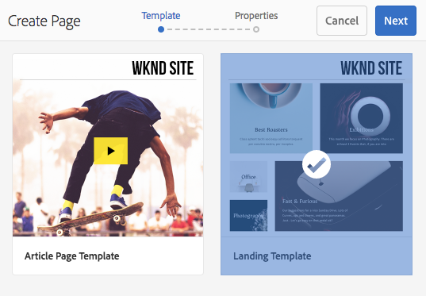
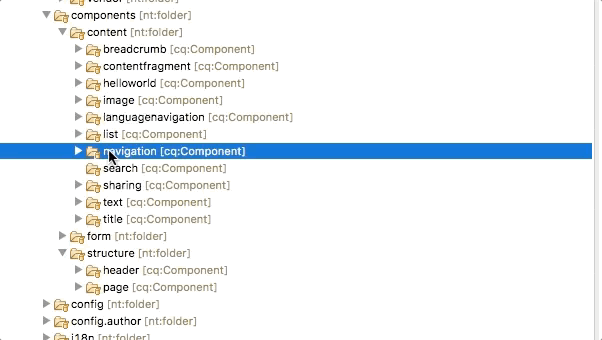
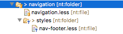
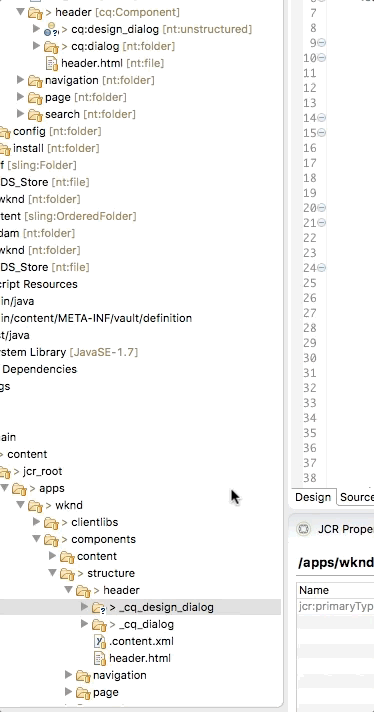
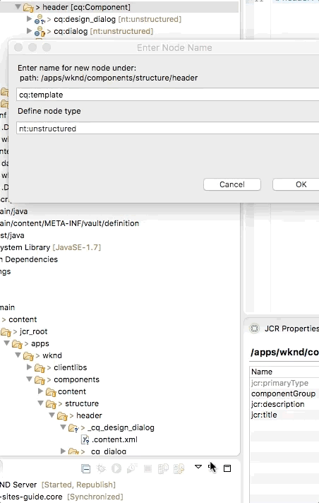

# Chapter 7 - Header and Footer{#chapter-header-and-footer}

Covers dynamic navigation driven by the content hierarchy and including the Quick Search component in the Header. Composite Components and policy sharing between multiple templates are included. Basics of HTL templating language, and dialogs are also used.

## Prerequisites {#prerequisites}

This is Chapter 7 of the multi-part tutorial. **[Chapter 6 can be found here](chapter-6.md)** and an **[overview can be found here](getting-started-wknd-tutorial-develop.md)**.

You can view the previous Chapter solution on [GitHub](https://github.com/Adobe-Marketing-Cloud/aem-guides-wknd) or you can download the **[solution package](https://github.com/Adobe-Marketing-Cloud/aem-guides-wknd/releases)**.

## Objective

1. Understand the importance and impact the Content Hierarchy can have on a Sites implementation.
2. Use the Navigation component to provide dynamic Header and Footer navigation for the site.
3. Learn to create a *composite* AEM component that includes multiple sub-components.

## Content Hierarchy {#content-hierarchy}

It is important with any AEM implementation to plan out the content hierarchy as this is the primary mechanism for organizing the content. Site navigation is often heavily influenced by the content hierarchy and well-thought hierarchy can simplify the application. Permissions and support for multiple languages also play a role in content hierarchy planning.

* [Data Modeling - David Nuescheler's Model](https://docs.adobe.com/docs/en/aem/6-3/develop/the-basics/model-data.html)  

* [Multi Site Manager Best Practices](https://docs.adobe.com/docs/en/aem/6-3/administer/sites/msm/best-practices.html)

The fictitious WKND site is a life-style site with articles of things to do in several categories. We will create a content hierarchy that reflects this organization. The navigation will be dynamically populated based on the content hierarchy. We will also set up the site with a language root so that we can use [AEM's translation feature in the future.](https://docs.adobe.com/docs/en/aem/6-3/administer/sites/translation/tc-bp.html)


*Top level hierarchy for WKND site structure.*

## Update Site Hierarchy {#site-hierarchy}

A well populated site hierarchy is needed to see the navigation functioning properly. The Landing Page Template will be used to provide much of that structure. The following steps will take place inside a local AEM instance.

1. 

   The Navigation component relies on the site hierarchy to function. In order to see it working we will stub out the content hierarchy in advance. Use the Landing Template to create the following series of pages:

   ```plain

   /WKND (wknd)
        /Home (en)
            /Restaurant (restaurant)
            /Bars (bars)
            /Sports (sports)
            /Art (art)
            /Music (music)
            /Shopping (shopping)

   ```

   Add a new page beneath one of the categories that uses the Article Template. You should end up with something like the following:

   

## Navigation Component {#navigation-component}

Core Components includes a **[Navigation](https://github.com/Adobe-Marketing-Cloud/aem-core-wcm-components/tree/master/content/src/content/jcr_root/apps/core/wcm/components/navigation/v1/navigation)** component that we will leverage to create a header and footer navigation. The Navigation component creates a navigation based on the site structure. It has already been proxied into our project.

We will implement the Navigation in **two** different ways for the Header and Footer. The footer navigation will be implemented **first** using an additional layout container to provide structure. The following steps will take place in a development IDE.

The **ui.apps** module will be updated.

1. The Navigation component was created by the AEM project archetype beneath `/apps/wknd/components/content`. This will be just a structural component for this project.

    1. Move the navigation component from **`/apps/wknd/components/content`** to **`/apps/wknd/components/structure`**

2. Update the **componentGroup** to be **WKND.Structure**

    

    

## Footer Styles {#footer-styles}

Next we will create a new style for the **Layout Container** that will act as the container for the footer. We will also create a specific style for the **Navigation** component when it is used in the footer of the site.

1. Create a style for a new Layout Container which will act as the container for the navigation in the footer.

   Beneath **`/apps/wknd/clientlibs/clientlib-site/components/layout-container`**

    1. Create a folder named **styles**
    2. Create a new file beneath styles named **footer.less**

    

2. Populate **`footer.less`** with the following:

   ```css

   /* WKND Layout Container Footer Style */

   @footer-background-color: #000;
   @footer-text-color: #fff;

   .cmp-layout-container--footer {
       background: @footer-background-color;
       min-height: 365px;
       margin-top: 3em;
       padding: 0 3em;

       >.aem-Grid {
           .container-content();
       }

       @media (max-width: @screen-medium) {
               min-height:267px;
       }

       p {
              color: @footer-text-color;
              font-size: @font-size-xsmall;
              text-align:center;
          }
   }

   ```

   This will create a black background with white text for the container when the CSS class **cmp-layout-container--footer** is added to the Layout Container.

3. Update **layout-container.less** to include **footer.less**:

   ```css
   /* WKND Layout Container Styles */

   @import "styles/fixed-width.less";
   @import "styles/footer.less";

   ```

4. Next create a footer style for the Navigation component. Below is the BEM notation for the **Navigation** component:

    **Navigation BEM Notation:**

    ```plain

    BLOCK cmp-navigation
        ELEMENT cmp-navigation__group
        ELEMENT cmp-navigation__item
            MOD cmp-navigation__item--active
            MOD cmp-navigation__item--level-*
        ELEMENT cmp-navigation__item-link

    ```

   Beneath **`/apps/wknd/clientlibs/clientlib-site/components`**

    1. Create a new folder named **navigation**
    2. Beneath the **navigation** folder create a new file named **navigation.less**
    3. Beneath the **navigation** folder create a new folder named **styles**
    4. Beneath the **styles** folder create a new file named **nav-footer.less**

    

5. Update **nav-footer.less**:

   ```css

   /* WKND Navigation Footer Style */

   @footer-color: #fff;

   .cmp-navigation--footer {

         .cmp-navigation {
           width: 100%;
           text-align: center;
           float: left;
           margin-top: 3em;

           .cmp-navigation__group {

               margin-top:2em;
               margin-left:2em;
               margin-right: 2em;

             .cmp-navigation__item {

               float:left;
               display: block;

               .cmp-navigation__item-link {
                   font-size: @font-size-xsmall;
                   text-transform: uppercase;
                   color: @footer-color;
                   height:6em;
                   width: 10em;
                   text-align: center;
                   text-decoration: none;
                   padding-top: 4em;
                   float:left;

                   &:hover,
                   &:focus {
                       background-color: @brand-primary;
                       color: @text-color;
                   }

               }

           }

           li.cmp-navigation__item--active .cmp-navigation__item-link {
               background-color: rgba(255, 233, 0, 0.4);
               color: @brand-primary;
           }

            @media (max-width: @screen-medium) {
               margin-top: 2em;    
           }
       }
    }

   }

   ```

6. Populate **navigation.less** with the following:

   ```css

   /* WKND navigation styles */

   @import (once) "styles/nav-footer.less";

   ```

7. Update **main.less** beneath **`/apps/wknd/clientlibs/clientlib-site`** to include the navigation styles:

   ```css

   /* main.less */

    ...
    /* Component Styles */
    @import "components/breadcrumb/breadcrumb.less";
    @import "components/byline/byline.less";
    @import "components/contentfragment/contentfragment.less";
    @import "components/header/header.less";
    @import "components/image/image.less";
    @import "components/layout-container/layout-container.less";
    @import "components/list/list.less";
    @import "components/navigation/navigation.less";
    @import "components/text/text.less";
    @import "components/title/title.less";

   ```

8. Deploy the updated code base to a local AEM instance with AEM Developer Tools or using your Maven skills.

## Configure Footer {#config-footer}

Next, configure the footer in the Article and Landing page templates. This will be done inside AEM directly.

1. Update the Article Template to add a **Footer Layout Container**.

    1. Navigate to the Article Template: [http://localhost:4502/editor.html/conf/wknd/settings/wcm/templates/article-page-template/structure.html](http://localhost:4502/editor.html/conf/wknd/settings/wcm/templates/article-page-template/structure.html)
    2. Drag a new Layout Container as the very last Layout Container (use Component Tree for help, it should be outside of the fixed-width container)

   

2. Configure the Footer Layout Container policy.

    1. Click the Policy Icon to create a New Policy for the Footer Layout Container
    2. **Policy Title** = **WKND Footer**
    3. **Allowed Components** = Check **WKND.Content**, **WKND.Structure**
    4. **Styles **&gt;** Default CSS Classes **=** cmp-layout-container--footer**

    After saving the policy the layout container should stretch full-width and have a black background.

    

3. Add a **Navigation** component to the footer container.

    1. Add a Navigation component to the Footer layout container
    2. Configure the policy for the Navigation Component with the following:
    3. **Policy Title** = **WKND Navigation - Footer**
    4. **Navigation Root = `/content/wknd/en`**
    5. Check **Exclude navigation root**
    6. Un-check **Collect all child pages**

        1. **Navigation Structure Dept = 1**

    7. **Styles** &gt; **Default CSS Classes** = **cmp-navigation--footer**

    

   

4. Repeat the above steps using the Landing Template: [http://localhost:4502/editor.html/conf/wknd/settings/wcm/templates/landing-page-template/structure.html](http://localhost:4502/editor.html/conf/wknd/settings/wcm/templates/landing-page-template/structure.html)

   You should be able to re-use the **WKND Footer** and **WKND Navigation - Footer** policies on the respective components.

   View one of the content pages. You should now be able to see the footer navigation populated on all the content pages.

   

## Header Component {#header-composite-component}

The Header Component will include Navigation as well as Search and a Home/Logo link. We could create a Layout Container and follow the same approach as with the Footer. However attempting to resize all the components and getting them to align would be quite complicated for an author.

Instead we will create a "composite" component. The Header component will embed a **[Navigation](https://github.com/Adobe-Marketing-Cloud/aem-core-wcm-components/tree/master/content/src/content/jcr_root/apps/core/wcm/components/navigation/v1/navigation)** and **[Quick Search](https://github.com/Adobe-Marketing-Cloud/aem-core-wcm-components/tree/master/content/src/content/jcr_root/apps/core/wcm/components/search/v1/search)** component inside of it. When the Header component is dragged onto the page it will bring the other two with it.


*Header Component with embedded Navigation and Quick Search components*

1. Move the **Search** component into the structure folder.

    The Search component was created by the AEM project archetype beneath `/apps/wknd/components/content`. This will be a structural component for this project and embedded into the Header component.

    1. Move the Search component from **`/apps/wknd/components/content`** to **`/apps/wknd/components/structure`**
    2. Update the **componentGroup** property of the Navigation component to be **WKND.Structure**

        

        

2. Update the empty dialog beneath the **Header** component.

    An empty dialog for the Header compponent was created in Chapter 2. We will update the dialog to allow a user to configure the Root Path to link the WKND Logo.

    1. Beneath **`/apps/wknd/components/structure/header`** edit the **cq:dialog**.
    2. It is easiest to edit the xml directly so open **`aem-guides-wkind.ui.apps/src/main/content/jcr_root/apps/wknd/components/structure/header/_cq_dialog/.content.xml`**

    

        ```xml

        <?xml version="1.0" encoding="UTF-8"?>
        <jcr:root xmlns:sling="https://sling.apache.org/jcr/sling/1.0" xmlns:cq="https://www.day.com/jcr/cq/1.0" xmlns:jcr="https://www.jcp.org/jcr/1.0" xmlns:nt="https://www.jcp.org/jcr/nt/1.0"
            jcr:primaryType="nt:unstructured"
            jcr:title="Header"
            sling:resourceType="cq/gui/components/authoring/dialog">
            <content
                jcr:primaryType="nt:unstructured"
                sling:resourceType="granite/ui/components/coral/foundation/container">
                <items jcr:primaryType="nt:unstructured">
                    <tabs
                        jcr:primaryType="nt:unstructured"
                        sling:resourceType="granite/ui/components/coral/foundation/tabs"
                        maximized="{Boolean}true">
                        <items jcr:primaryType="nt:unstructured">
                            <header
                                jcr:primaryType="nt:unstructured"
                                jcr:title="Header Settings"
                                sling:resourceType="granite/ui/components/coral/foundation/fixedcolumns"
                                margin="{Boolean}true">
                                <items jcr:primaryType="nt:unstructured">
                                    <column
                                        jcr:primaryType="nt:unstructured"
                                        sling:resourceType="granite/ui/components/coral/foundation/container">
                                        <items jcr:primaryType="nt:unstructured">
                                            <rootpath
                                                jcr:primaryType="nt:unstructured"
                                                sling:resourceType="granite/ui/components/coral/foundation/form/pathfield"
                                                fieldDescription="Populate the link of the WKND logo"
                                                fieldLabel="Root Path"
                                                name="./rootPath"
                                                rootPath="/content/wknd"/>
                                        </items>
                                    </column>
                                </items>
                            </header>
                        </items>
                    </tabs>
                </items>
            </content>
        </jcr:root>

        ```

3. Policy configurations (formerly design dialogs) allow a user to update the Policy of a component. When working with structural components that will be re-used across templates it is advantageous to use Policies since the policy can be applied across templates.

   Create a Header Design Dialog to allow a user to configure the Root Path to link the WKND Logo via a Policy:

    1. Beneath **`/apps/wknd/components/structure/header`** create a new node named **cq:design_dialog** of type **nt:unstructured**.
    2. It is easiest to edit the xml directly so open **`/wknd-sites-guide.ui.apps/src/main/content/jcr_root/apps/wknd/components/structure/header/_cq_design_dialog/.content.xml`**

        

        ```xml
        <?xml version="1.0" encoding="UTF-8"?>
        <jcr:root xmlns:sling="https://sling.apache.org/jcr/sling/1.0" xmlns:granite="https://www.adobe.com/jcr/granite/1.0" xmlns:cq="https://www.day.com/jcr/cq/1.0" xmlns:jcr="https://www.jcp.org/jcr/1.0" xmlns:nt="https://www.jcp.org/jcr/nt/1.0"
            jcr:primaryType="nt:unstructured"
            jcr:title="Navigation"
            sling:resourceType="cq/gui/components/authoring/dialog">
            <content
                granite:class="cmp-navigation__editor"
                jcr:primaryType="nt:unstructured"
                sling:resourceType="granite/ui/components/coral/foundation/container">
                <items jcr:primaryType="nt:unstructured">
                    <tabs
                        jcr:primaryType="nt:unstructured"
                        sling:resourceType="granite/ui/components/coral/foundation/tabs"
                        maximized="{Boolean}true">
                        <items jcr:primaryType="nt:unstructured">
                            <properties
                                jcr:primaryType="nt:unstructured"
                                jcr:title="Properties"
                                sling:resourceType="granite/ui/components/coral/foundation/container"
                                margin="{Boolean}true">
                                <items jcr:primaryType="nt:unstructured">
                                    <rootpath
                                        jcr:primaryType="nt:unstructured"
                                        sling:resourceType="granite/ui/components/coral/foundation/form/pathfield"
                                        fieldDescription="Populate the link of the WKND logo"
                                        fieldLabel="Root Path"
                                        name="./rootPath"
                                        rootPath="/content/wknd"/>
                                </items>
                            </properties>
                            <styletab
                                jcr:primaryType="nt:unstructured"
                                sling:resourceType="granite/ui/components/coral/foundation/include"
                                path="/mnt/overlay/cq/gui/components/authoring/dialog/style/tab_design/styletab"/>
                        </items>
                    </tabs>
                </items>
            </content>
        </jcr:root>
        ```

   In the XML note the **`<rootpath />`** node that has an attribute **`name="./rootPath`"**. This will be the name of the property in which the Authors selection will be made.

   Note the **`<styletab />`** node and the path **`/mnt/overlay/cq/gui/components/authoring/dialog/style/tab_design/styletab`**. This will include the Style Tab and allow the Header component to leverage the style system.

4. Next update the **`header.html`** script to include **navigation** and **search** components.

    1. Update **`/apps/wknd/components/structure/header/header.html`** with the following:

        ```xml

        <!--/* Header Component for WKND Site */-->

        <header class="wknd-header">
        <div class="container">
            <a class="wknd-header-logo" href="${properties.rootPath || currentStyle.rootPath @ extension='html'}">WKND</a>
            <div class="cmp-search--header" data-sly-resource="${'search' @ resourceType='wknd/components/structure/search'}"></div>
            <div class="cmp-navigation--header" id="header-navbar" data-sly-resource="${'navigation' @ resourceType='wknd/components/structure/navigation'}"></div>
        </div>
        </header>

        ```

   The snippet **`${properties.rootPath || currentStyle.rootPath @ extension='html'}`**

   Injects the path selected by the author via the Dialog or Design Dialog. It first looks to see if a properties value of rootPath exists (Dialog) and then falls back to look at the currentStyle (Design Dialog) for the value of the rootPath.

   Both **properties** and **currentStyle** are [Global Objects](https://helpx.adobe.com/experience-manager/htl/using/global-objects.html) made available to all components HTL scripts.

   The snippet **`data-sly-resource="${'search' @ resourceType='wknd/components/structure/search'}"`** includes the Search Component and looks for it as a resource beneath the header node named **search**.

   The Navigation Component is included in the same way: **`data-sly-resource="${'navigation' @ resourceType='wknd/components/structure/navigation'}"`**

   This is an example of HTL Block Statements, [more information can be found here.](https://helpx.adobe.com/experience-manager/htl/using/block-statements.html)

5. Whenever creating **composite** components it is a best practice to create a **`cq:template`** to ensure that the embedded or sub-components have actual nodes/resources created in the JCR. If there is not a true node that maps to the sub-component odd behavior can occur with the Dialogs and Policies when saving.

   Beneath **`/apps/wknd/components/structure/header`**

    1. Create a new node named **cq:template** of type **nt:unstructured**
    2. Open the **.content.xml** for easier editing

         

        ```xml

        <?xml version="1.0" encoding="UTF-8"?>
        <jcr:root xmlns:sling="https://sling.apache.org/jcr/sling/1.0" xmlns:cq="https://www.day.com/jcr/cq/1.0" xmlns:jcr="https://www.jcp.org/jcr/1.0" xmlns:nt="https://www.jcp.org/jcr/nt/1.0"
            jcr:primaryType="nt:unstructured">
            <navigation
                jcr:primaryType="nt:unstructured"
                sling:resourceType="wknd/components/structure/navigation"/>
            <search
                jcr:primaryType="nt:unstructured"
                sling:resourceType="wknd/components/structure/search"/>
        </jcr:root>

        ```

   Replace **`/aem-guides-wknd.ui.apps/src/main/content/jcr_root/apps/wknd/components/structure/header/_cq_template/.content.xml`** with the above snippet. 

   This will ensure that nodes for **navigation** and **search** are created when a Header component is added.

## Header Styles {#add-styles-header}

Next we will add styles to the **Header** component. Since the Header component is now composed of **navigation** and **search** components we will create specific header-styles for these components.

1. Add a new style for the **navigation** component in the header.

   Beneath **`/apps/wknd/clientlibs/clientlib-site/components/navigation/styles`**

    1. Create a new file named **nav-header.less**. Like earlier with the **nav-header.less**, we will target the BEM classes of the **Navigation** component:

        **Navigation BEM Notation:**

        ```plain

        BLOCK cmp-navigation
            ELEMENT cmp-navigation__group
            ELEMENT cmp-navigation__item
                MOD cmp-navigation__item--active
                MOD cmp-navigation__item--level-*
            ELEMENT cmp-navigation__item-link

        ```

    2. Populate it with the following:

        ```css

        /* WKND Navigation Header styles */

        @mobile-nav-bg-color: #000;
        @mobile-nav-link-color: #fff;

        .cmp-navigation--header {

            float:right;
            padding-top: .25em;
            min-width: 100px;
            margin-right: 0.25em;
            margin-left: 0.25em;

            .cmp-navigation {
                float:right;

                .cmp-navigation__group {
                    list-style: none;
                    margin:0; 
                }

                .cmp-navigation__item {
                    display: block;
                    float: left;
                }

                .cmp-navigation__item-link {
                    color: @text-color;
                    font-size: @font-size-medium;
                    text-transform: uppercase;
                    font-weight: bolder;
                    padding: 15px 17px;
                    text-decoration: none;

                    &:hover,
                        &:focus {
                        background-color: @brand-primary;
                        }
                }

                .cmp-navigation__item--active .cmp-navigation__item-link {
                    background-color: @brand-primary;
                }
            }

            @media (max-width: @screen-medium) {

                display:none;
            }
        }

        ```

    3. Update **`/apps/wknd/clientlibs/clientlib-site/components/navigation/navigation.less`** to included the **nav-header.less** file:

        ```css
        /* WKND navigation styles */

        @import (once) "styles/nav-footer.less";
        @import (once) "styles/nav-header.less";
        ```

2. Next we will add a new style for the **search** component in the header. Again we will target the BEM classes on the component.

    **Search BEM notation:**

    ```plain

    BLOCK cmp-search
    ELEMENT cmp-search__form
    ELEMENT cmp-search__field
    ELEMENT cmp-search__icon
    ELEMENT cmp-search__input
    ELEMENT cmp-search__loading-indicator
    ELEMENT cmp-search__clear
    ELEMENT cmp-search__clear-icon
    ELEMENT cmp-search__results
    ELEMENT cmp-search__item
    ELEMENT cmp-search__item-mark
    ELEMENT cmp-search__item-title
        MOD cmp-search__item--is-focused

    ```

   Beneath **`/apps/wknd/clientlibs/clientlib-site/components`**:

    1. Create a new folder named **search**
    2. Beneath the **search** folder, create a new file named **search.less**
    3. Beneath the **search** folder, create a new folder named **styles**
    4. Beneath the **styles** folder, create a new file named **search-header.less**

    

3. Populate **search-header.less** with the following:

   ```css
   /* WKND Search Header styles */

   @search-width: 165px;
   @search-width-expand: 265px;
   @search-width-mobile: @search-width /2;
   @search-width-mobile-expand: @search-width;

   .cmp-search--header {
       float: right;
       margin-right: -12px;
       padding-right: @gutter-padding;

       .cmp-search {

           &__form {

           .cmp-search__icon {
               top: 0.7rem;
           }

           .cmp-search__clear-icon {
               top: 0.7rem;
           }

           .cmp-search__input {
               background-color: #ebebeb8a;
               color:@text-color;
               font-size: @font-size-medium;
               border-radius: 0px;
               border:none;
               height:40px;
               width:@search-width;
               padding-right: 2rem;
               padding-left: 1.8rem;
               transition: ease-in-out, width .35s ease-in-out;

               &:focus {
                   background-color: @body-bg;
                   outline: none !important;
                   border:1px solid @text-color;
                   box-shadow: none;
                   width: @search-width-expand;
               }

               &::placeholder { 
                   text-transform: uppercase;
                   }

                   @media (max-width: @screen-small) {
                       width: @search-width-mobile;
                       &:focus {
                           width: @search-width-mobile-expand;
                            }
                   }

               }

       }

           .cmp-search__results {
               margin-top: 0.5em;
               background: @gray-dark;

               a.cmp-search__item {
                   color: @brand-third;
                   font-size: @font-size-small;
                   height: 50px;
                   text-overflow: ellipsis;
                   padding: 0.5em;
                   margin-top:0.25em;
               }

               a.cmp-search__item:hover {
                   text-decoration:none;
                   background: @gray-base;
               }

               .cmp-search__item-mark {
                   background: @gray-base;
                   color: @brand-third;
               }
             }
           }

            @media (max-width: @screen-medium) {
                .cmp-search__input {
                  height:50px;
                }
           }

           @media (max-width: @screen-small) {
               margin-right: 1em;
               position: absolute;
               right: 0;
               z-index: 100;
               margin-top: 0.25em;

           }
    }

   ```

4. Populate **`/apps/wknd/clientlibs/clientlib-site/components/search/search.less`** to included the **search-header.less** file:

   ```css
   /* WKND Search styles */

   @import (once) "styles/search-header.less";

   ```

5. Update **main.less** beneath **`/apps/wknd/clientlibs/clientlib-site`** to include the search styles:

   ```css
   /* main.less */
   ...

   /* Component Styles */
   @import "components/breadcrumb/breadcrumb.less";
   @import "components/contentfragment/contentfragment.less";
   @import "components/header/header.less";
   @import "components/image/image.less";
   @import "components/layout-container/layout-container.less";
   @import "components/list/list.less";
   @import "components/navigation/navigation.less";
   /* import search styles */
   @import "components/search/search.less";
   @import "components/text/text.less";
   @import "components/title/title.less";

   ```

6. Deploy the updated code to a local AEM instance using AEM Developer tools or using your Maven skills.

## Configure Header {#configure-header}

After the updated code for the Header, Navigation, and Search components are deployed to AEM, we will configure the Header component as part of the templates.

You should now see the header component includes a navigation and search on [http://localhost:4502/editor.html/conf/wknd/settings/wcm/templates/article-page-template/structure.html](http://localhost:4502/editor.html/conf/wknd/settings/wcm/templates/article-page-template/structure.html)

However before we can configure it we must Delete it and re-add it. This is because the Header component is now a "composite" component and embeds a navigation and search component. In order for it to function properly the search and navigation nodes must be added to template structure. The cq:template configured earlier, will ensure that the proper node structure is created.

The high level steps for configuring the header:

1. Delete the header node from the Article and Landing page templates via CRXDE-Lite
2. Re-add the Header component to the Article page template
3. Configure the embedded Navigation component in the Header component
4. Configure the embedded Search component in the Header component
5. Repeat the steps 2-4 for the Landing page template and re-use the Navigation and Search policies

**The below video details these high level steps:**

>[!VIDEO](https://video.tv.adobe.com/v/21509?quality=9)

## Mobile Navigation {#mobile-navigation}

At this point we have used the AEM Style System to style the existing markup generated by a core component. LESS and CSS are very powerful tools to change a component visually but depending on the requirements there will be limitations. It is also possible to use JavaScript to manipulate the markup of a core component after it has loaded. In this way we can re-purpose the markup of the component to be used in a different way, but do not need to make any back-end code changes.

For the mobile navigation we would ideally like the navigation to pop out from the left hand-side and "push" the body of the page off screen. Given the nested location of the navigation in the header component it is not really achievable to accomplish this behavior with CSS alone. Instead we will use a little bit of Javascript to create a copy of the Header Navigation markup and append it to the body tag. This will allow us to create that mobile navigation visual effect.


Use JavaScript to clone the Navigation items in the Header to a mobile navigation that will be appended to the HTML body. This will occur on page load or when the header component is added to the page.

### Add Mobile Navigation Style {#add-mobile-nav-style}

1. Beneath **`/apps/wknd/clientlibs/clientlib-site/components/navigation/styles`** Create a new file named **nav-mobile.less**.
2. Populate **nav-mobile.less** with the following:

   ```css
   /* WKND Navigation - Mobile */

   @nav-item-mobile-top-level-color: #fff;
   @nav-item-mobile-hover-color: @brand-primary;
   @nav-item-mobile-text-color: #888;
   @nav-item-mobile-border : solid 1px rgba(255, 255, 255, 0.05);

   .cmp-navigation--mobile {

     .cmp-navigation__group {
         list-style: none;
         display: inline-block;
         margin: 0;
         padding: 0;
     }

     .cmp-navigation__item {
         display: inline-block;
         float: left;
         width: 100%;
     }

     .cmp-navigation__item-link {
       display: block;
       color: @nav-item-mobile-text-color;
       text-decoration: none;
       height: 44px;
       line-height: 44px;
       border-top: @nav-item-mobile-border;
       padding: 0 1em 0 1em;

       &:hover {
           color: @nav-item-mobile-hover-color;
       }
     }

     .cmp-navigation__item--level-0, .cmp-navigation__item--level-1 {

             > .cmp-navigation__item-link {
                 color: @nav-item-mobile-top-level-color;

                 &:hover {
                     color: @nav-item-mobile-hover-color;
                 }
             }
       }

       .cmp-navigation__item--level-2 {
           padding-left: 2em;
       }

       .cmp-navigation__item--level-3 {
           padding-left: 4em;
            }
        }

        #mobileNav, #toggleNav {
           display: none;
       }

       /*Styles to push mobile nav into view */

       @media (max-width: @screen-medium) {

       .root.responsivegrid {
                   -moz-backface-visibility: hidden;
                   -webkit-backface-visibility: hidden;
                   -ms-backface-visibility: hidden;
                   backface-visibility: hidden;
                   -moz-transition: -moz-transform 0.5s ease;
                   -webkit-transition: -webkit-transform 0.5s ease;
                   -ms-transition: -ms-transform 0.5s ease;
                   transition: transform 0.5s ease;
                   padding-bottom: 1px;
       }

       #toggleNav {
                   -moz-backface-visibility: hidden;
                   -webkit-backface-visibility: hidden;
                   -ms-backface-visibility: hidden;
                   backface-visibility: hidden;
                   -moz-transition: -moz-transform 0.5s ease;
                   -webkit-transition: -webkit-transform 0.5s ease;
                   -ms-transition: -ms-transform 0.5s ease;
                   transition: transform 0.5s ease;
                   display: block;
                   height: 44px;
                   left: 0;
                   position: fixed;
                   top: 6px;
                   width: 40px;
                   z-index: 10001;
                   border-top-right-radius: 2px;
                   border-bottom-right-radius: 2px;
               }
               .scrolly {
                   #toggleNav {
                       background: #edededa8;
                   }
               }

                   #toggleNav .toggle {
                       width: 80px;
                       height: 60px;
                       font-size: 40px;
                       color: @text-color;

                       &:hover {
                           text-decoration:none;
                           color: @text-color;
                       }

                   }

               #mobileNav {
                   -moz-backface-visibility: hidden;
                   -webkit-backface-visibility: hidden;
                   -ms-backface-visibility: hidden;
                   backface-visibility: hidden;
                   -moz-transform: translateX(-275px);
                   -webkit-transform: translateX(-275px);
                   -ms-transform: translateX(-275px);
                   transform: translateX(-275px);
                   -moz-transition: -moz-transform 0.5s ease;
                   -webkit-transition: -webkit-transform 0.5s ease;
                   -ms-transition: -ms-transform 0.5s ease;
                   transition: transform 0.5s ease;
                   display: block;
                   height: 100%;
                   left: 0;
                   overflow-y: auto;
                   position: fixed;
                   top: 0;
                   width: 275px;
                   z-index: 10002;
                   color: #858484;
                   background: #000;
                   box-shadow: inset -3px 0px 5px 0px rgba(0, 0, 0, 0.35);
               }

               body.navPanel-visible {
                   overflow-x: hidden;

                   .root.responsivegrid {
                       -moz-transform: translateX(290px);
                       -webkit-transform: translateX(290px);
                       -ms-transform: translateX(290px);
                       transform: translateX(290px);
                   }

                    #toggleNav {
                       -moz-transform: translateX(275px);
                       -webkit-transform: translateX(275px);
                       -ms-transform: translateX(275px);
                       transform: translateX(275px);
                   }

                   #mobileNav {
                       -moz-transform: translateX(0);
                       -webkit-transform: translateX(0);
                       -ms-transform: translateX(0);
                       transform: translateX(0);
                   }

           }
       }

   ```

   The mobile nav will be scoped by the .**cmp-navigation--mobile** class. Several CSS **transform** rules are used to animate the mobile navigation opening and closing.

3. Finally update **`/apps/wknd/clientlibs/clientlib-site/components/navigation/navigation.less`** to include the **nav-mobile.less** file:

   ```css

    /* WKND navigation styles */

    @import (once) "styles/nav-footer.less";
    @import (once) "styles/nav-header.less";
    @import (once) "styles/nav-mobile.less";

   ```

### Add Mobile Navigation JavaScript {#add-mobile-nav-js}

Next, we will use Javascript to create a copy of the Header Navigation markup and append it to the body tag. This will allow us to create that mobile navigation visual effect.

1. Beneath  **`/apps/wknd/clientlibs/clientlib-site/components/navigation`**. Create a new file named **navigation.js**.
2. Populate **navigation.js** with the following:

   ```js

   // Wrap bindings in anonymous namespace to prevent collisions
   jQuery(function($) {
       "use strict";

    function applyComponentStyles() {

     //Top Level Navigation (expected to only be one of these)
     $("#header-navbar .cmp-navigation").not("[data-top-nav-processed='true']").each(function() {
               // Mark the component element as processed to avoid the cyclic processing (see .not(..) above).
               var nav = $(this).attr("data-top-nav-processed", true),
                   $body = $('body');

               // Toggle Nav
               $('<div id="toggleNav">' +
                    '<a href="#mobileNav" class="toggle"><i class="wkndicon wkndicon-ico-bm" aria-hidden="true"></i></a>' +
                   '</div>'
               ).appendTo($body);

            // Navigation Panel.
               $(
                   '<div id="mobileNav" class="cmp-navigation--mobile">' +
                       '<nav class="cmp-navigation">' +
                           $(this).html() +
                       '</nav>' +
                   '</div>'
               )
                   .appendTo($body)
                   .panel({
                       delay: 500,
                       hideOnClick: true,
                       hideOnSwipe: true,
                       resetScroll: true,
                       resetForms: true,
                       side: 'left',
                       target: $body,
                       visibleClass: 'navPanel-visible'
                   });
           });
       }

     applyComponentStyles();

   });

   ```

   The above code will get called when the **`.responsivegrid`** is added to the DOM. The first jQuery selector searches for the navigation in the Header. There is expected to only be one. There is a top-level check to avoid duplicate processing, in the case when the component is added via the AEM editor.

   Next an anchor tag is appended to the body. This is what users will click to toggle the mobile navigation. After that the header navigation is copied into a new div with an id of mobileNav and a class of cmp-navigation--mobile. This is the mobile navigation and is appended to the body.

   Finally a panel function is attached to toggle the mobile navigation visibility. This panel functionality is defined in a 3rd party utility file.

3. Next, add a 3rd party javascript file modified from [https://html5up.net/](https://html5up.net/) to allow for click and swipe support of the mobile navigation.
4. Beneath **`/apps/wknd/clientlibs/clientlib-site`**. Create a new folder named **js**.
5. Beneath the **js** folder, create a new file named **util.js**.
6. Populate **util.js** with the following [**util.js**](https://github.com/Adobe-Marketing-Cloud/aem-guides-wknd/blob/master/ui.apps/src/main/content/jcr_root/apps/wknd/clientlibs/clientlib-site/js/util.js) (we have included it as a link to GitHub since the code snippet is very long).

   

7. Update **`/apps/wknd/clientlibs/clientlib-site/js.txt`** to include the **navigation.js** and **util.js** files:

   ```plain

   #base=.

   js/util.js
   components/page/page.js
   components/navigation/navigation.js

   ```

8. Deploy the updated code to AEM using AEM Developer Tools or using your Maven skills. 
9. Final configurations and wrap up can be seen in the below video

## Putting It Together {#putting-it-together}

>[!VIDEO](https://video.tv.adobe.com/v/21510?quality=9)

## Next Steps {#next-steps}

Next part in the tutorial:

* [Chapter 8 - Implementing a Landing Page](chapter-8.md)
* View the finished code on [GitHub](https://github.com/Adobe-Marketing-Cloud/aem-guides-wknd) or download the finished package for this part of the tutorial:

## Help! {#help}

If you get stuck or have additional questions make sure to check out the [Experience League forums for AEM](https://forums.adobe.com/community/experience-cloud/marketing-cloud/experience-manager) or view existing [GitHub issues](https://github.com/Adobe-Marketing-Cloud/aem-guides-wknd/issues).

Didn't find what you were looking for? Think you found an error? Please file a [GitHub issue for the WKND project](https://github.com/Adobe-Marketing-Cloud/aem-guides-wknd/issues).