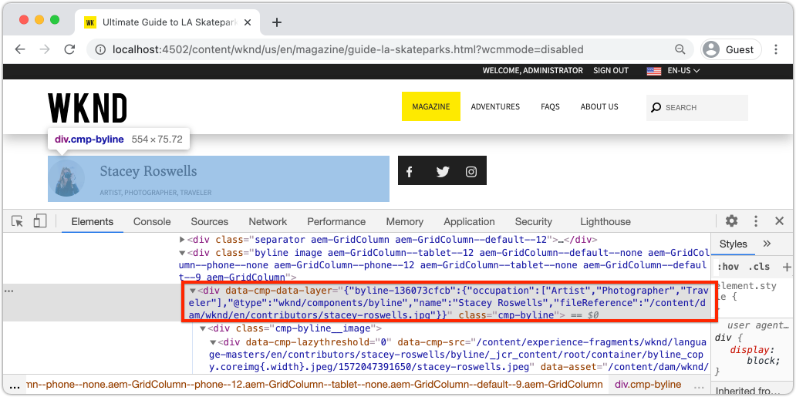
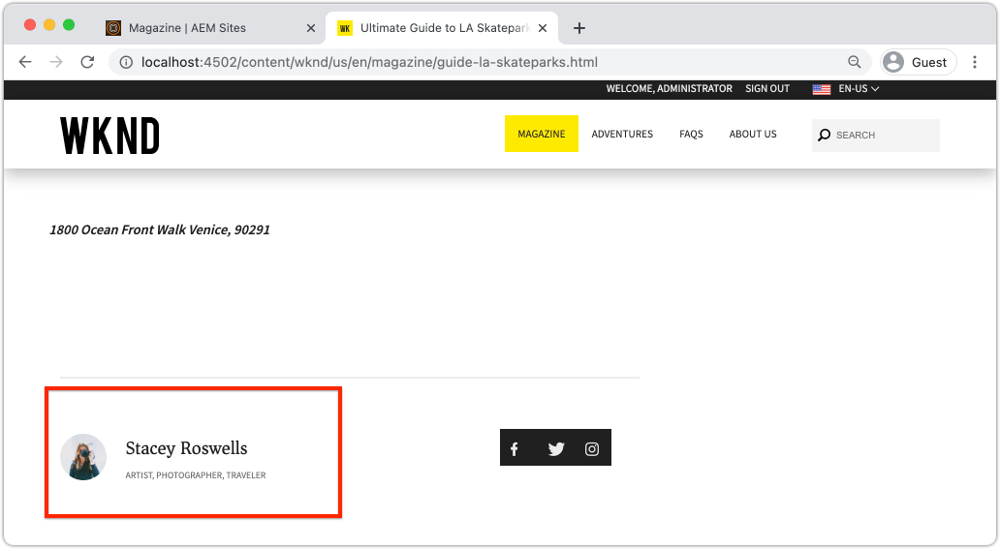
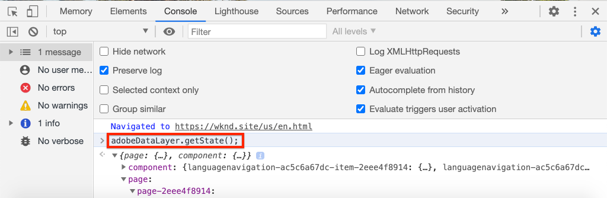
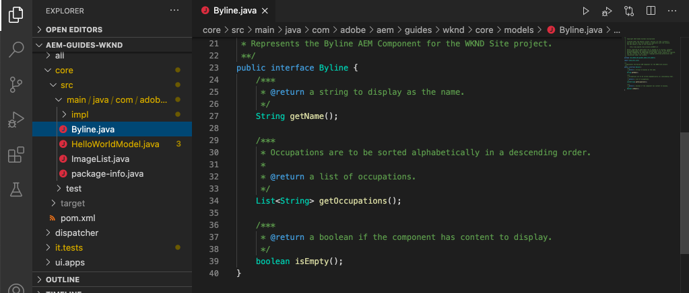
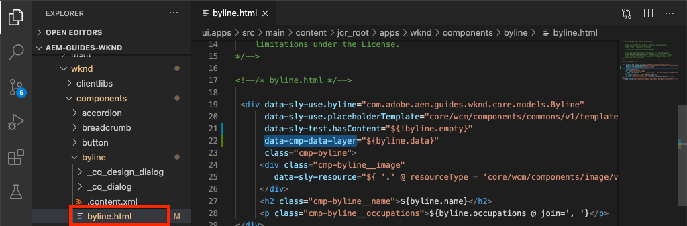
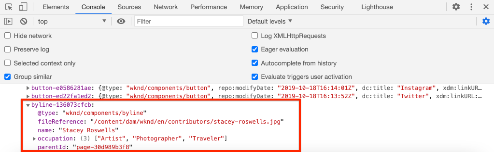
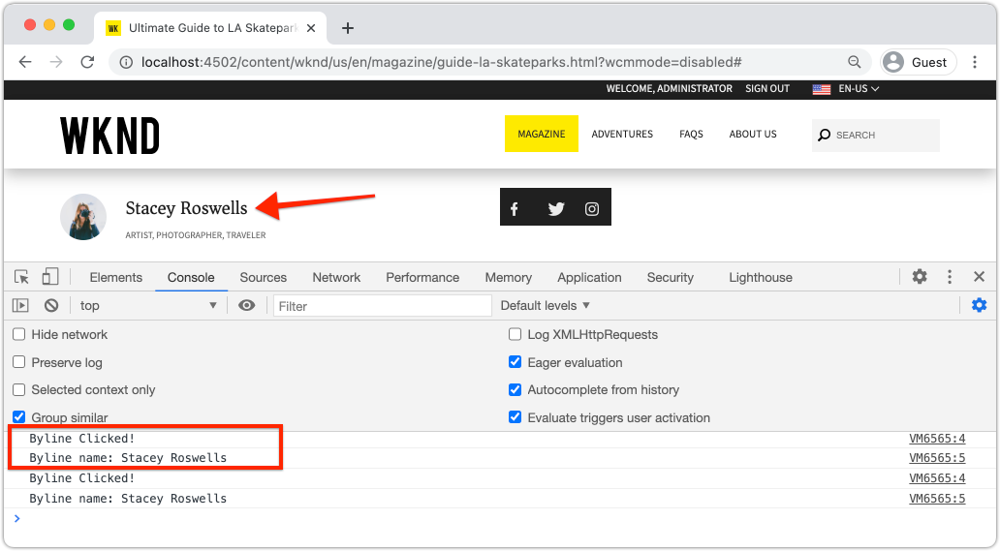
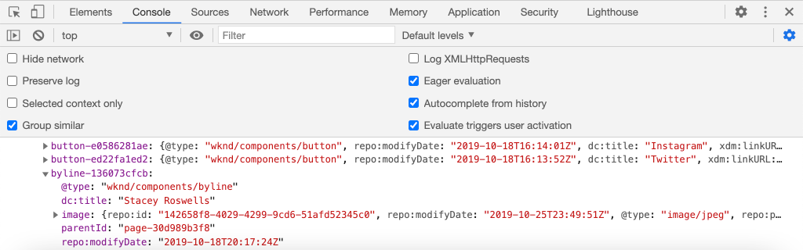

# Customize the Adobe Client Data Layer with AEM Components {#customize-data-layer}

Learn how to customize the Adobe Client Data Layer with content from custom AEM Components. Learn how to use APIs provided by [AEM Core Components to extend](https://experienceleague.adobe.com/docs/experience-manager-core-components/using/developing/data-layer/extending.html) and customize the data layer.

## What you will build



In this tutorial you will explore various options for extending the Adobe Client Data Layer by updating the WKND [Byline component](https://experienceleague.adobe.com/docs/experience-manager-learn/getting-started-wknd-tutorial-develop/custom-component.html). This is a custom component and lessons learned in this tutorial can be applied to other custom components.

### Objectives {#objective}

1. Inject component data into the data layer by extending a Sling Model and component HTL
1. Use Core Component data layer utilities to reduce effort
1. Use Core Component data attributes to hook into existing data layer events

## Prerequisites {#prerequisites}

A **local development environment** is necessary to complete this tutorial. Screenshots and video are captured using the AEM as a Cloud Service SDK running on a macOS. Commands and code are independent of the local operating system unless otherwise noted.

**New to AEM as a Cloud Service?** Check out the [following guide to setting up a local development environment using the AEM as a Cloud Service SDK](https://docs.adobe.com/content/help/en/experience-manager-learn/cloud-service/local-development-environment-set-up/overview.html).

**New to AEM 6.5?** Check out the [following guide to setting up a local development environment](https://docs.adobe.com/content/help/en/experience-manager-learn/foundation/development/set-up-a-local-aem-development-environment.html).

## Download and deploy the WKND Reference site {#set-up-wknd-site}

This tutorial extends the Byline component in the WKND reference site. Clone and install the WKND code base to your local environment.

1. Start a local Quickstart **author** instance of AEM running at [http://localhost:4502](http://localhost:4502).
1. Open a terminal window and clone the WKND code base using Git:

    ```shell
    $ git clone git@github.com:adobe/aem-guides-wknd.git
    ```

1. Deploy the WKND code base to a local instance of AEM:

    ```shell
    $ cd aem-guides-wknd
    $ mvn clean install -PautoInstallSinglePackage
    ```

    >[!NOTE]
    >
    > If using AEM 6.5 and the latest service pack add the `classic` profile to the Maven command:
    >
    > `mvn clean install -PautoInstallSinglePackage -Pclassic`

1. Open a new browser window and login to AEM. Open a **Magazine** page like: [http://localhost:4502/content/wknd/us/en/magazine/guide-la-skateparks.html](http://localhost:4502/content/wknd/us/en/magazine/guide-la-skateparks.html).

    

    You should see an example of the Byline component that has been added to the page as part of an Experience Fragment. You can view the Experience Fragment at [http://localhost:4502/editor.html/content/experience-fragments/wknd/language-masters/en/contributors/stacey-roswells/byline.html](http://localhost:4502/editor.html/content/experience-fragments/wknd/language-masters/en/contributors/stacey-roswells/byline.html)
1. Open your developer tools and enter the following command in the **Console**:

    ```js
    window.adobeDataLayer.getState();
    ```

    Inspect the response to see the current state of the data layer on an AEM site. You should see information about the page and individual components.

    

    Observe that the Byline component is not listed in the Data Layer.

## Update the Byline Sling Model {#sling-model}

To inject data about the component in the data layer we must first update the component's Sling Model. Next, update the Byline's Java interface and Sling Model implementation to add a new method `getData()`. This method will contain the properties we want to inject into the data layer.

1. In the IDE of your choice open the `aem-guides-wknd` project. Navigate to the `core` module.
1. Open the file `Byline.java` at `core/src/main/java/com/adobe/aem/guides/wknd/core/models/Byline.java`.

    

1. Add a new method to the interface:

    ```java
    public interface Byline {
        ...
        /***
         * Return data about the Byline Component to populate the data layer
         * @return String
         */
        String getData();
    }
    ```

1. Open the file `BylineImpl.java` at `core/src/main/java/com/adobe/aem/guides/wknd/core/models/impl/BylineImpl.java`.

    This is the implementation of the `Byline` interface and is implemented as a Sling Model.

1. Add the following import statements to the beginning of the file:

    ```java
    import java.util.HashMap;
    import java.util.Map;
    import org.apache.sling.api.resource.Resource;
    import com.fasterxml.jackson.core.JsonProcessingException;
    import com.fasterxml.jackson.databind.ObjectMapper;
    import com.adobe.cq.wcm.core.components.util.ComponentUtils;
    ```

    The `fasterxml.jackson` APIs will be used to serialize the data we want to expose as JSON. The `ComponentUtils` of AEM Core Components will be used to check if the data layer is enabled.

1. Add the unimplemented method `getData()` to `BylineImple.java`:

    ```java

    public class BylineImpl implements Byline {
        ...
        @Override
        public String getData() {
            Resource bylineResource = this.request.getResource();
            // Use ComponentUtils to verify if the DataLayer is enabled
            if (ComponentUtils.isDataLayerEnabled(bylineResource)) {

                //Create a map of properties we want to expose
                Map<String, Object> bylineProperties = new HashMap<String,Object>();
                bylineProperties.put("@type", bylineResource.getResourceType());
                bylineProperties.put("name", this.getName());
                bylineProperties.put("occupation", this.getOccupations());
                bylineProperties.put("fileReference", image.getFileReference());
                
                //Use AEM Core Component utils to get a unique identifier for the Byline component (in case multiple are on the page)
                String bylineComponentID = ComponentUtils.getId(bylineResource, this.currentPage, this.componentContext);

                // Return the bylineProperties as a JSON String with a key of the bylineResource's ID
                try {
                    return String.format("{\"%s\":%s}",
                        bylineComponentID,
                        // Use the ObjectMapper to serialize the bylineProperties to a JSON string
                        new ObjectMapper().writeValueAsString(bylineProperties));
                } catch (JsonProcessingException e) {

                    LOGGER.error("Unable to generate dataLayer JSON string", e);
                }

            }
            // return null if the Data Layer is not enabled
            return null;
        }
    }
    ```

    In the above method a new `HashMap` is used to capture the properties we want to expose as JSON. Notice that existing methods like `getName()` and `getOccupations()` are used. `@type` represents the unique resource type of the component, this allows a client to easily identify events and/or triggers based on the type of component.

    The `ObjectMapper` is used to serialize the properties and return a JSON string. This JSON string can then be injected into the data layer.

1. Open a terminal window. Build and deploy just the `core` module using your Maven skills:

    ```shell
    $ cd aem-guides-wknd/core
    $ mvn clean install -PautoInstallBundle
    ```

## Update the Byline HTL {#htl}

Next, update the `Byline` [HTL](https://experienceleague.adobe.com/docs/experience-manager-htl/using/htl/block-statements.html?lang=en#htl). HTL (HTML Template Language) is the template used to render the component's HTML.

A special data attribute `data-cmp-data-layer` on each AEM Component is used to expose its data layer.  JavaScript provided by AEM Core Components looks for this data attribute, whose value will be populated with the JSON String returned by the Byline Sling Model's `getData()` method, and injects the values into the Adobe Client Data layer.

1. In the IDE open the `aem-guides-wknd` project. Navigate to the `ui.apps` module.
1. Open the file `byline.html` at `ui.apps/src/main/content/jcr_root/apps/wknd/components/byline/byline.html`.

    

1. Update `byline.html` to include the `data-cmp-data-layer` attribute:

    ```diff
      <div data-sly-use.byline="com.adobe.aem.guides.wknd.core.models.Byline"
        data-sly-use.placeholderTemplate="core/wcm/components/commons/v1/templates.html"
        data-sly-test.hasContent="${!byline.empty}"
    +   data-cmp-data-layer="${byline.data}"
        class="cmp-byline">
        ...
    ```

    The value of `data-cmp-data-layer` has been set to `"${byline.data}"` where `byline` is the Sling Model updated earlier. `.data` is the standard notation for calling a Java Getter method in HTL of `getData()` implemented in the previous exercise.

1. Open a terminal window. Build and deploy just the `ui.apps` module using your Maven skills:

    ```shell
    $ cd aem-guides-wknd/ui.apps
    $ mvn clean install -PautoInstallPackage
    ```

1. Return to the browser and re-open the page with a Byline component: [http://localhost:4502/content/wknd/us/en/magazine/guide-la-skateparks.html](http://localhost:4502/content/wknd/us/en/magazine/guide-la-skateparks.html).

1. Open the developer tools and inspect the HTML source of the page for the Byline component:

    

    You should see that the `data-cmp-data-layer` has been populated with the JSON String from the Sling Model.

1. Open the browser's developer tools and enter the following command in the **Console**:

    ```js
    window.adobeDataLayer.getState();
    ```

1. Navigate beneath the response under `component` to find the instance of the `byline` component has been added to the data layer:

    

    You should see an entry like the following:

    ```json
    byline-136073cfcb:
        @type: "wknd/components/byline"
        fileReference: "/content/dam/wknd/en/contributors/stacey-roswells.jpg"
        name: "Stacey Roswells"
        occupation: (3) ["Artist", "Photographer", "Traveler"]
        parentId: "page-30d989b3f8"
    ```

    Observe that the properties exposed are the same ones added in the `HashMap` in the Sling Model.

## Add a Click Event {#click-event}

The Adobe Client Data Layer is event driven and one of the most common events to trigger an action is the `cmp:click` event. The AEM Core components make this easy to register your component with the help of the data element: `data-cmp-clickable`.

Clickable elements are usually a CTA button or a navigation link. Unfortunately the Byline component does not have any of these but we will register it anyways as this might be common for other custom components.

1. Open the `ui.apps` module in your IDE
1. Open the file `byline.html` at `ui.apps/src/main/content/jcr_root/apps/wknd/components/byline/byline.html`.

1. Update `byline.html` to include the `data-cmp-clickable` attribute on the Byline's **name** element:

    ```diff
      <h2 class="cmp-byline__name" 
    +    data-cmp-clickable="${byline.data ? true : false}">
         ${byline.name}
      </h2>
    ```

1. Open a new terminal. Build and deploy just the `ui.apps` module using your Maven skills:

    ```shell
    $ cd aem-guides-wknd/ui.apps
    $ mvn clean install -PautoInstallPackage
    ```

1. Return to the browser and re-open the page with the Byline component added: [http://localhost:4502/content/wknd/us/en/magazine/guide-la-skateparks.html](http://localhost:4502/content/wknd/us/en/magazine/guide-la-skateparks.html).

    To test our event we will manually add some JavaScript using the developer console. See [Using the Adobe Client Data Layer with AEM Core Components](data-layer-overview.md) for a video on how to do this.

1. Open the browser's developer tools and enter the following method in the **Console**:

    ```javascript
    function bylineClickHandler(event) {
        var dataObject = window.adobeDataLayer.getState(event.eventInfo.path);
        if (dataObject != null && dataObject['@type'] === 'wknd/components/byline') {
            console.log("Byline Clicked!");
            console.log("Byline name: " + dataObject['name']);
        }
    }
    ```

    This simple method should handle the click of the Byline component's name.

1. Enter the following method in the **Console**:

    ```javascript
    window.adobeDataLayer.push(function (dl) {
         dl.addEventListener("cmp:click", bylineClickHandler);
    });
    ```

    The above method pushes an event listener onto the data layer to listen for the `cmp:click` event and calls the `bylineClickHandler`.

    >[!CAUTION]
    >
    > It will be important **not** to refresh the browser throughout this exercise, otherwise the console JavaScript will be lost.

1. In the browser, with the **Console** open, click the name of the author in the Byline component:

    

    You should see the console message `Byline Clicked!` and the Byline name.

    The `cmp:click` event is the easiest to hook into. For more complex components and to track other behavior it is possible to add custom javascript to add and register new events. A great example is the Carousel Component, which triggers a `cmp:show` event whenever a slide is toggled. See the [source code for more details](https://github.com/adobe/aem-core-wcm-components/blob/master/content/src/content/jcr_root/apps/core/wcm/components/carousel/v1/carousel/clientlibs/site/js/carousel.js#L219).

## Use the DataLayerBuilder Utility {#data-layer-builder}

When the Sling Model was [updated](#sling-model) earlier in the chapter, we opted to create the JSON String by using a `HashMap` and setting each of the properties manually. This method works fine for small one-off components, however for components that extend the AEM Core Components this could result in a lot of extra code.

A utility class, `DataLayerBuilder`, exists to perform most of the heavy lifting. This allows implementations to extend just the properties they want. Let's update the Sling Model to use the the `DataLayerBuilder`.

1. Return to the IDE and navigate to the `core` module.
1. Open the file `Byline.java` at `core/src/main/java/com/adobe/aem/guides/wknd/core/models/Byline.java`.
1. Modify the `getData()` method to return a type of `ComponentData`

    ```java
    import com.adobe.cq.wcm.core.components.models.datalayer.ComponentData;
    ...
    public interface Byline {
        ...
        /***
         * Return data about the Byline Component to populate the data layer
         * @return ComponentData
         */
        ComponentData getData();
    }
    ```

    `ComponentData` is an object provided by AEM Core Components. It results in a JSON String, just like in the previous example, but also performs a lot of additional work.

1. Open the file `BylineImpl.java` at `core/src/main/java/com/adobe/aem/guides/wknd/core/models/impl/BylineImpl.java`.

1. Add the following import statements:

    ```java
    import com.adobe.cq.wcm.core.components.models.datalayer.ComponentData;
    import com.adobe.cq.wcm.core.components.models.datalayer.builder.DataLayerBuilder;
    ```

1. Replace the `getData()` method with the following:

    ```java
    @Override
    public ComponentData getData() {
        Resource bylineResource = this.request.getResource();
        // Use ComponentUtils to verify if the DataLayer is enabled
        if (ComponentUtils.isDataLayerEnabled(bylineResource)) {
            
            return DataLayerBuilder.extending(getImage().getData()).asImageComponent()
                .withTitle(this::getName)
                .build();

        }
        // return null if the Data Layer is not enabled
        return null;
    }
    ```

    The Byline component re-uses parts of the Image Core Component to display an image representing the author. In the above snippet, the [DataLayerBuilder](https://javadoc.io/doc/com.adobe.cq/core.wcm.components.core/latest/com/adobe/cq/wcm/core/components/models/datalayer/builder/ComponentDataBuilder.html) is used to extend the data layer of the `Image` component. This pre-populates the JSON object with all of the data about the image used. It also does some of the routine functions like setting the `@type` and the unique identifier of the component. Notice that the method is really small!

    The only property extended the `withTitle` which is replaced with the value of `getName()`.

1. Open a terminal window. Build and deploy just the `core` module using your Maven skills:

    ```shell
    $ cd aem-guides-wknd/core
    $ mvn clean install -PautoInstallBundle
    ```

1. Return to the IDE and open the `byline.html` file under `ui.apps`
1. Update the HTL to use `byline.data.json` to populate the `data-cmp-data-layer` attribute:

    ```diff
      <div data-sly-use.byline="com.adobe.aem.guides.wknd.core.models.Byline"
        data-sly-use.placeholderTemplate="core/wcm/components/commons/v1/templates.html"
        data-sly-test.hasContent="${!byline.empty}"
    -   data-cmp-data-layer="${byline.data}"
    +   data-cmp-data-layer="${byline.data.json}"
    ```

    Remember we are now returning an object of type `ComponentData`. This object includes a getter method `getJson()` and this is used to populate the `data-cmp-data-layer` attribute.

1. Open a terminal window. Build and deploy just the `ui.apps` module using your Maven skills:

    ```shell
    $ cd aem-guides-wknd/ui.apps
    $ mvn clean install -PautoInstallPackage
    ```

1. Return to the browser and re-open the page with the Byline component added: [http://localhost:4502/content/wknd/us/en/magazine/guide-la-skateparks.html](http://localhost:4502/content/wknd/us/en/magazine/guide-la-skateparks.html).
1. Open the browser's developer tools and enter the following command in the **Console**:

    ```js
    window.adobeDataLayer.getState();
    ```

1. Navigate beneath the response under `component` to find the instance of the `byline` component:

    

    You should see an entry like the following:

    ```json
    byline-136073cfcb:
        @type: "wknd/components/byline"
        dc:title: "Stacey Roswells"
        image:
            @type: "image/jpeg"
            repo:id: "142658f8-4029-4299-9cd6-51afd52345c0"
            repo:modifyDate: "2019-10-25T23:49:51Z"
            repo:path: "/content/dam/wknd/en/contributors/stacey-roswells.jpg"
            xdm:tags: []
        parentId: "page-30d989b3f8"
        repo:modifyDate: "2019-10-18T20:17:24Z"
    ```

    Observe that there is now an `image` object within the `byline` component entry. This has a lot more information about the asset in the DAM. Also observe that the `@type` and the unique id (in this case `byline-136073cfcb`) have been automatically populated, as well as the `repo:modifyDate` which indcates when the component was modified.

## Additional Examples {#additional-examples}

1. Another example of extending the data layer can be viewed by inspecting the `ImageList` component in the WKND code base:
    * `ImageList.java` - Java interface in the `core` module.
    * `ImageListImpl.java` - Sling Model in the `core` module.
    * `image-list.html` - HTL template in the `ui.apps` module.

    >[!NOTE]
    >
    > It is a little more difficult to include custom properties like `occupation` when using the [DataLayerBuilder](https://javadoc.io/doc/com.adobe.cq/core.wcm.components.core/latest/com/adobe/cq/wcm/core/components/models/datalayer/builder/ComponentDataBuilder.html). However if extending a Core Component that includes an Image or Page, the utility saves a lot of time.

    >[!NOTE]
    >
    > If building an advanced Data Layer for objects re-used throughout an implementation it is recommended to extract the Data Layer elements into their own data layer specific Java Objects. For example the Commerce Core Components have added interfaces for `ProductData` and `CategoryData` since these could be used on many components within a Commerce implementation. Review [the code in the aem-cif-core-components repo](https://github.com/adobe/aem-core-cif-components/tree/master/bundles/core/src/main/java/com/adobe/cq/commerce/core/components/datalayer) for more details.

## Congratulations! {#congratulations}

You just explored a few ways to extend and customize the Adobe Client Data Layer with AEM components!

## Additional Resources {#additional-resources}

* [Adobe Client Data Layer Documentation](https://github.com/adobe/adobe-client-data-layer/wiki)
* [Data Layer Integration with the Core Components](https://github.com/adobe/aem-core-wcm-components/blob/master/DATA_LAYER_INTEGRATION.md)
* [Using the Adobe Client Data Layer and Core Components Documentation](https://docs.adobe.com/content/help/en/experience-manager-core-components/using/developing/data-layer/overview.html)
