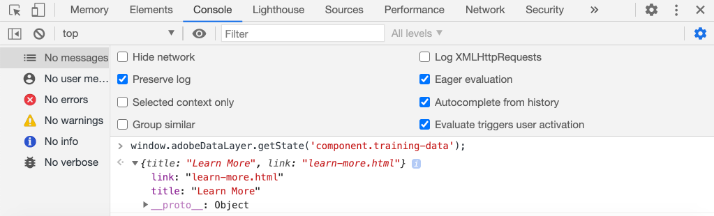
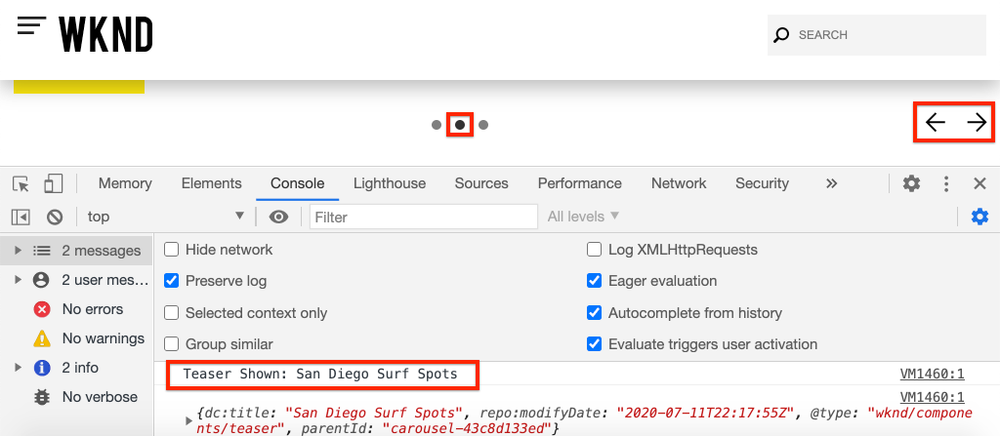
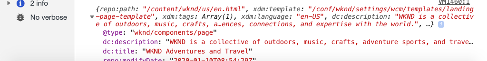

# Using the Adobe Client Data Layer with AEM Core Components {#overview}

The Adobe Client Data Layer introduces a standard method to collect and store data about a visitors experience on a webpage and then make it easy to access this data. The Adobe Client Data Layer is platform agnostic, but is fully integrated into the Core Components for use with AEM.

>[!VIDEO](https://video.tv.adobe.com/v/41195?quality=12&learn=on)

>[!NOTE]
>
> Want to enable the Adobe Client Data Layer on your AEM site? [See the instructions here](https://docs.adobe.com/content/help/en/experience-manager-core-components/using/developing/data-layer/overview.html#installation-activation).

## Explore the Data Layer

You can get an idea of the built-in functionality of the Adobe Client Data Layer just by using the developer tools of your browser and the live [WKND reference site](https://wknd.site/).

>[!NOTE]
>
> Screenshots below taken from the Chrome browser.

1. Navigate to [https://wknd.site](https://wknd.site)
1. Open your developer tools and enter the following command in the **Console**:

    ```js
    window.adobeDataLayer.getState();
    ```

    Inspect the response to see the current state of the data layer on an AEM site. You should see information about the page and individual components.

    

1. Push a data object on to the data layer by entering the following in the console:

    ```js
    window.adobeDataLayer.push({
        "component": {
            "training-data": {
                "title": "Learn More",
                "link": "learn-more.html"
            }
        }
    });
    ```

1. Run the command `adobeDataLayer.getState()` again and find the entry for `training-data`.
1. Next add a path parameter to return just the specific state of a component:

    ```js
    window.adobeDataLayer.getState('component.training-data');
    ```

    

## Working with Events

It is a best practice to trigger any custom code based on an event from the data layer. Next, explore registering and listening to different events.

1. Enter the following helper method in your console:

    ```js
    function getDataObjectHelper(event, filter) {
        if (event.hasOwnProperty("eventInfo") && event.eventInfo.hasOwnProperty("path")) {
            var dataObject = window.adobeDataLayer.getState(event.eventInfo.path);
            if (dataObject != null) {
                for (var property in filter) {
                    if (!dataObject.hasOwnProperty(property) || (filter[property] !== null && filter[property] !== dataObject[property])) {
                        return;
                    }
                    return dataObject;
                }
            }
        }
        return;
    }
    ```

    The above code will inspect the `event` object and use the `adobeDataLayer.getState` method to get the current state of the object that triggered the event. The helper method will then inspect the `filter` criteria and only if the current `dataObject` meets the filter will it be returned.

    >[!CAUTION]
    >
    > It will be important **not** to refresh the browser throughout this exercise, otherwise the console JavaScript will be lost.

1. Next, enter an event handler that will be called when a **Teaser** component is shown within a **Carousel**.

    ```js
    function teaserShownHandler(event) {
        var dataObject = getDataObjectHelper(event, {"@type": "wknd/components/teaser"});
        if(dataObject != null) {
            console.log("Teaser Shown: " + dataObject['dc:title']);
            console.log(dataObject);
        }
    }
    ```

    The `teaserShownHandler` will call the `getDataObjectHelper` method and pass in a filter of `wknd/components/teaser` as the `@type` to filter out events triggered by other components.

1. Next, push an event listener onto the data layer to listen for the `cmp:show` event.

    ```js
    window.adobeDataLayer.push(function (dl) {
         dl.addEventListener("cmp:show", teaserShownHandler);
    });
    ```

    The `cmp:show` event is triggered by many different components, like when a new slide is shown in the **Carousel** or when a new tab is selected in the **Tab** component.

1. On the page toggle the carousel slides and observe the console statements:

    

1. Remove the event listener from the data layer to stop listening for the `cmp:show` event:

    ```js
    window.adobeDataLayer = window.adobeDataLayer || [];
    window.adobeDataLayer.push(function(dl) {
        dl.removeEventListener("cmp:show", teaserShownHandler);
    });
    ```

1. Return to the page and toggle the carousel slides. Observe that no more statements are logged and that the event is not being listened to.

1. Next, enter an event handler that will be called when page shown event is triggered:

    ```js
    function pageShownHandler(event) {
        var dataObject = getDataObjectHelper(event, {"@type": "wknd/components/page"});
        if(dataObject != null) {
            console.log("Page Shown: " + dataObject['dc:title']);
            console.log(dataObject);
        }
    }
    ```

    Notice that the resource type `wknd/components/page` is used to filter the event.

1. Next, push an event listener onto the data layer to listen for the `cmp:show` event, calling the `pageShownHandler`.

    ```js
    window.adobeDataLayer = window.adobeDataLayer || [];
    window.adobeDataLayer.push(function (dl) {
         dl.addEventListener("cmp:show", pageShownHandler);
    });
    ```

1. You should immediately see a console statement fired with the page data:

    

    The `cmp:show` event for the page is triggered on each page load at the very top of the page. You might ask, why did the event handler get triggered, when the page has clearly already been loaded? 

    This is one of the unique features of the Adobe Client Data Layer, in that you can register event listeners **before** or **after** the Data Layer has been initialized. This is a critical feature to avoiding race conditions. 

    The Data Layer maintains a queue array of all events that have occured in sequence. The Data Layer by default will trigger event callbacks for events that occured in the **past** as well as events in the **future**. Its possible to filter the events to just past or future. [More information can be found in the documentation](https://github.com/adobe/adobe-client-data-layer/wiki#addeventlistener).


## Next Steps

Check out the following tutorial to learn how to use the event-driven Adobe Client Data layer to [collect page data and send to Adobe Analytics](../analytics/collect-data-analytics.md).


## Additional Resources {#additional-resources}

* [Adobe Client Data Layer Documentation](https://github.com/adobe/adobe-client-data-layer/wiki)
* [Using the Adobe Client Data Layer and Core Components Documentation](https://docs.adobe.com/content/help/en/experience-manager-core-components/using/developing/data-layer/overview.html)
