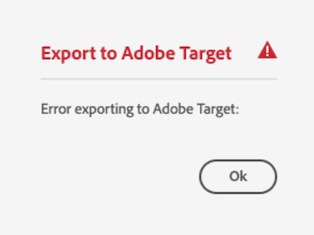
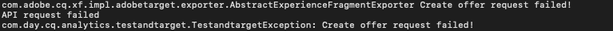
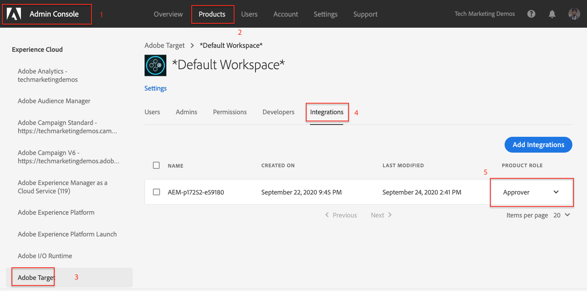

# Export Experience Fragment to Adobe Target {#experience-fragment-target}

Learn how to export AEM Experience Fragment as Adobe Target Offers.

>[!VIDEO](https://video.tv.adobe.com/v/41245?quality=12&learn=on)

## Next Steps

+ [Create a Target Activity using Experience Fragment Offers](./create-target-activity.md)

## Troubleshooting

### Exporting Experience Fragments to Target fails

#### Error

Exporting Experience Fragment to Adobe Target without the correct permissions in Adobe Admin Console, results in the following error on the AEM Author service:      

    

... and the following log messages in the `aemerror` log:

    

#### Resolution

1. Login to [Admin Console](https://adminconsole.adobe.com/) with administrative rights for the Adobe Target Product Profile used but he AEM integration
2. Select __Products > Adobe Target > Product Profile__
3. Under __Integrations__ tab, select the integration for your AEM as a Cloud Service environment (same name as the Adobe I/O project)
4. Assign __Editor__ or __Approver__ role 

    

Adding the correct permission to your Adobe Target integration should resolve this error.

## Supporting Links

+ [Adobe Experience Cloud Debugger - Chrome](https://chrome.google.com/webstore/detail/adobe-experience-cloud-de/ocdmogmohccmeicdhlhhgepeaijenapj) 
+ [Adobe Experience Cloud Debugger - Firefox](https://addons.mozilla.org/en-US/firefox/addon/adobe-experience-platform-dbg/)
