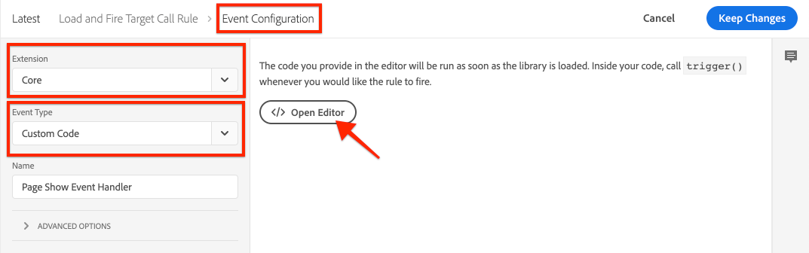
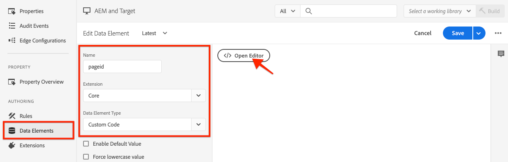

# Load and fire a Target call {#load-fire-target}

Learn how to load, pass parameters to page request, and fire a Target call from your site page using a tags Rule. Web page information is retrieved and passed as parameters using the Adobe Client Data Layer that lets you collect and store data about visitors' experience on a webpage and then make it easy to access this data.

>[!VIDEO](https://video.tv.adobe.com/v/41243?quality=12&learn=on)

## Page Load Rule 

The Adobe Client Data Layer is an event-driven data layer. When the AEM Page data layer is loaded, it triggers an event `cmp:show` . In the video, the `tags Library Loaded` rule is invoked using a custom event. Below, you can find the code snippets used in the video for the custom event and for the data elements. 

### Custom Page Shown Event{#page-event}



In the tags property, add a new **Event** to the **Rule**

+ __Extension:__ Core
+ __Event Type:__ Custom Code
+ __Name:__ Page Show Event Handler (or something  descriptive)

Tap the __Open Editor__ button and paste in the following code snippet. This code __must__ be added to the __Event Configuration__ and a subsequent __Action__. 

```javascript
// Define the event handler function
var pageShownEventHandler = function(coreComponentEvent) {

    // Check to ensure event trigger via AEM Core Components is shaped correctly
    if (coreComponentEvent.hasOwnProperty("eventInfo") && 
        coreComponentEvent.eventInfo.hasOwnProperty("path")) {
    
        // Debug the AEM Component path the show event is associated with
        console.debug("cmp:show event: " + coreComponentEvent.eventInfo.path);

        // Create the tags Event object
        var launchEvent = {
            // Include the ID of the AEM Component that triggered the event
            id: coreComponentEvent.eventInfo.path,
            // Get the state of the AEM Component that triggered the event           
            component: window.adobeDataLayer.getState(coreComponentEvent.eventInfo.path)
        };

        // Trigger the tags Rule, passing in the new `event` object
        // the `event` obj can now be referenced by the reserved name `event` by other tags data elements
        // i.e `event.component['someKey']`
        trigger(launchEvent);
   }
}

// With the AEM Core Component event handler, that proxies the event and relevant information to Data Collection, defined above...

// Initialize the adobeDataLayer global object in a safe way
window.adobeDataLayer = window.adobeDataLayer || [];

// Push the event custom listener onto the Adobe Data Layer
window.adobeDataLayer.push(function (dataLayer) {
   // Add event listener for the `cmp:show` event, and the custom `pageShownEventHandler` function as the callback
   dataLayer.addEventListener("cmp:show", pageShownEventHandler);
});
```

A custom function defines the `pageShownEventHandler`, and listens for events emitted by AEM Core Components, derives the relevant information the Core Component, packages it up into an event object, and triggers the tags Event with the derived event info at its payload.

The tags Rule is triggered using the tags's `trigger(...)` function which is __only__ available from within a Rule's Event's Custom Code code snippet definition. 

The `trigger(...)` function takes an event object as a parameter which in turn is exposed in tags Data Elements, by another reserved name in tags named `event`. Data Elements in tags can now reference data from this event object from the `event` object using syntax like `event.component['someKey']`.

If `trigger(...)` is used outside the context of an Event's Custom Code event type (for example, in an Action), the JavaScript error `trigger is undefined` is thrown on the Web site integrated with the tags property.


### Data Elements 



Tags Data Elements map the data from the event object [triggered in the custom Page Shown event](#page-event) to variables available in Adobe Target, via the Core extension's Custom Code Data Element Type.

#### Page ID Data Element

```
if (event && event.id) {
    return event.id;
}
```

This code returns the Core Component's generate unique Id.


### Page Path Data Element

```
if (event && event.component && event.component.hasOwnProperty('repo:path')) {
    return event.component['repo:path'];
}
```

This code returns the AEM page's path.


### Page Title Data Element

```
if (event && event.component && event.component.hasOwnProperty('dc:title')) {
    return event.component['dc:title'];
}
```

This code returns the AEM page's title.


## Troubleshooting

### Why are my mboxes not firing on my web pages?

#### Error message when mboxDisable cookie is not set


```
> AT: [page-init] Adobe Target content delivery is disabled. Ensure that you can save cookies to your current domain, there is no "mboxDisable" cookie and there is no "mboxDisable" parameter in the query string.
```

#### Solution

Target customers sometimes use cloud-based instances with Target for testing or simple proof-of-concept purposes. These domains, and many others, are part of the Public Suffix List .
Modern browsers won't save cookies if you are using these domains unless you customize the `cookieDomain` setting using `targetGlobalSettings()`.

```
window.targetGlobalSettings = {  
   cookieDomain: 'your-domain' //set the cookie directly on this subdomain, for example: 'publish-p1234-e5678.adobeaemcloud.com'
};
```

## Next Steps

+ [Export Experience Fragment to Adobe Target](./export-experience-fragment-target.md)
   
## Supporting Links

+ [Adobe Client Data Layer Documentation](https://github.com/adobe/adobe-client-data-layer/wiki)
+ [Adobe Experience Cloud Debugger - Chrome](https://chrome.google.com/webstore/detail/adobe-experience-platform/bfnnokhpnncpkdmbokanobigaccjkpob) 
+ [Using the Adobe Client Data Layer and Core Components Documentation](https://experienceleague.adobe.com/docs/experience-manager-core-components/using/developing/data-layer/overview.html)
+ [Introduction to the Adobe Experience Platform Debugger](https://experienceleague.adobe.com/docs/platform-learn/data-collection/debugger/overview.html)
