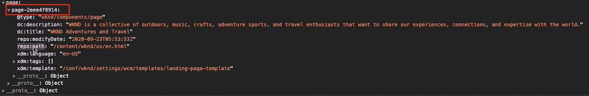
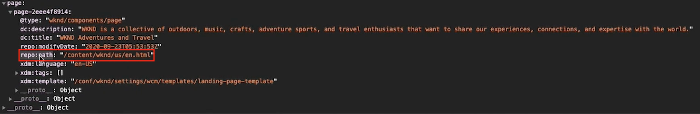
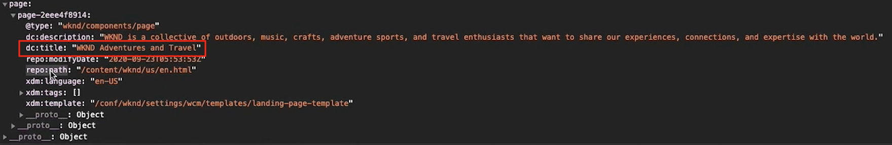
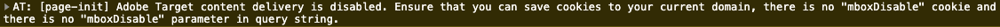

# Load and fire a Target call {#load-fire-target}

Learn how to load, pass parameters to page request, and fire a Target call from your site page using a Launch Rule. Page information is retrieved and passed as parameters using the Adobe Client Data Layer that lets you collect and store data about visitors' experience on a webpage and then make it easy to access this data.

>[!VIDEO](https://video.tv.adobe.com/v/41243?quality=12&learn=on)

## Page Load Rule 

The Adobe Client Data Layer is an event driven data layer. When the AEM Page data layer is loaded, it will trigger an event `cmp:show` . In the video, the `Launch Library Loaded` rule is invoked using a custom event. Below, you can find the code snippets used in the video for the custom event as well as for the data elements. 

### Custom Event

The below code snippet will add an event listener by pushing a function into the data layer. When the `cmp:show` event is triggered the `pageShownEventHandler` function is called. In this function, a few sanity checks are added and a new `dataObject` is constructed with the latest state of the data layer for the component that triggered the event.

After that `trigger(dataObject)` is called. `trigger()` is a reserved name in Launch and will "trigger" the Launch Rule. We pass the event object as a parameter which in turn will be exposed by another reserved name in Launch named event. Data Elements in Launch can now reference various properties like so: `event.component['someKey']`.

```javascript
var pageShownEventHandler = function(evt) {
// defensive coding to avoid a null pointer exception
if(evt.hasOwnProperty("eventInfo") && evt.eventInfo.hasOwnProperty("path")) {
   //trigger Launch Rule and pass event
   console.debug("cmp:show event: " + evt.eventInfo.path);
   var event = {
      //include the id of the component that triggered the event
      id: evt.eventInfo.path,
      //get the state of the component that triggered the event
      component: window.adobeDataLayer.getState(evt.eventInfo.path)
   };

      //Trigger the Launch Rule, passing in the new `event` object
      // the `event` obj can now be referenced by the reserved name `event` by other Launch data elements
      // i.e `event.component['someKey']`
      trigger(event);
   }
}

//set the namespace to avoid a potential race condition
window.adobeDataLayer = window.adobeDataLayer || [];
//push the event listener for cmp:show into the data layer
window.adobeDataLayer.push(function (dl) {
   //add event listener for `cmp:show` and callback to the `pageShownEventHandler` function
   dl.addEventListener("cmp:show", pageShownEventHandler);
});
```

### Data Layer Page ID

```
if(event && event.id) {
    return event.id;
}
```



### Page Path

```
if(event && event.component && event.component.hasOwnProperty('repo:path')) {
    return event.component['repo:path'];
}
```



### Page Title

```
if(event && event.component && event.component.hasOwnProperty('dc:title')) {
    return event.component['dc:title'];
}
```



### Common Issues

#### Why are my mboxes not firing on my web pages?

**Error message when mboxDisable cookie is not set**



**Solution**

Target customers sometimes use cloud-based instances with Target for testing or simple proof-of-concept purposes. These domains, and many others, are part of the Public Suffix List .
Modern browsers won't save cookies if you are using these domains unless you customize the `cookieDomain` setting using `targetGlobalSettings()`.

```
window.targetGlobalSettings = {  
   cookieDomain: 'your-domain' //set the cookie directly on this subdomain 
};
```

## Supporting Links

* [Adobe Client Data Layer Documentation](https://github.com/adobe/adobe-client-data-layer/wiki)
* [Adobe Experience Cloud Debugger - Chrome](https://chrome.google.com/webstore/detail/adobe-experience-cloud-de/ocdmogmohccmeicdhlhhgepeaijenapj) 
* [Adobe Experience Cloud Debugger - Firefox](https://addons.mozilla.org/en-US/firefox/addon/adobe-experience-platform-dbg/)
* [Using the Adobe Client Data Layer and Core Components Documentation](https://docs.adobe.com/content/help/en/experience-manager-core-components/using/developing/data-layer/overview.html)
* [Introduction to the Adobe Experience Platform Debugger](https://docs.adobe.com/content/help/en/platform-learn/tutorials/data-ingestion/web-sdk/introduction-to-the-experience-platform-debugger.html)