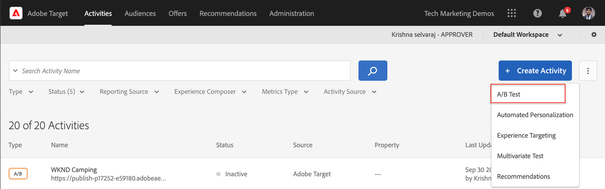
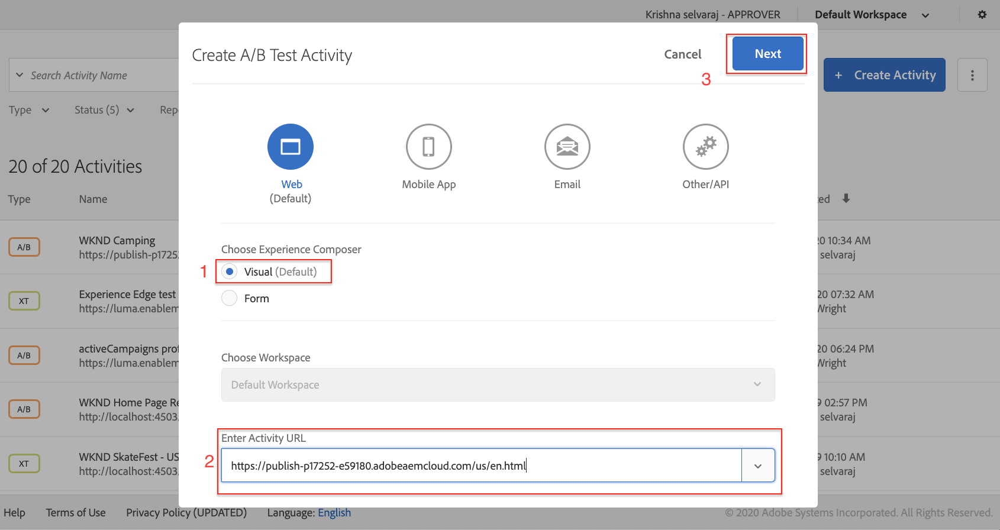
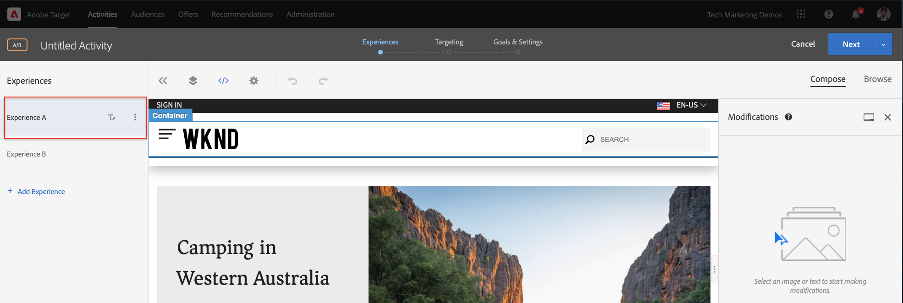
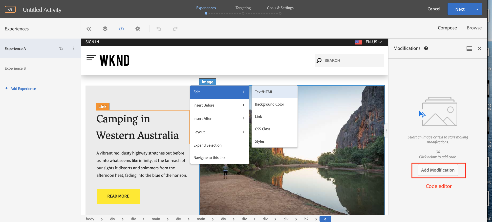
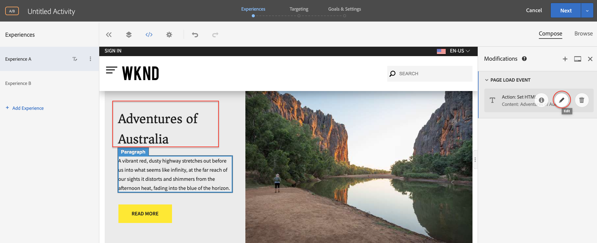
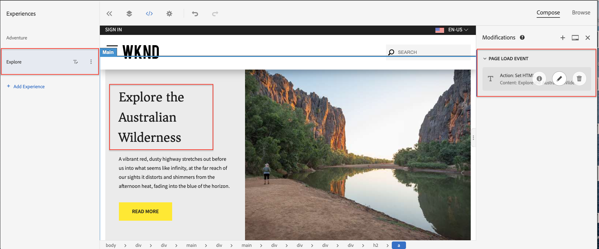
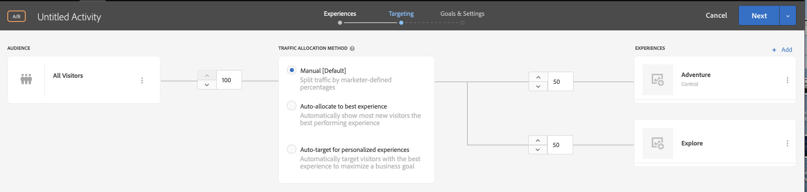
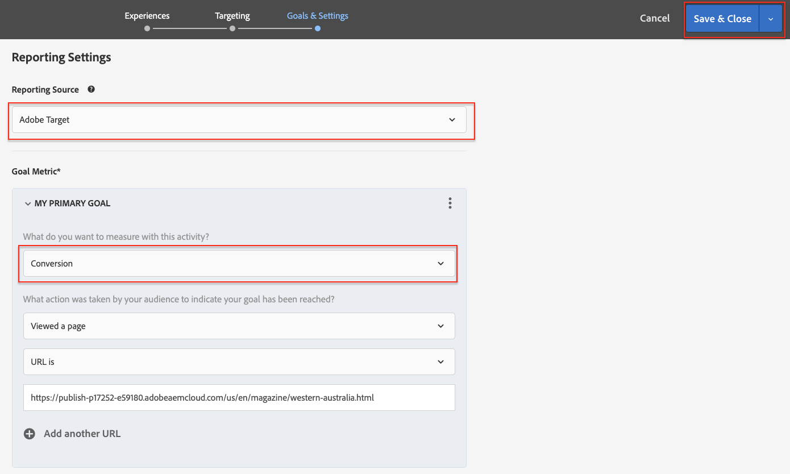
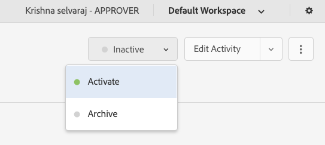
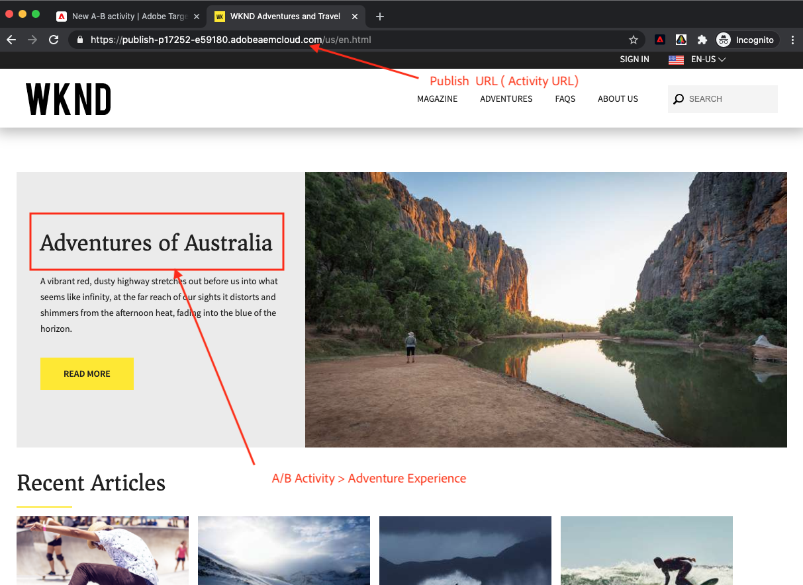

# Personalization using Visual Experience Composer {#personalization-vec}

Learn how to create an A/B Test Target Activity using Visual Experience Composer (VEC).

## Prerequisites

To use VEC on an AEM web site, the following set-up must be completed:

1. [Add Adobe Target to your AEM web site](./add-target-launch-extension.md)
1. [Trigger an Adobe Target call from Launch](./load-and-fire-target.md)

## Scenario Overview

The WKND site home page displays local activities or the best things to do around a city in the form of informational cards. As a marketer, you have been assigned the task to modify the home page, by making text changes to the adventure section teaser and understand how it improves conversion.

## Steps to create an A/B test using Visual Experience Composer (VEC)

1. Login to [Adobe Experience Cloud](https://experience.adobe.com/), tap on __Target__,  navigate to the __Activities__ tab
    
    + If you do not see __Target__ on the Experience Cloud dashboard, ensure that the correct Adobe organization is selected in the organization switcher in the top right, and that user has been granted access to Target in [Adobe Admin Console](https://adminconsole.adobe.com/).

1. Click **Create Activity** button and then choose **A/B Test** activity

    

1. Select the **Visual Experience Composer** option,  provide the Activity URL, and then click **Next**

    

1. The Visual Experience Composer displays two tabs on the left side after you create an activity: *Experience A* and *Experience B*. Select an experience from the list. You can add new experiences to the list by using the **Add Experience** button.

    

1. Select an image or text on your page to start making modification or use can use the code editor to pick and HTML element.

    

1. Change the text from *Camping in Western Australia* to *Adventures of Australia*. A list of changes added to an Experience are displayed under Modifications. You can click and edit the modified item to view its CSS selector and the new content added to it.

    

1. Rename *Experience A* to *Adventure*
1. Similarly, update the text on *Experience B* from *Camping in Western Australia* to *Explore the Australian Wilderness*.

    

1. Click **Next** to move to Targeting and let's keep a Manual traffic allocation of 50-50 between the two experiences. 

    

1. For Goals and settings, choose the Reporting source as Adobe Target and select the Goal metric as Conversion with a page view action.

    

1. Provide a name for your activity and Save.
1. Activate your saved activity to push your changes live.

    

1. Open your site page (Activity URL from step 3) in a new tab and you should be able to view either of the experiences (Adventure or Explore) from our A/B test activity.

    

## Summary

In this chapter a marketer was able to create an experience using Visual Experience Composer by dragging and dropping, swapping, and modifying the layout and content of a web page without changing any code to run a test.

## Supporting Links

+ [Adobe Experience Cloud Debugger - Chrome](https://chrome.google.com/webstore/detail/adobe-experience-platform/bfnnokhpnncpkdmbokanobigaccjkpob) 
+ [Adobe Experience Cloud Debugger - Firefox](https://addons.mozilla.org/en-US/firefox/addon/adobe-experience-platform-dbg/)
