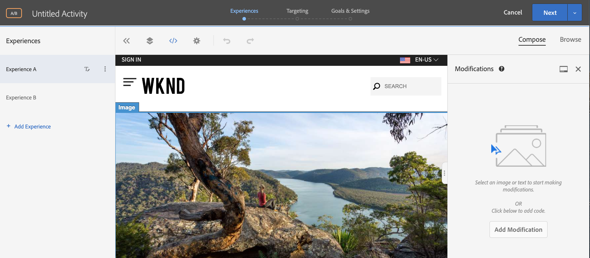
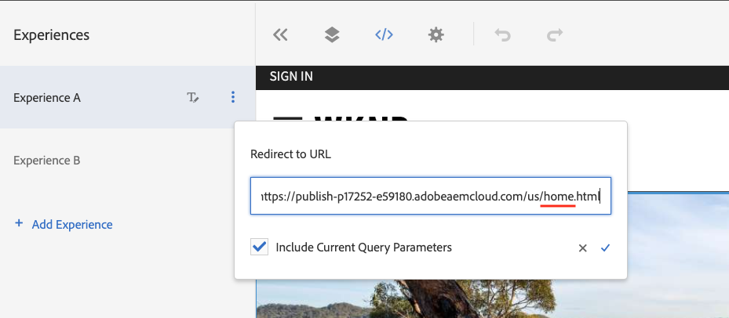
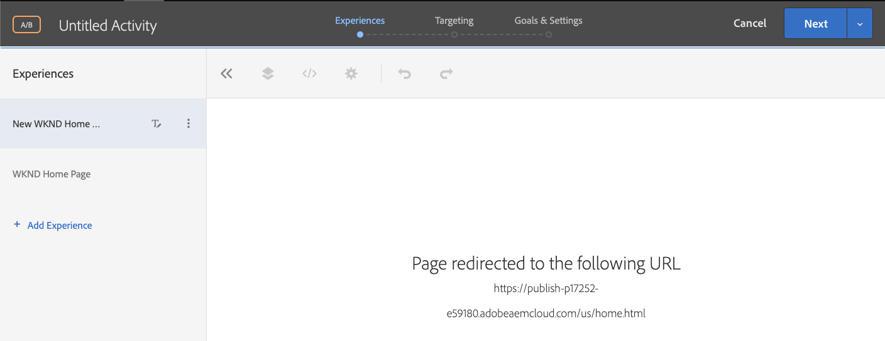
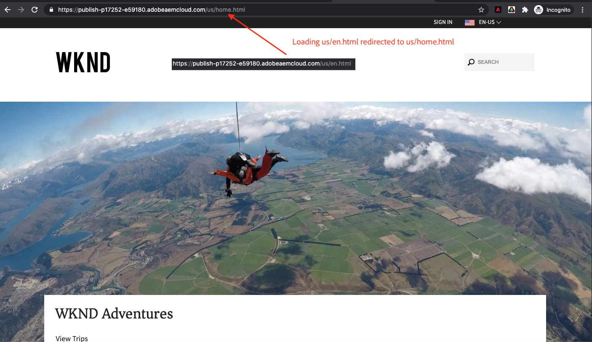

# Personalization of full web page Experience {#personalization-fpe}

Learn how to create an activity to redirect your site pages that are hosted on AEM to a new page using Adobe Target.

## Scenario Overview

WKND site redesigned their home page and would like to redirect their current home page visitors to the new home page. At the same time, also understand how the redesigned home page helps to improve user engagement and revenue. As a marketer, you have been assigned the task to create an activity to redirect the visitors to the new home page. Let us explore the WKND site home page and learn how to create an activity using Adobe Target.

## Steps to create an A/B test using Visual Experience Composer (VEC)

1. Login to Adobe Target and navigate to the Activities tab
2. Click **Create Activity** button and then choose **A/B Test** activity
   
    

3. Select the **Visual Experience Composer** option,  provide the Activity URL, and then click **Next**

    

4. The Visual Experience Composer displays two tabs on the left side after you create a new activity: *Experience A* and *Experience B*. Select an experience from the list. You can add new experiences to the list, by using the **Add Experience** button.

    

5. View options available for Experience A and then select the **Redirect to URL** option and provide a URL for the new WKND Site home page.

    

6. Rename *Experience A* to *New WKND Home Page* and *Experience B* to *WKND Home Page*

    

7.  Click **Next** to move to Targeting and keep a Manual traffic allocation of 50-50 between the two experiences. 
    
    

8.  For Goals and settings, choose the Reporting source as Adobe Target and select the Goal metric as Conversion with a page view action.
    
    

9.  Provide a name for your activity and Save.
10. Activate your saved activity to push your changes live.
    
    

11. Open your site page (Activity URL from step 3) in a new tab and you should be able to view either of the experiences (WKND Home Page or New WKND Home Page) from our A/B test activity. `us/en.html` redirects to `us/home.html`.
    
    

## Summary

As a marketer you were able to create an activity to redirect your site pages that are hosted on AEM to a new page using Adobe Target.

## Supporting Links

* [Adobe Experience Cloud Debugger - Chrome](https://chrome.google.com/webstore/detail/adobe-experience-cloud-de/ocdmogmohccmeicdhlhhgepeaijenapj) 
* [Adobe Experience Cloud Debugger - Firefox](https://addons.mozilla.org/en-US/firefox/addon/adobe-experience-platform-dbg/)

