# Integrate AEM Sites and Adobe Analytics

Learn how to integrate AEM Sites and Adobe Analytics with Adobe Analytics tags extension, using the built-in features of the [Adobe Client Data Layer with AEM Core Components](https://experienceleague.adobe.com/docs/experience-manager-core-components/using/developing/data-layer/overview.html) to collect data about a page in Adobe Experience Manager Sites. [Tags in Experience Platform](https://experienceleague.adobe.com/docs/experience-platform/tags/home.html) and the [Adobe Analytics extension](https://experienceleague.adobe.com/docs/experience-platform/tags/extensions/client/analytics/overview.html) are used to create rules to send page data to Adobe Analytics.

## What you are going to build {#what-build}

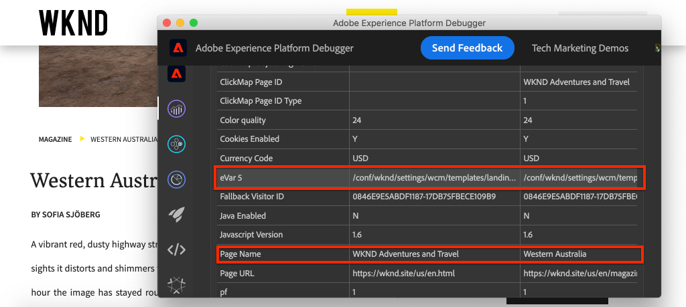

In this tutorial, you are going to trigger a tag rule based on an event from the Adobe Client Data Layer. Also, add conditions for when the rule should be fired, and then send the **Page Name** and **Page Template** values of an AEM Page to Adobe Analytics.

### Objectives {#objective}

1. Create an event-driven rule in the tag property that captures changes from the data layer
1. Map page data layer properties to Data Elements in the tag property
1. Collect and send page data into Adobe Analytics using the page view beacon

## Prerequisites

The following are required:

* **Tag property** in Experience Platform
* **Adobe Analytics** test/dev report suite ID and tracking server. See the following documentation for [creating a report suite](https://experienceleague.adobe.com/docs/analytics/admin/admin-tools/manage-report-suites/c-new-report-suite/new-report-suite.html).
* [Experience Platform Debugger](https://experienceleague.adobe.com/docs/platform-learn/data-collection/debugger/overview.html) browser extension. Screenshots in this tutorial captured from the Chrome browser.
* (Optional) AEM Site with the [Adobe Client Data Layer enabled](https://experienceleague.adobe.com/docs/experience-manager-core-components/using/developing/data-layer/overview.html#installation-activation). This tutorial uses the public facing [WKND](https://wknd.site/us/en.html) site but you are welcome to use your own site.

>[!NOTE]
>
> Need help with integrating tag property and AEM site? [See this video series](../experience-platform/data-collection/tags/overview.md).

## Switch Tag Environment for WKND Site

The [WKND](https://wknd.site/us/en.html) is a public-facing site built based on [an open-source project](https://github.com/adobe/aem-guides-wknd) designed as a reference and [tutorial](https://experienceleague.adobe.com/docs/experience-manager-learn/getting-started-wknd-tutorial-develop/overview.html) for an AEM implementation. 

Instead of setting up an AEM environment and installing the WKND code base, you can use the Experience Platform debugger to **switch** the live [WKND Site](https://wknd.site/us/en.html) to *your* tag property. However, you can use your own AEM site if it already has the [Adobe Client Data Layer enabled](https://experienceleague.adobe.com/docs/experience-manager-core-components/using/developing/data-layer/overview.html#installation-activation).

1. Log in to Experience Platform and [create a Tag property](https://experienceleague.adobe.com/docs/platform-learn/implement-in-websites/configure-tags/create-a-property.html) (if you haven't already).
1. Ensure that an initial tag JavaScript [library has been created](https://experienceleague.adobe.com/docs/experience-platform/tags/publish/libraries.html#create-a-library) and promoted to the tag [environment](https://experienceleague.adobe.com/docs/experience-platform/tags/publish/environments/environments.html).
1. Copy the JavaScript embed code from the tag environment where your library has been published to.

   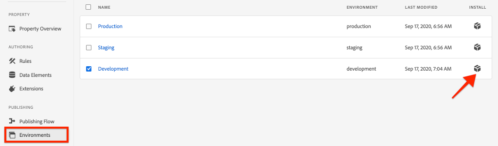

1. In your browser, open a new tab and navigate to [WKND Site](https://wknd.site/us/en.html)
1. Open the Experience Platform Debugger browser extension

   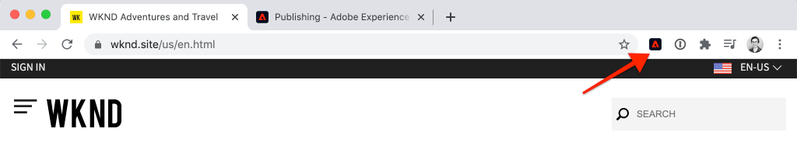

1. Navigate to **Experience Platform Tags** > **Configuration** and under **Injected Embed Codes** replace the existing embed code with *your* embed code copied from step 3.

   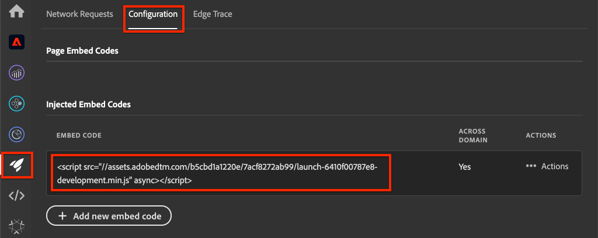

1. Enable **Console Logging** and **Lock** the debugger on the WKND tab.

   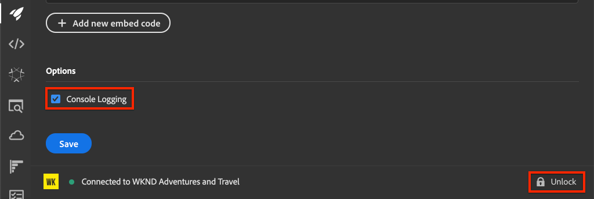

## Verify Adobe Client Data Layer on WKND Site

The [WKND reference project](https://github.com/adobe/aem-guides-wknd) is built with AEM Core Components and has the [Adobe Client Data Layer enabled](https://experienceleague.adobe.com/docs/experience-manager-core-components/using/developing/data-layer/overview.html#installation-activation) by default. Next, verify that the Adobe Client Data Layer is enabled.

1.  Navigate to [WKND Site](https://wknd.site/us/en.html).
1.  Open the browser's developer tools and navigate to the **Console**. Run the following command:

    ```js
    adobeDataLayer.getState();
    ```

    Above code returns the current state of the Adobe Client Data Layer.

    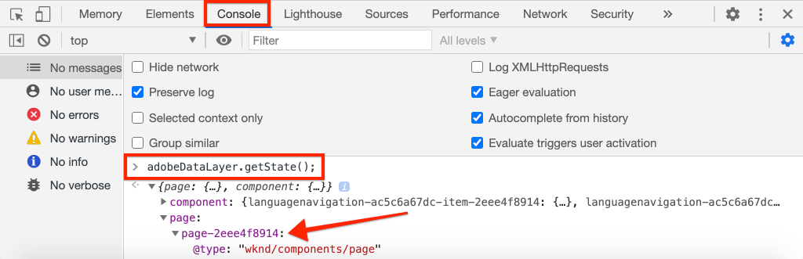

1.  Expand the response and inspect the `page` entry. You should see a data schema like the following:

    ```json
    page-2eee4f8914:
        @type: "wknd/components/page"
        dc:description: WKND is a collective of outdoors, music, crafts, adventure sports, and travel enthusiasts that want to share our experiences, connections, and expertise with the world.
        dc:title: "WKND Adventures and Travel"
        repo:modifyDate: "2020-08-31T21:02:21Z"
        repo:path: "/content/wknd/us/en.html"
        xdm:language: "en-US"
        xdm:tags: ["Attract"]
        xdm:template: "/conf/wknd/settings/wcm/templates/landing-page-template"
    ```

    To send page data to Adobe Analytics let's use the standard properties like `dc:title`, `xdm:language`, and `xdm:template` of the data layer.

    For more information, review the [Page Schema](https://experienceleague.adobe.com/docs/experience-manager-core-components/using/developing/data-layer/overview.html#page) from the Core Components Data Schemas. 

    >[!NOTE]
    >
    > If you don't see the `adobeDataLayer` JavaScript object? Ensure that the [Adobe Client Data Layer has been enabled](https://experienceleague.adobe.com/docs/experience-manager-core-components/using/developing/data-layer/overview.html#installation-activation) on your site.

## Create a Page Loaded rule

The Adobe Client Data Layer is an **event-driven** data layer. When the AEM Page data layer is loaded, it triggers a `cmp:show` event. Create a rule that is triggered when the `cmp:show` event is fired from the page data layer.

1. Navigate to Experience Platform and into the tag property integrated with the AEM Site.
1. Navigate to the **Rules** section in the Tag Property UI and then click **Create New Rule**.

   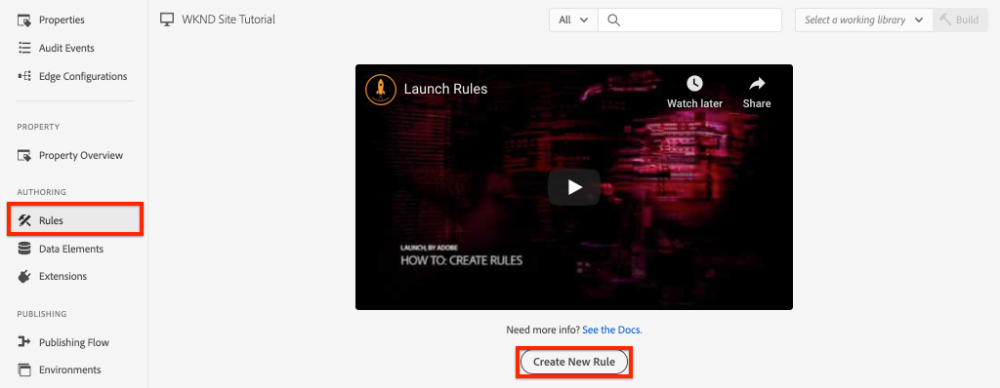

1. Name the rule **Page Loaded**.
1. In the **Events** subsection, click **Add** to open the **Event Configuration** wizard.
1. For **Event Type** field, select **Custom Code**.

   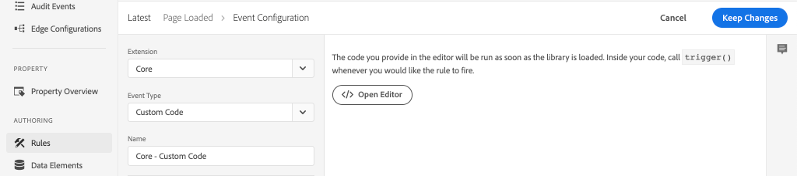

1. Click **Open Editor** in the main panel and enter the following code snippet:

   ```js
   var pageShownEventHandler = function(evt) {
      // defensive coding to avoid a null pointer exception
      if(evt.hasOwnProperty("eventInfo") && evt.eventInfo.hasOwnProperty("path")) {
         //trigger the Tag Rule and pass event
         console.log("cmp:show event: " + evt.eventInfo.path);
         var event = {
            //include the path of the component that triggered the event
            path: evt.eventInfo.path,
            //get the state of the component that triggered the event
            component: window.adobeDataLayer.getState(evt.eventInfo.path)
         };

         //Trigger the Tag Rule, passing in the new `event` object
         // the `event` obj can now be referenced by the reserved name `event` by other Tag data elements
         // i.e `event.component['someKey']`
         trigger(event);
      }
   }

   //set the namespace to avoid a potential race condition
   window.adobeDataLayer = window.adobeDataLayer || [];
   //push the event listener for cmp:show into the data layer
   window.adobeDataLayer.push(function (dl) {
      //add event listener for `cmp:show` and callback to the `pageShownEventHandler` function
      dl.addEventListener("cmp:show", pageShownEventHandler);
   });
   ```

   The above code snippet adds an event listener by [pushing a function](https://github.com/adobe/adobe-client-data-layer/wiki#pushing-a-function) into the data layer. When `cmp:show` event is triggered the `pageShownEventHandler` function is called. In this function, a few sanity checks are added and a new `event` is constructed with the latest [state of the data layer](https://github.com/adobe/adobe-client-data-layer/wiki#getstate) for the component that triggered the event.

   Finally the `trigger(event)` function is called. The `trigger()` function is a reserved name in the tag property and it **triggers** the rule. The `event` object is passed as a parameter which in turn is exposed by another reserved name in the tag property. Data Elements in the tag property can now reference various properties using code snippet like `event.component['someKey']`.

1. Save the changes.
1. Next under **Actions** click **Add** to open the **Action Configuration** wizard.
1. For **Action Type** field, choose **Custom Code**.

   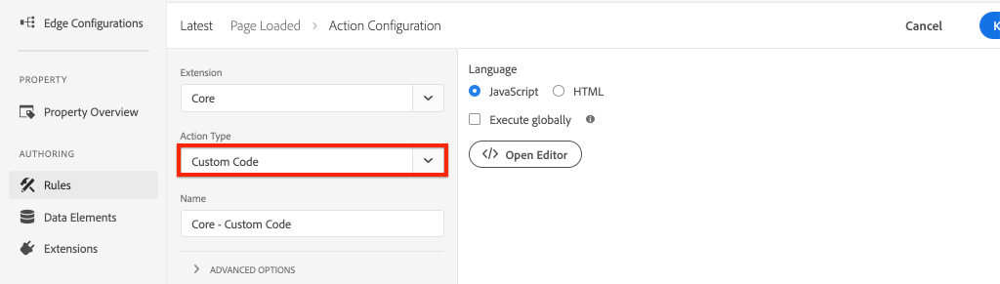

1. Click **Open Editor** in the main panel and enter the following code snippet:

   ```js
   console.log("Page Loaded ");
   console.log("Page name: " + event.component['dc:title']);
   console.log("Page type: " + event.component['@type']);
   console.log("Page template: " + event.component['xdm:template']);
   ```

   The `event` object is passed from the `trigger()` method called in the custom event. Here, the `component` is the current page derived from the data layer `getState` in the custom event. 

1. Save the changes and run a [build](https://experienceleague.adobe.com/docs/experience-platform/tags/publish/builds.html) in the tag property to promote the code to the [environment](https://experienceleague.adobe.com/docs/experience-platform/tags/publish/environments/environments.html) used on your AEM Site.

   >[!NOTE]
   >
   > It can be useful to use the [Adobe Experience Platform Debugger](https://experienceleague.adobe.com/docs/platform-learn/data-collection/debugger/overview.html) to switch the embed code to a **Development** environment.

1.  Navigate to your AEM site and open the developer tools to view the console. Refresh the page and you should see that the console messages have been logged:

   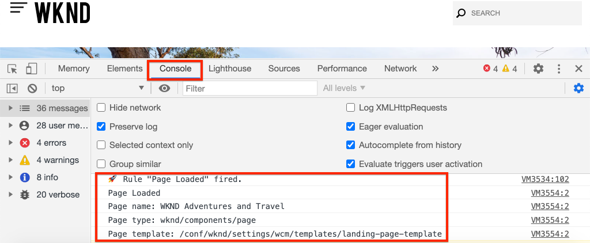

## Create Data Elements

Next create several Data Elements to capture different values from the Adobe Client Data Layer. As seen in the previous exercise it is possible to access the properties of the data layer directly through custom code. The advantage of using Data Elements is that they can be reused across tag rules.

Data elements are mapped to the `@type`, `dc:title`, and `xdm:template` properties.

### Component Resource Type

1.  Navigate to Experience Platform and into the tag property integrated with the AEM Site.
1.  Navigate to the **Data Elements** section and click **Create New Data Element**.
1.  For the **Name** field, enter the **Component Resource Type**.
1.  For the **Data Element Type** field, select **Custom Code**.

    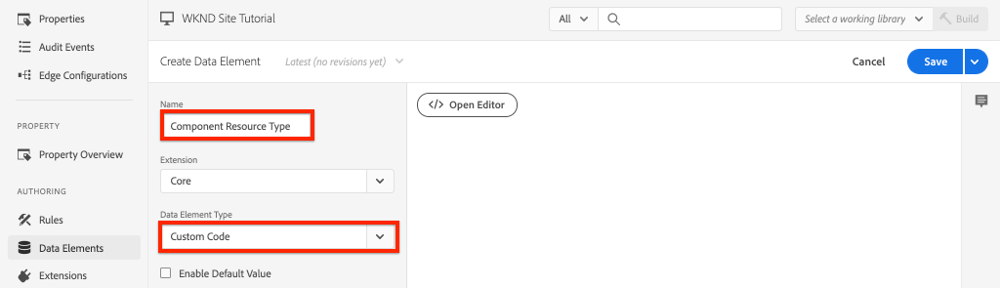

1.  Click **Open Editor** button and enter the following in the custom code editor:

    ```js
    if(event && event.component && event.component.hasOwnProperty('@type')) {
        return event.component['@type'];
    }
    ```

1.  Save the changes.

    >[!NOTE]
    >
    > Recall that the `event` object is made available and scoped based on the event that triggered the **Rule** in tag property. The value of a Data Element is not set until the Data Element is *referenced* within a Rule. Therefore it is safe to use this Data Element inside a Rule like the **Page Loaded** rule created in the previous step *but* would not be safe to use in other contexts.

### Page Name

1.  Click **Add Data Element** button
1.  For the **Name** field, enter **Page Name**.
1.  For the **Data Element Type** field, select **Custom Code**.
1.  Click **Open Editor** button, and enter the following in the custom code editor:

    ```js
    if(event && event.component && event.component.hasOwnProperty('dc:title')) {
        return event.component['dc:title'];
    }
    ```

1.  Save the changes.

### Page Template

1.  Click the **Add Data Element** button
1.  For the **Name** field, enter **Page Template**.
1.  For the **Data Element Type** field, select **Custom Code**.
1.  Click **Open Editor** button, and enter the following in the custom code editor:

    ```js
    if(event && event.component && event.component.hasOwnProperty('xdm:template')) {
        return event.component['xdm:template'];
    }
    ```

1.  Save the changes.

1.  You should now have three data elements as part of your rule:

    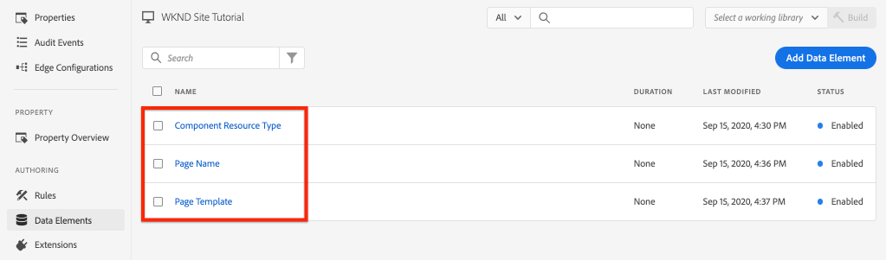

## Add the Analytics Extension

Next add the Analytics extension to your tag property to send data into a report suite.

1. Navigate to Experience Platform and into the tag property integrated with the AEM Site.
1. Go to **Extensions** > **Catalog**
1. Locate the **Adobe Analytics** extension and click **Install**

   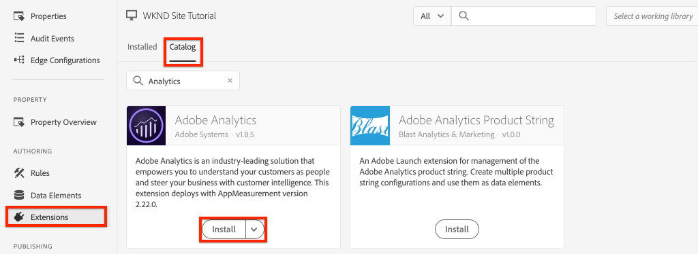

1. Under **Library Management** > **Report Suites**, enter the report suite ids you would like to use with each tag environment.

    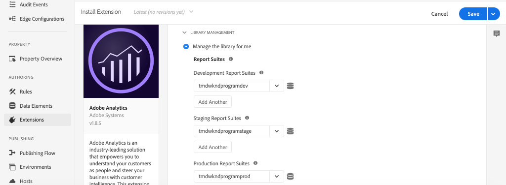

    >[!NOTE]
    >
    > It's okay to use one report suite for all environments in this tutorial, but in real life you would want to use separate report suites, as shown in the image below

    >[!TIP]
    >
    >We recommend using the *Manage the library for me option* as the Library Management setting as it makes it much easier to keep the `AppMeasurement.js` library up to date.

1. Check the box to enable **Use Activity Map**.

   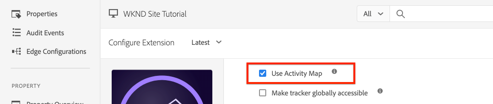

1. Under **General** > **Tracking Server**, enter your tracking server, for example, `tmd.sc.omtrdc.net`. Enter your SSL Tracking Server if your site supports `https://`

    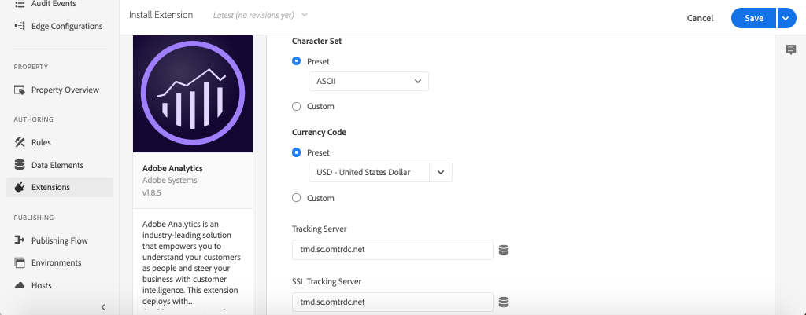

1. Click **Save** to save the changes.

## Add a condition to the Page Loaded rule

Next, update the **Page Loaded** rule to use the **Component Resource Type** data element to ensure that the rule only fires when the `cmp:show` event is for the **Page**. Other components can fire the `cmp:show` event, for example, the Carousel component fires it when the slides change. Therefore it is important to add a condition for this rule.

1. In the Tag Property UI, navigate to the **Page Loaded** rule created earlier.
1. Under **Conditions** click **Add** to open the **Condition Configuration** wizard.
1. For **Condition Type** field, select **Value Comparison** option.
1. Set the first value in the form field to `%Component Resource Type%`. You can use the Data Element Icon  to select the **Component Resource Type** data element. Leave the comparator set to `Equals`.
1. Set the second value to `wknd/components/page`.

   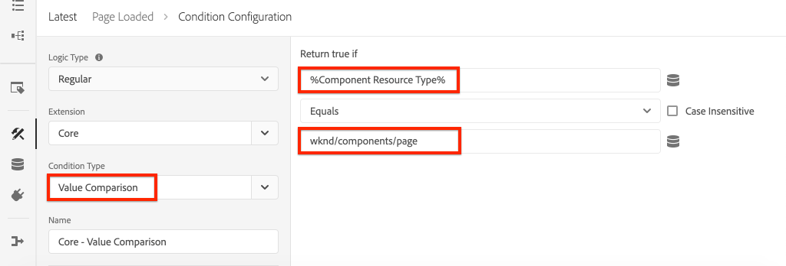

   >[!NOTE]
   >
   > It is possible to add this condition within the custom code function that listens for the `cmp:show` event created earlier in the tutorial. However, adding it within the UI gives more visibility to additional users that might need to make changes to the rule. Plus we get to use our data element!

1. Save the changes.

## Set Analytics Variables and trigger Page View Beacon

Currently the **Page Loaded** rule simply outputs a console statement. Next, use the data elements and the Analytics extension to set Analytics variables as an **action** in the **Page Loaded** rule. We also set an extra action to trigger the **Page View Beacon** and send the collected data to Adobe Analytics.

1. In the Page Loaded rule, **remove** the **Core - Custom Code** action (the console statements):

   

1. Under Actions subsection, click **Add** to add a new action.

1. Set the **Extension** type to **Adobe Analytics** and set the **Action Type** to  **Set Variables**

   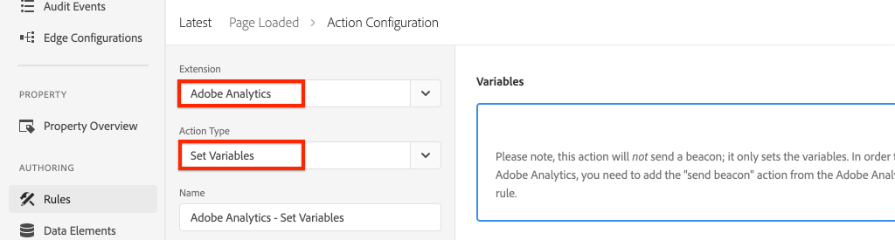

1. In the main panel, select an available **eVar** and set as the value of the Data Element **Page Template**. Use the Data Elements icon  to select the **Page Template** element.

   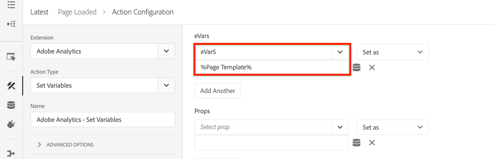

1. Scroll down, under **Additional Settings** set **Page Name** to the data element **Page Name**:

   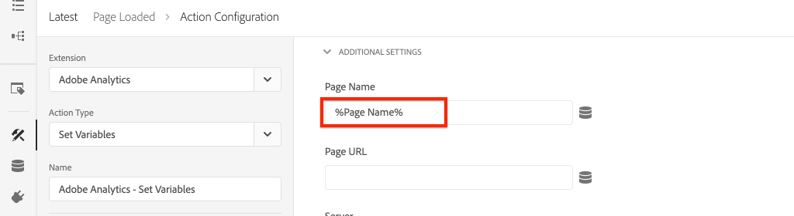

1. Save the changes.

1. Next, add an extra Action to the right of the **Adobe Analytics - Set Variables** by tapping the **plus** icon:

    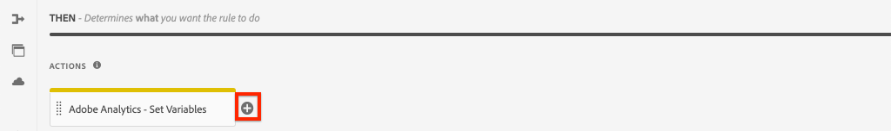

1. Set the **Extension** type to **Adobe Analytics** and set the **Action Type** to  **Send Beacon**. Since this action is considered a page view, leave the default tracking set to **`s.t()`**.

   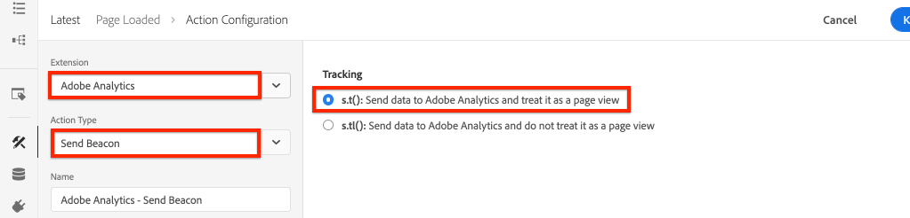

1. Save the changes. The **Page Loaded** rule should now have the following configuration:

   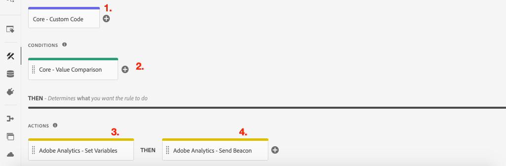

   * **1.** Listen for the `cmp:show` event.
   * **2.** Check that the event was triggered by a page.
   * **3.** Set Analytics variables for **Page Name** and **Page Template**
   * **4.** Send the Analytics Page View Beacon

1. Save all the changes and build your tag library, promoting to the appropriate Environment.

## Validate the Page View Beacon and Analytics call

Now that the **Page Loaded** rule sends the Analytics beacon, you should be able to see the Analytics tracking variables using the Experience Platform Debugger.

1. Open the [WKND Site](https://wknd.site/us/en.html) in your browser.
1. Click the Debugger icon  to open the Experience Platform Debugger.
1. Make sure that the Debugger is mapping the tag property to *your* Development environment, as described earlier and **Console Logging** is checked.
1. Open the Analytics menu and verify that the report suite is set to *your* report suite. The Page Name should also be populated:

   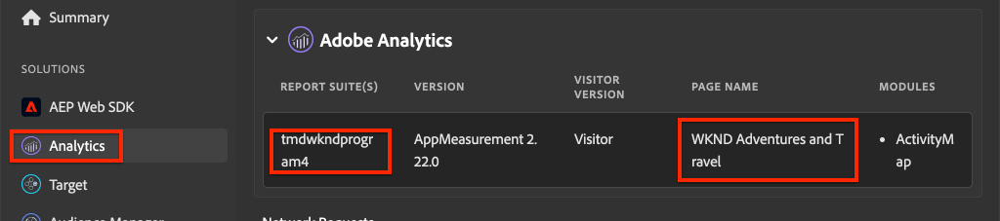

1. Scroll down and expand **Network Requests**. You should be able to find the **evar** set for the **Page Template**:

   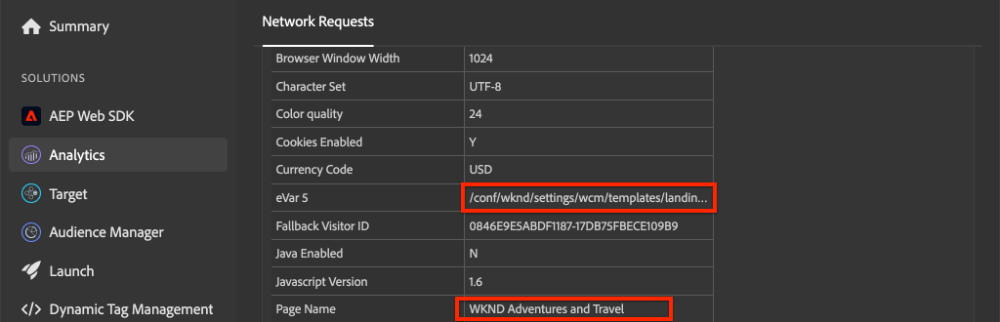

1. Return to the browser and open up the developer console. Click through the **Carousel** at the top of the page.

   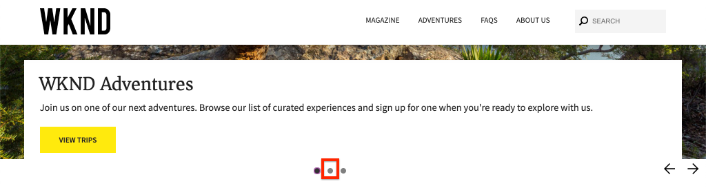

1. Observe in the browser console the console statement:

   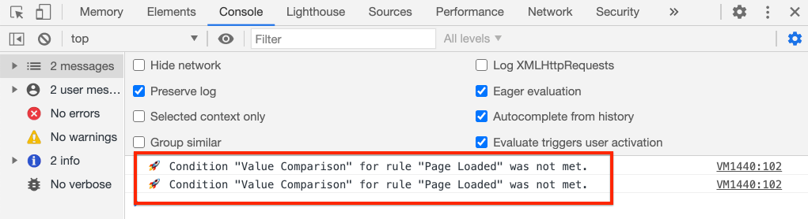

   This is because the Carousel does trigger a `cmp:show` event *but* because of our check of the **Component Resource Type**, no event is fired.

   >[!NOTE]
   >
   > If you don't see any console logs, ensure that **Console Logging** is checked under **Experience Platform Tags** in the Experience Platform Debugger.

1. Navigate to an article page like [Western Australia](https://wknd.site/us/en/magazine/western-australia.html). Observe that Page Name, and Template Type change.

## Congratulations!

You just used the event-driven Adobe Client Data Layer and Tags in Experience Platform to collect data page data from an AEM Site and send it to Adobe Analytics.

### Next Steps

Check out the following tutorial to learn how to use the event-driven Adobe Client Data layer to [track clicks of specific components on an Adobe Experience Manager site](track-clicked-component.md).
