# Analyze data with Analysis Workspace

Learn how to map data captured from an Adobe Experience Manager Site to metrics and dimensions in Adobe Analytics report suites. Learn how to build a detailed reporting dashboard using the Analysis Workspace feature of Adobe Analytics. 

## What you are going to build {#what-build}

The WKND marketing team is interested in knowing which `Call to Action (CTA)` buttons are performing the best on the home page. In this tutorial, create a project in the **Analysis Workspace** to visualize the performance of different CTA buttons and understand user behavior on the site. The following information gets captured using Adobe Analytics when a user clicks a Call to Action (CTA) button on the WKND home page.

**Analytics Variables**

Below are the Analytics variables currently being tracked:

* `eVar5` -  `Page template`
* `eVar6` - `Page Id`
* `eVar7` - `Page last modified date`
* `eVar8` - `CTA Button Id`
* `eVar9` - `Page Name`
* `event8` - `CTA Button Click event`
* `prop8` - `CTA Button Id`

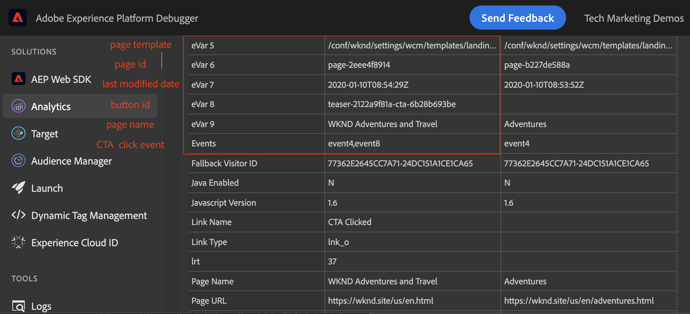

### Objectives {#objective}

1. Create a Report Suite or use an existing one.
1. Configure [Conversion Variables (eVars)](https://experienceleague.adobe.com/docs/analytics/admin/admin-tools/manage-report-suites/edit-report-suite/conversion-variables/conversion-var-admin.html) and [Success Events (Events)](https://experienceleague.adobe.com/docs/analytics/admin/admin-tools/manage-report-suites/edit-report-suite/conversion-variables/success-events/success-event.html) in the Report Suite.
1. Create an [Analysis Workspace project](https://experienceleague.adobe.com/docs/analytics/analyze/analysis-workspace/home.html) to analyze data with the help of tools that allows you to build, analyze, and share insights quickly.
1. Share the Analysis Workspace project with other team members.

## Prerequisites

This tutorial is a continuation of the [Track clicked component with Adobe Analytics](./track-clicked-component.md) and assumes that you have:

* A **Tag Property** with the [Adobe Analytics extension](https://experienceleague.adobe.com/docs/experience-platform/tags/extensions/client/analytics/overview.html) enabled
* **Adobe Analytics** test/dev report suite ID and tracking server. See the following documentation for [creating a report suite](https://experienceleague.adobe.com/docs/analytics/admin/admin-tools/manage-report-suites/c-new-report-suite/new-report-suite.html).
* [Experience Platform Debugger](https://experienceleague.adobe.com/docs/platform-learn/data-collection/debugger/overview.html) browser extension configured with a tag property loaded on the [WKND Site](https://wknd.site/us/en.html) or an AEM site with the Adobe Data Layer enabled.

## Conversion Variables (eVars) and Success Events (Event)

The Custom Insight Conversion Variable (or eVar) is placed in the Adobe code on your site's selected web pages. Its primary purpose is to segment conversion success metrics in custom marketing reports. An eVar can be a visit-based and it functions similarly to cookies. The values passed into eVar variables follow the user for a predetermined period.

When an eVar is set to a visitor's value, Adobe automatically remembers that value until it expires. Any success events that a visitor encounters while the eVar value is active are counted toward the eVar value.

eVars are best used to measure cause and effect, such as:

* Which internal campaigns influenced revenue
* Which banner ads ultimately resulted in a registration
* The number of times an internal search was used before making an order

Success events are actions that can be tracked. You determine what a success event is. For example, if a visitor clicks a CTA button, the click event could be considered a success event.

### Configure eVars

1.  From the Adobe Experience Cloud home page, select your organization, and launch Adobe Analytics.

    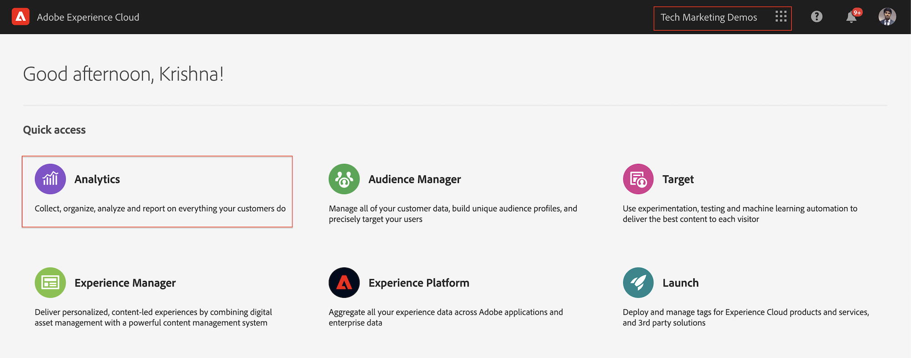

1. From the Analytics toolbar, click **Admin** > **Report Suites** and find your Report Suite.

    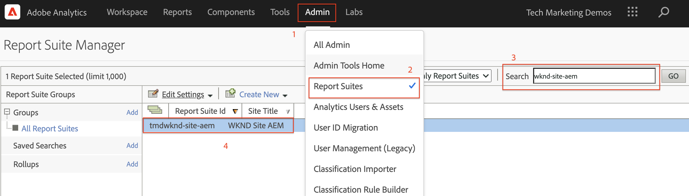

1. Select the Report Suite > **Edit Settings** > **Conversion** > **Conversion Variables**

    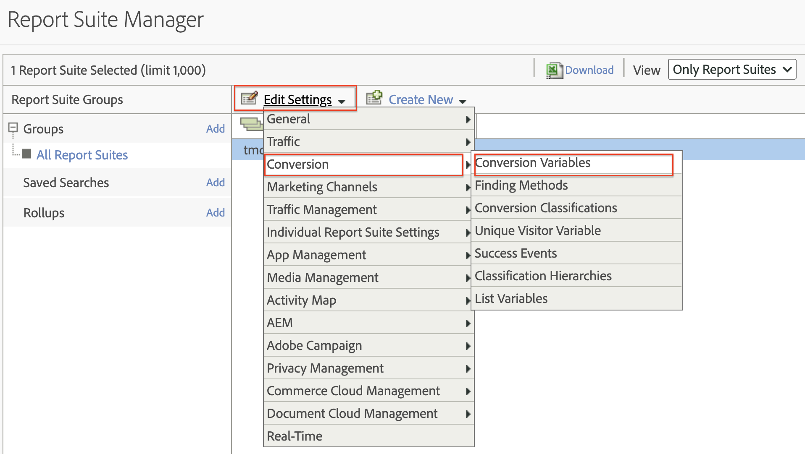

1. Using the **Add new** option, let's create Conversion Variables to map the schema as below: 

   * `eVar5` -  `Page Template`
   * `eVar6` - `Page ID`
   * `eVar7` - `Last Modified Date`
   * `eVar8` - `Button Id`
   * `eVar9` - `Page Name`

    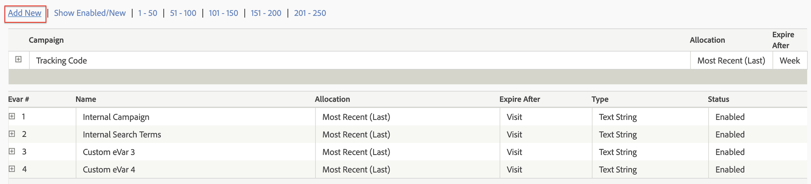

1. Provide an appropriate name and description for each eVars and **Save** your changes. In the Analysis Workspace project the eVars with appropriate name is used, thus, a user-friendly name makes the variables easily discoverable.
   
   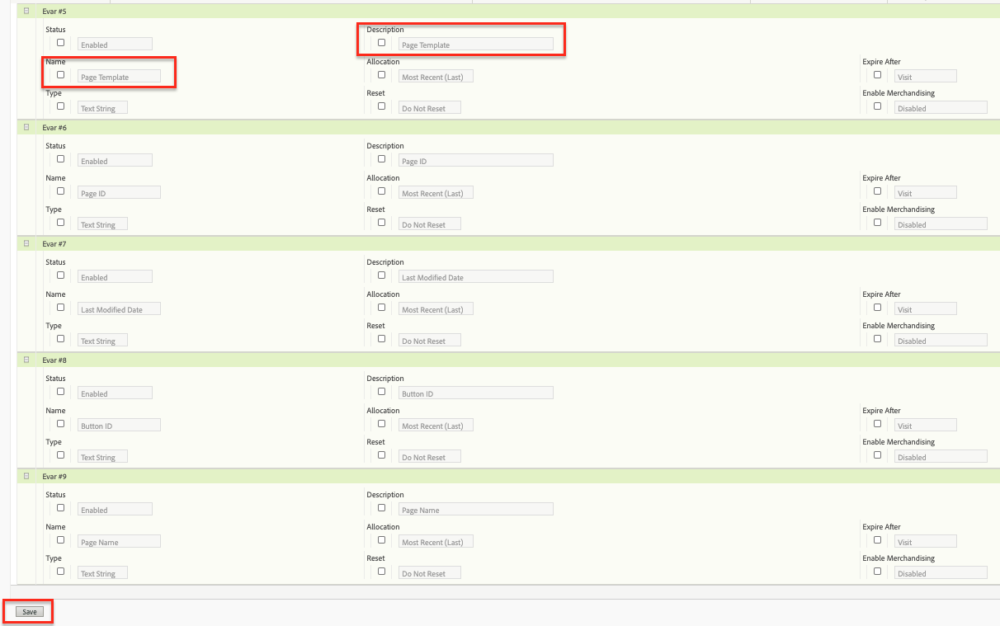

### Configure Success Events

Next, let's create an event to track the CTA Button click.

1. From the **Report Suite Manager** window, select the **Report Suite Id** and click **Edit Settings**.
1. Click **Conversion** > **Success Events**
1. Using the **Add New** option, create a custom success event to track the CTA Button click and then **Save** your changes.
    * `Event` : `event8`
    * `Name`:`CTA Click`
    * `Type`:`Counter`
  
   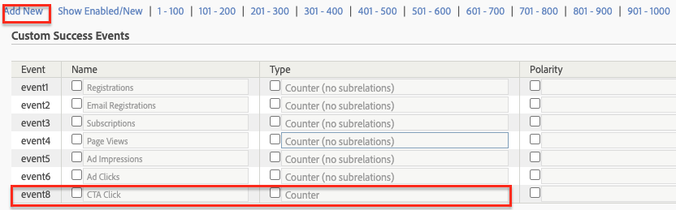

## Create a project in Analysis Workspace {#workspace-project}

Analysis Workspace is a flexible browser tool that allows you to build analyses and share insights quickly. Using the drag-and-drop interface, you can craft your analysis, add visualizations to bring data to life, curate a dataset, share, and schedule projects with anyone in your organization. 

Next, create a [project](https://experienceleague.adobe.com/docs/analytics/analyze/analysis-workspace/build-workspace-project/freeform-overview.html#analysis-workspace) to build a dashboard to analyze the performance of the CTA buttons throughout the site.

1. From the Analytics toolbar, select **Workspace** and click to **Create a New Project**.

    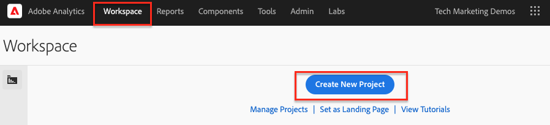

1. Choose to start from a **blank project** or select one of the pre-built templates, either provided by Adobe or custom templates created by your organization. Several templates are available, depending on the analysis or use case you have in mind. [Learn more](https://experienceleague.adobe.com/docs/analytics/analyze/analysis-workspace/build-workspace-project/starter-projects.html) about the different template options available.

    In your Workspace project, panels, tables, visualizations, and components are accessed from the left rail. They makeup building blocks for your project.

    * **[Components](https://experienceleague.adobe.com/docs/analytics/analyze/analysis-workspace/components/analysis-workspace-components.html)** - Components are dimensions, metrics, segments, or date ranges, all of which can be combined in a Freeform table to start answering your business question. Be sure to familiarize yourself with each component type before diving into your analysis. Once you've mastered component terminology, you can begin dragging and dropping to build your analysis in a Freeform table.
    * **[Visualizations](https://experienceleague.adobe.com/docs/analytics/analyze/analysis-workspace/visualizations/freeform-analysis-visualizations.html)** - Visualizations, such as a bar or line chart, are then added on top of the data to bring it to life visually. On the far left rail, select the middle Visualizations icon to see the full list of visualizations available.
    * **[Panels](https://experienceleague.adobe.com/docs/analytics/analyze/analysis-workspace/panels/panels.html)** - A panel is a collection of tables and visualizations. You can access panels from the top-left icon in the Workspace. Panels are helpful when you want to organize your projects according to time periods, report suites, or analysis use cases. The following panel types are available in Analysis Workspace:

    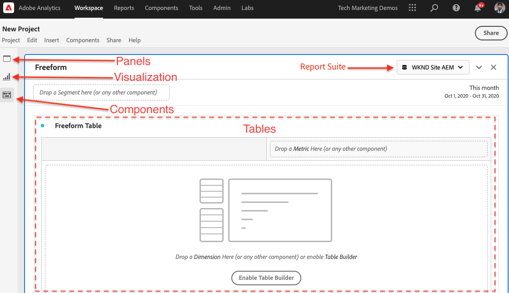

### Add data visualization with Analysis Workspace

Next, build a table to create a visual representation of how users interact with `Call to Action (CTA)` buttons on the WKND Site home page. To build such a representation, let's use the data collected in the [Track clicked component with Adobe Analytics](./track-clicked-component.md). Below is a quick summary of data tracked for user interactions with the Call to Action buttons for the WKND Site.

* `eVar5` -  `Page template`
* `eVar6` - `Page Id`
* `eVar7` - `Page last modified date`
* `eVar8` - `CTA Button Id`
* `eVar9` - `Page Name`
* `event8` - `CTA Button Click event`
* `prop8` - `CTA Button Id`

1. Drag-drop the **Page** dimension component onto the Freeform Table. You should now be able to view a visualization that displays the Page Name (eVar9) and corresponding Page Views (Occurrences) displayed within the table.

     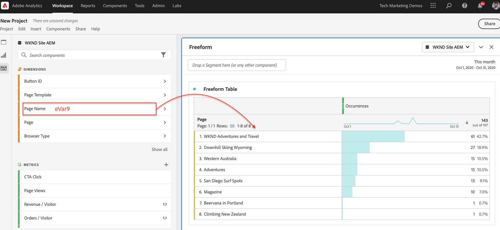

1. Drag-drop the **CTA Click** (event8) metric onto the occurrences metric and replace it. You could now view a visualization that displays the Page Name (eVar9) and a corresponding count of CTA Click events on a page.

    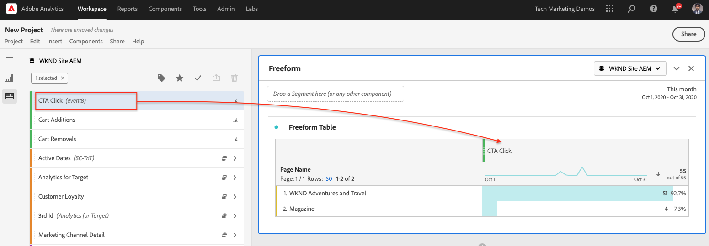

1. Let's break down the page by its template type. Select the page template metric from components, and drag-drop the Page Template metric onto the Page Name dimension. You could now view the page name broken down by its template type.

    * **Before**
        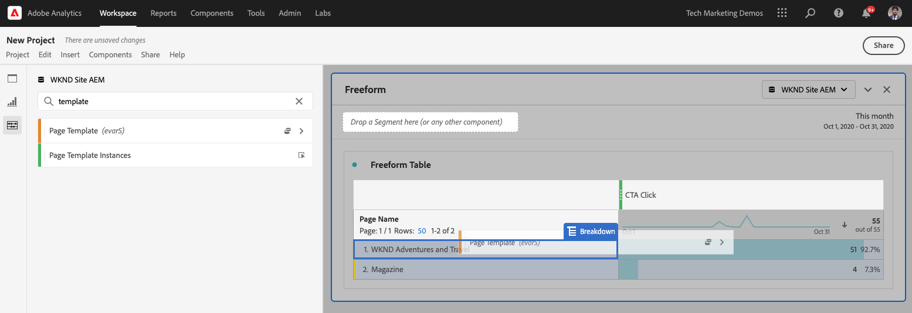

    * **After**
        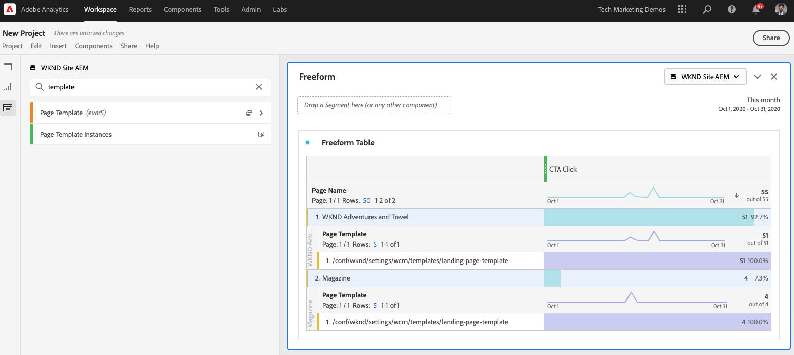

1. To understand how users interact with CTA Buttons when they are on the WKND Site pages, further breakdown by adding the Button ID (eVar8) metric is needed. 
    
    

1. Below you can see a visual representation of the WKND Site broken down by its page template and further broken down by user interaction with the WKND Site Click to Action (CTA) Buttons. 

    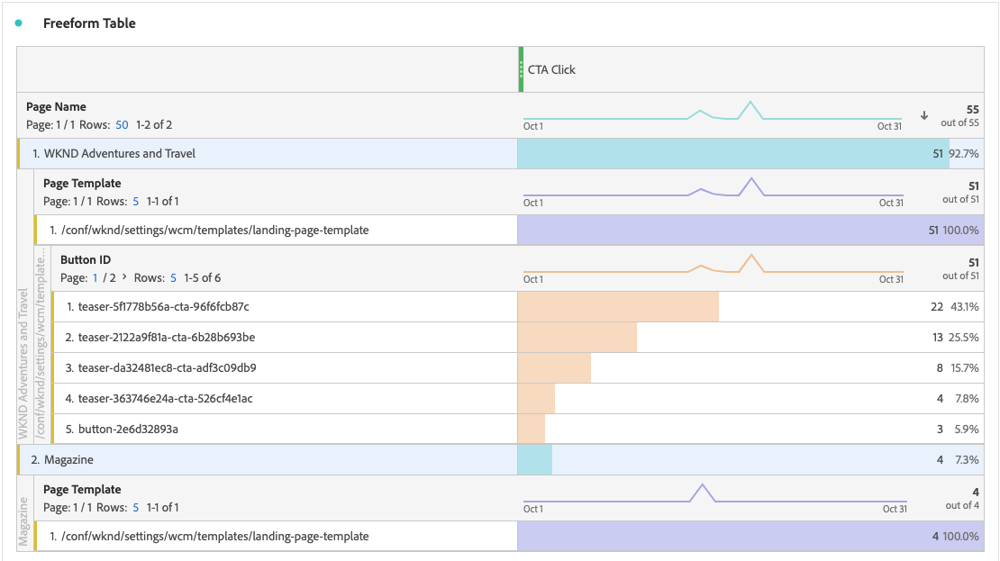

1. You could replace the Button ID value with a more user-friendly name using the Adobe Analytics Classifications. You could read more about how to create a classification for a specific metric [here](https://experienceleague.adobe.com/docs/analytics/components/classifications/c-classifications.html). In this case, we have a classification metric `Button Section (Button ID)` setup for `eVar8` that maps button id to a user-friendly name. 

    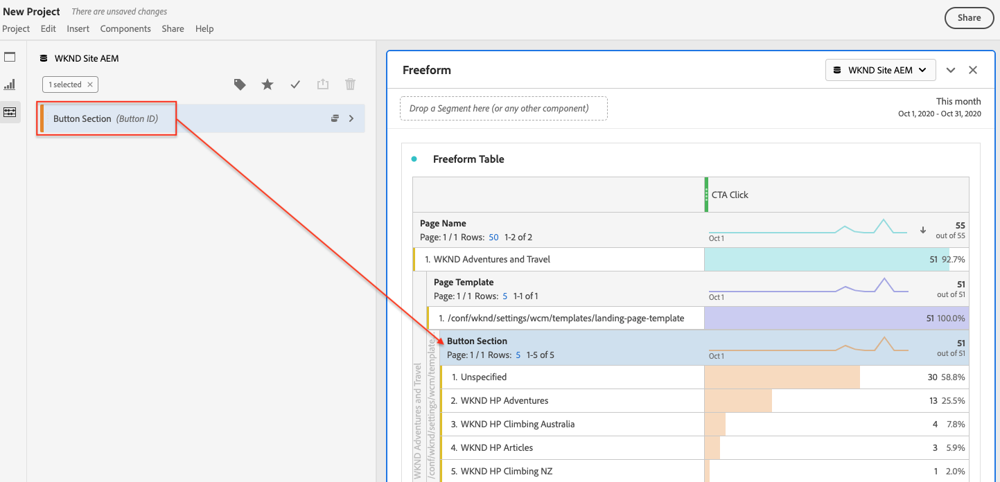

## Add Classification to an Analytic Variable

### Conversion Classifications

Analytics Classification is a way of categorizing Analytics variable data, then displaying the data in different ways when you generate reports. To improve how Button ID gets displayed in the Analytics Workspace report, let's create a classification variable for Button Id (eVar8). When classifying, you are establishing a relationship between the variable and the metadata related to that variable. 

Next, let's create a Classification for Analytics variable.

1. From the **Admin** toolbar menu, select **Report Suites**
1. Select the **Report Suite Id** from the **Report Suite Manager** window and click **Edit Settings** > **Conversion** > **Conversion Classifications**

    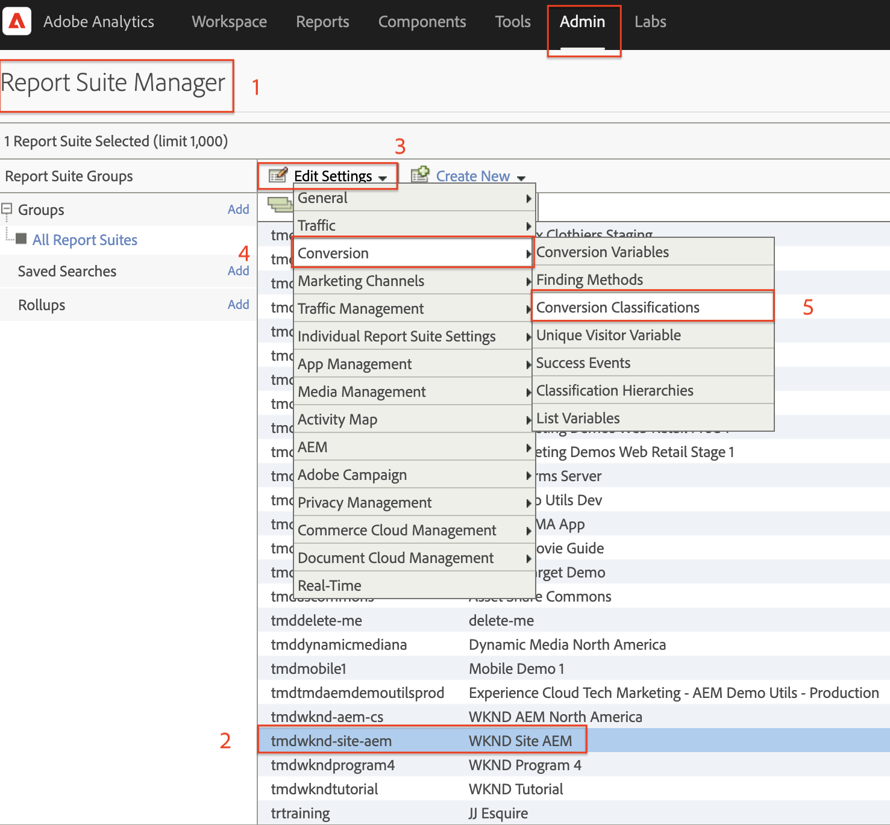

1. From the **Select Classification Type** drop-down list, select the variable (eVar8-Button ID) to add a classification.
1. Click the arrow right next to the Classification variable listed under the Classifications section to add a new Classification.

    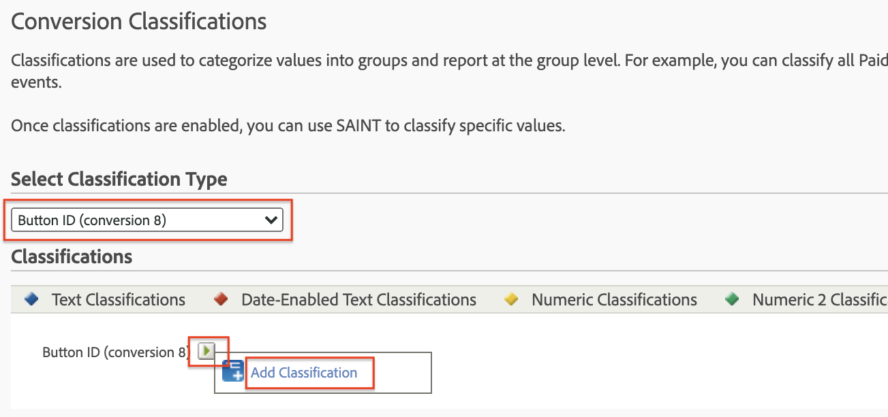

1. In the **Edit a Classification** dialog box, provide a suitable name for the Text Classification. A dimension component with the Text Classification name gets created. 

    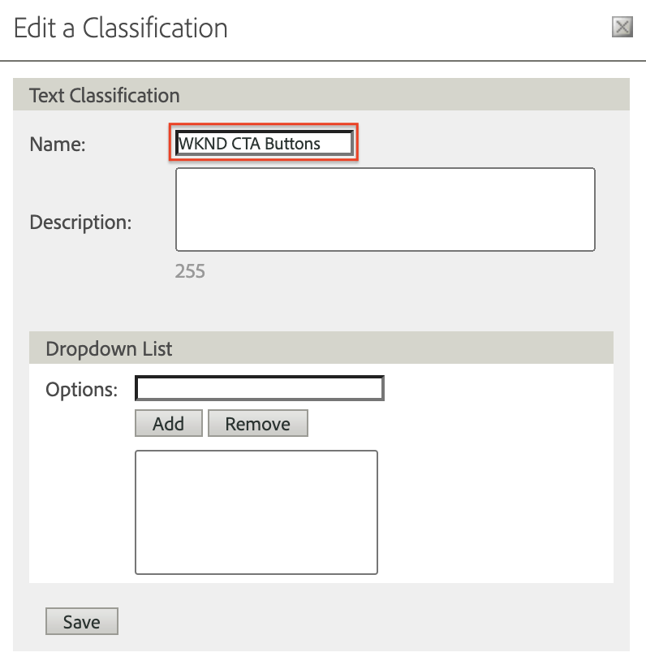

1. **Save** your changes.

### Classification Importer

Use the importer to upload classifications into Adobe Analytics. You can also export the data for updating before an import. The data that you import using the import tool must be in a specific format. Adobe provides you with the option to download a data template with all the proper header details in a tab-delimited data file. You can add your new data to this template and then import the data file in the browser using FTP.

#### Classification template

Before importing classifications into marketing reports, you can download a template that helps you create a classifications data file. The data file uses your desired classifications as column headings, then organizes the reporting data set under the appropriate classification headings. 

Next, let's download the Classification Template for the Button Id (eVar8) variable

1. Navigate to **Admin** > **Classification Importer**
1. Let's download a Classification template for the conversion variable from the **Download Template** Tab.
    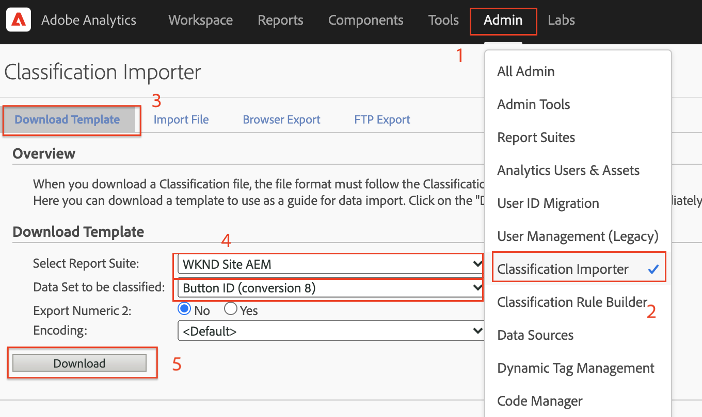

1. On the Download Template tab, specify the data template configuration.
    * **Select Report Suite** : Select the report suite to use in the template. The report suite and data set must match.
    * **Data Set to be classified** : Select the type of data for the data file. The menu includes all reports in your report suites that are configured for classifications.
    * **Encoding** : Select the character encoding for the data file. The default encoding format is UTF-8.

1. Click **Download** and save the template file to your local system. The template file is a tab-delimited data file (.tab filename extension) that most spreadsheet applications support.
1. Open the tab-delimited data file using an editor of your choice.
1. Add the Button ID (eVar9) and a corresponding button name to the tab-delimited file for each eVar9 value from Step 9 in the section.
    
    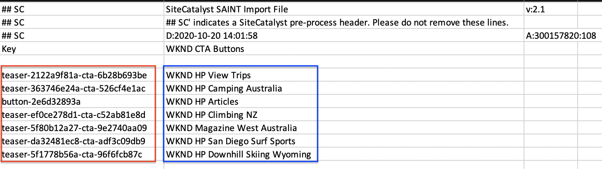

1. **Save** the tab-delimited file.
1. Navigate to the **Import File** tab. 
1. Configure the Destination for the file import.
   * **Select Report Suite** : WKND Site AEM (Report Suite)
   * **Data Set to be Classified** : Button Id (Conversion Variable eVar8)
1. Click the **Choose File** option to upload the tab-delimited file from your system, and then click **Import File**

    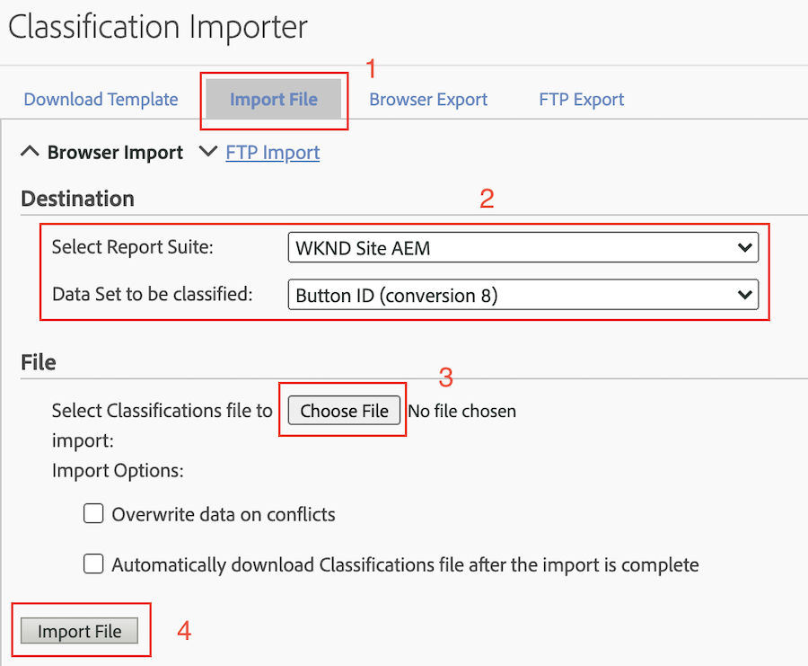

    >[!NOTE]
    >
    > A successful import immediately displays the appropriate changes in an export. However, data changes in reports take up to four hours when using a browser import and up to 24 hours when using an FTP import.

#### Replace Conversion Variable with Classification Variable

1.  From the Analytics toolbar, select **Workspace** and open the workspace created in the [Create a project in Analysis Workspace](#create-a-project-in-analysis-workspace) section of this tutorial.  

    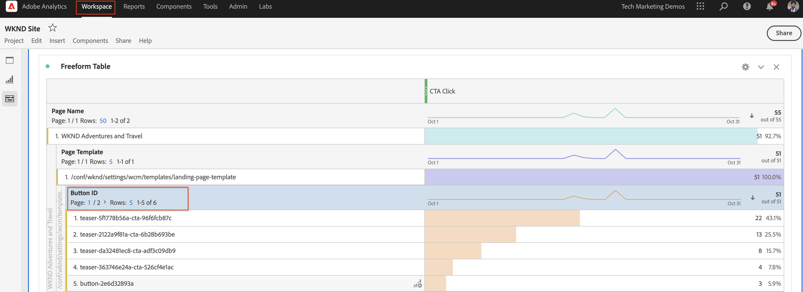

1. Next, replace the **Button Id** metric in your workspace that displays the ID of a Call to Action (CTA) button with the classification name created in the previous step.

1. From the component finder, search for **WKND CTA Buttons** and drag-drop the **WKND CTA Buttons (Button Id)** dimension onto the Button Id metric and replace it.

    * **Before**
      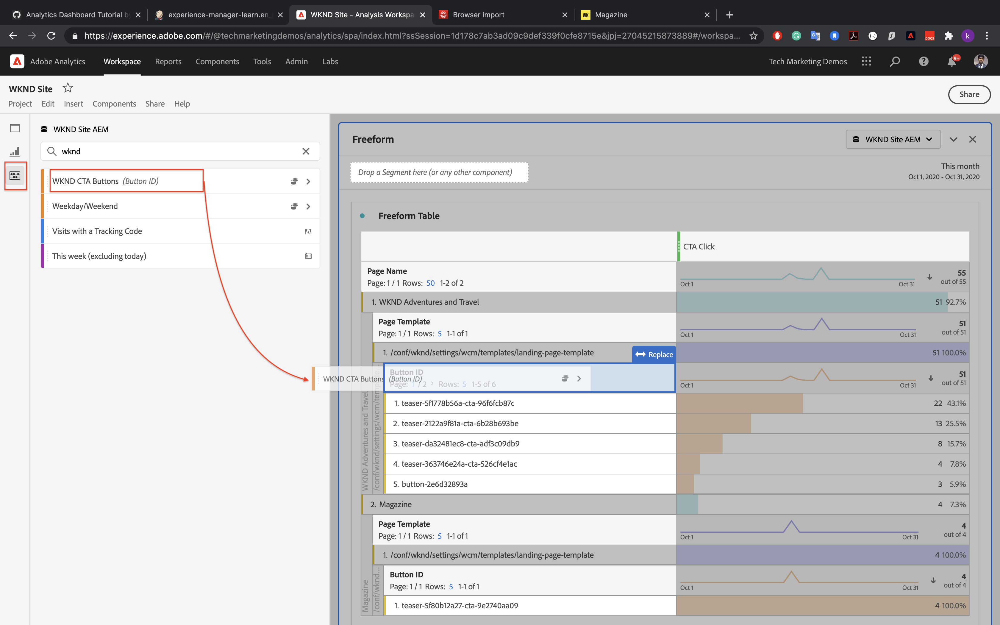
    * **After**
      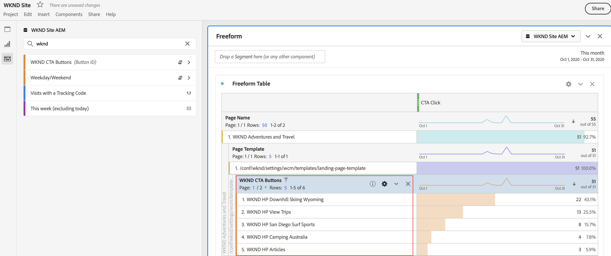

1. You can notice the Button Id metric that contained the button id of a Call to Action (CTA) button is now replaced with a corresponding name provided in the Classification Template.
1. Let's compare the Analytics Workspace table to the WKND Home page and understand the CTA Button click count and its analysis. Based on the workspace freeform table data, it is clear that 22 times users have clicked the **SKI NOW** button and four times for the WKND Home Page Camping in Western Australia **Read More** button. 

    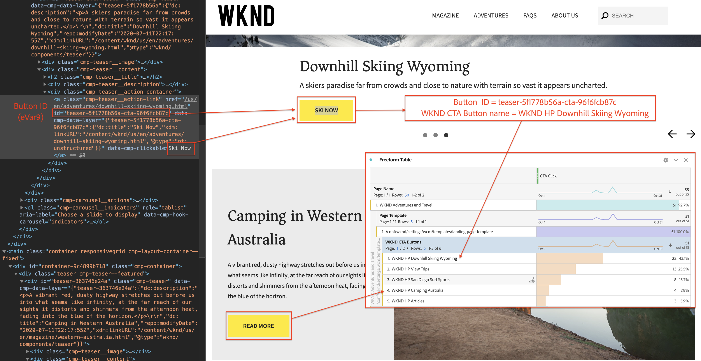

1. Make sure to save your Adobe Analytics Workspace project and provide a proper name and description. Optionally, you could add tags to a workspace project.

    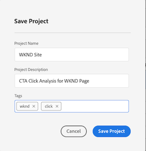

1. After successfully saving your project, you could share your workspace project with other co-workers or teammates using the Share option. 

    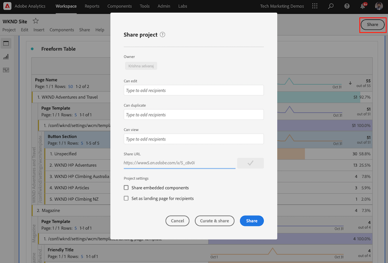

## Congratulations!

You just learned how to map data captured from an Adobe Experience Manager Site to metrics and dimensions in Adobe Analytics report suites. Also, performed a Classification for the metrics, and build a detailed reporting dashboard using the Analysis Workspace feature of Adobe Analytics.
