# Track clicked component with Adobe Analytics

Use the event-driven [Adobe Client Data Layer with AEM Core Components](https://experienceleague.adobe.com/docs/experience-manager-core-components/using/developing/data-layer/overview.html) to track clicks of specific components on an Adobe Experience Manager site. Learn how to use rules in Experience Platform Launch to listen for click events, filter by component and send the data to an Adobe Analytics with a track link beacon.

## What you will build

The WKND marketing team wants to understand which Call to Action (CTA) buttons are performing the best on the home page. In this tutorial we will add a new rule in Experience Platform Launch that listens for `cmp:click` events from **Teaser** and **Button** components and send the component ID and a new event to Adobe Analytics alongside the track link beacon.

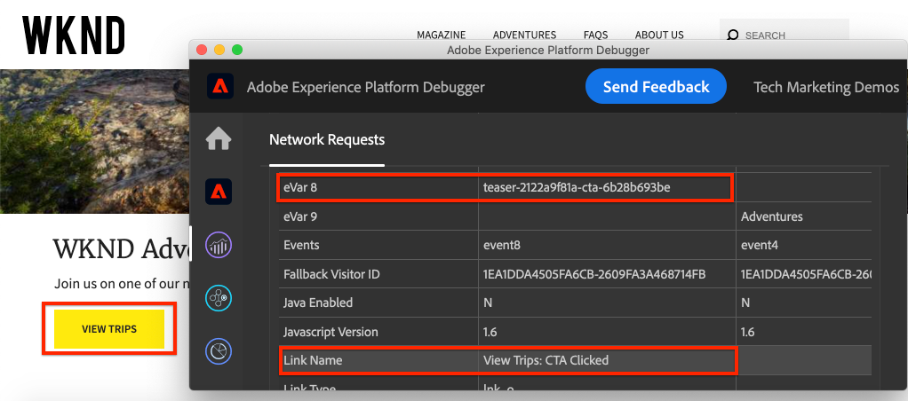

### Objectives {#objective}

1. Create an event-driven rule in Launch based on the `cmp:click` event.
1. Filter the different events by component resource type.
1. Set the component id clicked and send event Adobe Analytics with the track link beacon.

## Prerequisites

This tutorial is a continuation of [Collect page data with Adobe Analytics](./collect-data-analytics.md) and assumes that you have:

* A **Launch Property** with the [Adobe Analytics extension](https://experienceleague.adobe.com/docs/experience-platform/tags/extensions/adobe/analytics/overview.html) enabled
* **Adobe Analytics** test/dev report suite ID and tracking server. See the following documentation for [creating a new report suite](https://experienceleague.adobe.com/docs/analytics/admin/manage-report-suites/new-report-suite/new-report-suite.html).
* [Experience Platform Debugger](https://experienceleague.adobe.com/docs/debugger-learn/tutorials/experience-platform-debugger/introduction-to-the-experience-platform-debugger.html) browser extension configured with your Launch property loaded on [https://wknd.site/us/en.html](https://wknd.site/us/en.html) or an AEM site with the Adobe Data Layer enabled.

## Inspect the Button and Teaser Schema

Before making rules in Launch it is useful to review the [schema for the Button and Teaser](https://experienceleague.adobe.com/docs/experience-manager-core-components/using/developing/data-layer/overview.html#item) and inspect them in the data layer implementation.

1. Navigate to [https://wknd.site/us/en.html](https://wknd.site/us/en.html)
1. Open the browser's developer tools and navigate to the **Console**. Run the following command:

    ```js
    adobeDataLayer.getState();
    ```

    This returns the current state of the Adobe Client Data Layer.

    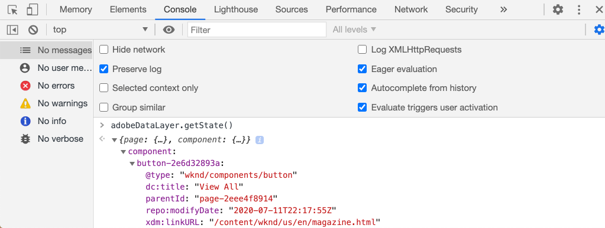

1. Expand the response and find entries prefixed with `button-` and  `teaser-xyz-cta` entry. You should see a data schema like the following:

    Button Schema:

    ```json
    button-2e6d32893a:
        @type: "wknd/components/button"
        dc:title: "View All"
        parentId: "page-2eee4f8914"
        repo:modifyDate: "2020-07-11T22:17:55Z"
        xdm:linkURL: "/content/wknd/us/en/magazine.html"
    ```

    Teaser Schema:

    ```json
    teaser-da32481ec8-cta-adf3c09db9:
        @type: "wknd/components/teaser/cta"
        dc:title: "Surf's Up"
        parentId: "teaser-da32481ec8"
        xdm:linkURL: "/content/wknd/us/en/magazine/san-diego-surf.html"
    ```

    These are based on the [Component/Container Item Schema](https://experienceleague.adobe.com/docs/experience-manager-core-components/using/developing/data-layer/overview.html#item). The rule we will create in Launch will use this schema.

## Create a CTA Clicked rule

The Adobe Client Data Layer is an **event** driven data layer. When the any Core Component is clicked a `cmp:click` event will be dispatched via the data layer. Next create a rule to listen for the `cmp:click` event.

1. Navigate to Experience Platform Launch and into the Web property integrated with the AEM Site.
1. Navigate to the **Rules** section in the Launch UI and then and click **Add Rule**.
1. Name the rule **CTA Clicked**.
1. Click **Events** > **Add** to open the **Event Configuration** wizard.
1. Under **Event Type** select **Custom Code**.

   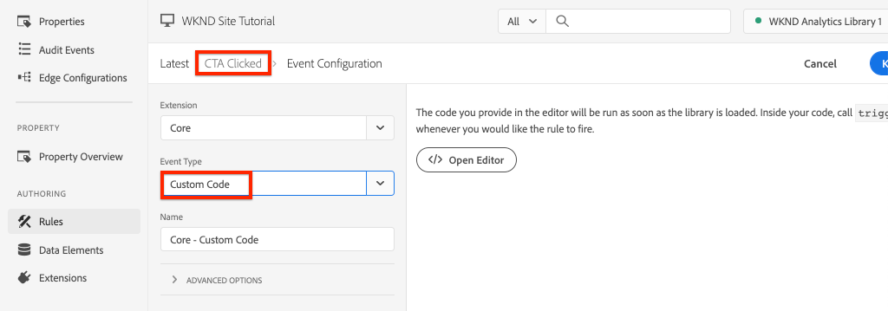

1. Click **Open Editor** in the main panel and enter the following code snippet:

   ```js
   var componentClickedHandler = function(evt) {
      // defensive coding to avoid a null pointer exception
      if(evt.hasOwnProperty("eventInfo") && evt.eventInfo.hasOwnProperty("path")) {
         //trigger Launch Rule and pass event
         console.debug("cmp:click event: " + evt.eventInfo.path);
         var event = {
            //include the path of the component that triggered the event
            path: evt.eventInfo.path,
            //get the state of the component that triggered the event
            component: window.adobeDataLayer.getState(evt.eventInfo.path)
         };

         //Trigger the Launch Rule, passing in the new `event` object
         // the `event` obj can now be referenced by the reserved name `event` by other Launch data elements
         // i.e `event.component['someKey']`
         trigger(event);
      }
   }

   //set the namespace to avoid a potential race condition
   window.adobeDataLayer = window.adobeDataLayer || [];
   //push the event listener for cmp:click into the data layer
   window.adobeDataLayer.push(function (dl) {
      //add event listener for `cmp:click` and callback to the `componentClickedHandler` function
      dl.addEventListener("cmp:click", componentClickedHandler);
   });
   ```

   The above code snippet will add an event listener by [pushing a function](https://github.com/adobe/adobe-client-data-layer/wiki#pushing-a-function) into the data layer. When the `cmp:click` event is triggered the `componentClickedHandler` function is called. In this function a few sanity checks are added and a new `event` object is constructed with the latest [state of the data layer](https://github.com/adobe/adobe-client-data-layer/wiki#getstate) for the component that triggered the event.

   After that `trigger(event)` is called. `trigger()` is a reserved name in Launch and will "trigger" the Launch Rule. We pass the `event` object as a parameter which in turn will be exposed by another reserved name in Launch named `event`. Data Elements in Launch can now reference various properties like so: `event.component['someKey']`.

1. Save the changes.
1. Next under **Actions** click **Add** to open the **Action Configuration** wizard.
1. Under **Action Type** choose **Custom Code**.

   

1. Click **Open Editor** in the main panel and enter the following code snippet:

   ```js
   console.debug("Component Clicked");
   console.debug("Component Path: " + event.path);
   console.debug("Component type: " + event.component['@type']);
   console.debug("Component text: " + event.component['dc:title']);
   ```

   The `event` object is passed from the `trigger()` method called in the custom event. `component` is the current state of the component derived from the data layer `getState` that triggered the click.

1. Save the changes and run a [build](https://experienceleague.adobe.com/docs/experience-platform/tags/publish/builds.html) in Launch to promote the code to the [environment](https://experienceleague.adobe.com/docs/experience-platform/tags/publish/environments.html) used on your AEM Site.

   >[!NOTE]
   >
   > It can be very useful to use the [Adobe Experience Platform Debugger](https://experienceleague.adobe.com/docs/debugger-learn/tutorials/experience-platform-debugger/introduction-to-the-experience-platform-debugger.html) to switch the embed code to a **Development** environment.

1. Navigate to the [WKND Site](https://wknd.site/us/en.html) and open the developer tools to view the console. Select **Preserve log**.

1. Click one of the **Teaser** or **Button** CTA buttons to navigate to another page.

    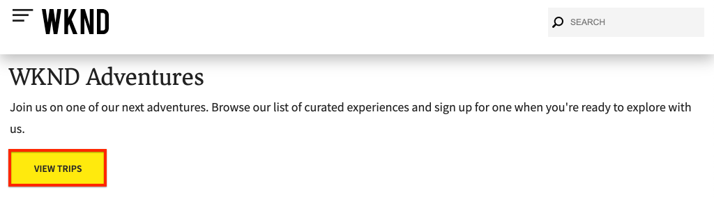

1. Observe in the developer console that the **CTA Clicked** rule has been fired:

    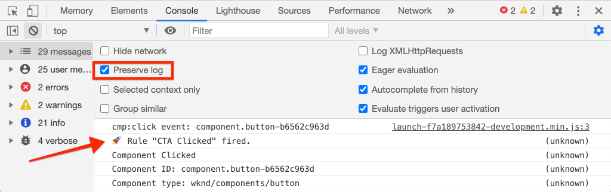

## Create Data Elements

Next create a Data Elements to capture the component ID and title that was clicked. Recall in the previous exercise the output of `event.path` was something similar to `component.button-b6562c963d` and the value of `event.component['dc:title']` was something like "View Trips".

### Component ID

1. Navigate to Experience Platform Launch and into the Web property integrated with the AEM Site.
1. Navigate to the **Data Elements** section and click **Add New Data Element**.
1. For **Name** enter **Component ID**.
1. For **Data Element Type** select **Custom Code**.

    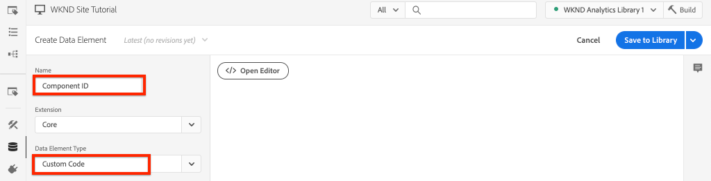

1. Click **Open Editor** and enter the following in the custom code editor:

    ```js
    if(event && event.path && event.path.includes('.')) {
        // split on the `.` to return just the component ID
        return event.path.split('.')[1];
    }
    ```

    Save the changes.

    >[!NOTE]
    >
    > Recall that the `event` object is made available and scoped based on the event that triggered the **Rule** in Launch. The value of a Data Element is not set until the Data Element is *referenced* within a Rule. Therefore it is safe to use this Data Element inside of a Rule like the **CTA Clicked** rule created in the previous exercise *but* would not be safe to use in other contexts.

### Component Title

1. Navigate to the **Data Elements** section and click **Add New Data Element**.
1. For **Name** enter **Component Title**.
1. For **Data Element Type** select **Custom Code**.
1. Click **Open Editor** and enter the following in the custom code editor:

    ```js
    if(event && event.component && event.component.hasOwnProperty('dc:title')) {
        return event.component['dc:title'];
    }
    ```

    Save the changes.

## Add a condition to the CTA Clicked rule

Next, update the **CTA Clicked** rule to to ensure that the rule only fires when the `cmp:click` event is fired for a **Teaser** or a **Button**. Since the Teaser's CTA is considered a separate object in the data layer it is important to check the parent to verify it came from a Teaser.

1. In the Launch UI, navigate to the **CTA Clicked** rule created earlier.
1. Under **Conditions** click **Add** to open the **Condition Configuration** wizard.
1. For **Condition Type** select **Custom Code**.

    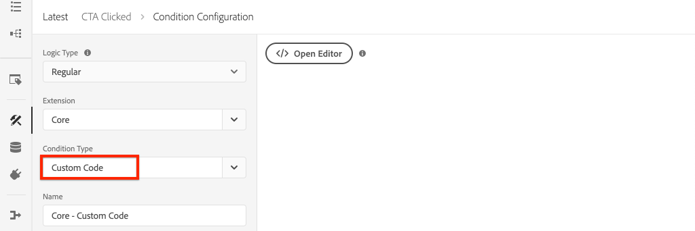

1. Click **Open Editor** and enter the following in the custom code editor:

    ```js
    if(event && event.component && event.component.hasOwnProperty('@type')) {
        // console.log("Event Type: " + event.component['@type']);
        //Check for Button Type OR Teaser CTA type
        if(event.component['@type'] === 'wknd/components/button' ||
           event.component['@type'] === 'wknd/components/teaser/cta') {
            return true;
        }
    }

    // none of the conditions are met, return false
    return false;
    ```

    The above code first checks to see if the resource type was from a **Button** and then checks to see if the resource type was from a CTA within a **Teaser**.

1. Save the changes.

## Set Analytics Variables and trigger Track Link Beacon

Currently the **CTA Clicked** rule simply outputs a console statement. Next, use the data elements and the Analytics extension to set Analytics variables as an **action**. We will also set an additional action to trigger the **Track Link** and send the collected data to Adobe Analytics.

1. In the **CTA Clicked** rule **remove** the **Core - Custom Code** action (the console statements):

   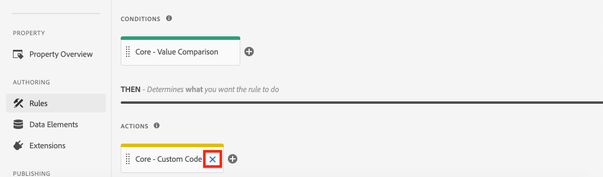

1. Under Actions, click **Add** to add a new action.
1. Set the **Extension** type to **Adobe Analytics** and set the **Action Type** to  **Set Variables**.

1. Set the following values for **eVars**, **Props**, and **Events**:

    * `evar8` - `%Component ID%`
    * `prop8` - `%Component ID%`
    * `event8`

    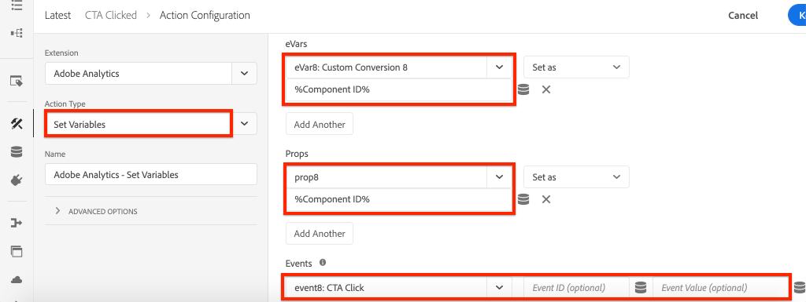

    >[!NOTE]
    >
    > Here `%Component ID%` is used since it will gaurantee a unique identifier for the CTA that was clicked. A potential downside of using `%Component ID%` is that the Analytics report will contain values like `button-2e6d32893a`. Using `%Component Title%` would give a more human friendly name but the value might not be unique.

1. Next, add an additional Action to the right of the **Adobe Analytics - Set Variables** by tapping the **plus** icon:

    

1. Set the **Extension** type to **Adobe Analytics** and set the **Action Type** to  **Send Beacon**.
1. Under **Tracking** set the radio button to **`s.tl()`**.
1. For **Link Type** choose **Custom Link** and for **Link Name** set the value to: **`%Component Title%: CTA Clicked`**:

    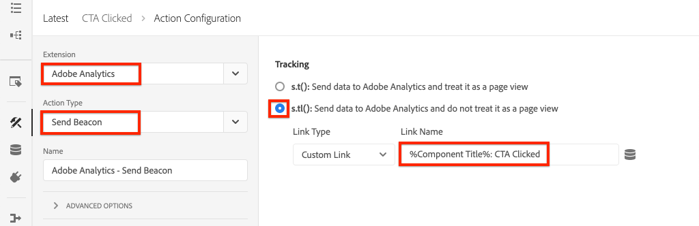

    This will combine the dynamic variable from the data element **Component Title** and the static string **CTA Clicked**.

1. Save the changes. The **CTA Clicked** rule should now have the following configuration:

   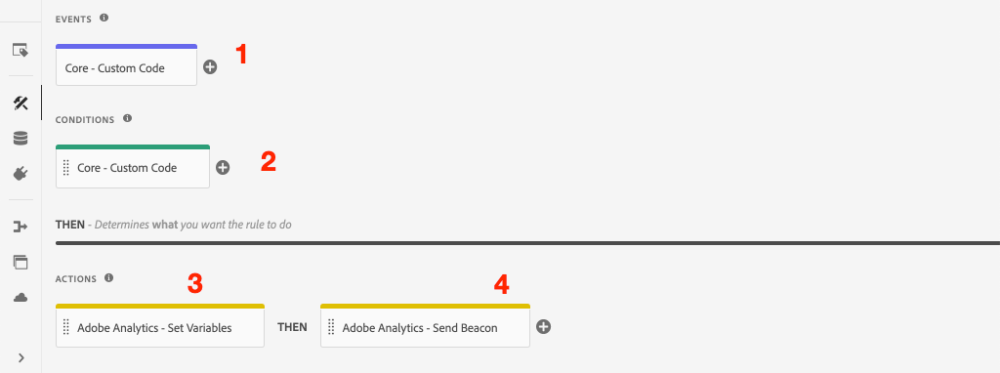

   * **1.** Listen for the `cmp:click` event.
   * **2.** Check that the event was triggered by a **Button** or **Teaser**.
   * **3.** Set Analytics variables for to track the **Component ID** as an **eVar**, **prop**, and an **event**.
   * **4.** Send the Analytics Track Link Beacon (and do **not** treat it as a page view).

1. Save all the changes and build your Launch library, promoting to the appropriate Environment.

## Validate the Track Link Beacon and Analytics call

Now that the **CTA Clicked** rule sends the Analytics beacon, you should be able to see the Analytics tracking variables using the Experience Platform Debugger.

1. Open the [WKND Site](https://wknd.site/us/en.html) in your browser.
1. Click the Debugger icon  to open the Experience Platform Debugger.
1. Make sure the Debugger is mapping the Launch property to *your* Development environment, as described earlier and **Console Logging** is checked.
1. Open the Analytics menu and verify that the report suite is set to *your* report suite.

   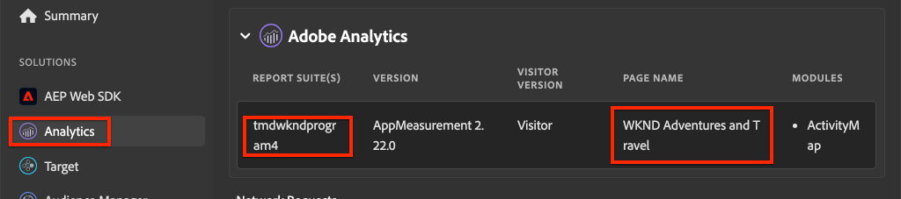

1. In the browser, click one of the **Teaser** or **Button** CTA buttons to navigate to another page.

    

1. Return to the Experience Platform Debugger and scroll down and expand **Network Requests** > *Your Report Suite*. You should be able to find the **eVar**, **prop**, and **event** set.

   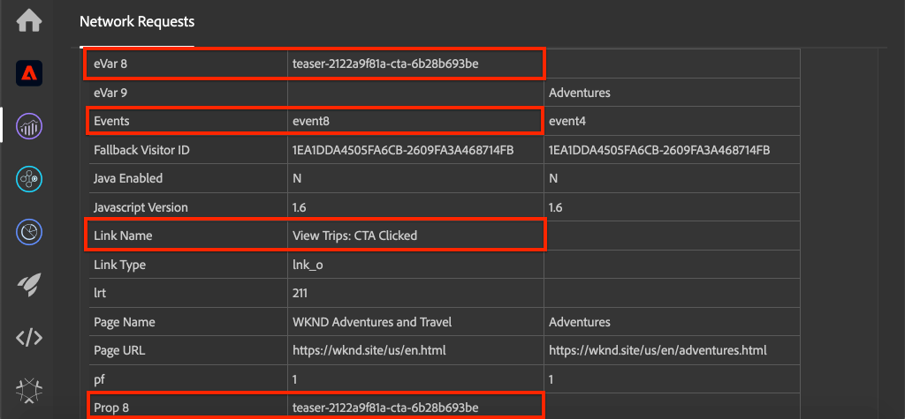

1. Return to the browser and open up the developer console. Navigate to the footer of the site and click one of the navigation links:

    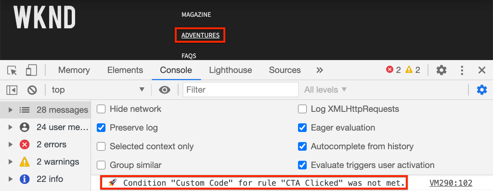

1. Observe in the browser console the message *"Custom Code" for rule "CTA Clicked" was not met*.

   This is because the Navigation component does trigger a `cmp:click` event *but* because of our check of the against the resource type no action is taken.

   >[!NOTE]
   >
   > If you don't see any console logs, ensure that **Console Logging** is checked under **Launch** in the Experience Platform Debugger.

## Congratulations!

You just used the event-driven Adobe Client Data Layer and Experience Platform Launch to track clicks of specific components on an Adobe Experience Manager site.