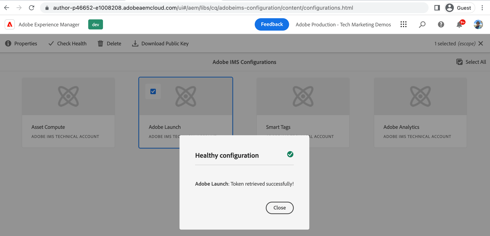

# Connect AEM Sites with Tag Property using IMS{#connect-aem-and-tag-property-using-ims}

>[!NOTE]
>
>The process of renaming Adobe Experience Platform Launch as a set of data collection technologies is being implemented in the AEM product UI, content, and documentation, so the term Launch is still being used here.

Learn how to connect AEM with Tag Property using the IMS (Identity Management System) configuration in AEM. This setup authenticates AEM with the Launch API and allows AEM to communicate via the Launch APIs to access Tag properties.

## Create or reuse IMS configuration

The IMS configuration using the Adobe Developer Console project is required to integrate AEM with newly created Tag Property. This configuration allows AEM to communicate with Tags application using Launch APIs and IMS handles the security aspect of this integration.

Whenever a AEM as Cloud Service environment is provisioned a few IMS configurations such as Asset Compute, Adobe Analytics, and Adobe Launch are automatically created. The auto created **Adobe Launch** IMS configuration can be used or a new IMS configuration should be created if you are using AEM 6.X environment.

Review auto created **Adobe Launch** IMS configuration using following steps.

1.  In AEM open the **Tools** menu

1.  In the Security section, select Adobe IMS Configurations.

1.  Select the **Adobe Launch** card and click **Properties**, review the details from **Certificate** and **Account** tabs. Then click **Cancel** to return without modifying any auto created details.

1.  Select the **Adobe Launch** card and this time click **Check Health**, you should see the **Success** message like below.

    

## Next Steps

[Create a Launch Cloud Service configuration in AEM](create-aem-launch-cloud-service.md)
