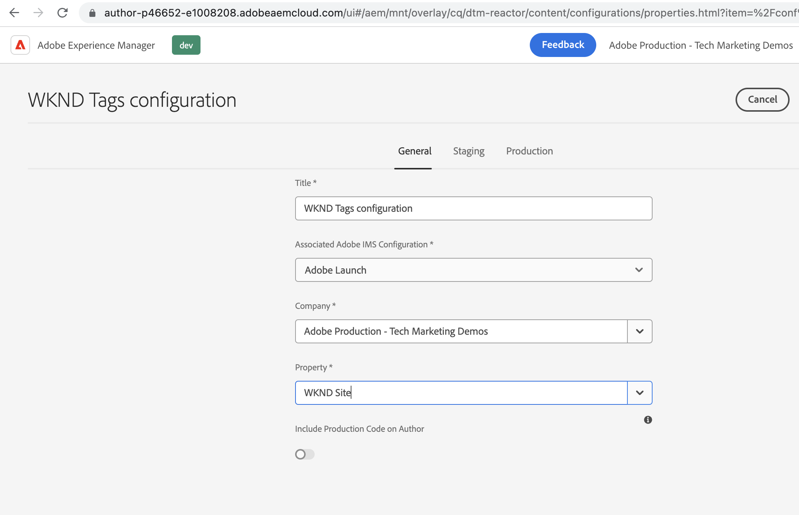
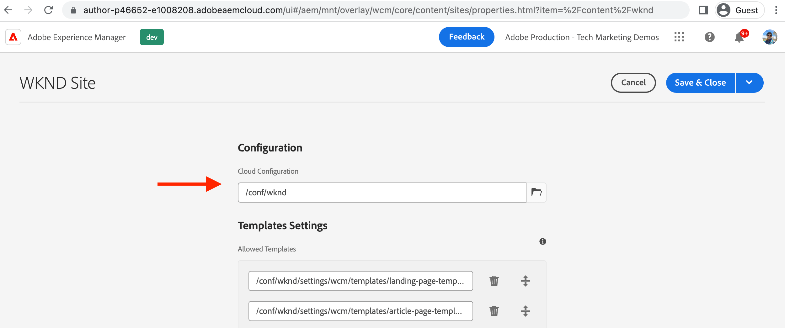

# Create a Launch Cloud Service configuration in AEM {#create-launch-cloud-service}

>[!NOTE]
>
>The process of renaming Adobe Experience Platform Launch as a set of data collection technologies is being implemented in the AEM product UI, content, and documentation, so the term Launch is still being used here.

Learn how to create a Launch Cloud Service configuration in Adobe Experience Manager. AEM's Launch Cloud Service configuration can then be applied to an existing Site and the Tags libraries can be observed loading in both Author and Publish environments.

## Create Launch cloud service

Create the Launch cloud service configuration using below steps.

1.  From the **Tools** menu, select **Cloud Services** section and click **Adobe Launch Configurations**

1.  Select your site's config folder or select **WKND Site** (if using WKND guide project) and click **Create**

1.  From the _General_ tab, name your configuration using the **Title** field, and select **Adobe Launch** from the _Associated Adobe IMS Configuration_ dropdown. Then, select your company name from the _Company_ dropdown and select previously created property from the _Property_ dropdown.

1.  From the _Staging_ and _Production_ tab keep the default configurations. However it's recommended reviewing and change the configurations for real production setup, specifically the _Load Library Asynchronously_ toggle based on your performance and optimization requirements. Also note that the _Library URI_ value is different for Staging and Production.

1.  Finally, click **Create** to complete the Launch cloud services. 

    

## Apply Launch cloud service to the site

To load the Tag property and its libraries onto the AEM site, the Launch cloud service configuration is applied to the site. In the previous step the cloud service configuration is created under the site name folder (WKND Site) so it should be automatically applied, let's verify it.

1.  From the **Navigation** menu, select **Sites** icon.

1.  Select the root page of the AEM Site, and click **Properties**. Then, navigate to the **Advanced** tab and under **Configuration** section, verify that Cloud Configuration value is pointing to your site-specific `conf` folder.

    

## Verify loading of Tag property on Author and Publish pages

Now it's time to verify that Tag property and its libraries are loaded onto the AEM site page.

1.  Open your favorite site page in the **View as Published** mode, in the browser console you should see the log message. It's the same message from the JavaScript code snippet of the Tag property Rule that is fired when _Library Loaded (Page Top)_ event is triggered.

1.  To verify on Publish, first publish your **Launch cloud service** configuration and open the site page on the Publish instance.

    

Congratulations! You have completed AEM and data collection Tag integration that injects JavaScript code into your AEM site without updating the AEM Project code.

## Challenge - update and publish Rule in Tag property

Use lessons learned from the previous [Create a Tag Property](./create-tag-property.md) to complete the simple challenge, update the existing Rule to add additional console statement and using _Publishing Flow_ deploy it onto the AEM site.

## Next Steps

[Debugging a Tags implementation](debug-tags-implementation.md)
