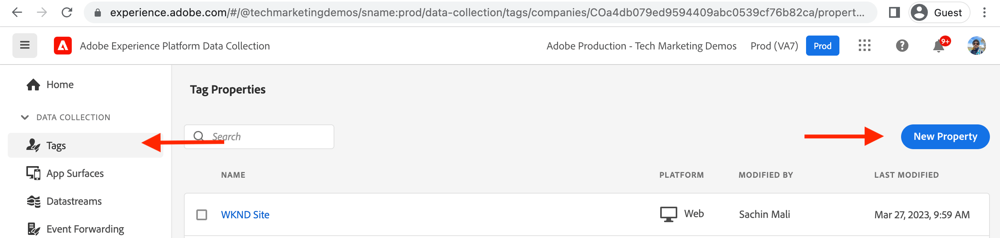
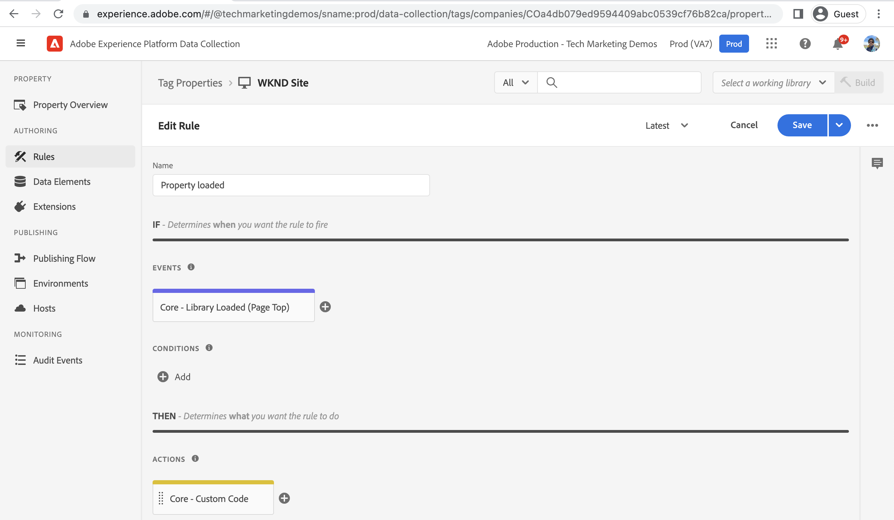
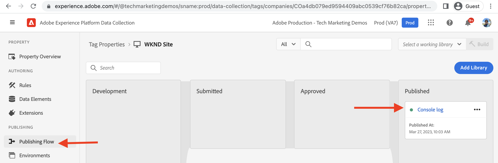

# Create a Tag Property {#create-tag-property}

Learn how to create a Tag property with the bare-minimum configuration to integrate with Adobe Experience Manager. Users are introduced to the Tag UI and learn about extensions, rules, and publishing workflows.

>[!VIDEO](https://video.tv.adobe.com/v/38553?quality=12&learn=on)

## Tag property creation

To create a Tag property, complete the following steps.

1.  In the browser, navigate to the [Adobe Experience Cloud Home](https://experience.adobe.com/) page and login using you Adobe ID.

1.  Click the **Data Collection** application from the _Quick access_ section of the Adobe Experience Cloud Home page.

1.  Click the **Tags** menu item from the left navigation, then click **New Property** from top-right corner.

1.  Name your Tag property using the **Name** required field. For Domains field, enter your domain name or if using AEM as a Cloud Service environment enter `adobeaemcloud.com` and click **Save**.

    

## Create a New Rule

Open the newly created Tag property by clicking its name in the **Tag Properties** view. Also under _My Recent Activity_ heading you should see that the Core extension added to it. The Core tag extension is the default extension and it provides foundational event types such as page-load, browser, form, and other event types, see [Core extension overview](https://experienceleague.adobe.com/docs/experience-platform/tags/extensions/client/core/overview.html) for more information. 

Rules allow you to specify what should happen as the visitor interacts with your AEM site. To keep things simple, let's log two messages to the browser console to demonstrate how data collection Tag integration can inject JavaScript code into your AEM site without updating AEM Project code.

To create a rule, complete the following steps.

1.  Click **Rules** from the _AUTHORING_ section of the left navigation and then click **Create New Rule**

1.  Name your rule using the **Name** required field.

1.  Click **Add** from the _EVENTS_ section, then in the _Event Configuration_ form, in the **Event Type** dropdown select _Library Loaded (Page Top)_ option and click **Keep Changes**.

1.  Click **Add** from the _ACTIONS_ section, then in the _Action Configuration_ form, in the **Action Type** dropdown select _Custom Code_ option and click **Open Editor**.

1.  In the _Edit Code_ modal, enter following JavaScript code snippet, then click **Save**, and finally click **Keep Changes**.

    ```javascript
    console.log('Tags Property loaded, all set for...');
    console.log('capabilities such as capturing data, conversion tracking and delivering unique and personalized experiences');
    ```

1.  Click **Save** to finish the rule creation process.

    

## Add Library and publish it

The Tag property _Rules_ are activated using a library, think of the library as a package containing JavaScript code. Activate the newly created rule by following the steps.

1.  Click **Publishing Flow** from the _PUBLISHING_ section of the left navigation, then click **Add Library**

1.  Name your library using the **Name** field and select _Development(development)_ option for **Environment** dropdown.

1.  To select all the changed resources since the Tag property creation, click **+ Add All Changed Resources**. This action adds the newly created rule and core extension resource to the library. Finally click **Save & Build to Development**.

1.  Once the library is built for the **Development** swim lane, using _ellipses_ select the **Submit for Approval**

1.  Then in the **Submitted** swim lane using _ellipses_ select the **Approve for Publishing**, likewise **Build & Publish to Production** in the **Approved** swim lane.




Above step completes the simple Tag property creation that has a rule to log a message to browser console when the page is loaded. Also the rule and core extension is published by creating a library.

## Next Steps

[Connect AEM with Tag Property using IMS](connect-aem-tag-property-using-ims.md)


## Additional Resources {#additional-resources}

* [Create a Tag Property](https://experienceleague.adobe.com/docs/platform-learn/implement-in-websites/configure-tags/create-a-property.html)
