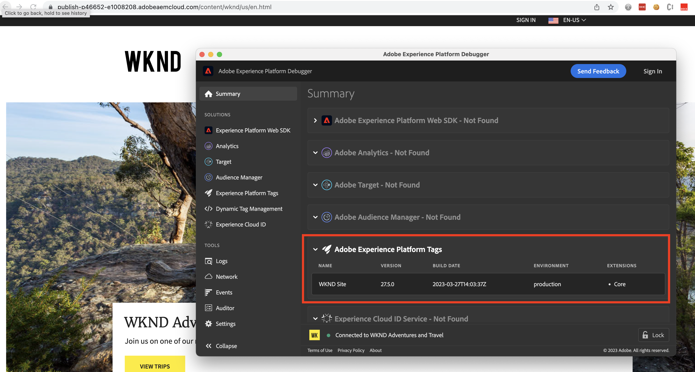

# Debugging a Tags implementation {#debug-tags-implementation}

An introduction to common tools and techniques used to debug a Tags implementation. Learn how to use the browser's developer console and the Experience Platform Debugger extension to identify and troubleshoot key aspects of a Tags implementation.

>[!VIDEO](https://video.tv.adobe.com/v/38567?quality=12&learn=on)

## Client-side debugging via Satellite object

The client-side debugging is helpful to verify Tag property rule loading or order of execution. Whenever a Tag property is added to the website, the `_satellite` JavaScript object is present in the browser to facilitate the client-side event and data tracking.

To enable the client-side debugging, call the `setDebug(true)` method on the `_satellite` object.

1.  Open the browser console, and run below command.

    ```javascript
        _satellite.setDebug(true);
    ```

1.  Reload the AEM site page, and verify console log shows _rule fired_ message like below.

    

## Debugging via Adobe Experience Platform Debugger 

Adobe provides Adobe Experience Platform Debugger [Chrome extension](https://chrome.google.com/webstore/detail/adobe-experience-platform/bfnnokhpnncpkdmbokanobigaccjkpob) and [Firefox add-on](https://addons.mozilla.org/en-US/firefox/addon/adobe-experience-platform-dbg/) to debug, understand, and get insight into the integration.

1.  Open the Adobe Experience Platform Debugger extension and open the site page on the Publish instance

1.  In the **Adobe Experience Platform Debugger > Summary > Adobe Experience Platform Tags** section, verify your Tag property details such as Name, Version, Build Date, Environment, and Extensions.

    

## Additional Resources {#additional-resources}

+   [Introduction to the Adobe Experience Platform Debugger](https://experienceleague.adobe.com/docs/platform-learn/data-collection/debugger/overview.html)

+   [Satellite object reference](https://experienceleague.adobe.com/docs/experience-platform/tags/client-side/satellite-object.html)
