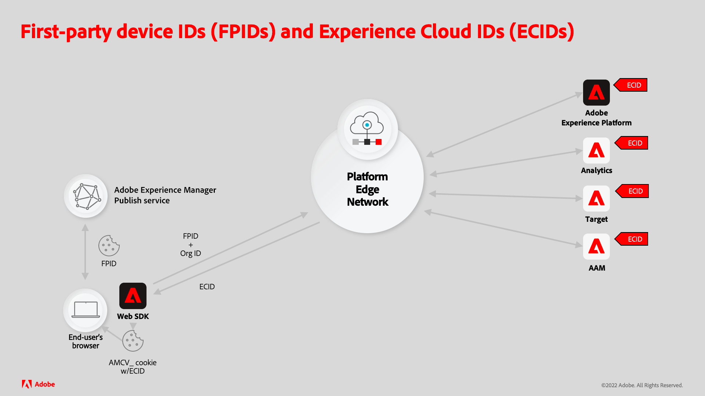

# Generate Experience Platform FPIDs with AEM Sites

Integrating Adobe Experience Manager (AEM) Sites with Adobe Experience Platform (AEP) requires AEM to generate, and maintain a unique first-party device ID (FPID) cookie, in order to uniquely track user activity.

Read the supporting documentation to [learn about the details of how first-part device IDs and Experience Cloud IDs work together](https://experienceleague.adobe.com/docs/platform-learn/data-collection/edge-network/generate-first-party-device-ids.html?lang=en).

Below is an overview of how FPIDs works when using AEM as the web host.



## Generate and persist the FPID with AEM

AEM Publish service optimizes performance by caching requests as many as it can, in both the CDN and AEM Dispatcher caches.  

It's imperative HTTP requests that generate the unique-per-user FPID cookie and return the FPID value are never cached, and served directly from AEM Publish which can implement logic to guarantee uniqueness.

Avoid generating the FPID cookie on requests for web pages, or other cacheable resources, as the combination of FPID's uniqueness requirement would render these resources uncacheable.

The following diagram describes how AEM Publish service manages FPIDs.


1. Web browser makes a request for a web page hosted by AEM. The request may be served using a cached copy of the web page from CDN or AEM Dispatcher cache.
1. If the web page cannot be served from CDN or AEM Dispatcher caches, the request reaches AEM Publish service, which generates the requested web page.
1. The web page is then returned to the web browser, populating the caches that could not serve the request. With AEM, expect CDN and AEM Dispatcher cache hit rates to be greater than 90%. 
1. The web page contains JavaScript that makes an uncacheable asynchronous XHR (AJAX) request to a custom FPID servlet in AEM Publish service. Because this is an uncacheable request (by virtue of it's random query parameter and Cache-Control headers), it is never cached by CDN or AEM Dispatcher, and always reaches AEM Publish service to generate the response. 
1. The custom FPID servlet in AEM Publish service processes the request, generating a new FPID when no existing FPID cookie is found, or extends the life of any existing FPID cookie. The servlet also returns the FPID in the response body for use by client-side JavaScript. Fortunately the custom FPID servlet logic is lightweight, preventing this request from impacting AEM Publish service performance.
1. The response for the XHR request returns to the browser with the FPID cookie and the FPID as JSON in the response body for use by the Platform Web SDK.

## Code sample

The following code and configuration can be deployed to AEM Publish service to create an endpoint that generates, or extends the life of an existing FPID cookie and returns the FPID as JSON.

### AEM FPID cookie servlet

An AEM HTTP endpoint must be created to generate or extend an FPID cookie, using a [Sling servlet](https://sling.apache.org/documentation/the-sling-engine/servlets.html#registering-a-servlet-using-java-annotations-1). 

+ The servlet is bound to `/bin/aem/fpid` as authentication is not required to access it. If authentication is required, bind to a Sling resource type.
+ The servlet accepts HTTP GET requests. The response is marked with `Cache-Control: no-store` to prevent caching, but this endpoint should be requested using unique cache-busting query parameters as well.

When an HTTP request reaches the servlet, the servlet checks if an FPID cookie exists on the request:

+ If an FPID cookie exists, extend the life of the cookie, and collect its value to write to the response.
+ If an FPID cookie does not exist, generate a new FPID cookie, and save the value to write to the response.

The servlet then writes the FPID to the response as a JSON object in the form: `{ fpid: "<FPID VALUE>" }`.

It is important to provide the FPID to the client in the body since the FPID cookie is marked `HttpOnly`, meaning only the server can read its value, and client-side JavaScript cannot.

The FPID value from the response body is used to parameterize calls using the Platform Web SDK.

Below is example code of a AEM servlet endpoint (available via `HTTP GET /bin/aep/fpid`) that generates or refreshes an FPID cookie, and returns the FPID as JSON.

+ `core/src/main/java/com/adobe/aem/guides/wkndexamples/core/aep/impl/FpidServlet.java`

```java
package com.adobe.aem.guides.wkndexamples.core.aep.impl;

import com.google.gson.JsonObject;
import org.apache.sling.api.SlingHttpServletRequest;
import org.apache.sling.api.SlingHttpServletResponse;
import org.apache.sling.api.servlets.SlingAllMethodsServlet;
import org.osgi.service.component.annotations.Component;
import org.slf4j.Logger;
import org.slf4j.LoggerFactory;

import javax.servlet.Servlet;
import javax.servlet.http.Cookie;
import java.io.IOException;
import java.util.UUID;

import static org.apache.sling.api.servlets.ServletResolverConstants.SLING_SERVLET_PATHS;
import static org.apache.sling.api.servlets.ServletResolverConstants.SLING_SERVLET_METHODS;

@Component(
        service = {Servlet.class},
        property = {
                SLING_SERVLET_PATHS + "=/bin/aep/fpid",
                SLING_SERVLET_METHODS + "=GET"
        }
)
public class FpidServlet extends SlingAllMethodsServlet {
    private static final Logger log = LoggerFactory.getLogger(FpidServlet.class);
    private static final String COOKIE_NAME = "FPID";
    private static final String COOKIE_PATH = "/";
    private static final int COOKIE_MAX_AGE = 60 * 60 * 24 * 30 * 13;
    private static final String JSON_KEY = "fpid";

    @Override
    protected final void doGet(SlingHttpServletRequest request, SlingHttpServletResponse response) throws IOException {
        // Try to get an existing FPID cookie, this will give us the user's current FPID if it exists
        final Cookie existingCookie = request.getCookie(COOKIE_NAME);

        String cookieValue;

        if (existingCookie == null) {
            //  If no FPID cookie exists, Create a new FPID UUID
            cookieValue = UUID.randomUUID().toString();
        } else {
            // If a FPID cookie exists. get its FPID UUID so it's life can be extended
            cookieValue = existingCookie.getValue();
        }

        // Add the newly generate FPID value, or the extended FPID value to the response
        // Use addHeader(..), as we need to set SameSite=Lax (and addCoookie(..) does not support this)
        response.addHeader("Set-Cookie",
                COOKIE_NAME + "=" + cookieValue + "; " +
                        "Max-Age=" + COOKIE_MAX_AGE + "; " +
                        "Path=" + COOKIE_PATH + "; " +
                        "HttpOnly; " +
                        "Secure; " +
                        "SameSite=Lax");
        
        // Avoid caching the response in any cache
        response.addHeader("Cache-Control", "no-store");

        // Since the FPID is HttpOnly, JavaScript cannot read it (only the server can)
        // Write the FPID to the response as JSON so client JavaScript can access it.
        final JsonObject json = new JsonObject();
        json.addProperty(JSON_KEY, cookieValue);
        
        // The JSON `{ fpid: "11111111-2222-3333-4444-55555555" }` is returned in the response
        response.setContentType("application/json");
        response.getWriter().write(json.toString());
    }
}
```

### HTML script

A custom client-side JavaScript must be added to the page to asynchronously invokes the servlet, generating or refreshing the FPID cookie and returning the FPID in the response.

This JavaScript script is typicalled added to the page usine one of the following methods:

+ [Tags in Adobe Experience Platform](https://experienceleague.adobe.com/docs/experience-platform/tags/home.html)
+ [AEM Client Library](https://experienceleague.adobe.com/docs/experience-manager-cloud-service/content/implementing/developing/full-stack/clientlibs.html?lang=en)

The XHR call to the custom AEM FPID servlet is fast, though asynchronous, so it is possible for a user to visit a webpage served by AEM, and navigate away before the request can complete. 
If this occurs, the same process will reattempt on the next page load of a web page from AEM.

The HTTP GET to the AEM FPID servlet (`/bin/aep/fpid`) is parameterized with a random query parameter to ensure any infrastructure between the browser and AEM Publish service does not cache the request's response. 
Similarly, the `Cache-Control: no-store` request header is added to support avoiding caching.

Upon an invocation of the AEM FPID servlet, the FPID is retrieved from the JSON response and used by the [Platform Web SDK](https://experienceleague.adobe.com/docs/platform-learn/implement-web-sdk/tags-configuration/install-web-sdk.html?lang=en) to send it to Experience Platform APIs.

See the Experience Platform documentation for more information on [using FPIDs in identityMap](https://experienceleague.adobe.com/docs/experience-platform/edge/identity/first-party-device-ids.html#identityMap)

```javascript
...
<script>
    // Invoke the AEM FPID servlet, and then do something with the response

    fetch(`/bin/aep/fpid?_=${new Date().getTime() + '' + Math.random()}`, { 
            method: 'GET',
            headers: {
                'Cache-Control': 'no-store'
            }
        })
        .then((response) => response.json())
        .then((data) => { 
            // Get the FPID from JSON returned by AEM's FPID servlet
            console.log('My FPID is: ' + data.fpid);

            // Send the `data.fpid` to Experience Platform APIs            
        });
</script>
```

### Dispatcher allow filter

Lastly, HTTP GET requests to the custom FPID servlet must be allowed via AEM Dispatcher's `filter.any` configuration. 

If this Dispatcher configuration is not implemented correctly, the HTTP GET requests to `/bin/aep/fpid` results in a 404.

+ `dispatcher/src/conf.dispatcher.d/filters/filters.any`

```
/1099 { /type "allow" /method "GET" /url "/bin/aep/fpid" }
```

## Experience Platform resources

Review the following Experience Platform documentation for First-party device IDs (FPIDs) and managing identity data with Platform Web SDK.

+ [Generate first-party device IDs](https://experienceleague.adobe.com/docs/platform-learn/data-collection/edge-network/generate-first-party-device-ids.html)
+ [First-party device IDs in the Platform Web SDK](https://experienceleague.adobe.com/docs/experience-platform/edge/identity/first-party-device-ids.html)
+ [Identity data in the Platform Web SDK](https://experienceleague.adobe.com/docs/experience-platform/edge/identity/overview.html)
