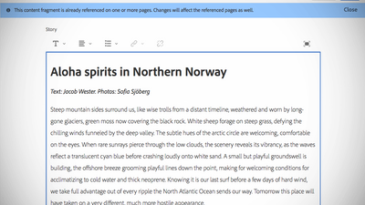
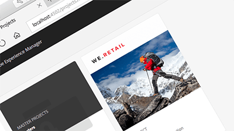

# Overview {#overview}

Adobe Experience Manager Sites is the leader in customer experience management by delivering personalized experiences for your whole audience — on any screen. This user guide contains videos and tutorials on the many features and capabilities of AEM Sites.

>[!VIDEO](https://video.tv.adobe.com/v/17028/?quality=9)

## What's New

**[Using Adobe Analytics Activity Map](./analytics/activity-map-feature-video-use.md)**

*Learn about integrating Adobe Analytics and AEM Sites.*

**[Using Content Fragments](./experience-fragments/experience-fragment-target-feature-video-use.md)**

*Content Fragments are a content abstraction in AEM that allows text-based content to be authored and managed independently of the channels it supports.*

**[Understanding Core Components](components/core-components-feature-video-understand.md)**

*Core Components 2.4.0 is here!*

## Trending Content

**[Getting Started with AEM Sites - WKND Tutorial](https://docs.adobe.com/content/help/en/experience-manager-learn/getting-started-wknd-tutorial-develop/overview.html)**

*How to implement a website using the latest standards and technologies in Adobe Experience Manager (AEM).*

**[Using the SPA Editor](spa-editor/spa-editor-framework-feature-video-use.md)**

*AEM's SPA Editor provides authors the ability to edit content for a Single Page Application or SPA.*

**[Using Language Copy](translation/language-copy-feature-video-use.md)**

*Users can create a language copy from master language without having to create a create a root page.*

## Additional AEM Sites Resources

* [Experience League - Explore AEM](https://experienceleague.adobe.com/#recommended/solutions/experience-manager)
* [AEM Sites Authoring User Guide](https://helpx.adobe.com/experience-manager/6-5/sites/authoring/user-guide.html)
* [AEM Sites Developing User Guide](https://helpx.adobe.com/experience-manager/6-5/sites/developing/user-guide.html)
* [AEM Sites Administering User Guide](https://helpx.adobe.com/experience-manager/6-5/sites/administering/user-guide.html)
* [AEM Sites Deploying User Guide](https://helpx.adobe.com/experience-manager/6-5/sites/deploying/user-guide.html)

## Other AEM Tutorials and Videos

* [AEM Assets Videos and Tutorials](/help/assets/overview.md)
* [AEM Forms Videos and Tutorials](/help/forms/introduction.md)
* [AEM Platform Videos and Tutorials](/help/foundation/introduction.md)