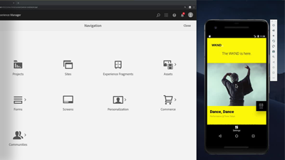

# AEM Sites videos and tutorials {#overview}

{{edge-delivery-services}}

Adobe Experience Manager (AEM) Sites is a leading experience management platform. This user guide contains videos and tutorials on the many features and capabilities of AEM Sites.

## What's new

* **[Overview of AEM and Edge Delivery Services (Video)](https://experienceleague.adobe.com/docs/experience-manager-learn/cloud-service/overview.html)**
    *Explore the comprehensive world of Adobe Experience Manager (AEM) encompassing AEM Sites, AEM Assets, AEM Headless, AEM Forms, and Edge Delivery Services in this informative overview video.*

* **[What are AEM and Edge Delivery Services? (Video)](https://experienceleague.adobe.com/docs/experience-manager-learn/cloud-service/introduction/what-is-aem-as-a-cloud-service.html)**
    *Learn about the value Adobe Experience Manager (AEM) and Edge Delivery Services provide.*

* **[AEM with Edge Delivery Services architectural overview (Video)](https://experienceleague.adobe.com/docs/experience-manager-learn/cloud-service/introduction/architecture.html)**
    *Learn all about AEM as a Cloud Service's architecture!*
   

   

## Staff picks

<table>
<tr>
  <td>
    
    

      <a href="https://experienceleague.adobe.com/docs/experience-manager-learn/getting-started-wknd-tutorial-develop/overview.html">
    <strong>Getting Started with AEM Sites</strong>
    </a>
    

    

    <em>A getting started guide for developers looking to implement AEM Sites.</em>
    

  </td>
  <td>
    
    

    <a href="https://experienceleague.adobe.com/docs/experience-manager-learn/getting-started-with-aem-headless/overview.html">
    <strong>Getting Started with AEM Headless</strong>
    </a>
    

    

    <em>A getting started guide for developers looking to use AEM as headless CMS.</em>
    

  </td>
  <td>
    
     

      <a href="https://experienceleague.adobe.com/docs/experience-manager-learn/getting-started-with-aem-headless/spa-editor/react/overview.html">
        <strong>Getting Started with AEM's SPA Editor</strong>
      </a>
    

    

    <em>A getting started guide for developers to integrate a single page application (SPA) with AEM.</em>
    

  </td>
</tr>
</table>

   
## Additional resources

* [AEM Sites Authoring documentation](https://experienceleague.adobe.com/docs/experience-manager-65/authoring/home.html)
* [AEM Sites Developing documentation](https://experienceleague.adobe.com/docs/experience-manager-65/developing/home.html)
* [AEM Sites Administering documentation](https://experienceleague.adobe.com/docs/experience-manager-65/administering/home.html)
* [AEM Sites Deploying documentation](https://experienceleague.adobe.com/docs/experience-manager-65/deploying/home.html)
* [AEM as a Cloud Service tutorials](/help/cloud-service/overview.md)
* [AEM Assets tutorials](/help/assets/overview.md)
* [AEM Forms tutorials](/help/forms/overview.md)
* [AEM Foundation tutorials](/help/foundation/overview.md)
