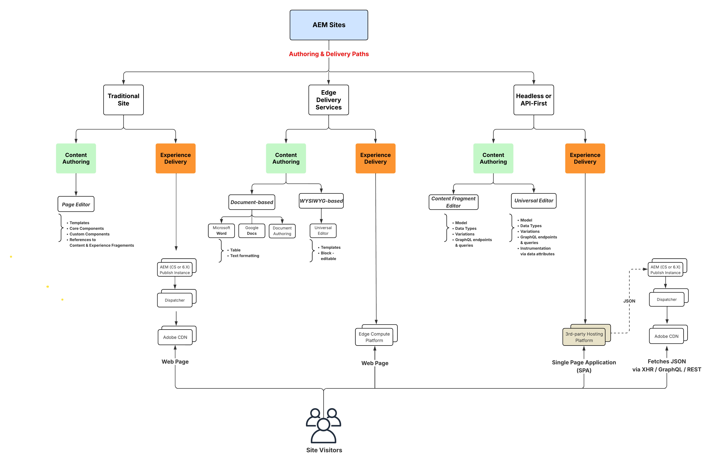
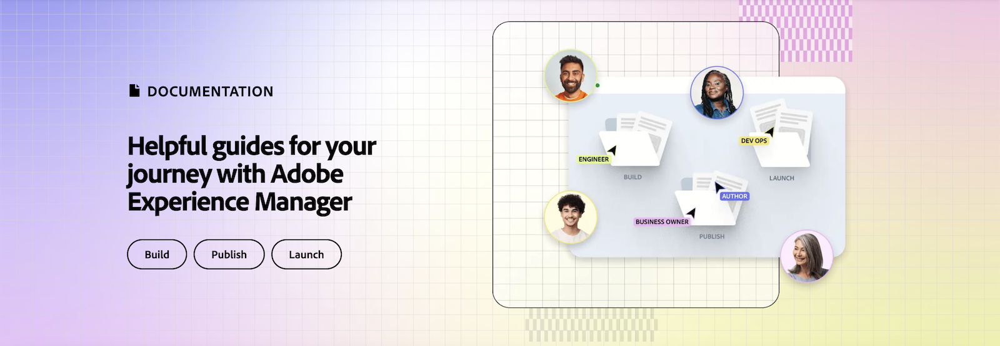
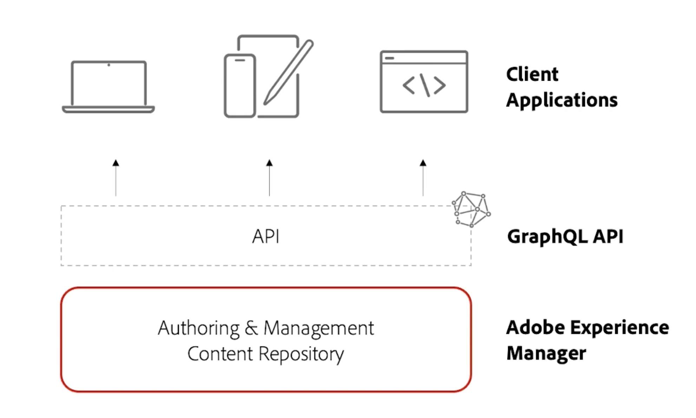

# AEM Sites videos and tutorials {#overview}

{{edge-delivery-services}}

Adobe Experience Manager (AEM) Sites is Adobe's experience management platform, enabling the authoring, management, and delivery of digital experiences, be it through a web site, mobile app, or any other digital channel. 

## Three ways to deliver experiences with AEM Sites

AEM Sites provides three ways to build, author and deliver experiences. Whether you're building web sites, optimizing for edge performance, or powering headless apps, AEM Sites offers flexible options to match your project needs:

1. **Edge Delivery Services** experiences use Adobe's Edge Network to deliver content with high speed and low latency. The service automatically optimizes content for the consuming device, searching engines, and GenAI agents. Authors create content using Adobe Universal Editor or document-based authoring.  
1. **Headless/API-first** experiences use AEM Publish to deliver content as JSON over HTTP APIs for mobile apps, single-page applications (SPAs), or other headless clients. Authors create content using Content Fragment Editor or Universal Editor.  
1. **Traditional AEM** experiences use AEM Publish to deliver content as HTML webpages. Authors create content using AEM Author's Page Editor. This option is best for existing projects or projects already migrated.  

All three options are strong approaches, and the best choice depends on your use case and organizational needs. Each approach allows teams to deliver personalized, engaging experiences at speed and scale across any channel or device.

>[!IMPORTANT]
>
> **Edge Delivery Services** is the newest and most advanced way to deliver websites with AEM. It combines the speed and scalability of Adobe's Edge Network with modern authoring options. While Edge Delivery Services is  recommended for new projects, AEM Sites continues to support headless and traditional approaches, so you can choose the path that best fits your needs.

The following diagram depicts the different options for building experiences with AEM Sites:

{width="700" zoomable="yes"}

### Compare the ways to build with AEM Sites

The following table provides a high-level comparison of the three paths. It focuses on the content authoring and experience delivery nuances of each path.

|            |  Edge Delivery Services          | Headless / API-First                        |  Traditional AEM            |
|---------------------|------------------------------|---------------------------------|---------------------------------------------|
| **Best for** |  Websites with high traffic, performance, and scalability needs | Mobile apps, SPAs, and other headless applications | Existing projects or migrated projects |
| **Authoring tools** |  Document-based authoring, Universal Editor, Page Editor | Content Fragments, Universal Editor | Page Editor, Universal Editor                  |
| **Authored content store**         |  Documents or AEM Author (JCR)                       | AEM Author (JCR)          |AEM Author (JCR)    |
| **Delivery** |  Edge Delivery Services                        |    AEM Publish (w/ Adobe CDN + Dispatcher)      | AEM Publish (w/ Adobe CDN + Dispatcher)       |
| **Delivery content store**         | Edge Delivery Services  | AEM Publish (JCR)           |  AEM Publish (JCR)    |
| **Delivery format**   |  HTML                                  | JSON | HTML                    |
| **Development technology**       |  JavaScript, CSS                | Any (e.g. Swift, React, etc.)        | Java&trade;, HTL, JavaScript, CSS    |
| **Search bot and GenAI agent support** | Optimized for bots, search engines, and GenAI agents | Works for bots and agents, but may require SSR or additional setup | Suitable for bots, but performance may be slower compared to Edge Delivery Services |

## Migrating from AMS or On-Premise

If you are migrating from AMS or on-premise (OTP) to AEM as a Cloud Service, Adobe encourages you to evaluate moving directly to Edge Delivery Services. The effort is typically no greater than migrating to AEM as a Cloud Service Publish, while providing faster performance and greater scalability. If you decide that Edge Delivery Services isn't the right choice for you at this time, or if the other approaches better meet your needs, they remain fully supported and valid options for your project.

## Tutorials

Explore the three approaches to building with AEM Sites in more detail. The tutorials below walk you through how each option works, the tools involved, and when to use them.

<!-- CARDS

* https://www.aem.live/docs/
  {title = Edge Delivery Services - Guides}
  {description = Explore Edge Delivery Services with comprehensive guides. The Build, Publish, and Launch guides cover everything you need to get started with Edge Delivery Services.}
  {image = ./assets/edge-delivery-services.png}
  {target = _blank}
* https://experienceleague.adobe.com/en/docs/experience-manager-learn/getting-started-with-aem-headless/overview
  {title = Headless/API-First - Tutorials}
  {description = Learn how to build headless applications powered by AEM content. Tutorials cover frameworks like iOS, Android, and React—choose what fits your stack.}
  {image = ./assets/headless.png}
  {target = _self}
* https://experienceleague.adobe.com/en/docs/experience-manager-learn/getting-started-wknd-tutorial-develop/overview
  {title = Traditional AEM - WKND Tutorial}
  {description = Learn how to build a sample AEM Sites project using the WKND tutorial. This guide walks you through project setup, Core Components, Editable Templates, client-side libraries, and component development.}
  {image = ./assets/aem-wknd-spa-editor-tutorial.png}
  {target = _self}
-->
<!-- START CARDS HTML - DO NOT MODIFY BY HAND -->

    

        

            

                <figure class="image x-is-16by9">
                    
                </figure>
            

            

                

                    

                        <a href="https://www.aem.live/docs/" target="_blank" rel="referrer" title="Edge Delivery Services - Guides">Edge Delivery Services - Guides</a>
                    

                    
Explore Edge Delivery Services with comprehensive guides. The Build, Publish, and Launch guides cover everything you need to get started with Edge Delivery Services.

                

                <a href="https://www.aem.live/docs/" target="_blank" rel="referrer" class="spectrum-Button spectrum-Button--outline spectrum-Button--primary spectrum-Button--sizeM" style="align-self: flex-start; margin-top: 1rem;">
                    Learn more
                </a>
            

        

    

    

        

            

                <figure class="image x-is-16by9">
                    
                </figure>
            

            

                

                    

                        <a href="https://experienceleague.adobe.com/en/docs/experience-manager-learn/getting-started-with-aem-headless/overview" target="_self" rel="referrer" title="Headless/API-First - Tutorials">Headless/API-First - Tutorials</a>
                    

                    
Learn how to build headless applications powered by AEM content. Tutorials cover frameworks like iOS, Android, and React—choose what fits your stack.

                

                <a href="https://experienceleague.adobe.com/en/docs/experience-manager-learn/getting-started-with-aem-headless/overview" target="_self" rel="referrer" class="spectrum-Button spectrum-Button--outline spectrum-Button--primary spectrum-Button--sizeM" style="align-self: flex-start; margin-top: 1rem;">
                    Learn more
                </a>
            

        

    

    

        

            

                <figure class="image x-is-16by9">
                    
                </figure>
            

            

                

                    

                        <a href="https://experienceleague.adobe.com/en/docs/experience-manager-learn/getting-started-wknd-tutorial-develop/overview" target="_self" rel="referrer" title="Traditional AEM - WKND Tutorial">Traditional AEM - WKND Tutorial</a>
                    

                    
Learn how to build a sample AEM Sites project using the WKND tutorial. This guide walks you through project setup, Core Components, Editable Templates, client-side libraries, and component development.

                

                <a href="https://experienceleague.adobe.com/en/docs/experience-manager-learn/getting-started-wknd-tutorial-develop/overview" target="_self" rel="referrer" class="spectrum-Button spectrum-Button--outline spectrum-Button--primary spectrum-Button--sizeM" style="align-self: flex-start; margin-top: 1rem;">
                    Learn more
                </a>
            

        

    

<!-- END CARDS HTML - DO NOT MODIFY BY HAND -->

   
## Additional resources

* [AEM Sites Authoring documentation](https://experienceleague.adobe.com/en/docs/experience-manager-65/content/sites/authoring/essentials/first-steps)
* [AEM Sites Developing documentation](https://experienceleague.adobe.com/en/docs/experience-manager-65/content/implementing/developing/introduction/getting-started)
* [AEM Sites Administering documentation](https://experienceleague.adobe.com/en/docs/experience-manager-65/content/sites/administering/home)
* [AEM Sites Deploying documentation](https://experienceleague.adobe.com/en/docs/experience-manager-65/content/implementing/deploying/introduction/platform)
* [AEM as a Cloud Service tutorials](/help/cloud-service/overview.md)
* [AEM Assets tutorials](/help/assets/overview.md)
* [AEM Forms tutorials](/help/forms/overview.md)
* [AEM Foundation tutorials](/help/foundation/overview.md)
