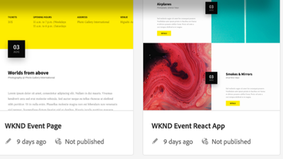
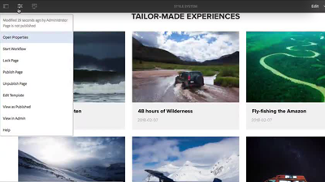

# Overview {#overview}

Adobe Experience Manager (AEM) Sites is a leading experience management platform. This user guide contains videos and tutorials on the many features and capabilities of AEM Sites.

## What's New

* **[Using Experience Fragments (Video)](./experience-fragments/experience-fragments-feature-video-use.md)**
     
    *Learn about AEM Experience Fragments for promoting content cross-channels.*

* **[Using Content Fragments (Video)](./content-fragments/content-fragments-feature-video-use.md)**
     
    *Content Fragments are channel agnostic pieces of content able to be re-used.*

* **[Using the SPA Editor (Video)](./spa-editor/spa-editor-framework-feature-video-use.md)**
     
    *Learn about AEM's editing capabilities for single page applications (SPA).*

* **[Translation Enhancements (Video)](./translation/translation-enhancements-feature-video-use.md)**
     
    *Learn about the latest translation enhancements in Adobe Experience Manager Sites.*

## Staff Picks

<table>
<tr>
  <td>
    
     

      <a href="https://helpx.adobe.com/experience-manager/kt/sites/using/getting-started-spa-wknd-tutorial-develop.html">
        <strong>Getting Started with the AEM SPA Editor - WKND Events Tutorial</strong>
      </a>
    

    

    <em>A getting started guide for developers to integrate a single page applications (SPA) with AEM.</em>
    

  </td>
  <td>
    
    

      <a href="https://docs.adobe.com/content/help/en/experience-manager-learn/getting-started-wknd-tutorial-develop/overview.html">
    <strong>Getting Started with AEM Sites - WKND Tutorial</strong>
    </a>
    

    

    <em>A getting started guide for developers looking to implement AEM Sites.</em>
    

  </td>
  <td>
    
    

    <a href="./page-authoring/style-system-feature-video-use.md">
    <strong>Using the Style System</strong>
    </a>
    

    

    <em>AEM's Style System allows visual variations of components without back-end development.</em>
    

  </td>
</tr>
</table>

## Additional Resources

* [Experience League - Explore AEM](https://experienceleague.adobe.com/#recommended/solutions/experience-manager)
* [AEM Sites Authoring Documentation](https://helpx.adobe.com/experience-manager/6-5/sites/authoring/user-guide.html)
* [AEM Sites Developing Documentation](https://helpx.adobe.com/experience-manager/6-5/sites/developing/user-guide.html)
* [AEM Sites Administering Documentation](https://helpx.adobe.com/experience-manager/6-5/sites/administering/user-guide.html)
* [AEM Sites Deploying Documentation](https://helpx.adobe.com/experience-manager/6-5/sites/deploying/user-guide.html)
* [AEM Assets Tutorials](/help/assets/overview.md)
* [AEM Forms Tutorials](/help/forms/introduction.md)
* [AEM Foundation Tutorials](/help/foundation/overview.md)
