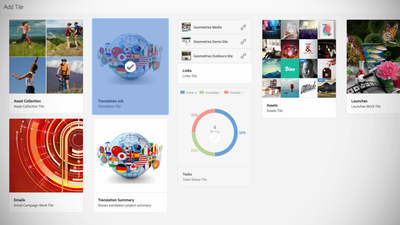

# Overview {#overview}

Adobe Experience Manager Sites is the leader in customer experience management by delivering personalized experiences for your whole audience — on any screen. This user guide contains videos and tutorials on the many features and capabilities of AEM Sites.

## What's New

* **[Using Adobe Analytics Activity Map (Video)](./analytics/activity-map-feature-video-use.md)**  
  *Learn about integrating Adobe Analytics and AEM Sites.*
* **[Using Content Fragments (Video)](./experience-fragments/experience-fragment-target-feature-video-use.md)**  
    *Content Fragments are a content abstraction in AEM that allows text-based content to be authored and managed independently of the channels it supports.*
* **[Understanding Core Components (Article)](./components/core-components-feature-video-understand.md)**  
    *Core Components 2.4.0 is here!*
* **[Understanding SPA components in AEM SPA Editor (Video)](./spa-editor/spa-editor-components-technical-video-understand.md)**  
    *A video series explaining how SPA components, built with AEM's SPA Editor JS SDK's are powered by AEM content.*
* **[Using Building Blocks with Experience Fragments (Video)](./experience-fragments/building-blocks-experience-fragment-feature-video-use.md)**  
    *AEM Experience Fragments introduces a new ability that lets content authors to create a building block consisting of components, that lets authors to re-use content across different variations and across different templates.*
* **[Set up Social Posting with Experience Fragments (Video)](./experience-fragments/experience-fragments-social-technical-video-setup.md)**  
    *Experience Fragments allow marketers to post experiences created in AEM to social media platforms. The video below details the setup and configuration necessary to publish Experience Fragments to Facebook and Pinterest.*

## Staff Picks

|         |      |      |
|---------|------|------|
|    [Getting Started with AEM Sites - WKND Tutorial](https://docs.adobe.com/content/help/en/experience-manager-learn/getting-started-wknd-tutorial-develop/overview.html)  *How to implement a website using the latest standards and technologies in Adobe Experience Manager (AEM)*|    [Getting Started with AEM Sites - WKND Tutorial](https://docs.adobe.com/content/help/en/experience-manager-learn/getting-started-wknd-tutorial-develop/overview.html)  *How to implement a website using the latest standards and technologies in Adobe Experience Manager (AEM)* |    [Getting Started with AEM Sites - WKND Tutorial](https://docs.adobe.com/content/help/en/experience-manager-learn/getting-started-wknd-tutorial-develop/overview.html)  *How to implement a website using the latest standards and technologies in Adobe Experience Manager (AEM)* |

|[Getting Started with AEM Sites - WKND Tutorial](https://docs.adobe.com/content/help/en/experience-manager-learn/getting-started-wknd-tutorial-develop/overview.html)|[Getting Started with AEM Sites - WKND Tutorial](https://docs.adobe.com/content/help/en/experience-manager-learn/getting-started-wknd-tutorial-develop/overview.html)|[Getting Started with AEM Sites - WKND Tutorial](https://docs.adobe.com/content/help/en/experience-manager-learn/getting-started-wknd-tutorial-develop/overview.html)|
|---------|------|------|
|    *How to implement a website using the latest standards and technologies in Adobe Experience Manager (AEM)*|    *How to implement a website using the latest standards and technologies in Adobe Experience Manager (AEM)* |    *How to implement a website using the latest standards and technologies in Adobe Experience Manager (AEM)* |

## HTML Table

<table>
<tr>
  <td>
    
     
     <a href="https://docs.adobe.com/content/help/en/experience-manager-learn/getting-started-wknd-tutorial-develop/overview.html">
    <b>Getting Started with AEM Sites - WKND Tutorial</b> 
    </a>
    <i>How to implement a website using the latest standards and technologies in Adobe Experience Manager (AEM).</i>
  </td>
  <td>
    <a href="spa-editor/spa-editor-framework-feature-video-use.md">
    
     
    </a>
    <a href="spa-editor/spa-editor-framework-feature-video-use.md">
     <b>Using the SPA Editor</b> 
    </a>
    <i>AEM's SPA Editor provides authors the ability to edit content for a Single Page Application or SPA.</i>
  </td>
  <td>
    <a href="translation/language-copy-feature-video-use.md">
    
     
    </a>
    <a href="translation/language-copy-feature-video-use.md">
    <b>Using Language Copy</b> 
    </a>
    <i>Users can create a language copy from master language without having to create a create a root page.</i>
  </td>
</tr>
</table>

## Additional Resources

* [Experience League - Explore AEM](https://experienceleague.adobe.com/#recommended/solutions/experience-manager)
* [AEM Sites Authoring User Guide](https://helpx.adobe.com/experience-manager/6-5/sites/authoring/user-guide.html)
* [AEM Sites Developing User Guide](https://helpx.adobe.com/experience-manager/6-5/sites/developing/user-guide.html)
* [AEM Sites Administering User Guide](https://helpx.adobe.com/experience-manager/6-5/sites/administering/user-guide.html)
* [AEM Sites Deploying User Guide](https://helpx.adobe.com/experience-manager/6-5/sites/deploying/user-guide.html)

## Other AEM Tutorials and Videos

* [AEM Assets Videos and Tutorials](/help/assets/overview.md)
* [AEM Forms Videos and Tutorials](/help/forms/introduction.md)
* [AEM Platform Videos and Tutorials](/help/foundation/introduction.md)
