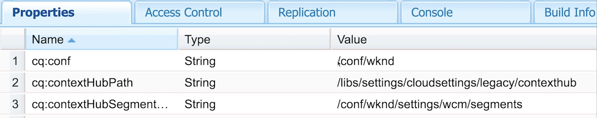

# Setup ContextHub for Personalization {#set-up-contexthub}

ContextHub is a framework for storing, manipulating, and presenting context data. The ContextHub Javascript API enables you to access stores to create, update, and delete data as necessary. As such, ContextHub represents a data layer on your pages. This page describes how to add context hub to your AEM site pages.

>[!VIDEO](https://video.tv.adobe.com/v/23765/?quality=9)

>[!NOTE]
>
>We use the WKND reference site for this video and it is not part of AEM release. You can download the [latest version here](https://github.com/adobe/aem-guides-wknd/releases).

Add ContextHub to your pages to enable the ContextHub features and to link to the ContextHub Javascript libraries. The ContextHub Javascript API provides access to the context data that ContextHub manages.

## Adding ContextHub to a Page Component {#adding-contexthub-to-a-page-component}

To enable the ContextHub features and to link to the ContextHub Javascript libraries, include the `contexthub` component in the head section of your page. The HTL code for your page component resembles the following example:

```java
<!--/* Include Context Hub */-->
<sly data-sly-resource="${'contexthub' @ resourceType='granite/contexthub/components/contexthub'}"/>
*/-->
```

## Site Configuration and ContextHub Segments {#site-configuration-and-contexthub-segments}

ContextHub includes a segmentation engine that manages segments and determines which segments are resolved for the current context. Several segments are defined. You can use the Javascript API to [determine resolved segments](https://helpx.adobe.com/experience-manager/6-5/sites/developing/using/ch-adding.html#DeterminingResolvedContextHubSegments). Enable the ContextHub segments for your site under Configuration Browser.

## Create Segments {#create-segments}

Create AEM segments that act as rules for the teasers. That is, they define when content within a teaser appears on a web page. Content can then be specifically targeted to the visitor's needs and interests, depending on the segment(s) they match.

## Assigning Cloud Configuration, Segment path and ContextHub path to your site {#assigning-cloud-configuration-segment-path-and-contexthub-path-to-your-site}

Assigning the Cloud configuration path, segmentation path and ContextHub path to your site root node so you can create a personalized experience for your audience. Using the ContextHub, you can manipulate the context data and test your resolved segments.



You can read more about Context Hub and Segmentation below:

* [Context Hub](https://helpx.adobe.com/experience-manager/6-5/sites/developing/using/contexthub.html)
* [Adding Context Hub to page and Accessing Stores](https://helpx.adobe.com/experience-manager/6-5/sites/developing/using/ch-adding.html)
* [Understanding Segmentation](https://helpx.adobe.com/experience-manager/6-5/sites/classic-ui-authoring/using/classic-personalization-campaigns-segmentation.html)
* [Configuring Segmentation with Context Hub](https://helpx.adobe.com/experience-manager/6-5/sites/administering/using/segmentation.html)
