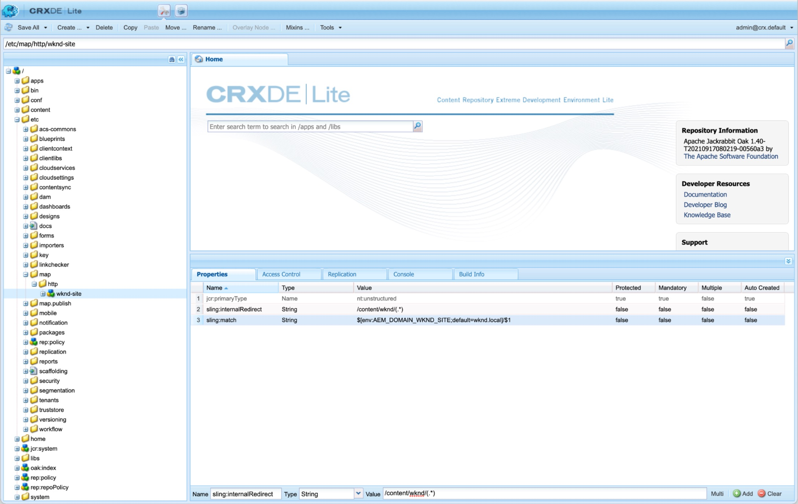

# Sitemaps

Learn how to help boost your SEO by creating sitemaps for AEM Sites.

>[!VIDEO](https://video.tv.adobe.com/v/337960/?quality=12&learn=on)

## Resources

+ [AEM Sitemap Documentation](https://experienceleague.adobe.com/docs/experience-manager-cloud-service/overview/seo-and-url-management.html?lang=en#building-an-xml-sitemap-on-aem)
+ [Apache Sling Sitemap documentation](https://github.com/apache/sling-org-apache-sling-sitemap#readme)
+ [Sitemap.org Sitemap documentation](https://www.sitemaps.org/protocol.html)
+ [Sitemap.org Sitemap index file documentation](https://www.sitemaps.org/protocol.html#index)
+ [Cronmaker](http://www.cronmaker.com/)

## Configurations

### Sitemap scheduler OSGi configuration

Defines the [OSGi factory configuration](http://localhost:4502/system/console/configMgr/org.apache.sling.sitemap.impl.SitemapScheduler) for the frequency (using [cron expressions](http://www.cronmaker.com)) sitemaps are re/generated and cached in AEM. 

`ui.config/src/main/jcr_content/apps/wknd/osgiconfig/config.publish`

```json
{
  "scheduler.name": "WKND Sitemaps",
  "scheduler.expression": "0 0 2 1/1 * ? *",
  "searchPath": "/content/wknd"
}
```

### Absolute sitemap URLs

AEM's sitemap supports absolute URL's by using [Sling mapping](https://sling.apache.org/documentation/the-sling-engine/mappings-for-resource-resolution.html). This is done by creating mapping nodes on the AEM services generating sitemaps.

An example Sling mapping node definition for `https://wknd.com` can be defined under `/etc/map/https` as follows:

| Path | Property name | Property type | Property value | 
|------|----------|---------------|-------|
| `/etc/map/https/wknd-site` | `jcr:primaryType` | String | `nt:unstructured` |
| `/etc/map/https/wknd-site` | `sling:internalRedirect` | String | `/content/wknd/(.*)` |
| `/etc/map/https/wknd-site` | `sling:match` | String | `wknd.com/$1` |

The screenshot below illustrates a similar configuration but for `http://wknd.local` (a local hostname mapping running on `http`).




### Dispatcher allow filter rule

Allow HTTP requests for the sitemap index and sitemap files.

`dispatcher/src/conf.dispatcher.d/filters/filters.any`

```
...

# Allow AEM sitemaps
/0200 { /type "allow" /path "/content/*" /selectors '(sitemap-index|sitemap)' /extension "xml" }
```

### Apache webserver rewrite rule

Ensure `.xml` sitemap HTTP requests are routed to the correct underlying AEM page. If URL shortening is not used, or Sling Mappings are used to achieve URL shortening, then this configuration is not needed.

`dispatcher/src/conf.d/rewrites/rewrite.rules`

```
...
RewriteCond %{REQUEST_URI} (.html|.jpe?g|.png|.svg|.xml)$
RewriteRule ^/(.*)$ /content/${CONTENT_FOLDER_NAME}/$1 [PT,L]
```
