# Developing with the AEM SPA Editor - Hello World Tutorial {#developing-with-the-aem-spa-editor-hello-world-tutorial}

>[!WARNING]
>
> This tutorial is **deprecated**. It is recommended to follow either: [Getting Started with the AEM SPA Editor and Angular](https://docs.adobe.com/content/help/en/experience-manager-learn/spa-angular-tutorial/overview.html) or [Getting Started with the AEM SPA Editor and React](https://docs.adobe.com/content/help/en/experience-manager-learn/spa-react-tutorial/overview.html)

AEM's SPA Editor provides support for in-context editing of a Single Page Application or SPA. This tutorial is an introduction to SPA development to be used with AEM's SPA Editor JS SDK. The tutorial will extend the We.Retail Journal app by adding a custom Hello World component. Users can complete the tutorial using React or Angular frameworks.

>[!NOTE]
>
> The Single-Page Application (SPA) Editor feature requires AEM 6.4 service pack 2 or newer.
>
> The SPA Editor is the recommended solution for projects that require SPA framework based client-side rendering (e.g. React or Angular).

## Prerequisite Reading {#prereq}

This tutorial is intended to highlight the steps needed to map a SPA component to an AEM component to enable in-context editing. Users starting this tutorial should be familiar with basic concepts of development with Adobe Experience Manager, AEM, as well as developing with React of Angular frameworks. The tutorial covers both back-end and front-end development tasks.

The following resources are recommended to be reviewed before starting this tutorial:

* [SPA Editor Feature Video](spa-editor-framework-feature-video-use.md) - A video overview of the SPA Editor and We.Retail Journal app.
* [React.js Tutorial](https://reactjs.org/tutorial/tutorial.html) - An introduction to developing with the React framework.
* [Angular Tutorial](https://angular.io/tutorial) - An introduction to developing with Angular

## Local Development Environment {#local-dev}

This tutorial is designed for:

[Adobe Experience Manager 6.5](https://helpx.adobe.com/experience-manager/6-5/release-notes.html) or [Adobe Experience Manager 6.4](https://helpx.adobe.com/experience-manager/6-4/sites/deploying/using/technical-requirements.html) + [Service Pack 5](https://helpx.adobe.com/experience-manager/6-4/release-notes/sp-release-notes.html)

In this tutorial the following technologies and tools should be installed:

1. [Java 11](https://downloads.experiencecloud.adobe.com/content/software-distribution/en/general.html)
2. [Apache Maven - 3.3.1+](https://maven.apache.org/)
3. [Node.js - 8.11.1+](https://nodejs.org/en/) and  npm  5.6.0+ (npm is installed with node.js)

Double check the installation of the above tools by opening up a new terminal and running the following:

```shell

$ java -version
java version "11 +"

$ mvn -version
Apache Maven 3.3.9

$ node --version
v8.11.1

$ npm --version
6.1.0

```

## Overview {#overview}

The basic concept is to map  a SPA  Component to an AEM Component. AEM components, running server-side, export content in the form of JSON. The JSON content is consumed by the SPA, running client-side in the browser. A 1:1 mapping between SPA components and an AEM component is created.

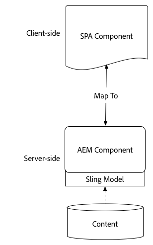

Popular frameworks [React JS](https://reactjs.org/) and [Angular](https://angular.io/) are supported out of the box. Users can complete this tutorial in either Angular or React, whichever framework they are most comfortable with.

## Project Setup {#project-setup}

SPA development has one foot in AEM development, and the other out. The goal is to allow SPA development to occur independently, and (mostly) agnostic to AEM.

* SPA projects can operate independently of the AEM project during front-end development.
* Front-end build tools and technologies like Webpack, NPM, [!DNL Grunt] and [!DNL Gulp]continue to be used.
* To build for AEM, the SPA project is compiled and automatically included in the AEM project.
* Standard AEM Packages used to deploy the SPA into AEM.

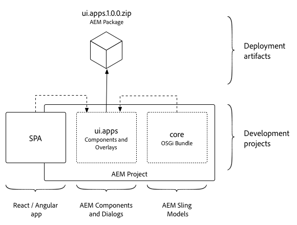

*SPA development has one foot in AEM development, and the other out - allowing SPA development to occur independently, and (mostly) agnostic to AEM.*

The goal of this tutorial is to extend the We.Retail Journal App with a new component. Start by downloading the source code for the We.Retail Journal app and deploying to a local AEM.

1. **Download** the latest [We.Retail Journal Code from GitHub](https://github.com/adobe/aem-sample-we-retail-journal).

   Or clone the repository from the command line:

   ```shell

   $ git clone git@github.com:adobe/aem-sample-we-retail-journal.git

   ```

   >[!NOTE]
   >
   >The tutorial will be working against the **master** branch with **1.2.1-SNAPSHOT** version of the project.

1. The following structure should be visible:

   

   The project contains the following maven modules:

   * `all`: Embeds and installs the entire project in a single package.
   * `bundles`: Contains two OSGi bundles: commons and core that contain [!DNL Sling Models] and other Java code.
   * `ui.apps`: contains the /apps parts of the project, ie JS & CSS clientlibs, components, runmode specific configs.
   * `ui.content`: contains structural content and configurations (`/content`, `/conf`)
   * `react-app`: We.Retail Journal React application. This is both a Maven module and a webpack project.
   * `angular-app`: We.Retail Journal Angular application. This is both a [!DNL Maven] module and a webpack project.

1. Open a new terminal window and run the following command to build and deploy the entire app to a local AEM instance running on [http://localhost:4502](http://localhost:4502).

   ```shell

   $ cd <src>/aem-sample-we-retail-journal
   $ mvn -PautoInstallSinglePackage clean install

   ```

   >[!NOTE]
   >
   > In this project the Maven profile to build and package the entire project is `autoInstallSinglePackage`

   >[!CAUTION]
   >
   > If you recieve an error during the build, [ensure your Maven settings.xml file includes Adobe's Maven artifact repository](https://helpx.adobe.com/experience-manager/kb/SetUpTheAdobeMavenRepository.html).

1. Navigate to:

   * [http://localhost:4502/editor.html/content/we-retail-journal/react/en/home.html](http://localhost:4502/editor.html/content/we-retail-journal/react/en/home.html)
   * [http://localhost:4502/editor.html/content/we-retail-journal/angular/en/home.html](http://localhost:4502/editor.html/content/we-retail-journal/angular/en/home.html)

   The We.Retail Journal App should be displayed within the AEM Sites editor.

1. In [!UICONTROL Edit] mode, select a component to edit and make an update to the content.

   

1. Select the [!UICONTROL Page Properties] icon to open the [!UICONTROL Page Properties]. Select [!UICONTROL Edit Template] to open the page's template.

   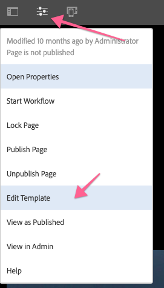

1. In the latest version of the SPA Editor, [Editable templates](https://helpx.adobe.com/experience-manager/6-5/sites/developing/using/page-templates-editable.html) can be used in the same way as with traditional Sites implementations. This will be revisited later with our custom component.

   >[!NOTE]
   >
   > Only AEM 6.5 and AEM 6.4 + **Service Pack 5** support Editable Templates.

## Development Overview {#development-overview}


SPA development iterations occur independently of AEM. When the SPA is ready to be deployed into AEM the following high-level steps take place (as illustrated above).

1. The AEM project build is invoked, which in turn triggers a build of the SPA project. The We.Retail Journal uses the [**frontend-maven-plugin**](https://github.com/eirslett/frontend-maven-plugin).
1. The SPA project's [**aem-clientlib-generator**](https://www.npmjs.com/package/aem-clientlib-generator) embeds the compiled SPA as an AEM Client Library in the AEM project.
1. The AEM project generates an AEM package, including the compiled SPA, plus any other supporting AEM code.

## Create AEM Component {#aem-component}

**Persona: AEM Developer**

An AEM component will be created first. The AEM component is responsible for rendering the JSON properties that are read by the React component. The AEM component is also responsible for providing a dialog for any editable properties of the component.

Using [!DNL Eclipse], or other [!DNL IDE], import the We.Retail Journal Maven project.

1. Update the reactor **pom.xml** to remove the [!DNL Apache Rat] plugin. This plugin checks each file to ensure that there is a License header. For our purposes we don't need to be concerned with this functionality.

   In **aem-sample-we-retail-journal/pom.xml** remove **apache-rate-plugin**:

   ```xml
   <!-- Remove apache-rat-plugin -->
   <plugin>
           <groupId>org.apache.rat</groupId>
           <artifactId>apache-rat-plugin</artifactId>
           <configuration>
               <excludes combine.children="append">
                   <exclude>*</exclude>
                       ...
               </excludes>
           </configuration>
           <executions>
                   <execution>
                       <phase>verify</phase>
                       <goals>
                           <goal>check</goal>
                       </goals>
               </execution>
           </executions>
       </plugin>
   ```

1. In the **we-retail-journal-content** (`<src>/aem-sample-we-retail-journal/ui.apps`) module create a new node beneath `ui.apps/jcr_root/apps/we-retail-journal/components` named **helloworld** of type **cq:Component**.
1. Add the following properties to the **helloworld** component, represented in XML (`/helloworld/.content.xml`) below:

   ```xml

   <?xml version="1.0" encoding="UTF-8"?>
   <jcr:root xmlns:cq="http://www.day.com/jcr/cq/1.0" xmlns:jcr="http://www.jcp.org/jcr/1.0"
       jcr:description="Hello World Component for We.Retail Journal"
       jcr:primaryType="cq:Component"
       jcr:title="Hello World"
       componentGroup="We.Retail Journal" />

   ```

   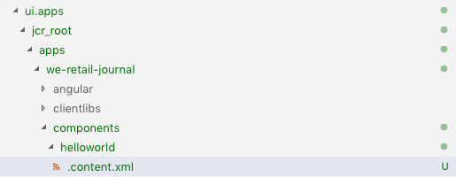

   >[!NOTE]
   >
   > To illustrate the Editable Templates feature we have purposely set the `componentGroup="Custom Components"`. In a real-world project, it is best to minimize the number of component groups, so a better group would be "[!DNL We.Retail Journal]" to match the other content components.
   >
   > Only AEM 6.5 and AEM 6.4 + **Service Pack 5** support Editable templates.

1. Next a dialog will be created to allow for a custom message to be configured for the **Hello World** component. Beneath `/apps/we-retail-journal/components/helloworld` add a node name **cq:dialog** of **nt:unstructured**.
1. The **cq:dialog** will display a single textfield that persists text to a property named **[!DNL message]**. Beneath the newly created **cq:dialog** add the following nodes and properties, represented in XML below (`helloworld/_cq_dialog/.content.xml`) :

   ```xml
   <?xml version="1.0" encoding="UTF-8"?>
   <jcr:root xmlns:sling="http://sling.apache.org/jcr/sling/1.0" xmlns:cq="http://www.day.com/jcr/cq/1.0" xmlns:jcr="http://www.jcp.org/jcr/1.0" xmlns:nt="http://www.jcp.org/jcr/nt/1.0"
       jcr:primaryType="nt:unstructured"
       jcr:title="We.Retail Journal - Hello World"
       sling:resourceType="cq/gui/components/authoring/dialog">
       <content
           jcr:primaryType="nt:unstructured"
           sling:resourceType="granite/ui/components/coral/foundation/container">
           <items jcr:primaryType="nt:unstructured">
               <tabs
                   jcr:primaryType="nt:unstructured"
                   sling:resourceType="granite/ui/components/coral/foundation/tabs"
                   maximized="{Boolean}true">
                   <items jcr:primaryType="nt:unstructured">
                       <properties
                           jcr:primaryType="nt:unstructured"
                           jcr:title="Properties"
                           sling:resourceType="granite/ui/components/coral/foundation/container"
                           margin="{Boolean}true">
                           <items jcr:primaryType="nt:unstructured">
                               <columns
                                   jcr:primaryType="nt:unstructured"
                                   sling:resourceType="granite/ui/components/coral/foundation/fixedcolumns"
                                   margin="{Boolean}true">
                                   <items jcr:primaryType="nt:unstructured">
                                       <column
                                           jcr:primaryType="nt:unstructured"
                                           sling:resourceType="granite/ui/components/coral/foundation/container">
                                           <items jcr:primaryType="nt:unstructured">
                                               <message
                                                   jcr:primaryType="nt:unstructured"
                                                   sling:resourceType="granite/ui/components/coral/foundation/form/textfield"
                                                   fieldLabel="Message"
                                                   name="./message"
                                                   required="{Boolean}true"/>
                                           </items>
                                       </column>
                                   </items>
                               </columns>
                           </items>
                       </properties>
                   </items>
               </tabs>
           </items>
       </content>
   </jcr:root>
   ```

   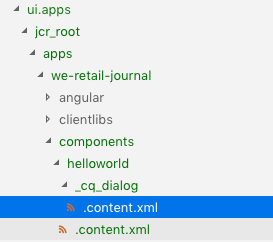

   The above XML node definition will create a dialog with a single textfield that will allow a user to enter a "message". Note the property `name="./message"` within the `<message />` node. This the name that of the property that will be stored in the JCR within AEM.

1. Next an empty policy dialog will be created (`cq:design_dialog`). The Policy dialog is needed to see the component in the Template Editor. For this simple use case it will be an empty dialog.

   Beneath `/apps/we-retail-journal/components/helloworld` add a node name `cq:design_dialog` of `nt:unstructured`.

   The configuration is represented in XML below (`helloworld/_cq_design_dialog/.content.xml`)

   ```xml

   <?xml version="1.0" encoding="UTF-8"?>
   <jcr:root xmlns:sling="http://sling.apache.org/jcr/sling/1.0" xmlns:cq="http://www.day.com/jcr/cq/1.0" xmlns:jcr="http://www.jcp.org/jcr/1.0" xmlns:nt="http://www.jcp.org/jcr/nt/1.0"
   jcr:primaryType="nt:unstructured" />

   ```

1. Deploy the code base to AEM from the command line:

   ```shell
   $ cd <src>/aem-sample-we-retail-journal/content
   $ mvn -PautoInstallPackage clean install
   ```

   In [CRXDE Lite](http://localhost:4502/crx/de/index.jsp#/apps/we-retail-journal/global/components/helloworld) validate the component has been deployed by inspecting the folder under `/apps/we-retail-journal/components:`

   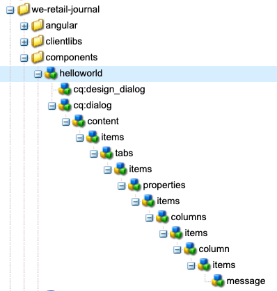

## Create Sling Model {#create-sling-model}

**Persona: AEM Developer**

Next a [!DNL Sling Model] is created to back the [!DNL Hello World] component. In a traditional WCM use case the [!DNL Sling Model] implements any business logic and a server-side rendering script (HTL) will make a call to the [!DNL Sling Model]. This keeps the rendering script relatively simple.

[!DNL Sling Models] are also used in the SPA use case to implement server-side business logic. The difference is that in the [!DNL SPA] use case, the [!DNL Sling Models] exposes it's methods as serialized JSON.

>[!NOTE]
>
>As a best practice, developers should look to use [AEM Core Components](https://docs.adobe.com/content/help/en/experience-manager-core-components/using/introduction.html) when possible. Among other features, Core Components provide [!DNL Sling Models] with JSON output that is "SPA-ready", allowing developers to focus more on front-end presentation.

1. In the editor of your choice, open the **we-retail-journal-commons** project ( `<src>/aem-sample-we-retail-journal/bundles/commons`).
1. In the package `com.adobe.cq.sample.spa.commons.impl.models`:
   * Create a new class named `HelloWorld`.
   * Add an implementing interface for `com.adobe.cq.export.json.ComponentExporter.`

   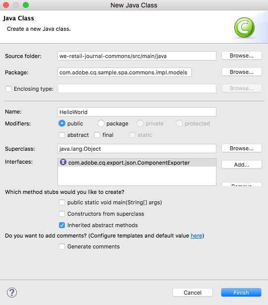

   The `ComponentExporter` interface must be implemented in order for the [!DNL Sling Model] to be compatible with AEM Content Services.

   ```java
    package com.adobe.cq.sample.spa.commons.impl.models;

    import com.adobe.cq.export.json.ComponentExporter;

    public class HelloWorld implements ComponentExporter {

        @Override
        public String getExportedType() {
            return null;
        }
    }

   ```

1. Add a static variable named `RESOURCE_TYPE` to identify the [!DNL HelloWorld] component's resource type:

   ```java
    ...
    public class HelloWorld implements ComponentExporter {

        static final String RESOURCE_TYPE = "we-retail-journal/components/helloworld";

        ...
    }
   ```

1. Add the OSGi annotations for `@Model` and `@Exporter`. The `@Model` annotation will register the class as a [!DNL Sling Model]. The `@Exporter` annotation will expose the methods as serialized JSON using the [!DNL Jackson Exporter] framework.

   ```java
   import org.apache.sling.api.SlingHttpServletRequest;
   import org.apache.sling.models.annotations.Exporter;
   import org.apache.sling.models.annotations.Model;
   import com.adobe.cq.export.json.ExporterConstants;
   ...

   @Model(
           adaptables = SlingHttpServletRequest.class,
           adapters = {ComponentExporter.class},
           resourceType = HelloWorld.RESOURCE_TYPE
   )
   @Exporter(
           name = ExporterConstants.SLING_MODEL_EXPORTER_NAME, 
           extensions = ExporterConstants.SLING_MODEL_EXTENSION
   )
   public class HelloWorld implements ComponentExporter {

   ...

   ```

1. Implement the method `getDisplayMessage()` to return the  JCR property `message`. Use the [!DNL Sling Model] annotation of `@ValueMapValue` to make it easy to retrieve the property `message` stored beneath the component. The `@Optional` annotation is important since when the component is first added to the page,  `message`  will not be populated.

   As part of the business logic, a string, "**Hello**", will be prepended to the message.

   ```java
   import org.apache.sling.models.annotations.injectorspecific.ValueMapValue;
   import org.apache.sling.models.annotations.Optional;

   ...

   public class HelloWorld implements ComponentExporter {

      static final String RESOURCE_TYPE = "we-retail-journal/components/helloworld";

      private static final String PREPEND_MSG = "Hello";

       @ValueMapValue @Optional
       private String message;

       public String getDisplayMessage() {
           if(message != null && message.length() > 0) {
               return PREPEND_MSG + " "  + message;
           }
           return null;
       }

   ...
   ```

   >[!NOTE]
   >
   > The method name `getDisplayMessage` is important. When the [!DNL Sling Model] is serialized with the [!DNL Jackson Exporter] it will be exposed as a JSON property: `displayMessage`. The [!DNL Jackson Exporter] will serialize and expose all `getter` methods that do not take a parameter (unless explicitly marked to ignore). Later in the React / Angular app we will read this property value and display it as part of the application.

   The method `getExportedType` is also important. The value of the component `resourceType` will be used to "map" the JSON data to the front-end component (Angular / React). We will explore this in the next section.

1. Implement the method `getExportedType()` to return the resource type of the `HelloWorld` component.

   ```java
    @Override
       public String getExportedType() {
           return RESOURCE_TYPE;
       }
   ```

   The full code for [**HelloWorld.java** can be found here.](https://github.com/Adobe-Marketing-Cloud/aem-guides/blob/master/spa-helloworld-guide/src/bundles/commons/HelloWorld.java)

1. Deploy the code to AEM using Apache Maven:

   ```shell
   $ cd <src>/sample-we-retail-spa-content/bundles/commons
   $ mvn -PautoInstallPackage clean install
   ```

   Verify the deployment and registration of the [!DNL Sling Model] by navigating to [[!UICONTROL Status] &gt; [!UICONTROL Sling Models]](http://localhost:4502/system/console/status-slingmodels) in the OSGi console.

   You should see that the `HelloWorld` Sling Model is bound to the `we-retail-journal/components/helloworld` Sling resource type and that it is registered as a [!DNL Sling Model Exporter Servlet]:

   ```shell
   com.adobe.cq.sample.spa.commons.impl.models.HelloWorld - we-retail-journal/components/helloworld
   com.adobe.cq.sample.spa.commons.impl.models.HelloWorld exports 'we-retail-journal/components/helloworld' with selector 'model' and extension '[Ljava.lang.String;@6480f3e5' with exporter 'jackson'
   ```

## Create React Component {#react-component}

**Persona: Front End Developer**

Next, the React component will be created. Open the **react-app** module ( `<src>/aem-sample-we-retail-journal/react-app`) using the editor of your choice.

>[!NOTE]
>
> Feel free to skip this section if you are only interested in [Angular development](#angular-component).

1. Inside the `react-app` folder navigate to its src folder. Expand the components folder to view the existing React component files.

   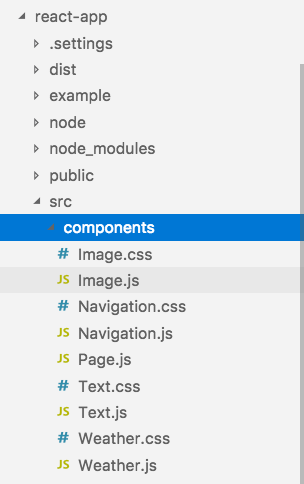

1. Add a new file beneath the components folder named `HelloWorld.js`.
1. Open `HelloWorld.js`. Add an import statement to import the React component library. Add a second import statement to import the `MapTo` helper provided by Adobe. The `MapTo` helper provides a mapping of the React component to the AEM component's JSON.

   ```js

   import React, {Component} from 'react';
   import {MapTo} from '@adobe/cq-react-editable-components';

   ```

1. Beneath the imports create a new class named `HelloWorld` that extends the React `Component` interface. Add the required `render()` method to the `HelloWorld` class.

   ```js
   import React, {Component} from 'react';
   import {MapTo} from '@adobe/cq-react-editable-components';

   class HelloWorld extends Component {

       render() {

       }
   }
   ```

1. The `MapTo` helper automatically includes an object named `cqModel` as part of the React component's props. The `cqModel` includes all properties exposed by the [!DNL Sling Model].

   Remember the [!DNL Sling Model] created earlier contains a method `getDisplayMessage()`. `getDisplayMessage()` is translated as a JSON key named `displayMessage` when output.

   Implement the `render()` method to output an `h1` tag that contains the value of `displayMessage`. [JSX](https://reactjs.org/docs/introducing-jsx.html), a syntax extension to JavaScript, is used to return the final markup of the component.

   ```js
   ...

   class HelloWorld extends Component {
       render() {

           if(this.props.displayMessage) {
               return (
                   <div className="cmp-helloworld">
                       <h1 className="cmp-helloworld_message">{this.props.displayMessage}</h1>
                   </div>
               );
           }
           return null;
       }
   }

   ```

1. Implement an edit configuration method. This method is passed via the `MapTo` helper and provides the AEM editor with information to display a placeholder in the case the component is empty. This occurs when the component is added to the SPA but has not yet been authored. Add the following below the `HelloWorld` class:

   ```js
   ...

   class HelloWorld extends Component {
       ...
   }

   const HelloWorldEditConfig = {

       emptyLabel: 'Hello World',

       isEmpty: function(props) {
           return !props || !props.displayMessage || props.displayMessage.trim().length < 1;
       }
   };

   ...
   ```

1. At the end of the file, call the `MapTo` helper, passing the `HelloWorld` class and the `HelloWorldEditConfig`. This will map the React Component to the AEM component based on the AEM Component's resource type: `we-retail-journal/components/helloworld`.

   ```js
   MapTo('we-retail-journal/components/helloworld')(HelloWorld, HelloWorldEditConfig);
   ```

   The completed code for [**HelloWorld.js** can be found here.](https://github.com/Adobe-Marketing-Cloud/aem-guides/blob/master/spa-helloworld-guide/src/react-app/components/HelloWorld.js)

1. Open the file `ImportComponents.js`. It can found at `<src>/aem-sample-we-retail-journal/react-app/src/ImportComponents.js`.

   Add a line to require the `HelloWorld.js` with the other components in the compiled JavaScript bundle:

   ```js
   ...
     require('./components/Text');
     require('./components/Image');
     require('./components/HelloWorld');
   ...
   ```

1. In the  `components`  folder create a new file named `HelloWorld.css` as a sibling of `HelloWorld.js.` Populate the file with the following to create some basic styling for the `HelloWorld` component:

   ```css
   /* HelloWorld.css to style HelloWorld component */

   .cmp-helloworld_message {
       text-align: center;
       color: #ff505e;
       text-transform: unset;
       letter-spacing: unset;
   }
   ```

1. Re-open `HelloWorld.js` and update below the import statements to require `HelloWorld.css`:

   ```js
   import React, {Component} from 'react';
   import {MapTo} from '@adobe/cq-react-editable-components';

   require('./HelloWorld.css');

   ...
   ```

1. Deploy the code to AEM using Apache Maven:

   ```shell

   $ cd <src>/sample-we-retail-spa-content
   $ mvn -PautoInstallSinglePackage clean install

   ```

1. In [CRXDE-Lite](http://localhost:4502/crx/de/index.jsp#/apps/we-retail-journal/react/clientlibs/we-retail-journal-react/js/app.js) open `/apps/we-retail-journal/react/clientlibs/we-retail-journal-react/js/app.js`. Perform a quick search for HelloWorld in app.js to verify the React component has been included in the compiled app.

   >[!NOTE]
   >
   > **app.js** is the bundled React app. The code is no longer human readable. The `npm run build` command has triggered an optimized build that outputs compiled JavaScript that can be interpreted by modern browsers.


## Create Angular Component {#angular-component}

**Persona: Front End Developer**

>[!NOTE]
>
> Feel free to skip this section if you are only interested in React development.

Next, the Angular component will be created. Open the **angular-app** module (`<src>/aem-sample-we-retail-journal/angular-app`) using the editor of your choice.

1. Inside the `angular-app` folder navigate to its `src` folder. Expand the components folder to view the existing Angular component files.

   

1. Add a new folder beneath the components folder named `helloworld`. Beneath the `helloworld` folder add new files named `helloworld.component.css, helloworld.component.html, helloworld.component.ts`.

   ```plain

   /angular-app
       /src
           /app
               /components
   +                /helloworld
   +                    helloworld.component.css
   +                    helloworld.component.html
   +                    helloworld.component.ts

   ```

1. Open `helloworld.component.ts`. Add an import statement to import the Angular `Component` and `Input` classes. Create a new component, pointing the `styleUrls` and `templateUrl` to `helloworld.component.css` and `helloworld.component.html`. Lastly export the class `HelloWorldComponent` with the expected input of `displayMessage`.

   ```js
   //helloworld.component.ts

   import { Component, Input } from '@angular/core';

   @Component({
     selector: 'app-helloworld',
     host: { 'class': 'cmp-helloworld' },
     styleUrls:['./helloworld.component.css'],
     templateUrl: './helloworld.component.html',
   })

   export class HelloWorldComponent {
     @Input() displayMessage: string;
   }

   ```

   >[!NOTE]
   >
   > If you recall the [!DNL Sling Model] created earlier, there was a method **getDisplayMessage()**. The serialized JSON of this method will be **displayMessage**, which we are now reading in the Angular app.

1. Open `helloworld.component.html` to include an `h1` tag that will print the `displayMessage` property:

   ```html

   <h1 *ngIf="displayMessage" class="cmp-helloworld_message">
       {{displayMessage}}
   </h1>

   ```

1. Update `helloworld.component.css` to include some basic styles for the component.

   ```css

   :host-context {
       display: block;
   };

   .cmp-helloworld {
       display:block;
   }
   .cmp-helloworld_message {
       text-align: center;
       color: #ff505e;
       text-transform: unset;
       letter-spacing: unset;
   }

   ```

1. Update `helloworld.component.spec.ts` with the following test bed:

   ```js
   import { async, ComponentFixture, TestBed } from '@angular/core/testing';

   import { HelloWorldComponent } from './helloworld.component';

       describe('HelloWorld', () => {
       let component: HelloWorldComponent;
       let fixture: ComponentFixture<HelloWorldComponent>;

       beforeEach(async(() => {
           TestBed.configureTestingModule({
           declarations: [ HelloWorldComponent ]
           })
           .compileComponents();
       }));

       beforeEach(() => {
           fixture = TestBed.createComponent(HelloWorldComponent);
           component = fixture.componentInstance;
           fixture.detectChanges();
       });

       it('should create', () => {
           expect(component).toBeTruthy();
       });
   });
   ```

1. Next update `src/components/mapping.ts` to include the `HelloWorldComponent`. Add a `HelloWorldEditConfig` that will mark the placeholder in the AEM editor before the component has been configured. Lastly add a line to map the AEM component to the Angular component with the `MapTo` helper.

   ```js
   // src/components/mapping.ts

   import { HelloWorldComponent } from "./helloworld/helloworld.component";

   ...

   const HelloWorldEditConfig = {

       emptyLabel: 'Hello World',

       isEmpty: function(props) {
           return !props || !props.displayMessage || props.displayMessage.trim().length < 1;
       }
   };

   ...

   MapTo('we-retail-journal/components/helloworld')(HelloWorldComponent, HelloWorldEditConfig);

   ```

   The full code for [**mapping.ts** can be found here.](https://github.com/Adobe-Marketing-Cloud/aem-guides/blob/master/spa-helloworld-guide/src/angular-app/mapping.ts)

1. Update `src/app.module.ts` to update the **NgModule**. Add the **`HelloWorldComponent`** as a **declaration** that belongs to the **AppModule**. Also add the `HelloWorldComponent` as an **entryComponent** so that it is compiled and dynamically included in the app as the JSON model is processed.

   ```js

   import { HelloWorldComponent } from './components/helloworld/helloworld.component';

   ...

   @NgModule({
     imports: [BrowserModule.withServerTransition({ appId: 'we-retail-sample-angular' }),
       SpaAngularEditableComponentsModule,
     AngularWeatherWidgetModule.forRoot({
       key: "37375c33ca925949d7ba331e52da661a",
       name: WeatherApiName.OPEN_WEATHER_MAP,
       baseUrl: 'http://api.openweathermap.org/data/2.5'
     }),
       AppRoutingModule,
       BrowserTransferStateModule],
     providers: [ModelManagerService,
       { provide: APP_BASE_HREF, useValue: '/' }],
     declarations: [AppComponent,
       TextComponent,
       ImageComponent,
       WeatherComponent,
       NavigationComponent,
       MenuComponent,
       MainContentComponent,
       HelloWorldComponent],
     entryComponents: [TextComponent,
       ImageComponent,
       WeatherComponent,
       NavigationComponent,
       MainContentComponent,
       HelloWorldComponent],
     bootstrap: [AppComponent]
    })

   ```

   The completed code for [**app.module.ts** can be found here.](https://github.com/Adobe-Marketing-Cloud/aem-guides/blob/master/spa-helloworld-guide/src/angular-app/app.module.ts)

1. Deploy the code to AEM using Maven:

   ```shell

   $ cd <src>/sample-we-retail-spa-content
   $ mvn -PautoInstallSinglePackage clean install

   ```

1. In [CRXDE-Lite](http://localhost:4502/crx/de/index.jsp#/apps/we-retail-journal/angular/clientlibs/we-retail-journal-angular/js/main.js) open `/apps/we-retail-journal/angular/clientlibs/we-retail-journal-angular/js/main.js`. Perform a quick search for **HelloWorld** in `main.js` to verify the Angular component has been included.

   >[!NOTE]
   >
   > **main.js** is the bundled Angular app. The code is no longer human readable. The npm run build command has triggered an optimized build that outputs compiled JavaScript that can be interpreted by modern browsers.

## Updating the Template {#template-update}

1. Navigate to the Editable Template for the React and/or Angular versions:

   * (Angular) [http://localhost:4502/editor.html/conf/we-retail-journal/angular/settings/wcm/templates/we-retail-angular-weather-template/structure.html](http://localhost:4502/editor.html/conf/we-retail-journal/angular/settings/wcm/templates/we-retail-angular-weather-template/structure.html)
   * (React) [http://localhost:4502/editor.html/conf/we-retail-journal/react/settings/wcm/templates/we-retail-react-weather-template/structure.html](http://localhost:4502/editor.html/conf/we-retail-journal/react/settings/wcm/templates/we-retail-react-weather-template/structure.html)

1. Select the main [!UICONTROL Layout Container] and select the [!UICONTROL Policy] icon to open its policy:

   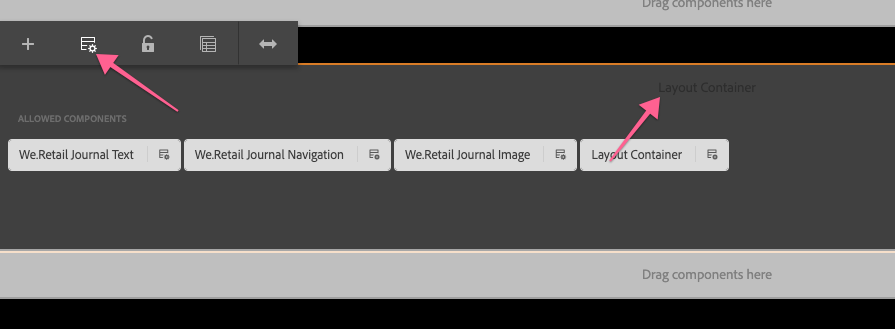

   Under **[!UICONTROL Properties]** > **[!UICONTROL Allowed Components]**, perform a search for **[!DNL Custom Components]**. You should see the **[!DNL Hello World]** component, select it. Save your changes by clicking the checkbox in the upper-right-hand corner.

   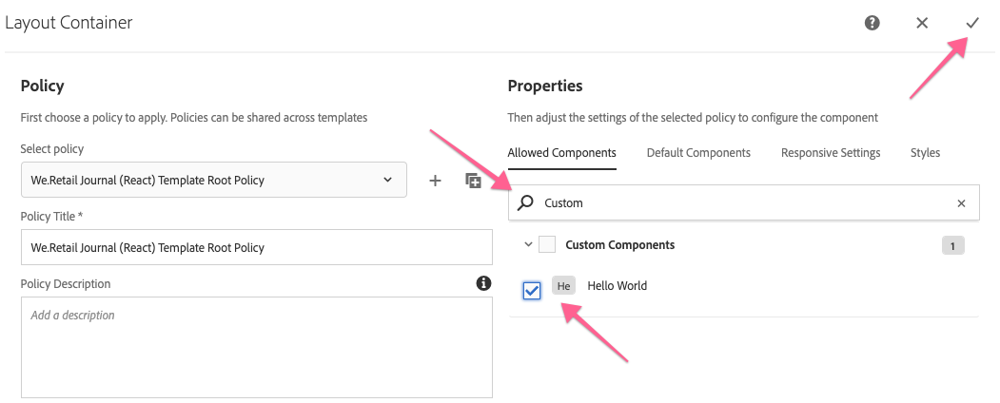

1. After saving, you should see the **[!DNL HelloWorld]** component as an allowed component in the [!UICONTROL Layout Container].

   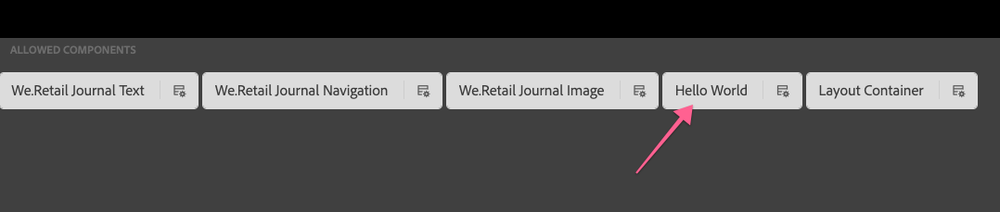

   >[!NOTE]
   >
   > Only AEM 6.5 and AEM 6.4.5 supports the Editable Template feature of the SPA Editor. If using AEM 6.4, you will need to manually configure the policy for Allowed Components via CRXDE Lite: `/conf/we-retail-journal/react/settings/wcm/policies/wcm/foundation/components/responsivegrid/default` or `/conf/we-retail-journal/angular/settings/wcm/policies/wcm/foundation/components/responsivegrid/default`

   CRXDE Lite showing the updated policy configurations for [!UICONTROL Allowed Components] in the [!UICONTROL Layout Container]:

   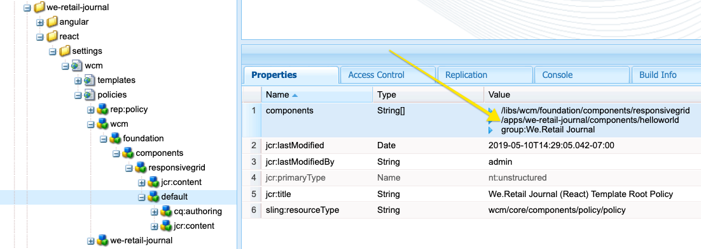

## Putting it all together {#putting-together}

1. Navigate to either the Angular or React pages:

   * [http://localhost:4502/editor.html/content/we-retail-journal/react/en/home.html](http://localhost:4502/editor.html/content/we-retail-journal/react/en/home.html)
   * [http://localhost:4502/editor.html/content/we-retail-journal/angular/en/home.html](http://localhost:4502/editor.html/content/we-retail-journal/angular/en/home.html)

1. Find the **[!DNL Hello World]** component and drag and drop the **[!DNL Hello World]** component on to the page.

   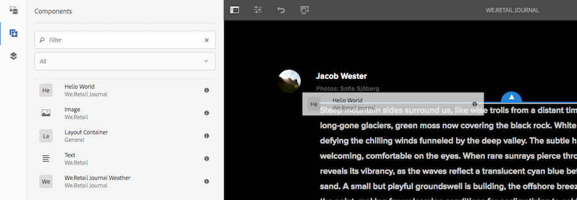

   The placeholder should appear.

   

1. Select the component and add a message in the dialog, i.e "World" or "Your Name". Save the changes.

   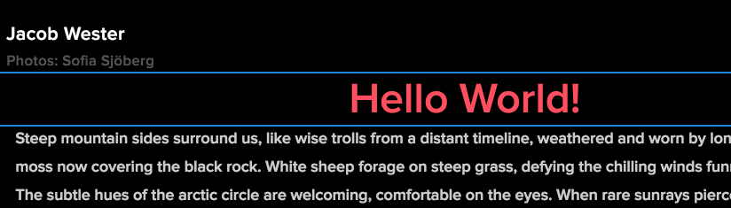

   Note that the string "Hello " is always prepended to the message. This is a result of the logic in the `HelloWorld.java` [!DNL Sling Model].

## Next Steps {#next-steps}

[Completed Solution for HelloWorld component](assets/spa-editor-helloworld-tutorial-use/aem-sample-we-retail-journal-HelloWorldSolution.zip)

* Full source code for [[!DNL We.Retail Journal] on GitHub](https://github.com/adobe/aem-sample-we-retail-journal)
* Check out a more in-depth tutorial on developing React with [[!DNL Getting Started with the AEM SPA Editor - WKND Tutorial]](https://helpx.adobe.com/experience-manager/kt/sites/using/getting-started-spa-wknd-tutorial-develop.html)

## Troubleshooting {#troubleshooting}

### Unable to build project in Eclipse {#unable-to-build-project-in-eclipse}

**Error:** An error when importing the [!DNL We.Retail Journal] project into Eclipse for unrecognized goal executions: 

`Execution npm install, Execution npm run build, Execution default-analyze-classes*`

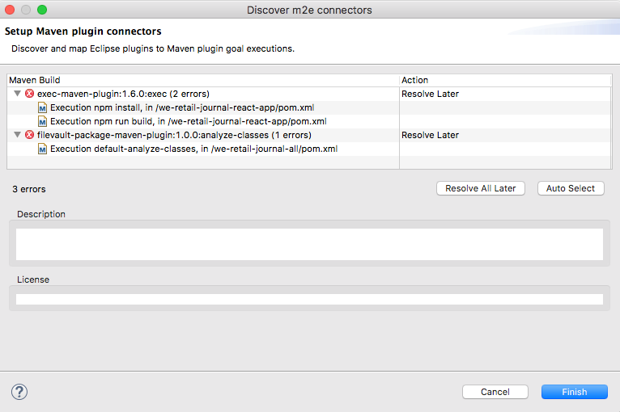

**Resolution**: Click Finish to resolve these later. This should not prevent the completion of the tutorial.

**Error**: The React module, `react-app`, does not build successfully during a Maven build.

**Resolution:** Try deleting the `node_modules` folder beneath the **react-app**. Re-run the Apache Maven command `mvn  clean install -PautoInstallSinglePackage` from the root of the project.

### Unsatisfied dependencies in AEM {#unsatisfied-dependencies-in-aem}

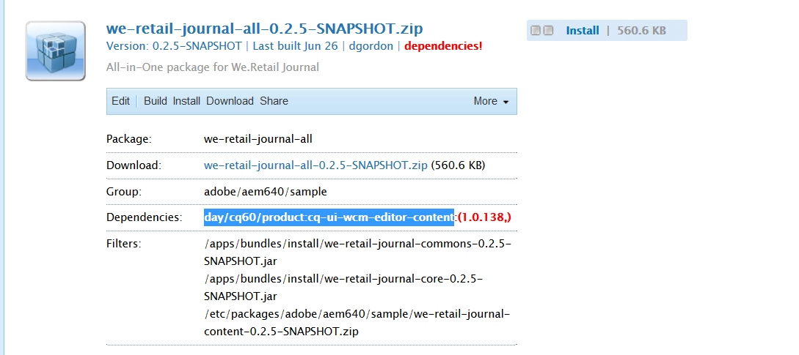

If an AEM dependency is not satisfied, in either the **[!UICONTROL AEM Package Manager]** or in the **[!UICONTROL AEM Web Console]** (Felix Console), this indicates that SPA Editor Feature is not available.

### Component doesn't display

**Error**: Even after a successful deployment and verifying that the compiled versions of React/Angular apps have the updated `helloworld` component my component is not displayed when I drag it on to the page. I can see the component in the AEM UI.

**Resolution**: Clear your Browser's history/cache and/or open a new browser or use incognito mode. If that doesn't work, invalidate the client library cache on the local AEM instance. AEM attempts to cache large clientlibraries in order to be efficient. Sometimes manually invalidating the cache is needed to fix issues where out-dated code is cached.

Navigate to: [http://localhost:4502/libs/granite/ui/content/dumplibs.rebuild.html](http://localhost:4502/libs/granite/ui/content/dumplibs.rebuild.html) and click Invalidate Cache. Return to your React/Angular page and refresh the page.

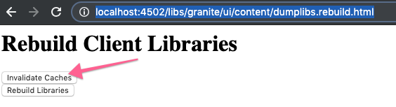
