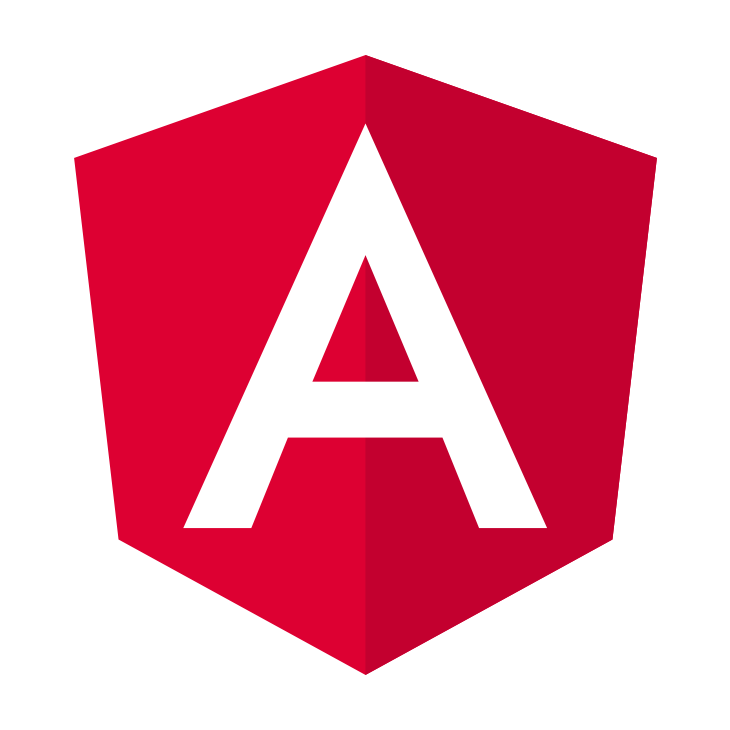

# Getting Started with Angular and AEM SPA Editor{#getting-started-with-angular-and-aem-spa-editor}

## WKND Events for Angular and AEM SPA Editor {#wknd-events-for-angular-and-aem-spa-editor}

This tutorial builds single-page application (SPA) experience for a fictional company WKND Events, using [AEM SPA Editor](http://helpx.adobe.com/experience-manager/6-4/sites/developing/using/spa-overview.html) and the [Angular framework](https://angular.io/).

The focus of this tutorial explains how AEM SPA Editor and its supporting functionalities, support the creation of Angular application in an unobtrusive manner. This tutorial explores best practices and strategies for accelerating front-end development and decreasing the developer's dependency on AEM.

## Table of contents {#table-of-contents}

* [Introduction](angular.md)
* [Chapter 0 - Setting up the tutorial](chapter-0.md) 
* [Chapter 1 - Bootstrapping the Angular application](chapter-1.md)
* [Chapter 2 - Setting up Angular routes and page resolution](chapter-2.md)   
* [Chapter 3 - Mapping AEM content to Angular components](chapter-3.md) 
* [Chapter 4 - Setting up the Angular development environment](chapter-4.md) 
* [Chapter 5 - Setting up the Styles](chapter-5.md)
* [Chapter 6 - Building new and styling existing Angular components for AEM](chapter-6.md)
* [Chapter 7 - Layouting with AEM Responsive Grid](chapter-7.md)  
* [Chapter 8 - Multi-page navigation with the List component](chapter-8.md)

## Tutorial overview {#tutorial-overview}

>[!VIDEO](https://video.tv.adobe.com/v/25755/?quality=12)

*An abridged overview of the Getting Started with Angular and AEM SPA Editor tutorial.*

## Github.com and the source code {#github-com-and-the-source-code}

All the source code and configuration created and used in this [project is available on Github.com](https://github.com/Adobe-Marketing-Cloud/aem-guides-wknd-events).

The end-state of each chapter is available via [branches](https://github.com/Adobe-Marketing-Cloud/aem-guides-wknd-events/branches) in the Github repository as well as in a single, easy to [download  ZIP  file](https://github.com/Adobe-Marketing-Cloud/aem-guides-wknd-events/releases).

*Note that this project houses a sister project that addresses React development. Please make sure to use branches and release files denoted as **angular**.*

* [https://github.com/Adobe-Marketing-Cloud/aem-guides-wknd-events](https://github.com/Adobe-Marketing-Cloud/aem-guides-wknd-events)

### Downloads {#downloads}

* [Download the Angular WKND Events chapter solution projects](https://github.com/Adobe-Marketing-Cloud/aem-guides-wknd-events/releases/latest)

## Local development environment {#local-dev-env}

A local development environment is necessary to complete this tutorial. Screenshots and video are captured from a Mac OS environment but the commands and code used should be independent of the local operating system, unless otherwise noted.

**New to AEM? **Check out the [following guide to setting up a local development environment.](https://helpx.adobe.com/experience-manager/kt/platform-repository/using/local-aem-dev-environment-article-setup.html)

### Required software {#required-software}

The following should be installed:

*  [AEM 6.4 + SP2](https://helpx.adobe.com/experience-manager/6-4/release-notes/sp-release-notes.html)

*   [Java 1.8](https://www.oracle.com/technetwork/java/javase/downloads/jdk8-downloads-2133151.html)

* [Apache Maven](https://maven.apache.org/) (3.3.9 or newer)  

* [Node.js v10+](https://nodejs.org/en/)
* [  npm  6+](https://www.npmjs.com/)

Start by double checking that the above tools have been installed and available via the command line path. Open up a new terminal and run the following commands:

### Integrated Development Environment (IDE) {#integrated-development-environment-ide}

This tutorial uses [Visual Studio Code](https://code.visualstudio.com/) as the IDE, however any IDE that has support for Angular, Java and Maven projects can be used. The reliance on specific IDE features in this tutorial is minimal.

For detailed steps for using Visual Studio Code for [local development with AEM check out the following guide](https://helpx.adobe.com/experience-manager/kt/platform-repository/using/local-aem-dev-environment-article-setup.html).

## Next steps {#next-steps}

Start the tutorial!

* [Chapter 0 - Setting up the tutorial](chapter-0.md)

## Want to skip to the end? {#want-to-skip-to-the-end}

Install the final AEM packages on AEM 6.4 SP2:

1. Download the following ZIP files from [the latest Github release for [Angular] WKND Events](https://github.com/Adobe-Marketing-Cloud/aem-guides-wknd-events/releases).

    * aem -guides-wknd-events.ui.apps-0.0.1-SNAPSHOT.zip
    * aem -guides-wknd-events.ui.content-0.0.1-SNAPSHOT.zip

2. Navigate to AEM Package Manager `crx/packmgr/index.jsp`
3. Upload and install both AEM packages via AEM Package Manager
4. Navigate to AEM &gt; Sites &gt; WKND Events &gt; Angular &gt; Home `/sites.html/content/wknd-events/angular/home` and explore the SPA Editor experience!

## Help! {#help}

If you get stuck or have additional questions make sure to check out the [Experience League forums for AEM](https://forums.adobe.com/community/experience-cloud/marketing-cloud/experience-manager) or view existing [GitHub issues](https://github.com/Adobe-Marketing-Cloud/aem-guides-wknd-events/issues).

Didn't find what you were looking for? Think you found an error? Please file a [GitHub issue for the WKND Events project](https://github.com/Adobe-Marketing-Cloud/aem-guides-wknd-events/issues).

Pull requests resolving specific issues (rather than adding or changing functionality) are welcome!
