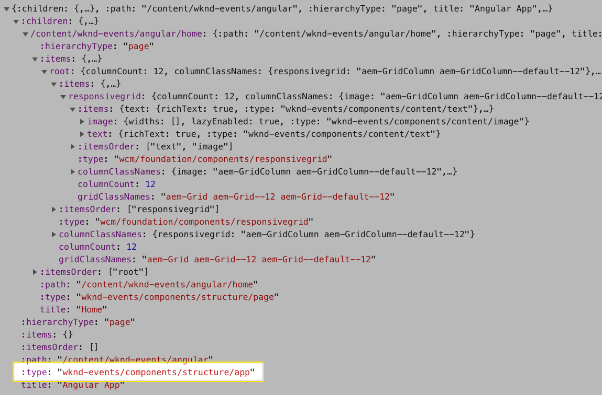
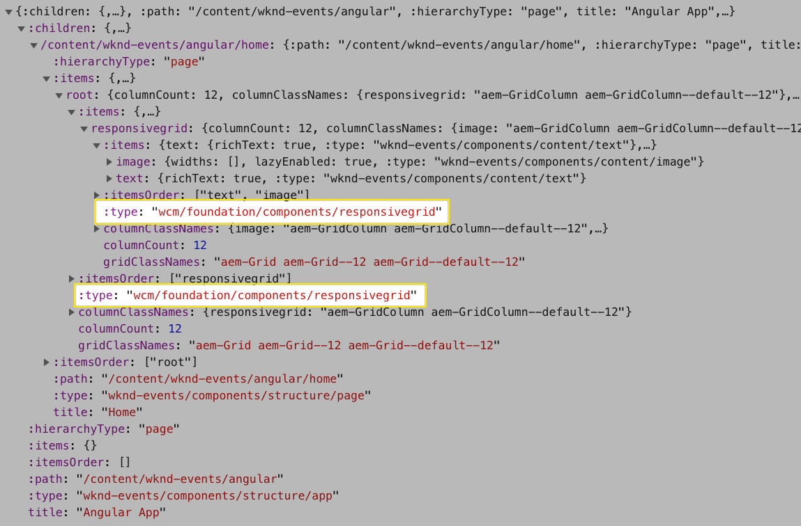
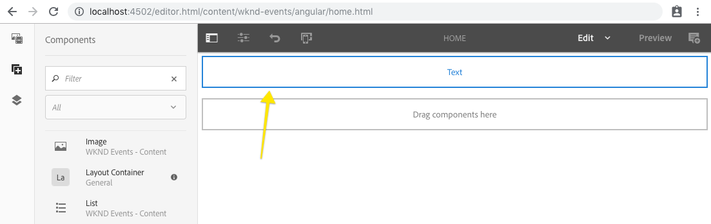
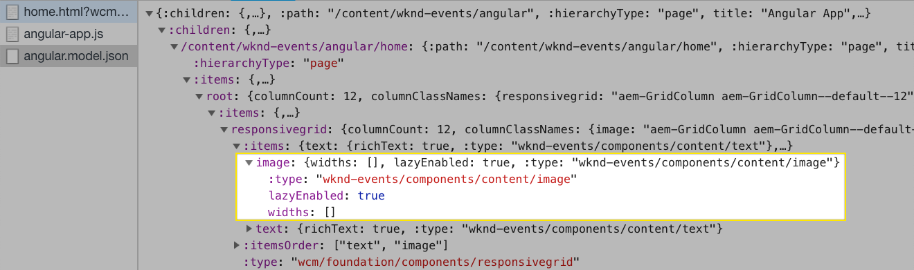
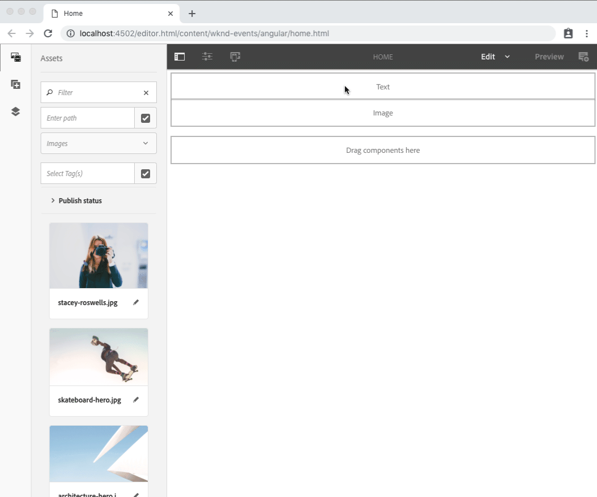
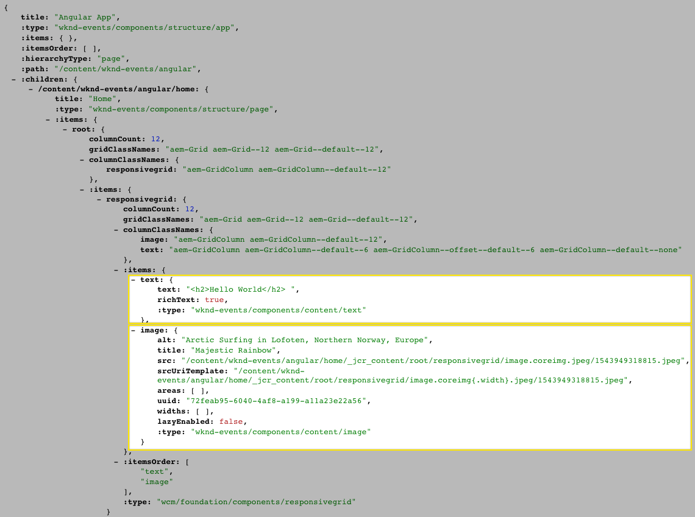
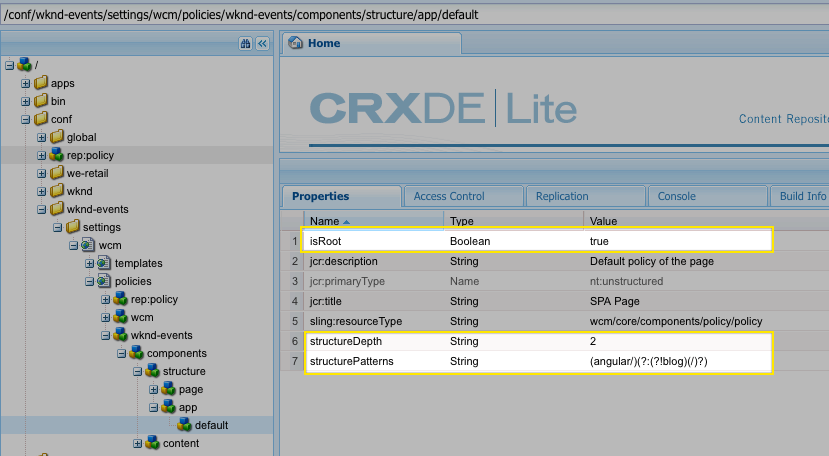

# Getting Started with Angular and AEM SPA Editor - Chapter 3{#getting-started-with-angular-and-aem-spa-editor-chapter}

## Mapping AEM content to Angular components {#mapping-aem-content-to-angular-components}

Now that the Angular app is loading the JSON representation of the page, the JSON objects must be mapped to Angular components for rendering.

This chapter explores two types of components in the mapping and resolution: Container components and Content components.

Container components are components that accept JSON structures which represent ***other*** components and dynamically instantiate them. Content components simply render content in some predefined manner.

This chapter does not focus on styling so the experience at the end of this chapter is unstyled. Applying styles is tackled in [Chapter 5](chapter-5.md).

## Mapping the AEM container components {#mapping-the-aem-container-components}

Persona: Angular Developer

First, two Angular components provided by the SPA Editor JavaScript SDK's must be mapped to resource types exposed in the JSON data. These mappings facilitate walking the JSON object provided by AEM Content Services and instantiating Angular components that are driven by their data.

1. The WKND Events Angular App page's resource type must be mapped to an Angular component. This resource type can be found by making an HTTP GET to the JSON entry point for the app,** /content/wknd-events/angular.model.json**.

   

   HTTP GET /content/wknd-events/angular.model.json

   The ** : type ** of the first JSON object that represents the root resources in AEM is **wknd-events/components/structure/app. **This resource type needs to be mapped to the [AEMContainerComponent](https://www.npmjs.com/package/@adobe/cq-angular-editable-components#class-aemcontainercomponent) Angular component provided by [@adobe/  cq -angular-editable-components](https://www.npmjs.com/package/@adobe/cq-angular-editable-components).** 
   **

   In the IDE, open **aem-guides-wknd-events/angular-app/src/app/components/app.component.ts**.

   ```
   import { Component } from '@angular/core';
   import { ModelManager, Constants } from '@adobe/cq-spa-page-model-manager';
   import { AEMContainerComponent, MapTo } from '@adobe/cq-angular-editable-components';
   
   @Component({
     selector: 'app-root',
     templateUrl: './app.component.html',
     styleUrls: ['./app.component.scss']
   })
   export class AppComponent {
     constructor() {
       ModelManager.initialize();
     }
   }
   
   MapTo('wknd-events/components/structure/app')(AEMContainerComponent);
   ```

   **Line 3** imports MapTo and [AEMContainerC](https://www.npmjs.com/package/@adobe/cq-angular-editable-components#class-aemcontainercomponent) [](https://www.npmjs.com/package/@adobe/cq-angular-editable-components#class-aemcontainercomponent) [omponent](https://www.npmjs.com/package/@adobe/cq-angular-editable-components#class-aemcontainercomponent) from [@adobe/cq-angular-editable-components](https://www.npmjs.com/package/@adobe/cq-angular-editable-components).  
   **Line 16** maps resource type of the WKND Events Angular App page type (wknd-events/components/structure/app) to the provided [AEMContainerComponent](https://www.npmjs.com/package/@adobe/cq-angular-editable-components#class-aemcontainercomponent) Angular component.

1. Similarly, AEM's Responsive Grid resource type **wcm/foundation/components/responsivegrid** is mapped to a provided Angular component.

   

   HTTP GET /content/wknd-events/angular.model.json

   This mapping allows any use of AEM's Responsive Grid to properly resolve and work as expected in Layout Mode in AEM's SPA Editor authoring experience, assuming the [AEM Responsive Grid CSS](https://adobe-marketing-cloud.github.io/aem-responsivegrid/) is loaded. Add this mapping to **app.component.ts**.

   ```
   import { Component } from '@angular/core';
   import { ModelManager, Constants } from '@adobe/cq-spa-page-model-manager';
   import { AEMResponsiveGridComponent, AEMContainerComponent, MapTo } from '@adobe/cq-angular-editable-components';
   
   @Component({
     selector: 'app-root',
     templateUrl: './app.component.html',
     styleUrls: ['./app.component.scss']
   })
   export class AppComponent {
     constructor() {
       ModelManager.initialize();
     }
   }
   
   MapTo('wknd-events/components/structure/app')(AEMContainerComponent);
   MapTo('wcm/foundation/components/responsivegrid')(AEMResponsiveGridComponent);
   ```

   **Line 3** imports [AEMResponsiveGridComponent](https://www.npmjs.com/package/@adobe/cq-angular-editable-components#aemresponsivegridcomponent.md) from [@adobe/cq-angular-editable-components](https://www.npmjs.com/package/@adobe/cq-angular-editable-components)**.**

   **Line 17** maps the well-known AEM Responsive Grid (or the Layout Container component in AEM) resource type to the provided [AEMResponsiveGridComponent](https://www.npmjs.com/package/@adobe/cq-angular-editable-components#aemresponsivegridcomponent.md) Angular component.

## Creating the Text component {#creating-the-text-component}

Persona: Angular Developer

The Text component is a "content component", and simply renders the the contnet defined by the author in AEM.

1. Create a new Text component by running the Angular CLI **ng generate component** command from within **wknd-events/angular-app**.

   ```shell
   $ ng generate component components/text
   ```

1. In the IDE, open **wknd-events/angular-app/src/app/components/text/text.component.ts **to see the generated stub of the Angular Text component.

   ```
   import { Component, OnInit } from '@angular/core';
   
   @Component({
     selector: 'app-text',
     templateUrl: './text.component.html',
     styleUrls: ['./text.component.scss']
   })
   export class TextComponent implements OnInit {
   
     constructor() { }
   
     ngOnInit() { }
   }
   
   ```

1. Next, we have to map the JSON fields exposed by the AEM WCM Core Components' Text component to this Angular component. In order to understand what fields are available, the Core Components' Text component's documentation or the JSON rendition of a text component added to an AEM page is reviewed.

    * [Core Components' Text component output](https://docs.adobe.com/content/help/en/experience-manager-core-components/using/components/text.html#sample-component-output)

1. Map the fields exposed by the JSON to the Angular component [@Inputs](https://angular.io/api/core/Input), so these values are available to the Angular component and its template. Some simple logic is required to expose the authored text value depending on if its rich text (raw HTML) or plain text, using Angular's [DomSanitizer](https://angular.io/api/platform-browser/DomSanitizer). [](https://angular.io/api/core/Input)

   ```
   import {Component, Input, OnInit} from '@angular/core';
   import {DomSanitizer} from '@angular/platform-browser';
   
   @Component({
     selector: 'app-text',
     templateUrl: './text.component.html',
     styleUrls: ['./text.component.scss']
   })
   export class TextComponent implements OnInit {
     @Input() richText: boolean;
     @Input() text: string;
   
     constructor(private sanitizer: DomSanitizer) {}
   
     get content() {
       const textValue = this.text || '';
       if (this.richText) {
         return this.sanitizer.bypassSecurityTrustHtml(textValue);
       } else {
         return textValue;
       }
     }
   
     ngOnInit() {}
   }
   ```

   **Line 1** imports Angular's [@Input](https://angular.io/api/core/Input) decorator.  
   **Line 2** imports Angular's [DomSanitizer](https://angular.io/api/platform-browser/DomSanitizer), which is used to output raw HTML.  
   **Lines 10-11** declare Input fields who values are set via the mapped JSON object.  
   **Line 13** passes the [DomSanitizer](https://angular.io/api/platform-browser/DomSanitizer) into the Component constructor to use in the class.  
   **Line 15-22** implements a method that exposes the authored text content, bypassing Angular's built-in security as needed. Note that the the text value is "scrubbed" to empty, in the event it's undefined.

1. In order to map the JSON data to these newly added Input fields, the TextComponent must be registered against the** :type** as it appears in the JSON. As seen in **Step 1** above, we must map **wknd-events/components/content/text** to the Angular **TextComponent**. For this **MapTo,** provided by **@adobe/cq-angular-editable-components, **is used.

   ```
   import {Component, Input, OnInit} from '@angular/core';
   import {DomSanitizer} from '@angular/platform-browser';
   import {MapTo} from '@adobe/cq-angular-editable-components';
   
   @Component({
     selector: 'app-text',
     templateUrl: './text.component.html',
     styleUrls: ['./text.component.scss']
   })
   export class TextComponent implements OnInit {
     @Input() richText: boolean;
     @Input() text: string;
   
     constructor(private sanitizer: DomSanitizer) {}
   
      get content() {
       const textValue = this.text || '';
   
       if (this.richText) {
         return this.sanitizer.bypassSecurityTrustHtml(textValue);
       } else {
         return textValue;
       }
     }
   
     ngOnInit() {}
   }
   
   MapTo('wknd-events/components/content/text')(TextComponent);
   ```

   **Line 3** adds the import for MapTo.  
   **Line 29** uses MapTo to map the value **wknd-events/components/content/text** (via the **:type** field in the JSON) to the **TextComponent**.

   Now, whenever this Angular app encounters a JSON object     with      ** :       type ** set to **wknd-events/components/content/text**, it knows to instantiate an **TextComponent** and inject the JSON data to the matching **@Input** fields.

1. The last addition to **text.component.ts** is the **EditConfig** placeholder configuration. The EditConfig is responsible for determining if AEM's SPA Page Editor's placeholder block should be dispayed, or if the Component's view (see Step 7) should be used.

   ```
   import {Component, Input, OnInit} from '@angular/core';
   import {DomSanitizer} from '@angular/platform-browser';
   import {MapTo} from '@adobe/cq-angular-editable-components';
   
   @Component({
     selector: 'app-text',
     templateUrl: './text.component.html',
     styleUrls: ['./text.component.scss']
   })
   export class TextComponent implements OnInit {
     @Input() richText: boolean;
     @Input() text: string;
   
     constructor(private sanitizer: DomSanitizer) {}
   
     get content() {
       const textValue = this.text || '';
   
       if (this.richText) {
         return this.sanitizer.bypassSecurityTrustHtml(textValue);
       } else {
         return textValue;
       }
     }
   
     ngOnInit() {}
   }
   
   const TextEditConfig = {
     emptyLabel: 'Text',
   
     isEmpty: function(componentData) {
       return !componentData || !componentData.text || componentData.text.trim().length < 1;
     }
   };
   
   MapTo('wknd-events/components/content/text')(TextComponent, TextEditConfig);
   ```

   **Line 29** defines the EditConfig object for the TextComponent.

   **Line 30** sets the `  emptyLabel` which is the test that displays in the center of the component placeholder indicating to the author what type of component it represents.

   **Lines 32-34** defines the isEmpty method which is invoked by the SPA Editor to determine if the placeholder should be rendered during authoring. `isEmpty(..)` is passed in JSON object from AEM Content Services that represents this component instance.

   Note that even if `isEmpty(..)` returns true, the component template will still render beneath the placeholder, thus it is important to ensure the template does not render when it is unconfigured. For example, without scrubbing this.text to the empty string on **Line 18**, text.component.html renders the string "undefined" under the placeholder when no text has been authored.

   **Line 37** adds the TextEditConfig as the 2nd parameter to MapTo, registering this EditConfig object as the handler for this TextComponent.

   

   Text component placeholder powered by the TextEditConfig

1. Add the HTML to render via the **text.component.html,** leveraging the TextComponent's fields.

   ```xml
   <div [innerHTML]="content"></div>
   ```

   Note `[innerHTML]` is required in this case since the text to display may be raw HTML, depending on the **richText** flag.

1. Open **image.component.scss **and update it as follows:

   ```css
   :host-context {
     display: block;
   }
   ```

   This allows the component's placeholder view to properly display in the authoring experience.

1. Because the **TextComponent** is not explicitly included, but rather dynamically via AEMResponsiveGridComponent, it must be listed in the **app.module.ts**' ** [entryComponents](https://angular.io/guide/entry-components)** array.

   ```
   import { BrowserModule } from '@angular/platform-browser';
   import { NgModule } from '@angular/core';
   import { SpaAngularEditableComponentsModule } from '@adobe/cq-angular-editable-components';
   import { AppRoutingModule } from './app-routing.module';
   import { AppComponent } from './app.component';
   import { PageComponent } from './components/page/page.component';
   import { TextComponent } from './components/text/text.component';
   
   @NgModule({
     declarations: [
       AppComponent,
       PageComponent,
       TextComponent
     ],
     imports: [
       BrowserModule,
       AppRoutingModule,
       SpaAngularEditableComponentsModule
     ],
     providers: [],
     bootstrap: [AppComponent],
     entryComponents: [TextComponent]
   })
   export class AppModule { }
   ```

   **Line 7** imports the newly created TextComponent.

   **Line 22** declares the [entryComponents](https://angular.io/guide/entry-components) array and add the TextComponent.

Now, whenever this Angular application encounters a JSON object     with      ** :       type ** set to **wknd-events/components/content/text**, it knows to instantiate an **TextComponent** and inject the JSON data to the matching **@Input** fields.

## Creating the Image component {#creating-the-image-component}

Persona: Angular Developer

The second mapping will be mapping the Core Component's Image component's JSON to a new Angular Image component.

As seen in in the **angular.model.json**, there is an entry for an un-authored image component. Let's map this JSON entry to a an Angular component so it can be authored and then displayed in the Angular app.

Likewise, the documenation can be reviewed to understand the JSON output:

* [Core Components' Image component output](https://docs.adobe.com/content/help/en/experience-manager-core-components/using/components/image.html#sample-component-output)



To do this, the AEM component's resource type, exposed via the **:type** property is used to map the JSON object to an Angular component to dynamically instantiate.

The following steps to create the Image component are an accelerated version of the TextComponent creation steps outlined above.

1. Create a new Image component by running the Angular CLI **ng generate component** command from within **wknd-events/angular-app**.

   ```shell
   $ ng generate component components/image
   ```

2. In the IDE, open **wknd-events/angular-app/src/app/components/image/image.component.ts **and update it as follows:

   ```
   import {Component, Input, OnInit} from '@angular/core';
   import {MapTo} from '@adobe/cq-angular-editable-components';
   
   @Component({
     selector: 'app-image',
     templateUrl: './image.component.html',
     styleUrls: ['./image.component.scss']
   })
   export class ImageComponent implements OnInit {
   
     @Input() src: string
     @Input() link: string;
     @Input() alt: string;
     @Input() title: string;
     @Input() displayPopupTitle: boolean;
   
     constructor() { }
   
     get hasImage() {
       return this.src && this.src.trim().length > 0;
     }
   
     get imageTitle() {
       return this.displayPopupTitle ? this.title : '';
     }
   
     ngOnInit() { }
   }
   
   const ImageEditConfig = {
     emptyLabel: 'Image',
   
     isEmpty: function(componentData) {
       return !componentData || !componentData.src || componentData.src.trim().length < 1;
     }
   };
   
   MapTo('wknd-events/components/content/image')(ImageComponent, ImageEditConfig);
   ```

3. Open **image.component.html **and update it as follows:

   ```xml
   <ng-container *ngIf="hasImage">
     
   </ng-container>
   ```

4. Open **image.component.scss **and update it as follows:

   ```css
   :host-context {
     display: block;
   }
   ```

   This allows the component's placeholder view to properly display in the authoring experience.

5. Open **app.module.ts **and add the ImageComponent to the entryComponents array:

   ```
   import { BrowserModule } from '@angular/platform-browser';
   import { NgModule } from '@angular/core';
   import { SpaAngularEditableComponentsModule } from '@adobe/cq-angular-editable-components';
   import { AppRoutingModule } from './app-routing.module';
   import { AppComponent } from './app.component';
   import { PageComponent } from './components/page/page.component';
   import { ImageComponent } from './components/image/image.component';
   import { TextComponent } from './components/text/text.component';
   
   @NgModule({
     declarations: [
       AppComponent,
       PageComponent,
       ImageComponent,
       TextComponent
     ],
     imports: [
       BrowserModule,
       AppRoutingModule,
       SpaAngularEditableComponentsModule
     ],
     providers: [],
     bootstrap: [AppComponent],
     entryComponents: [ImageComponent, TextComponent]
   })
   export class AppModule { }
   ```

## Review the Text and Image components in AEM {#review-the-text-and-image-components-in-aem}

Deploy the application to AEM and review the Text and Image components in AEM's SPA Editor. Ignore the lack of styling; the visual styles are added later in the tutorial.

```shell
$ cd aem-guides-wknd-events
$ mvn -PautoInstallPackage clean install
```

### Review the Text component {#review-the-text-component}

In AEM Author, add or edit the **WKND Events - Text component**. 

 

### Review the Image component {#review-the-image-component}

In AEM Author, add an Image to a **WKND Events - Image component**. Note that adding text to the Caption dialog field displays the value under the image per the **image.component.html** implementation.

 

### Review the JSON {#review-the-json}

After authoring the components , the JSON that powers the SPA can be reviewed, and the content from AEM can be seen in the fields that are mapped into the Angular TextComponent and ImageComponents above.



HTTP GET /content/wknd-events/angular.model.json

Don't worry about the styles for now, in the next chapter we will start adding CSS and look at the front-end developer cycle.

## Next steps {#next-steps}

Next part in the tutorial:

* [Chapter 4 - Setting up the Angular development environment](chapter-4.md)

View the solution for [Chapter 3 on GitHub](https://github.com/Adobe-Marketing-Cloud/aem-guides-wknd-events/tree/angular/chapter-3).

## (Bonus) HierarchyPage Sling Model {#bonus-hierarchy-page-sling-model}

> Persona: AEM Developer

The AEM SPA JS SDK is designed to parse a JSON schema into a JavaScript Model. A Sling Model, HierarchyPage.java has been included in the starter project that will expose content within AEM as JSON that matches the expected schema. A key feature of the exported JSON by the HierarchyPageImpl is the ability to expose the content of multiple AEM pages in a single request. This allows the SPA to be initialized with most of the content of the app and can remove the need for subsequent requests as a user navigates the app.

In the IDE of your choice open the `aem -guides-wknd-events/core` module.

1. Open **core/src/main/java/com/adobe/aem/guides/wkndevents/core/models/HierarchyPage.java**

   ```java
   package com.adobe.aem.guides.wkndevents.core.models;
    
   import com.adobe.cq.export.json.ContainerExporter;
   import com.adobe.cq.export.json.hierarchy.HierarchyNodeExporter;
   import com.fasterxml.jackson.annotation.JsonIgnore;
   import com.fasterxml.jackson.annotation.JsonProperty;
    
   public interface HierarchyPage extends HierarchyNodeExporter, ContainerExporter {
     ...
   }
   ```

   The interface HierarchyPage extends two interfaces:

    * **ContainerExporter** which defines the JSON of a container component like a page, responsive grid, or  parsys .
    
    * **HierarchyNodeExporter **which defines the JSON of a hierarchical node, like a root page and it's child pages.

2. Open **core/src/main/java/com/adobe/aem/guides/wkndevents/core/models/impl/HierarchyPageImpl.java**

   This is the implementation of the **HierarchyPage interface**.

   >[!NOTE]
   >
   >Currently, the **HierarchyPageImpl** is copied into the project. In the near future, a default **HierarchyPageImpl** will be made available via **Core Components**. Developers will continue to have the option to extend but will no longer be responsible for maintaining the implementation.
   >
   >
   >Check back for updates.

   ```java
   @Model(
       adaptables = SlingHttpServletRequest.class,
       adapters = {HierarchyPage.class, ContainerExporter.class},
       resourceType = HierarchyPageImpl.RESOURCE_TYPE
   )
   @Exporter(
       name = ExporterConstants.SLING_MODEL_EXPORTER_NAME,
       extensions = ExporterConstants.SLING_MODEL_EXTENSION
   )
   public class HierarchyPageImpl implements HierarchyPage {
    
   /**
    * Resource type of associated with the current implementation
    */
   protected static final String RESOURCE_TYPE = 
                             "wknd-events/components/structure/page";
   ```

   The **HierarchyPageImpl** is registered as Sling Model Exporter for the **wknd-events/components/structure/page** resource type. If implementing a custom project you would update the RESOURCE_TYPE to point to your project's base page component.

   The methods `getRootModel()` and `getRootPage()` are used to find and return what is considered to be the "root" of the application. There are three properties stored on an App template's policy used to drive the collection of content:

    1. **PR_IS_ROOT** ( `isRoot)` Identifies the root page of the application. The root page is used as the starter point to collect all the child pages of the app.
    
    2. **STRUCTURE_DEPTH_PN** ( `  structureDepth )`identifies how deep in the hierarchy to collect child pages.
    
    3. **STRUCTURE_PATTERNS_PN** ( `structurePatterns`) is a regular expression that can be used to ignore or exclude certain pages from automatically being collected.

3. Open [CRXDE-Lite](http://localhost:4502/crx/de/index.jsp#/conf/wknd-events/settings/wcm/policies/wknd-events/components/structure/app/default) and navigate to **/conf/wknd-events/settings/wcm/policies/wknd-events/components/structure/app/default**. This is the policy for the **wknd-events-app-template** template.

   Notice the properties for `isRoot,  structureDepth ,  structurePatterns .`

   

   CRXDE Lite /conf/wknd-events/settings/wcm/policies/wknd-events/components/structure/app/default

   >[!CAUTION]
   >
   >At the time of writing this tutorial the SPA Editor does not support Editable Templates in the UI. Full support for Editable Templates is expected in the near future. Until then, updates to the templates will need to be done via CRXDE-Lite or by modifying the XML in the ui.content module.

4. Open the Angular root page at [http://localhost:4502/content/wknd-events/angular.html](http://localhost:4502/content/wknd-events/react.html)

   The page may render blank for now. This page is built using the **wknd-events-app-template**.

5. Change the extension to model.json: [http://localhost:4502/content/wknd-events/angular.model.json](http://localhost:4502/content/wknd-events/angular.model.json)

   Notice that the content of the current page is exposed and the content of child page: **/content/wknd-events/angular/home**.

   ```
   // /content/wknd-events/angular.model.json 
    
   {
   ":type": "wknd-events/components/structure/app",
   ":items": {},
   ":itemsOrder": [],
   ":children": {
   "/content/wknd-events/angular/home": {
       ":type": "wknd-events/components/structure/page",
       ":items": { ... },
       ":itemsOrder": [
       "root"
       ],
       ":path": "/content/wknd-events/angular/home",
       ":hierarchyType": "page",
       "title": "Home"
       }
   },
   ":path": "/content/wknd-events/angular",
   ":hierarchyType": "page",
   "title": "Angular App"
   }
   ```

## Help! {#help}

