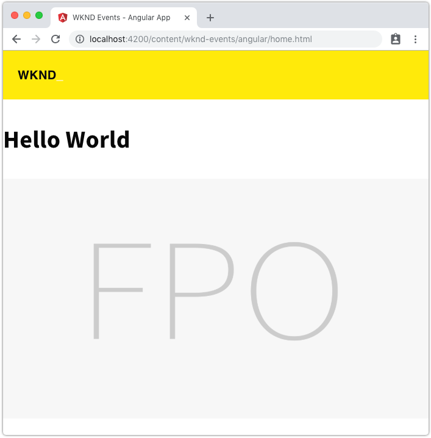
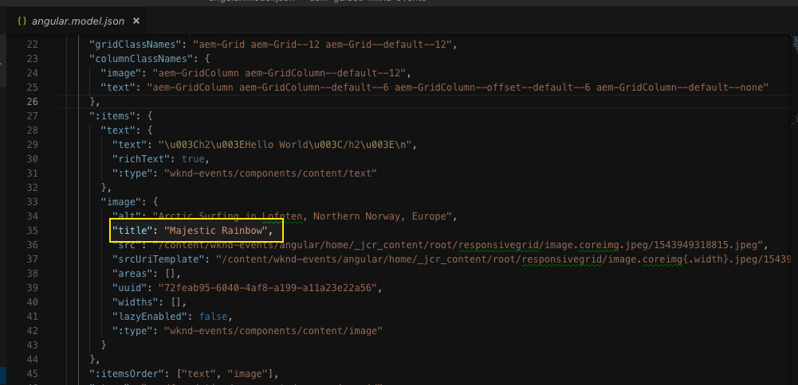
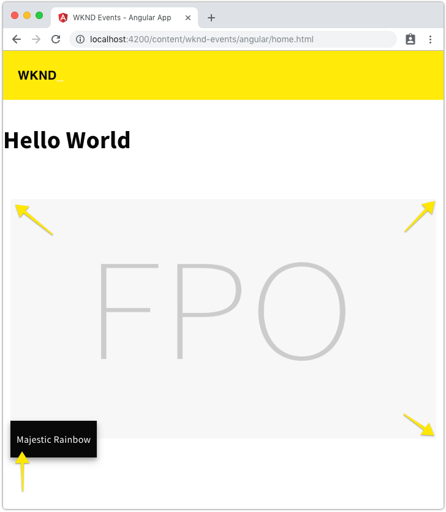
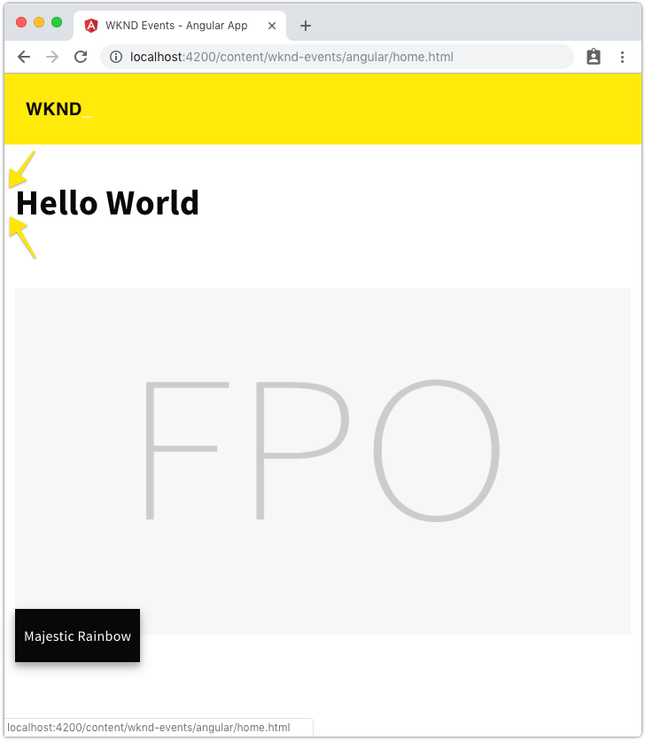

# Getting Started with Angular and AEM SPA Editor - Chapter 6{#getting-started-with-angular-and-aem-spa-editor-chapter}

## Building new and styling existing Angular components for AEM {#building-new-and-styling-existing-angular-components-for-aem}

In this chapter, a new, static Header component is created and update the Text and Image component previously created (Chapter 3) are updated to align with the WKND Events look and feel.

## Creating the Header component {#creating-the-header-component}

Persona: Angular Developer

Next a dedicated Angular component will be created for the header of the application.

1. Create a new Header Angular component using the **ng genereate** command from the **angular-app** folder.

   ```shell
   $ cd aem-guides-wknd-events/angular-app
   $ ng generate component components/header
   ```

   This will create a skeleton for the new Angular Header component at **aem-guides-wknd-events/angular-app/src/app/components/header**.

1. Edit and add the following HTML to **aem-guides-wknd-events/angular-app/src/app/components/header/header.component.html**.

   ```xml
   <header class="header">
     <a class="wrapper link" routerLink="/content/wknd-events/angular/home.html">
       <h1 class="title">WKND<span class="title--inverse">_</span></h1>
     </a>
   </header>
   ```

   Note this displays "hard-coded" content at this time, so this Angular component does not require any adjustments to the default generated **header.component.ts**.

1. Populate **header.component.scss** with the following to add some styles to the component:

   ```css
   @import "~src/styles/shared";
   
   .header {
     background-color: $color-primary;
     height: $header-height;
     position: fixed;
     top: 0;
     width: 100%;
     z-index: 99;
   
     @include media(tablet, desktop) {
       height: $header-height-big;
     }
   
     .wrapper {
       @include content-area();
       display: flex;
       justify-content: space-between;
     }
   
     .link {
         text-decoration: none;
         color: $color-black;
   
         &:active {
         text-decoration: none;
         color: $color-black;
         }
     }
   
     .title {
       float: left;
       font-family: 'Helvetica', sans-serif;
       font-size: 20px;
       padding-left: $gutter-padding;
   
       @include media(tablet, desktop) {
         font-size: 24px;
       }
   
       &--inverse {
         color: $color-white;
       }
     }
   }
   ```

1. Add the Angular Header component directly above the `<router-outlet>` tag in **wknd-events/angular-app/src/app.component.html**. This will effectively keep the header constant in the display across all Angular routes.

   ```xml
   <app-header></app-header>
   <router-outlet></router-outlet>
   ```

## Review the Header component {#review-the-header-component}

After creating and adding the Angular Header component, the Angular application should have the yellow header running along the top of the Angular application.

 

## Update the Image component {#update-the-image-component}

Persona: Angular Developer

Next we'll update the Image component to include an optional caption, which should be driven from the Image component's Title.



angular.mode.json

Inspecting the **angular.model.json** (either the mock or directly generated by AEM) we can see the title property that drives the caption.

1. Edit and add the following JavaScript to **aem-guides-wknd-events/angular-app/src/app/components/image/image.component.ts**.

   ```
   import {Component, Input, OnInit} from '@angular/core';
   import {MapTo} from '@adobe/cq-angular-editable-components';
   
   @Component({
     selector: 'app-image',
     templateUrl: './image.component.html',
     styleUrls: ['./image.component.scss']
   })
   export class ImageComponent implements OnInit {
   
     @Input() src: string;
     @Input() link: string;
     @Input() alt: string;
     @Input() title: string;
     @Input() displayPopupTitle: string;
   
     constructor() { }
   
     get hasImage() {
       return this.src && this.src.trim().length > 0;
     }
   
     get imageTitle() {
       return this.displayPopupTitle ? this.title : '';
     }
   
     get imageCaption() {
       return this.title;
     }
   
     ngOnInit() { }
   }
   
   const ImageEditConfig = {
     emptyLabel: 'Image',
   
     isEmpty: function(componentData) {
       return !componentData || !componentData.src || componentData.src.trim().length < 1;
     }
   };
   
   MapTo('wknd-events/components/content/image')(ImageComponent, ImageEditConfig);
   ```

   **Line 27-29** defines a getter that returns the authored **displayPopupTitle** field as the caption. 

1. Edit and update the following HTML to **aem-guides-wknd-events/angular-app/src/app/components/image/image.component.html**.

   ```xml
   <ng-container *ngIf="hasImage">
     
     <span class="caption" *ngIf="imageCaption">{{imageCaption}}</span>
   </ng-container>
   ```

   **Line 3** is added to conditionally display a **&lt;span&gt;** tag that renders the Image caption.

1. Populate **image.component.scss** with the following to add some styles to the component:

   ```css
   @import '~src/styles/shared';
   
   :host-context {
     display: block;
     @include component-padding();
   }
   
   .image {
     border: 0;
     margin: 2rem 0;
     padding: 0;
     vertical-align: baseline; 
     width: 100%;
   }
   
   .caption {
     background-color: $color-black;
     color: $color-white;
     height: 3em;
     padding: 20px 10px;
     position: relative;
     top: -50px;
   
     @include drop-shadow();
   
     @include media(tablet) {
         padding: 25px 15px;
     }
   
     @include media(desktop) {
         padding: 30px 20px;
     }
   }
   ```

   **Line 6** adds the component padding, as defined in the **_mixins.scss** to the component.

   **Lines 16-32** define the styles to display the caption.

1. Viewing the Angular app on the local dev  wb  server the new styles as well as the caption, derived from the image JSON's title property is displayed.

   

   Angular Image component

## Update the Text component {#update-the-text-component}

Persona: Angular Developer

Next we will make some small modifications to the Text component to promote consistency across all of the mapped components.

1. Edit and update the following HTML to **wknd-events/angular-app/src/app/components/text/text.component.scss**.

   ```css
   @import "~src/styles/shared";
   
   :host-context {
     display: block;
   
     @include component-padding();
   }
   ```

   **Line 6** adds the component padding, as defined in the **_mixins.scss** to the component.

   

   Angular Text component

## Next steps {#next-steps}

Next part in the tutorial:

* [Chapter 7 - Layouting with AEM Responsive Grid](chapter-7.md)

View the solution for [Chapter 6 on GitHub](https://github.com/Adobe-Marketing-Cloud/aem-guides-wknd-events/tree/angular/chapter-6).
