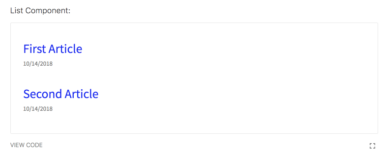
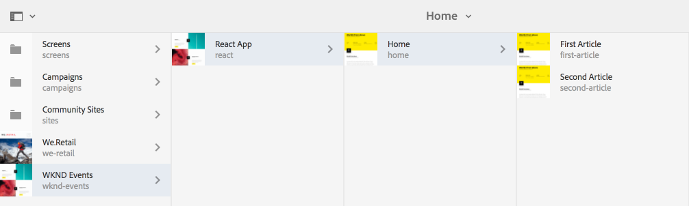
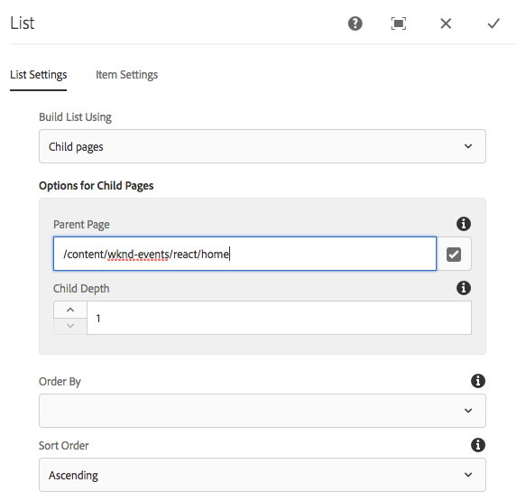
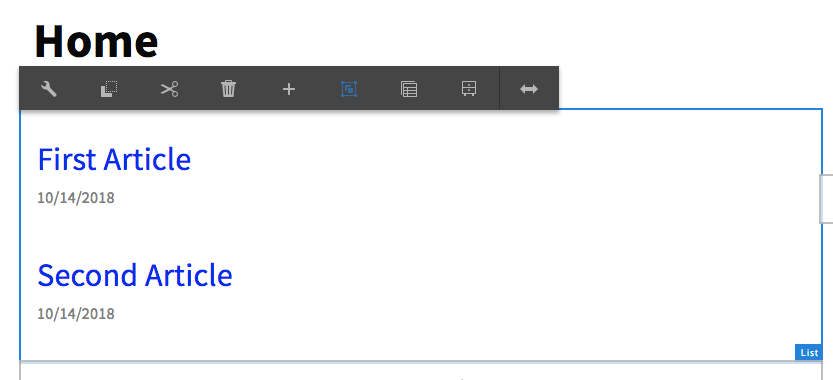
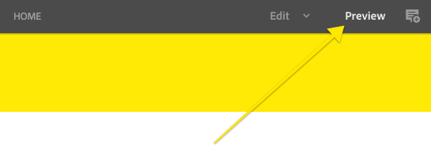
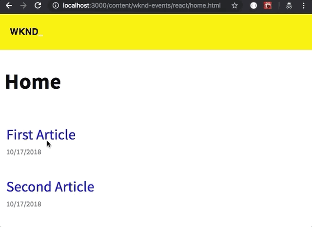
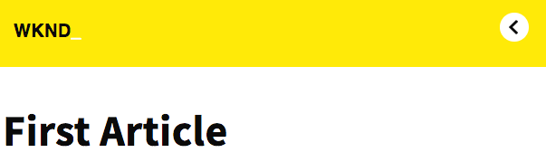

# Getting Started with React and AEM SPA Editor - Chapter 3{#getting-started-with-react-and-aem-spa-editor-chapter}

Chapter 3 covers the development of SPA Model Routing to allow navigation between different views of the App. React Router and the HTML5 History API are used. A list component is used to provide dynamic navigation.

## Tutorial Table of Contents {#table-of-contents}

## Prerequisites {#prerequisites}

**New to AEM?** [Check out how to set up a local development environment](https://helpx.adobe.com/experience-manager/kt/platform-repository/using/local-aem-dev-environment-article-setup.html) before continuing.

This is Chapter 3 of the multi-part tutorial. This assumes the completion of [Chapter 2](chapter-2.md) and the installation of tools needed for a [local development environment.](react.md) View the [Chapter 2 code on GitHub](https://github.com/Adobe-Marketing-Cloud/aem-guides-wknd-events).

Download the solution files from the previous chapter:

## SPA Routing Approach {#navigation-approach}

The high level approach to navigation with the AEM SPA Editor is to map different views within the SPA to respective pages within AEM. This makes it easy to manage multiple parts of the application and allows content authors to edit individual views. More information about the [SPA Model Routing approach can be found here](https://helpx.adobe.com/experience-manager/6-4/sites/developing/using/spa-routing.html).

Each AEM Page represented in the App will be wrapped in a &lt;Route&gt; with a path of the AEM page. The psuedo code of this in JSX below:

```
// psuedo code in JSX to represent the Routing approach

<BrowserRouter>
    <App>
        <Route path="/content/wknd-events/react/home">
            <WkndPage cqPath="/content/wknd-events/react/home" /> 
        </Route>
        <Route path="/content/wknd-events/react/home/first-article">
            <WkndPage cqPath="/content/wknd-events/react/home/first-article" /> 
        </Route>
        <Route path="/content/wknd-events/react/home/second-article">
            <WkndPage cqPath="/content/wknd-events/react/home/second-article" /> 
        </Route>
    </App>
</BrowserRouter>
```

As discussed in [Chapter 1](chapter-1.md#hierarchypage-sling-model), the App is driven based on a JSON model provided by AEM. The JSON model uses a Sling Model, HierarchyPage, to include the content of multiple AEM pages with a single request. This allows for most of the content of the App to be loaded on the initial page load and should minimize subsequent server-side requests as a user navigates the app. Review the explanation about the [HiearchyPage implementation](chapter-1.md#hierarchypage-sling-model) in Chapter 1 for more information.

Below is a psuedo representation of the JSON exported by AEM. Notice that the JSON structure maps nicely to the above JSX structure.

```
{
    ":type": "wknd-events/components/structure/app",
    ":itemsOrder": [],
    ":items": {},
    ":hierarchyType": "page",
    ":path": "/content/wknd-events/react",
    ":children": {
        "/content/wknd-events/react/home": {},
        "/content/wknd-events/react/home/first-article": {},
        "/content/wknd-events/react/home/second-article": {}
        },
    "title": "React App"
}
```

## Install React Router {#react-router}

Persona: Front End Developer

[React Router](https://www.npmjs.com/package/react-router) provides a collection of navigational components for React applications to provide and manage different views of the application. React Router is broken into 3 modules: **react-router**, **react-router-dom** and** react-router-native.** Since this will be deployed to the web we will use **react-router-dom**. More information about [React Router for the web can be found here](https://reacttraining.com/react-router/web/example/basic).

1. Open a new terminal window and navigate to the `react-app` directory. Install `react-router` and `react-router-dom`:

   ```shell
   $ cd <src>/aem-guides-wknd-events/react-app
   $ npm install --save react-router
   $ npm install --save react-router-dom
   
   ```

2. In the editor of your choice open the `react-app`module. Create a new folder beneath `react-app/src` named `utils`. Beneath the `utils` folder create a new file named `RouteHelper.js.`

   ```
   /react-app
       /src
           /utils
               RouteHelper.js
   ```

3. Populate `RouteHelper.js`with the following:

   ```
   import React, {Component} from 'react';
   import {Route} from 'react-router-dom';
   import { withRouter } from 'react-router';
   
   /**
    * Helper that facilitate the use of the {@link Route} component
    */
   
   /**
    * Returns a composite component where a {@link Route} component wraps the provided component
    *
    * @param {React.Component} WrappedComponent    - React component to be wrapped
    * @param {string} [extension=html]             - extension used to identify a route amongst the tree of resource URLs
    * @returns {CompositeRoute}
    */
   export const withRoute = (WrappedComponent, extension) => {
       return class CompositeRoute extends Component {
           render() {
               let routePath = this.props.cqPath;
               if (!routePath) {
                   return <WrappedComponent {...this.props}/>;
               }
   
               extension = extension || 'html';
   
               // Context path + route path + extension
               return <Route key={ routePath } path={ '(.*)' + routePath + '.' + extension } render={ (routeProps) => {
                   return <WrappedComponent {...this.props} {...routeProps}/>;
               } } />
           }
       }
   };
   
   /**
    * ScrollToTop component will scroll the window on every navigation.
    * wrapped in in `withRouter` to have access to router's props.
    */
   class ScrollToTop extends Component {
       componentDidUpdate(prevProps) {
         if (this.props.location !== prevProps.location) {
           window.scrollTo(0, 0)
         }
       }
       render() {
         return this.props.children
       }
     }
     export default withRouter(ScrollToTop);
   ```

   `withRoute` is a reusable component that can wrap any other React component. This will primarily be used to wrap the Page component to provide routing between pages.

   The Header component in the App is a sticky header and when navigation occurs to different views we want to make sure the browser scrolls to the top. The ScrollToTop component will provide that functionality. More information on [scroll restoration and React Router can be found here.](https://reacttraining.com/react-router/web/guides/scroll-restoration)

4. Update `react-app/src/index.js` to wrap the **App** with **BrowserRouter** and **ScrollToTop** components:

   ```
     import './index.scss';
     import App from './App';
     import "./components/MappedComponents";
   + import {BrowserRouter} from 'react-router-dom';
   + import ScrollToTop from './utils/RouteHelper';
    
     function render(model) {
        ReactDOM.render((
   +        <BrowserRouter>
   +            <ScrollToTop>
               <App cqChildren={ model[Constants.CHILDREN_PROP] } cqItems={ model[Constants.ITEMS_PROP] } cqItemsOrder={ model[Constants.ITEMS_ORDER_PROP] }
                   cqPath={ ModelManager.rootPath } locationPathname={ window.location.pathname }/>
   +             </ScrollToTop>
   +        </BrowserRouter>), 
           document.getElementById('root'));
     }
   ```

   ** [BrowserRouter](https://reacttraining.com/react-router/web/api/BrowserRouter)** is a type of Router that uses the HTML5 history API to keep the App UI in sync with the URL. This allows for easy deep linking to specific views of the App. The **ScrollToTop** component from **RouteHelper** is included. 

5. Update **Page.js **beneath `react-app/src/components/page` to wrap the WkndPage component with a route using the utility from **RouteHelper**.

   ```
       import {Page, MapTo, withComponentMappingContext } from "@adobe/cq-react-editable-components";
   +   import {withRoute} from '../../utils/RouteHelper';
       require('./Page.scss');
   
       class WkndPage extends Page {
       
           get containerProps() {
               let attrs = super.containerProps;
               attrs.className = (attrs.className || '') + ' WkndPage ' + (this.props.cssClassNames || '');
               return attrs
           }
       }
   -   MapTo('wknd-events/components/structure/page')(withComponentMappingContext(WkndPage));    
   +   MapTo('wknd-events/components/structure/page')(withComponentMappingContext(withRoute(WkndPage)));
   ```

   To recap, the AEM resource `wknd-events/components/structure/page` represents an AEM Page and will be mapped to the React component **WkndPage**. With the addition of `withRoute` all pages will be wrapped as a **Route** that can then be navigated to.

## List Component {#list-component}

Persona: Front End Developer

Next we will implement a React component to display a list of links. This React component will map to an [AEM List component](https://github.com/Adobe-Marketing-Cloud/aem-core-wcm-components/tree/master/content/src/content/jcr_root/apps/core/wcm/components/list/v2/list), which is provided by Core Components.

The **List** component provides an array of **items** that includes a **url**, **path**, optional description, **title** and a **datetimestamp** for when the page was last modified. A sample of the List JSON model can be seen below:

```
"list": {
    "dateFormatString": "yyyy-MM-dd",
    "items": [
        {
            "url": "/content/wknd-events/react/home/first-article.html",
            "path": "/content/wknd-events/react/home/first-article",
            "description": null,
            "title": "First Article",
            "lastModified": 1539529744910
        },
        {
            "url": "/content/wknd-events/react/home/second-article.html",
            "path": "/content/wknd-events/react/home/second-article",
            "description": null,
            "title": "Second Article",
            "lastModified": 1539532397436
        }
    ],
    "showDescription": false,
    "showModificationDate": false,
    "linkItems": false,
    ":type": "wknd-events/components/content/list"
}
```

1. Beneath `react-app/src/components` create a new folder named **list**. Beneath the list folder create two files: **List.js** and **List.scss.**

   ```
   /react-app
       /src
           /components
               /list
                   List.js
                   List.scss
   ```

1. Add the following imports to the top** List.js **and include a **ListEditConfig** to be used by the AEM editor as a placeholder:

   ```
   import React, {Component} from 'react';
   import {MapTo} from '@adobe/cq-react-editable-components';
   import {Link} from "react-router-dom";
   require('./List.scss');
   
   const ListEditConfig = {
   
       emptyLabel: 'List',
   
       isEmpty: function(props) {
           return !props || !props.items || props.items.length < 1;
       }
   };
   
   ```

1. Create a **ListItem** component to render each individual item of the **List**. The **ListItem** is expected to be passed a **title**, **url**, **path**, and **date** as **props**.

   ```
   /**
    * ListItem renders the individual items in the list
    */
   class ListItem extends Component {
   
       get date() {
          if(!this.props.date) {
              return null;
          }
           let date = new Date(this.props.date);
           return date.toLocaleDateString('en-US');
       }
   
       render() {
           if(!this.props.path || !this.props.title || !this.props.url) {
               return null;
           }
           return (
               <li className="ListItem" key={this.props.path}>
                   <Link className="ListItem-link" to={this.props.url}>{this.props.title}
                       <span className="ListItem-date">{this.date}</span>
                   </Link>
               </li>
           );
       }
   }
   ```

   >[!NOTE]
   >
   >Instead of using a standard anchor tag the ** [<Link>](https://reacttraining.com/react-router/web/api/Link)** component is used from `react-router-dom`. This provides the look and feel of a standard HTML link but instead will use React Router to navigate to a different part of the App without a page refresh.

1. Lastly, add a **List** class to** List.js** that will map to the AEM component `wknd-events/components/content/list`. The List class expects an array named **items**. We will iterate over the items array and pass the properties to include multiple **ListItem** components.

   ```
   /**
    * List renders the list contents and maps wknd-events/components/content/list
    */
   export default class List extends Component {
       render() {
           return (
                   <div className="List">
                       <ul className="List-wrapper">
                           { this.props.items && this.props.items.map((listItem, index) => {
                               return <ListItem path={listItem.path} url={listItem.url} 
                                                title={listItem.title} date={listItem.lastModified} />
                               })
                          }
                       </ul>
                   </div>
           );
       }
   }
   
   MapTo("wknd-events/components/content/list")(List, ListEditConfig);
   ```

1. Populate **List.scss** with the following to style the **List** Component:

   ```css
   @import '../../styles/shared';
   
   .List {
       @include component-padding();
   }
   
   .ListItem {
       list-style: none;
       float: left;
       width: 100%;
       margin-bottom: 1em;
       font-size: $lead-font-size;
       padding: 4px;
       color: #0045ff;
   
       &:hover {
           background-color: #ededed;
       }
   
       &-link {
           text-decoration: none;
       }
   
       &-date {
           width: 100%;
           float:left;
           color: $color-secondary;
           font-size: $base-font-size;
       }
   }
   ```

1. Beneath `react-app/src/components/list` add a new file named **List.md**. This will be a style guide entry where we will mock a static version of the List component.

   List Component:

   ```js
   const {Route} = require('react-router-dom');
   const {BrowserRouter} = require('react-router-dom');
   let items = [
       {
           url: "#",
           path: "item1",
           title: "First Article",
           lastModified: 1539529744910
       },
       {
           url: "#",
           path: "item2",
           title: "Second Article",
           lastModified: 1539532397436
       }
       ];
       <BrowserRouter>
           <Route key="list-example" path="sample">
               <List items={items} />
           </Route>
       </BrowserRouter>
       
   ```

   Since the **List** component uses the **&lt;Link&gt;** component from react-router, we need to wrap the component with a mock **&lt;BrowserRouter&gt;** and mock **&lt;Route&gt;**.

   Open a terminal window and start the styleguide:

   ```shell
   $ cd <src>/aem-guides-wknd-events/react-app
   $ npm run styleguide
   ```

   You should now see the static List Component:

   

1. Update `react-app/src/components/MappedComponents.js` to require **List.js**:

   ```
     require('./page/Page');
     require('./text/Text');
     require('./image/Image');
   + require('./list/List');
   ```

1. Deploy the project to a local AEM instance running at [http://localhost:4502](http://localhost:4502):

   ```shell
   $ cd <src>/aem-guides-wknd-events
   $ mvn -PautoInstallPackage -Padobe-public clean install
   ```

1. In the [AEM Sites Console](http://localhost:4502/sites.html/content/wknd-events/react) update the page structure beneath **/content/wknd-events/react/home** to include 2 or more child pages. Use the WKND Event Page template (not WKND Event React App template). The child pages can be named however you want.

   

1. Open the Home page inside the AEM editor at: [http://localhost:4502/editor.html/content/wknd-events/react/home.html](http://localhost:4502/editor.html/content/wknd-events/react/home)

   Add a List Component to the page and configure with the following values to display a list of child pages beneath the Home page:

    

1. Toggle into Preview mode and then click one of the links in the List component. You should be navigated to the child page. Once on the child page toggle back into Edit mode and you should be able to edit the components on the page. 

   

   View the App outside of the Editor: [http://localhost:4502/content/wknd-events/react/home.html](http://localhost:4502/content/wknd-events/react/home.html)

   Try the navigation and notice that the page is not refreshed and the URL is updated. The Back button in the browser also should work. As you navigate there should not be any network traffic, outside of the initial page load.

   Lastly we don't have any navigation to return to the Home page (not counting the browser's back button). In the next section we will add a dynamic return button to the Header component.

## Update Header Component {#header-component}

Persona: Front End Developer

Next we will add a back button as part of the Header component. Like the List component we will use components provided by React Router to accomplish this.

1. Beneath `react-app/src/components/header` update **Header.js**.

   Start by importing **Link** and **withRouter:**

   ```
   import React, {Component} from 'react';
   +import {Link} from "react-router-dom";
   +import { withRouter } from 'react-router';
   import './Header.scss';
   ```

   Update the Header class to remove the `export default` and add a new getter method named `homeLink()`. The `homeLink()` method will look at the location and determine if the current route is equal to the Home page. If it is not equal a **Link** to the Home page will be returned.

   ```
   -  export default class Header extends Component {
   + class Header extends Component {
   
       get homeLink() {
           let currLocation;
           currLocation = this.props.location.pathname;
           currLocation = currLocation.substr(0, currLocation.length - 5);
   
           if (this.props.navigationRoot && currLocation !== this.props.navigationRoot) {
               return (<Link className="Header-action" to={this.props.navigationRoot + ".html"}>
                  Back
               </Link>);
           }
           return null;
       }
   
   ...
   ```

   Update the `render()` method to make a call the **homeLink**:

   ```
        render() {
            return (
            <header className="Header">
                <div className="Header-wrapper">
                    <h1 className="Header-title">WKND<span className="Header-title--inverse">_</span></h1>
   +                <div className="Header-tools">
   +                    { this.homeLink }
   +                </div>
                </div>
              </header>
            );
    
        }
   ```

   Lastly add a line at the bottom of the file to export the **Header** wrapped in `withRouter` from `react-router`. This ensures that the **Header** component has access to the `location` props.

   ```
   export default withRouter(Header); 
   ```

1. Update `react-app/src/App.js` to pass in a property for `navigationRoot` to the **Header** component:

   ```
    return (
           <div className="App">
   +            <Header navigationRoot="/content/wknd-events/react/home" />
               <EditorContext.Provider value={ Utils.isInEditor() }>
                   { this.childComponents }
                   { this.childPages }
               </EditorContext.Provider>
           </div>
         );
   ```

1. Ensure that `react-app/.env.development` is set up to use AEM as a proxy:

   ```shell
   #Request the JSON from AEM
   REACT_APP_PAGE_MODEL_PATH=/content/wknd-events/react.model.json
   ```

1. Start the static development server in the `react-app`:

   ```shell
   $ cd <src>/aem-guides-wknd-events/react-app
   $ npm start
   ```

   In the browser navigate to [https://localhost:3000/content/wknd-events/react/home.html](https://localhost:3000/content/wknd-events/react/home.html). Make sure to have logged in to AEM in another tab within the same browser.

   You should see the List component and be able to navigate to the child pages. The Back button should be displayed on the child pages.

   

   Next we will add a some style to the Back button in the Header.

## Add Font Awesome Icons {#font-awesome}

Persona: Front End Developer

[Font Awesome](https://fontawesome.com/) is a popular icon set. Font Awesome provides an [official React component](https://fontawesome.com/how-to-use/on-the-web/using-with/react) to easily integrate the icon set into a React application. We will integrate a few of the icons into our project.

1. Open a new terminal and navigate to the react-app. Install Font Awesome with npm. Official installation instructions for [Font Awesome can be found here](https://fontawesome.com/how-to-use/on-the-web/using-with/react#how).

   ```shell
   $ cd <src>/aem-guides-wknd-events/react-app
   $ npm i --save @fortawesome/fontawesome-svg-core \
     npm i --save @fortawesome/free-solid-svg-icons \
     npm i --save @fortawesome/react-fontawesome
   ```

1. In the editor of your choice, open the `react-app`. Beneath `react-app/src/utils` create a new file named **Icons.js**. Populate **Icons.js** with the following to create an app specific library of icons:

   ```
   import { library } from '@fortawesome/fontawesome-svg-core';
   import { faCheckSquare, faChevronLeft, faSearch, faHeadphonesAlt, faMusic, faCamera, faFutbol, faPaintBrush, faTheaterMasks} from '@fortawesome/free-solid-svg-icons';
   
   library.add(faCheckSquare, faChevronLeft, faSearch, faHeadphonesAlt, faMusic, faCamera, faFutbol, faPaintBrush, faTheaterMasks);
   ```

1. Beneath `react-app/src/components/header` update **Header.js** to include the chevron-left icon.

   ```
     import React, { Component } from 'react';
     import { Link } from "react-router-dom";
     import { withRouter } from 'react-router';
   + import { FontAwesomeIcon } from '@fortawesome/react-fontawesome';
     import './Header.scss';
   + require('../../utils/Icons');
   
   class Header extends Component {
   
       get homeLink() {
           let currLocation;
           currLocation = this.props.location.pathname;
           currLocation = currLocation.substr(0, currLocation.length - 5);
   
           if (this.props.navigationRoot && currLocation !== this.props.navigationRoot) {
               return (<Link className="Header-action" to={this.props.navigationRoot + ".html"}>
   +                <FontAwesomeIcon icon="chevron-left" />
               </Link>);
           }
           return null;
       }
   
   ...
   ```

1. Beneath `react-app/src/components/header` update **Header.scss** to add additional styles for header icon:

   ```css
   @import '../../styles/shared';
   
   $icon-size-lg: 46px;
   $icon-size-md: 40px;
   $icon-size-sm: 32px;
   
   .Header {
   
       ...
   
        &-tools {
           padding-top: 8px;
           padding-right: $gutter-padding;
       }
   
       &-action {
           background: $color-white;
           border-radius: 100%;
           width:  $icon-size-sm;
           height:   $icon-size-sm;
           font-size:   18px;
           color: $color-black;
           text-align: center;
           align-content: center;
           float: left;
           margin-right: 1.5rem;
           
           &:last-child {
             margin-right: 0;
           }
       
           .svg-inline--fa {
             position:relative;
             top: 2.5px;
             right: 1px;
           }
       
           @include media(desktop) {
             width:  $icon-size-lg;
             height:   $icon-size-lg;
             font-size:   26px;
           }
       
           @include media(tablet) {
             width:  $icon-size-md;
             height:   $icon-size-md;
             font-size:   22px;
           }
         }
   
   }
   ```

1. Start the local development server to view the updated styles of the Back button in the Header:

   

## Add Redirect to App.js {#redirect-app}

Persona: Front End Developer

The last thing we will do in this chapter is update **App.js**, the entry point to the application, to automatically redirect to the Home page view.

1. Update `react-app/src/App.js` to import the [Redirect](https://reacttraining.com/react-router/core/api/Redirect) component from react-router.

   Add a utility function named **getModelPath() **to strip the extension of a url to just return the path. Add another function named **canRedirectHome()** to determine based on the current location if the app should redirect to the Home view.

   ```
    import React from 'react';
    import { Page, withModel, EditorContext, Utils } from '@adobe/cq-react-editable-components';
   +import { Redirect } from 'react-router';
   
    /**
        * Returns a model path from the given URL
        * @param {string} url     - Path from which to extract a model path
        * @return {string|undefined}
        */
       function getModelPath(url) {
           if (!url) {
               return;
           }
   
           let dotIndex = url.indexOf(".");
           return url.substr(0, dotIndex > -1 ? dotIndex : url.length);
       }
   
       /**
        * Should the App redirect to the home page
        *
        * @param {string} modelUrl     - Path of the current model
        * @return {boolean}
        */
       function canRedirectHome(modelUrl, pathname) {
           if (!pathname) {
               return false;
           }
           const currentUrl = getModelPath(pathname);
           // 1. if a model url has been provided
           // 2. if the current URL is located under the content
           // 3. if app root model path equals the current URL
           return modelUrl && modelUrl.indexOf('/content/') > -1 && (modelUrl === currentUrl || modelUrl.endsWith(currentUrl));
       }
   
       // This component is the application entry point
       class App extends Page {
   
       ...

   ```

1. Update the **App** class in **App.js** to include a getter method named **redirect()** that uses the functions created above to determine if the App should redirect.

   ```
   class App extends Page {
   
       get redirect() {
           const modelRootPath = this.props.cqPath;
           const locationPathname = this.props.locationPathname;
   
           if (canRedirectHome(modelRootPath, locationPathname)) {
               // Redirect to the home url
               return <Redirect to={ modelRootPath + '/home.html' }/>;
           }
           return null;
       }
   
       render() {
           return (
               <div className="App">
                   <Header navigationRoot="/content/wknd-events/react/home" />
                   <EditorContext.Provider value={ Utils.isInEditor() }>
   +                    { this.redirect }
                         { this.childComponents }
                         { this.childPages }
                   </EditorContext.Provider>
               </div>
             );
       }
   }
   ```

1. Start the static development server. Navigate to [https://localhost:3000/content/wknd-events/react.html](https://localhost:3000/content/wknd-events/react.html). You should see the App automatically redirect to [https://localhost:3000/content/wknd-events/react/home.html](https://localhost:3000/content/wknd-events/react/home.html).
1. From the command line deploy the app to AEM:

   ```shell
   $ cd <src>/aem-guides-wknd-events
   $ mvn -PautoInstallPackage -Padobe-public clean install
   ```

   In AEM navigate to [http://localhost:4502/editor.html/content/wknd-events/react.html](http://localhost:4502/editor.html/content/wknd-events/react). You should see the Home view. You should also be able to navigate to the child pages and see the styled Back button in the Header.

   

   Note that the url for the app is not reflected in the browser while in the AEM Editor. View the App without the Editor at [http://localhost:4502/content/wknd-events/react.html](http://localhost:4502/content/wknd-events/react.html). Verify the redirect and that the HTML5 History API is working as expected.

## Next Steps {#next-steps}

Next part in the tutorial:

* Coming Soon: Implementing a custom component to use the Google Maps API.

View the solution for [Chapter 3 on GitHub](https://github.com/Adobe-Marketing-Cloud/aem-guides-wknd-events).

Download the finished package for this part of the tutorial:

## Help! {#help}

