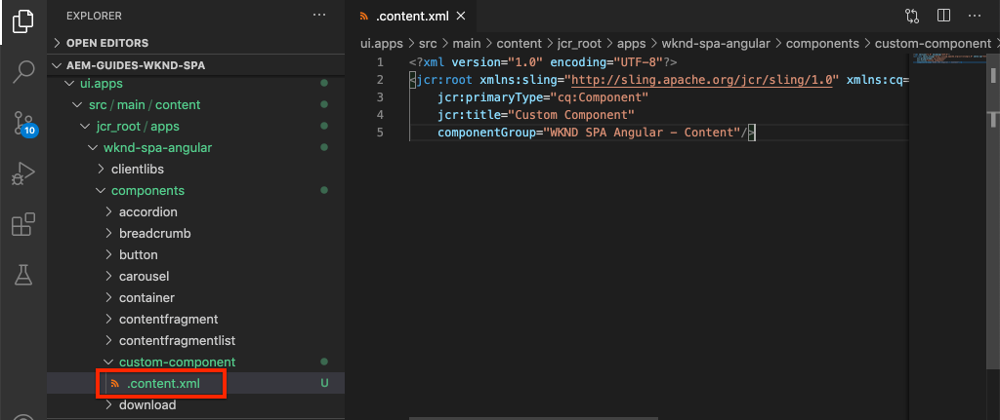
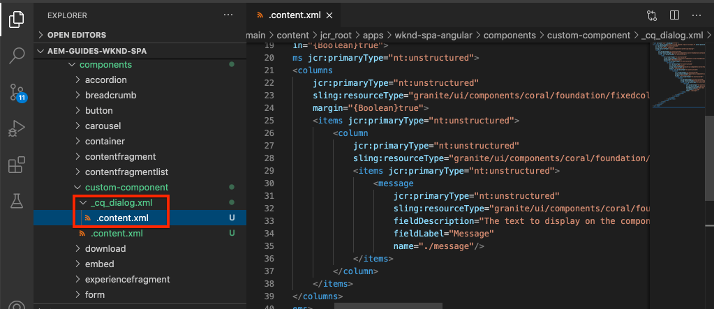
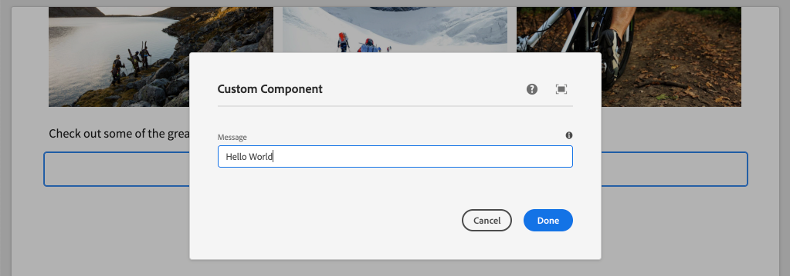

# Create a Custom Component {#custom-component}

Learn how to create a custom component to be used with the AEM SPA Editor. Learn how to develop author dialogs and Sling Models to extend the JSON model to populate a custom component.

## Objective

1. Understand the role of Sling Models in manipulating the JSON model API provided by AEM.
2. Understand how to create new AEM component dialogs.
3. Learn to create a **custom** AEM Component that will be compatible with the SPA editor framework.

## What you will build

The focus of previous chapters was developing SPA components and mapping them to *existing* AEM Core Components. This chapter will focus on how to create and extend *new* AEM components and manipulate the JSON model served by AEM.

A simple `Custom Component` illustrates the steps needed to create a net-new AEM component.


## Prerequisites

Review the required tooling and instructions for setting up a [local development environment](overview.md#local-dev-environment).

### Get the code

1. Download the starting point for this tutorial via Git:

    ```shell
    $ git clone git@github.com:adobe/aem-guides-wknd-spa.git
    $ cd aem-guides-wknd-spa
    $ git checkout Angular/custom-component-start
    ```

2. Deploy the code base to a local AEM instance using Maven:

    ```shell
    $ mvn clean install -PautoInstallSinglePackage
    ```

    If using [AEM 6.x](overview.md#compatibility) add the `classic` profile:

    ```shell
    $ mvn clean install -PautoInstallSinglePackage -Pclassic
    ```

3. Install the finished package for the traditional [WKND reference site](https://github.com/adobe/aem-guides-wknd/releases/latest). The images provided by [WKND reference site](https://github.com/adobe/aem-guides-wknd/releases/latest) will be re-used on the WKND SPA. The package can be installed using [AEM's Package Manager](http://localhost:4502/crx/packmgr/index.jsp).

    

You can always view the finished code on [GitHub](https://github.com/adobe/aem-guides-wknd-spa/tree/Angular/custom-component-solution) or check the code out locally by switching to the branch `Angular/custom-component-solution`.

## Define the AEM Component

An AEM component is defined as a node and properties. In the project these nodes and properties are represented as XML files in the `ui.apps` module. Next, create the AEM component in the `ui.apps` module.

>[!NOTE]
>
> A quick refresher on the [basics of AEM components may be helpful](https://docs.adobe.com/content/help/en/experience-manager-learn/getting-started-wknd-tutorial-develop/component-basics.html).

1. In the IDE of your choice open the `ui.apps` folder.
2. Navigate to `ui.apps/src/main/content/jcr_root/apps/wknd-spa-angular/components` and create a new folder named `custom-component`.
3. Create a new file named `.content.xml` beneath the `custom-component` folder. Populate the `custom-component/.content.xml` with the following:

    ```xml
    <?xml version="1.0" encoding="UTF-8"?>
    <jcr:root xmlns:sling="http://sling.apache.org/jcr/sling/1.0" xmlns:cq="http://www.day.com/jcr/cq/1.0" xmlns:jcr="http://www.jcp.org/jcr/1.0"
        jcr:primaryType="cq:Component"
        jcr:title="Custom Component"
        componentGroup="WKND SPA Angular - Content"/>
    ```

    

    `jcr:primaryType="cq:Component"` - identifies that this node will be an AEM component.

    `jcr:title` is the value that will be displayed to Content Authors and the `componentGroup` determines the grouping of components in the authoring UI.

4. Beneath the `custom-component` folder, create another folder named `_cq_dialog`.
5. Beneath the `_cq_dialog` folder create a new file named `.content.xml` and populate it with the following:

    ```xml
    <?xml version="1.0" encoding="UTF-8"?>
    <jcr:root xmlns:sling="http://sling.apache.org/jcr/sling/1.0" xmlns:granite="http://www.adobe.com/jcr/granite/1.0" xmlns:cq="http://www.day.com/jcr/cq/1.0" xmlns:jcr="http://www.jcp.org/jcr/1.0" xmlns:nt="http://www.jcp.org/jcr/nt/1.0"
        jcr:primaryType="nt:unstructured"
        jcr:title="Custom Component"
        sling:resourceType="cq/gui/components/authoring/dialog">
        <content
            jcr:primaryType="nt:unstructured"
            sling:resourceType="granite/ui/components/coral/foundation/container">
            <items jcr:primaryType="nt:unstructured">
                <tabs
                    jcr:primaryType="nt:unstructured"
                    sling:resourceType="granite/ui/components/coral/foundation/tabs"
                    maximized="{Boolean}true">
                    <items jcr:primaryType="nt:unstructured">
                        <properties
                            jcr:primaryType="nt:unstructured"
                            jcr:title="Properties"
                            sling:resourceType="granite/ui/components/coral/foundation/container"
                            margin="{Boolean}true">
                            <items jcr:primaryType="nt:unstructured">
                                <columns
                                    jcr:primaryType="nt:unstructured"
                                    sling:resourceType="granite/ui/components/coral/foundation/fixedcolumns"
                                    margin="{Boolean}true">
                                    <items jcr:primaryType="nt:unstructured">
                                        <column
                                            jcr:primaryType="nt:unstructured"
                                            sling:resourceType="granite/ui/components/coral/foundation/container">
                                            <items jcr:primaryType="nt:unstructured">
                                                <message
                                                    jcr:primaryType="nt:unstructured"
                                                    sling:resourceType="granite/ui/components/coral/foundation/form/textfield"
                                                    fieldDescription="The text to display on the component."
                                                    fieldLabel="Message"
                                                    name="./message"/>
                                            </items>
                                        </column>
                                    </items>
                                </columns>
                            </items>
                        </properties>
                    </items>
                </tabs>
            </items>
        </content>
    </jcr:root>
    ```

    

    The above XML file generates a very simple dialog for the `Custom Component`. The critical part of the file is the inner `<message>` node. This dialog will contain a simple `textfield` named `Message` and persist the value of the textifeld to a property named `message`.

    A Sling Model will be created next to expose the value of the `message` property via the JSON model.

    >[!NOTE]
    >
    > You can view a lot more [examples of dialogs by viewing the Core Component definitions](https://github.com/adobe/aem-core-wcm-components/tree/master/content/src/content/jcr_root/apps/core/wcm/components). You can also view additional form fields, like `select`, `textarea`, `pathfield`, available beneath `/libs/granite/ui/components/coral/foundation/form` in [CRXDE-Lite](http://localhost:4502/crx/de/index.jsp#/libs/granite/ui/components/coral/foundation/form).

    With a traditional AEM component, an [HTL](https://docs.adobe.com/content/help/en/experience-manager-htl/using/overview.html) script is typically required. Since the SPA will render the component, no HTL script is needed.

## Create the Sling Model

Sling Models are annotation driven Java "POJO's" (Plain Old Java Objects) that facilitate the mapping of data from the JCR to Java variables. [Sling Models](https://docs.adobe.com/content/help/en/experience-manager-learn/getting-started-wknd-tutorial-develop/component-basics.html#sling-models) typically function to encapsulate complex server-side business logic for AEM Components.

In the context of the SPA Editor, Sling Models expose a component's content through the JSON model through a feature using the [Sling Model Exporter](https://docs.adobe.com/content/help/en/experience-manager-learn/foundation/development/develop-sling-model-exporter.html).

1. In the IDE of your choice open the `core` module. `CustomComponent.java` and `CustomCompoinentImpl.java` have already been created and stubbed out as part of the chapter starter code.

    >[!NOTE]
    >
    > If using Visual Studio Code IDE, it may be helpful to install [extensions for Java](https://code.visualstudio.com/docs/java/extensions).

2. Open the Java interface `CustomComponent.java` at `core/src/main/java/com/adobe/aem/guides/wknd/spa/angular/core/models/CustomComponent.java`:

    

    This is the Java interface that will be implemented by the Sling Model.

3. Update `CustomComponent.java` so that it extends the `ComponentExporter` interface:

    ```java
    package com.adobe.aem.guides.wknd.spa.angular.core.models;
    import com.adobe.cq.export.json.ComponentExporter;

    public interface CustomComponent extends ComponentExporter {

        public String getMessage();

    }
    ```

    Implementing the `ComponentExporter` interface is a requirement for the Sling Model to be automatically picked up by the JSON model API.

    The `CustomComponent` interface includes a single getter method `getMessage()`. This is the method that will expose the value of the author dialog through the JSON model. Only getter methods with empty parameters `()` will be exported in the JSON model.

4. Open `CustomComponentImpl.java` at `core/src/main/java/com/adobe/aem/guides/wknd/spa/angular/core/models/impl/CustomComponentImpl.java`.

    This is the implementation of the `CustomComponent` interface. The `@Model` annotation identifies the Java class as a Sling Model. The `@Exporter` annotation enables the Java class to be serialized and exported through the Sling Model Exporter.

5. Update the static variable `RESOURCE_TYPE` to point to the AEM component `wknd-spa-angular/components/custom-component` created in the previous exercise.

    ```java
    static final String RESOURCE_TYPE = "wknd-spa-angular/components/custom-component";
    ```

    The resource type of the component is what will bind the Sling Model to the AEM component and ultimately will be mapped to the Angular component.

6. Add the `getExportedType()` method to the `CustomComponentImpl` class to return the component resource type:

    ```java
    @Override
    public String getExportedType() {
        return CustomComponentImpl.RESOURCE_TYPE;
    }
    ```

    This method is required when implementing the `ComponentExporter` interface and will expose the resource type which allows the mapping to the Angular component.

7. Update the `getMessage()` method to return the value of the `message` property persisted by the author dialog. Use the `@ValueMap` annotation is map the JCR value `message` to a Java variable:

    ```java
    @ValueMapValue
    private String message;

    @Override
    public String getMessage() {
        return StringUtils.isNotBlank(message) ? message.toUpperCase() : null;
    }
    ```

    Some additional "business logic" is added to return the value of message as upper case. This will allow us to see the difference between the raw value stored by the author dialog and the value exposed by the Sling Model.

    >[!NOTE]
    >
    > You can view the [finished CustomComponentImpl.java here](https://github.com/adobe/aem-guides-wknd-spa/blob/Angular/custom-component-solution/core/src/main/java/com/adobe/aem/guides/wknd/spa/angular/core/models/impl/CustomComponentImpl.java).

## Update the Angular Component

The Angular code for the Custom Component has already been created. Next, make a few updates to map the Angular component to the AEM component.

1. In the `ui.frontend` module open the file `ui.frontend/src/app/components/custom/custom.component.ts`
2. Observe the `@Input() message: string;` line. It is expected that the transformed uppercase value will be mapped to this variable.
3. Import the `MapTo` object from the AEM SPA Editor JS SDK and use it to map to the AEM component:

    ```diff
    + import {MapTo} from '@adobe/cq-angular-editable-components';

     ...
     export class CustomComponent implements OnInit {
         ...
     }

    + MapTo('wknd-spa-angular/components/custom-component')(CustomComponent, CustomEditConfig);
    ```

4. Open `cutom.component.html` and observe that the value of `{{message}}` will be displayed in side an `<h2>` tag.
5. Open `custom.component.css` and add the following rule:

    ```css
    :host-context {
        display: block;
    }
    ```

    In order for the AEM Editor Placeholder to display properly when the component is empty the `:host-context` or another `<div>` needs to be set to `display: block;`.

6. Deploy all of the updates to a local AEM environment from the root of the project directory, using your Maven skills:

    ```shell
    $ cd aem-guides-wknd-spa
    $ mvn clean install -PautoInstallSinglePackage
    ```

## Update the Template Policy

Next, navigate to AEM to verify the updates and allow the `Custom Component` to be added to the SPA.

1. Verify the registration of the new Sling Model by navigating to [http://localhost:4502/system/console/status-slingmodels](http://localhost:4502/system/console/status-slingmodels).

    ```plain
    com.adobe.aem.guides.wknd.spa.angular.core.models.impl.CustomComponentImpl - wknd-spa-angular/components/custom-component

    com.adobe.aem.guides.wknd.spa.angular.core.models.impl.CustomComponentImpl exports 'wknd-spa-angular/components/custom-component' with selector 'model' and extension '[Ljava.lang.String;@6fb4a693' with exporter 'jackson'
    ```

    You should see the above two lines that indicate the `CustomComponentImpl` is associated with the `wknd-spa-angular/components/custom-component` component and that it is registered via the Sling Model Exporter.

2. Navigate to the SPA Page Template at [http://localhost:4502/editor.html/conf/wknd-spa-angular/settings/wcm/templates/spa-page-template/structure.html](http://localhost:4502/editor.html/conf/wknd-spa-angular/settings/wcm/templates/spa-page-template/structure.html).
3. Update the Layout Container's policy to add the new `Custom Component` as an allowed component:

    

    Save the changes to the policy, and observe the `Custom Component` as an allowed component:

    

## Author the Custom Component

Next, author the `Custom Component` using the AEM SPA Editor.

1. Navigate to [http://localhost:4502/editor.html/content/wknd-spa-angular/us/en/home.html](http://localhost:4502/editor.html/content/wknd-spa-angular/us/en/home.html).
2. In `Edit` mode, add the `Custom Component` to the `Layout Container`:

    

3. Open the component's dialog and enter a message that contains some lowercase letters.

    

    This is the dialog that was created based on the XML file earlier in the chapter.

4. Save the changes. Observe that the message displayed is in all capitalized.

    

5. View the JSON model by navigating to [http://localhost:4502/content/wknd-spa-angular/us/en.model.json](http://localhost:4502/content/wknd-spa-angular/us/en.model.json). Search for `wknd-spa-angular/components/custom-component`:

    ```json
    "custom_component_208183317": {
        "message": "HELLO WORLD",
        ":type": "wknd-spa-angular/components/custom-component"
    }
    ```

    Notice that the JSON value is set to all capital letters based on the logic added to the Sling Model.

## Congratulations! {#congratulations}

Congratulations, you learned how to create a custom AEM component and how Sling Models and dialogs work with the JSON model.

You can always view the finished code on [GitHub](https://github.com/adobe/aem-guides-wknd-spa/tree/Angular/custom-component-solution) or check the code out locally by switching to the branch `Angular/custom-component-solution`.

### Next Steps {#next-steps}

[Extend a Core Component](extend-component.md) - Learn how to extend an existing Core Component to be used with the AEM SPA Editor. Understanding how to add properties and content to an existing component is a powerful technique to expand the capabilities of an AEM SPA Editor implementation.
