# Add navigation and routing {#navigation-routing}

Learn how multiple views in the SPA are supported using AEM Pages and the SPA Editor SDK. Dynamic navigation is implemented using Angular routes and added to an existing Header component.

## Objective

1. Understand the SPA model routing options available when using the SPA Editor.
2. Learn to use [Angular routing](https://angular.io/guide/router) to navigate between different views of the SPA.
3. Implement a dynamic navigation that is driven by the AEM page hierarchy.

## What you will build

This chapter adds a navigation menu to an existing `Header` component. The navigation menu is driven by the AEM page hierarchy and uses the JSON model provided by the [Navigation Core Component](https://docs.adobe.com/content/help/en/experience-manager-core-components/using/components/navigation.html).


## Prerequisites

Review the required tooling and instructions for setting up a [local development environment](overview.md#local-dev-environment).

### Get the code

1. Download the starting point for this tutorial via git:

    ```shell
    $ git clone git@github.com:adobe/aem-guides-wknd-spa.git
    $ cd aem-guides-wknd-spa
    $ git checkout Angular/navigation-routing-start
    ```

2. Deploy the code base to a local AEM instance using Maven:

    ```shell
    $ mvn clean install -PautoInstallSinglePackage
    ```

    If using [AEM 6.x](overview.md#compatibility) add the `classic` profile:

    ```shell
    $ mvn clean install -PautoInstallSinglePackage -Pclassic
    ```

3. Install the finished package for the traditional [WKND reference site](https://github.com/adobe/aem-guides-wknd/releases/latest). The images provided by [WKND reference site](https://github.com/adobe/aem-guides-wknd/releases/latest) will be re-used on the WKND SPA. The package can be installed using [AEM's Package Manager](http://localhost:4502/crx/packmgr/index.jsp).

    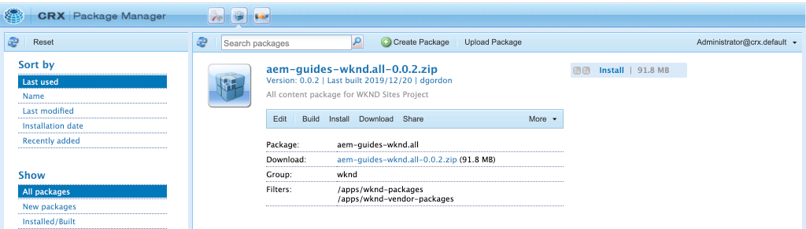

You can always view the finished code on [GitHub](https://github.com/adobe/aem-guides-wknd-spa/tree/Angular/navigation-routing-solution) or check the code out locally by switching to the branch `Angular/navigation-routing-solution`.

## Inspect HeaderComponent updates {#inspect-header}

In previous chapters, the `HeaderComponent` component was added as a pure Angular component included via `app.component.html`. In this chapter, the `HeaderComponent` component is removed from the app and will be added via the [Template Editor](https://docs.adobe.com/content/help/en/experience-manager-learn/sites/page-authoring/template-editor-feature-video-use.html). This allows users to configure the navigation menu of the `HeaderComponent` from within AEM.

>[!NOTE]
>
> Several CSS and JavaScript updates have already been made to the code base to start this chapter. To focus on core concepts, not **all** of the code changes are discussed. You can view the full changes [here](https://github.com/adobe/aem-guides-wknd-spa/compare/Angular/map-components-solution...Angular/navigation-routing-start).

1. In the IDE of your choice open the SPA starter project for this chapter.
2. Beneath the `ui.frontend` module inspect the file `header.component.ts` at: `ui.frontend/src/app/components/header/header.component.ts`.

    Several updates have been made, including the addition of a `HeaderEditConfig` and a `MapTo` to enable the component to be mapped to an AEM component `wknd-spa-angular/components/header`.

    ```js
    /* header.component.ts */
    ...
    const HeaderEditConfig = {
        ...
    };

    @Component({
    selector: 'app-header',
    templateUrl: './header.component.html',
    styleUrls: ['./header.component.scss']
    })
    export class HeaderComponent implements OnInit {
    @Input() items: object[];
        ...
    }
    ...
    MapTo('wknd-spa-angular/components/header')(withRouter(Header), HeaderEditConfig);
    ```

    Note the `@Input()` annotation for `items`. `items` will contain an array of navigation objects passed in from AEM.

3. In the `ui.apps` module inspect the component definition of the AEM `Header` component: `ui.apps/src/main/content/jcr_root/apps/wknd-spa-angular/components/header/.content.xml`:

    ```xml
    <?xml version="1.0" encoding="UTF-8"?>
    <jcr:root xmlns:sling="http://sling.apache.org/jcr/sling/1.0" xmlns:cq="http://www.day.com/jcr/cq/1.0"
        xmlns:jcr="http://www.jcp.org/jcr/1.0"
        jcr:primaryType="cq:Component"
        jcr:title="Header"
        sling:resourceSuperType="wknd-spa-angular/components/navigation"
        componentGroup="WKND SPA Angular - Structure"/>
    ```

    The AEM `Header` component will inherit all of the functionality of the [Navigation Core Component](https://docs.adobe.com/content/help/en/experience-manager-core-components/using/components/navigation.html) via the `sling:resourceSuperType` property.

## Add the HeaderComponent to the SPA template {#add-header-template}

1. Open a browser and login to AEM, [http://localhost:4502/](http://localhost:4502/). The starting code base should already be deployed.
2. Navigate to the **[!UICONTROL SPA Page Template]**: [http://localhost:4502/editor.html/conf/wknd-spa-angular/settings/wcm/templates/spa-page-template/structure.html](http://localhost:4502/editor.html/conf/wknd-spa-angular/settings/wcm/templates/spa-page-template/structure.html).
3. Select the outer-most **[!UICONTROL Root Layout Container]** and click its **[!UICONTROL Policy]** icon. Be careful **not** to select the **[!UICONTROL Layout Container]** un-locked for authoring.

    

4. Copy the current policy and create a new policy named **[!UICONTROL SPA Structure]**:

    

    Under **[!UICONTROL Allowed Components]** &gt; **[!UICONTROL General]** &gt; select the **[!UICONTROL Layout Container]** component.

    Under **[!UICONTROL Allowed Components]** &gt; **[!UICONTROL WKND SPA ANGULAR - STRUCTURE]** &gt; select the **[!UICONTROL Header]** component:

    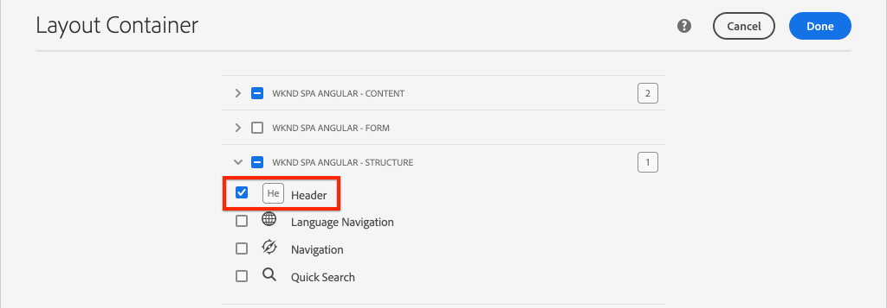

    Under **[!UICONTROL Allowed Components]** &gt; **[!UICONTROL WKND SPA ANGULAR - Content]** &gt; select the **[!UICONTROL Image]** and **[!UICONTROL Text]** components. You should have 4 total components selected.

    Click **[!UICONTROL Done]** to save the changes.

5. **Refresh** the page. Add the **[!UICONTROL Header]** component above the un-locked **[!UICONTROL Layout Container]**:

    

6. Select the **[!UICONTROL Header]** component and click its **Policy** icon to edit the policy.

    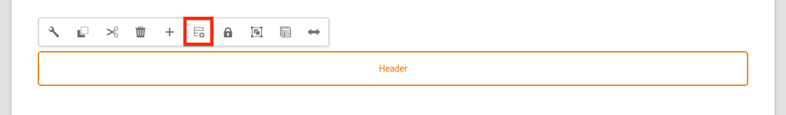

7. Create a new policy with a **[!UICONTROL Policy Title]** of **"WKND SPA Header"**.

    Under the **[!UICONTROL Properties]**:

    * Set the **[!UICONTROL Navigation Root]** to `/content/wknd-spa-angular/us/en`. 
    * Set the **[!UICONTROL Exclude Root Levels]** to **1**.
    * Uncheck **[!UICONTROL Collect al child pages]**.
    * Set the **[!UICONTROL Navigation Structure Depth]** to **3**.

    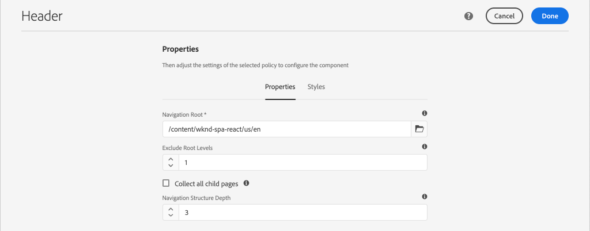

    This will collect the navigation 2 levels deep beneath `/content/wknd-spa-angular/us/en`.

8. After saving your changes you should see the populated `Header` as part of the template:

    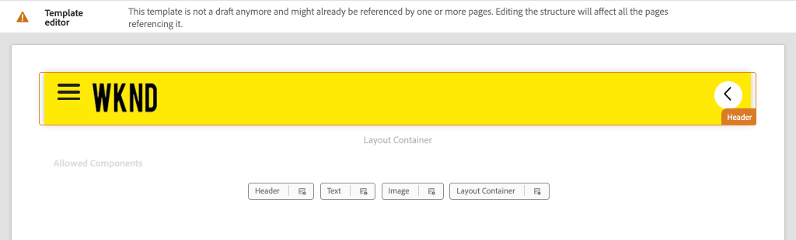

## Create child pages

Next, create additional pages in AEM that will serve as the different views in the SPA. We will also inspect the hierarchal structure of the JSON model provided by AEM.

1. Navigate to the **Sites** console: [http://localhost:4502/sites.html/content/wknd-spa-angular/us/en/home](http://localhost:4502/sites.html/content/wknd-spa-angular/us/en/home). Select the **WKND SPA Angular Home Page** and click **[!UICONTROL Create]** &gt; **[!UICONTROL Page]**:

    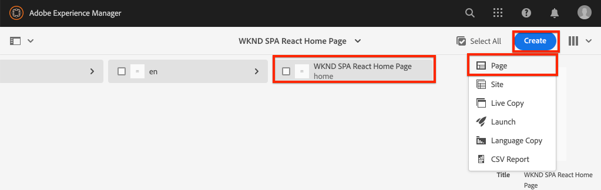

2. Under **[!UICONTROL Template]** select **[!UICONTROL SPA Page]**. Under **[!UICONTROL Properties]** enter **"Page 1"** for the **[!UICONTROL Title]** and **"page-1"** as the name.

    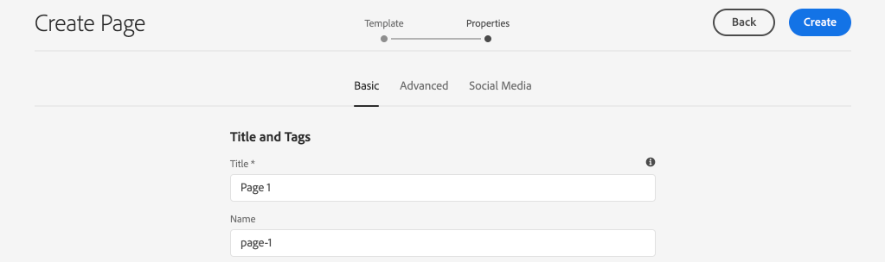

    Click **[!UICONTROL Create]** and in the dialog pop-up, click **[!UICONTROL Open]** to open the page in the AEM SPA Editor.

3. Add a new **[!UICONTROL Text]** component to the main **[!UICONTROL Layout Container]**. Edit the component and enter the text: **"Page 1"** using the RTE and the **H1** element (you will have to enter full-screen mode to change the paragraph elements)

    

    Feel free to add additional content, like an image.

4. Return to the AEM Sites console and repeat the above steps, creating a second page named **"Page 2"** as a sibling of **Page 1**. Add content to **Page 2** so that it is easily identified.
5. Lastly create a third page, **"Page 3"** but as a **child** of **Page 2**. Once completed the site hierarchy should look like the following:

    

6. In a new tab, open the JSON model API provided by AEM: [http://localhost:4502/content/wknd-spa-angular/us/en.model.json](http://localhost:4502/content/wknd-spa-angular/us/en.model.json). This JSON content is requested when the SPA is first loaded. The outer structure looks like the following:

    ```json
    {
    "language": "en",
    "title": "en",
    "templateName": "spa-app-template",
    "designPath": "/libs/settings/wcm/designs/default",
    "cssClassNames": "spa page basicpage",
    ":type": "wknd-spa-angular/components/spa",
    ":items": {},
    ":itemsOrder": [],
    ":hierarchyType": "page",
    ":path": "/content/wknd-spa-angular/us/en",
    ":children": {
        "/content/wknd-spa-angular/us/en/home": {},
        "/content/wknd-spa-angular/us/en/home/page-1": {},
        "/content/wknd-spa-angular/us/en/home/page-2": {},
        "/content/wknd-spa-angular/us/en/home/page-2/page-3": {}
        }
    }
    ```

    Under `:children` you should see an entry for each of the pages created. The content for all of the pages is in this initial JSON request. Once, the navigation routing is implemented, subsequent views of the SPA will be loaded rapidly, since the content is already available client-side.

    It is not wise to load **ALL** of the content of a SPA in the initial JSON request, as this would slow down the initial page load. Next, lets look at how the heirarchy depth of pages are collected.

7. Navigate to the **SPA Root** template at: [http://localhost:4502/editor.html/conf/wknd-spa-angular/settings/wcm/templates/spa-app-template/structure.html](http://localhost:4502/editor.html/conf/wknd-spa-angular/settings/wcm/templates/spa-app-template/structure.html).

    Click the **[!UICONTROL Page properties menu]** &gt; **[!UICONTROL Page Policy]**:

    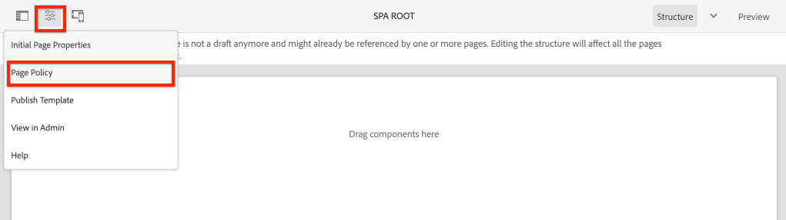

8. The **SPA Root** template has an extra **[!UICONTROL Hierarchical Structure]** tab to control the JSON content collected. The **[!UICONTROL Structure Depth]** determines how deep in the site hierarchy to collect child pages beneath the **root**. You can also use the **[!UICONTROL Structure Patterns]** field to filter out additional pages based on a regular expression.

    Update the **[!UICONTROL Structure Depth]** to **"2"**:

    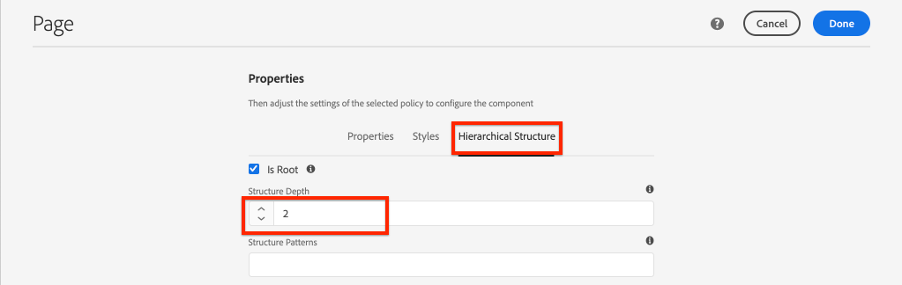

    Click **[!UICONTROL Done]** to save the changes to the policy.

9. Re-open the JSON Model [http://localhost:4502/content/wknd-spa-angular/us/en.model.json](http://localhost:4502/content/wknd-spa-angular/us/en.model.json).

    ```json
    {
    "language": "en",
    "title": "en",
    "templateName": "spa-app-template",
    "designPath": "/libs/settings/wcm/designs/default",
    "cssClassNames": "spa page basicpage",
    ":type": "wknd-spa-angular/components/spa",
    ":items": {},
    ":itemsOrder": [],
    ":hierarchyType": "page",
    ":path": "/content/wknd-spa-angular/us/en",
    ":children": {
        "/content/wknd-spa-angular/us/en/home": {},
        "/content/wknd-spa-angular/us/en/home/page-1": {},
        "/content/wknd-spa-angular/us/en/home/page-2": {}
        }
    }
    ```

    Notice that the **Page 3** path has been removed: `/content/wknd-spa-angular/us/en/home/page-2/page-3` from the initial JSON model.

    Later, we will observe how the AEM SPA Editor SDK can dynamically load additional content.

## Implement the navigation

Next, implement the navigation menu with a new `NavigationComponent`. We could add the code directly in `header.component.html` but a better practice is to avoid large components. Instead, implement a `NavigationComponent` that could potentially be re-used later.

1. Review the JSON exposed by the AEM `Header` component at [http://localhost:4502/content/wknd-spa-angular/us/en.model.json](http://localhost:4502/content/wknd-spa-angular/us/en.model.json):

    ```json
    ...
    "header": {
        "items": [
        {
        "level": 0,
        "active": true,
        "path": "/content/wknd-spa-angular/us/en/home",
        "description": null,
        "url": "/content/wknd-spa-angular/us/en/home.html",
        "lastModified": 1589062597083,
        "title": "WKND SPA Angular Home Page",
        "children": [
                {
                "children": [],
                "level": 1,
                "active": false,
                "path": "/content/wknd-spa-angular/us/en/home/page-1",
                "description": null,
                "url": "/content/wknd-spa-angular/us/en/home/page-1.html",
                "lastModified": 1589429385100,
                "title": "Page 1"
                },
                {
                "level": 1,
                "active": true,
                "path": "/content/wknd-spa-angular/us/en/home/page-2",
                "description": null,
                "url": "/content/wknd-spa-angular/us/en/home/page-2.html",
                "lastModified": 1589429603507,
                "title": "Page 2",
                "children": [
                    {
                    "children": [],
                    "level": 2,
                    "active": false,
                    "path": "/content/wknd-spa-angular/us/en/home/page-2/page-3",
                    "description": null,
                    "url": "/content/wknd-spa-angular/us/en/home/page-2/page-3.html",
                    "lastModified": 1589430413831,
                    "title": "Page 3"
                    }
                ],
                }
            ]
            }
        ],
    ":type": "wknd-spa-angular/components/header"
    ```

    The hierarchal nature of the AEM pages are modeled in the JSON that can be used to populate a navigation menu. Recall that the `Header` component inherits all of the functionality of the [Navigation Core Component](https://www.aemcomponents.dev/content/core-components-examples/library/templating/navigation.html) and the content exposed through the JSON will be automatically mapped to the Angular `@Input` annotation.

2. Open a new terminal window and navigate to the `ui.frontend` folder of the SPA project. Create a new `NavigationComponent` using the Angular CLI tool:

    ```shell
    $ cd ui.frontend
    $ ng generate component components/navigation
    CREATE src/app/components/navigation/navigation.component.scss (0 bytes)
    CREATE src/app/components/navigation/navigation.component.html (25 bytes)
    CREATE src/app/components/navigation/navigation.component.spec.ts (656 bytes)
    CREATE src/app/components/navigation/navigation.component.ts (286 bytes)
    UPDATE src/app/app.module.ts (2032 bytes)
    ```

3. Next create a class named `NavigationLink` using the Angular CLI in the newly created `components/navigation` directory:

    ```shell
    $ cd src/app/components/navigation/
    $ ng generate class NavigationLink
    CREATE src/app/components/navigation/navigation-link.spec.ts (187 bytes)
    CREATE src/app/components/navigation/navigation-link.ts (32 bytes)
    ```

4. Return to the IDE of your choice and open the file at `navigation-link.ts` at `/src/app/components/navigation/navigation-link.ts`.

    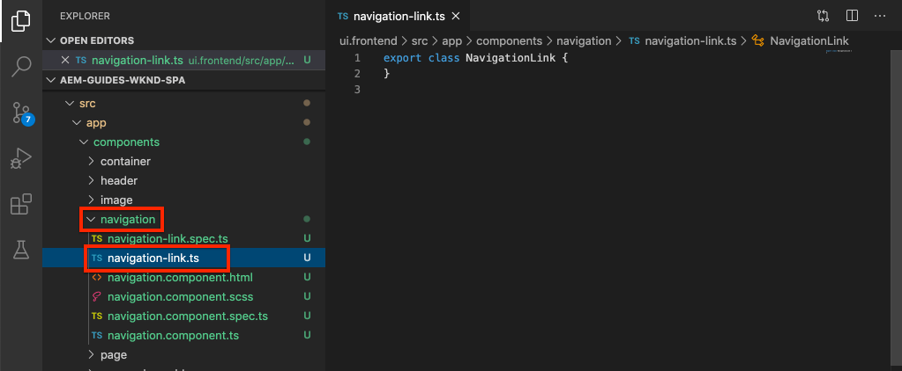

5. Populate `navigation-link.ts` with the following:

    ```js
    export class NavigationLink {

        title: string;
        path: string;
        url: string;
        level: number;
        children: NavigationLink[];
        active: boolean;

        constructor(data) {
            this.path = data.path;
            this.title = data.title;
            this.url = data.url;
            this.level = data.level;
            this.active = data.active;
            this.children = data.children.map( item => {
                return new NavigationLink(item);
            });
        }
    }
    ```

    This is a simple class to represent an individual navigation link. In the class constructor we expect `data` to be the JSON object passed in from AEM. This class will be used within both the `NavigationComponent` and `HeaderComponent` to easily populate the navigation structure.

    No data transformation is performed, this class is primarily created to strongly type the JSON Model. Notice that `this.children` is typed as `NavigationLink[]` and that the constructor recursively creates new `NavigationLink` objects for each of the items in the `children` array. Recall that JSON model for the `Header` is hierarchical.

6. Open the file `navigation-link.spec.ts`. This is the test file for the `NavigationLink` class. Update it with the following:

    ```js
    import { NavigationLink } from './navigation-link';

    describe('NavigationLink', () => {
        it('should create an instance', () => {
            const data = {
                children: [],
                level: 1,
                active: false,
                path: '/content/wknd-spa-angular/us/en/home/page-1',
                description: null,
                url: '/content/wknd-spa-angular/us/en/home/page-1.html',
                lastModified: 1589429385100,
                title: 'Page 1'
            };
            expect(new NavigationLink(data)).toBeTruthy();
        });
    });
    ```

    Notice that `const data` follows the same JSON Model inspected earlier for a single link. This is far from a robust unit test, however it should suffice to test the costructor of `NavigationLink`.

7. Open the file `navigation.component.ts`. Update it with the following:

    ```js
    import { Component, OnInit, Input } from '@angular/core';
    import { NavigationLink } from './navigation-link';

    @Component({
    selector: 'app-navigation',
    templateUrl: './navigation.component.html',
    styleUrls: ['./navigation.component.scss']
    })
    export class NavigationComponent implements OnInit {

        @Input() items: object[];

        constructor() { }

        get navigationLinks(): NavigationLink[] {

            if (this.items && this.items.length > 0) {
                return this.items.map(item => {
                    return new NavigationLink(item);
                });
            }

            return null;
        }

        ngOnInit() {}

    }

    ```

    `NavigationComponent` expects an `object[]` named `items` that is the JSON Model from AEM. This class exposes a single method `get navigationLinks()` which returns an array of `NavigationLink` objects.

8. Open the file `navigation.component.html` and update it with the following:

    ```html
    <ul *ngIf="navigationLinks && navigationLinks.length > 0" class="navigation__group">
        <ng-container *ngTemplateOutlet="recursiveListTmpl; context:{ links: navigationLinks }"></ng-container>
    </ul>
    ```

    This generates an initial `<ul>` and calls the `get navigationLinks()` method from `navigation.component.ts`. An `<ng-container>` is used to make a call to a template named `recursiveListTmpl` and passes it the `navigationLinks` as a variable named `links`.

    Add the `recursiveListTmpl` next:

    ```html
    <ng-template #recursiveListTmpl let-links="links">
        <li *ngFor="let link of links" class="{{'navigation__item naviation__item--' + link.level}}">
            <a [routerLink]="link.url" class="navigation__item-link" [title]="link.title" [attr.aria-current]="link.active">
                {{link.title}}
            </a>
            <ul *ngIf="link.children && link.children.length > 0">
                <ng-container *ngTemplateOutlet="recursiveListTmpl; context:{ links: link.children }"></ng-container>
            </ul>
        </li>
    </ng-template>
    ```

    Here the rest of the rendering for the navigation link is implemented. Note that the variable `link` is of type `NavigationLink` and all methods/properties created by that class are available. [`[routerLink]`](https://angular.io/api/router/RouterLink) is used instead of normal `href` attribute. This allows us to link to specific routes in the app, without a full-page refresh.

    The recursive portion of the navigation is also implemented by creating another `<ul>` if the current `link` has a non-empty `children` array.

9. Update `navigation.component.spec.ts` to add support for `RouterTestingModule`:

    ```diff
     ...
    + import { RouterTestingModule } from '@angular/router/testing';
     ...
     beforeEach(async(() => {
        TestBed.configureTestingModule({
    +   imports: [ RouterTestingModule ],
        declarations: [ NavigationComponent ]
        })
        .compileComponents();
     }));
     ...
    ```

    Adding the `RouterTestingModule` is required because the component uses `[routerLink]`.

10. Update `navigation.component.scss` to add some basic styles to the `NavigationComponent`:

    ```scss
    @import "~src/styles/variables";

    $link-color: $black;
    $link-hover-color: $white;
    $link-background: $black;

    :host-context {
        display: block;
        width: 100%;
    }

    .navigation__item {
        list-style: none;
    }

    .navigation__item-link {
        color: $link-color;
        font-size: $font-size-large;
        text-transform: uppercase;
        padding: $gutter-padding;
        display: flex;
        border-bottom: 1px solid $gray;

        &:hover {
            background: $link-background;
            color: $link-hover-color;
        }

    }
    ```

## Update the header component

Now that the `NavigationComponent` has been implemented, the `HeaderComponent` must be updated to reference it.

1. Open a terminal and navigate to the `ui.frontend` folder within the SPA project. Start the **webpack dev server**:

    ```shell
    $ npm start
    ```

2. Open a browser tab and navigate to [http://localhost:4200/](http://localhost:4200/).

    The **webpack dev server** should be configured to proxy the JSON model from a local instance of AEM (`ui.frontend/proxy.conf.json`). This will allow us to code directly against the content created in AEM from earlier in the tutorial.

    

    The `HeaderComponent` currently has the menu toggle functionality already implemented. Next, add the navigation component.

3. Return to the IDE of your choice, and open the file `header.component.ts` at `ui.frontend/src/app/components/header/header.component.ts`.
4. Update the `setHomePage()` method to remove the hard-coded String and use the dynamic props passed in by the AEM component:

    ```js
    /* header.component.ts */
    import { NavigationLink } from '../navigation/navigation-link';
    ...
     setHomePage() {
        if (this.hasNavigation) {
            const rootNavigationLink: NavigationLink = new NavigationLink(this.items[0]);
            this.isHome = rootNavigationLink.path === this.route.snapshot.data.path;
            this.homePageUrl = rootNavigationLink.url;
        }
    }
    ...
    ```

    A new instance of `NavigationLink` is created based on `items[0]`, the root of the navigation JSON model passed in from AEM. `this.route.snapshot.data.path` returns the path of the current Angular route. This value is used to determine if the current route is the **Home Page**. `this.homePageUrl` is used to populate the anchor link on the **logo**.

5. Open `header.component.html` and replace the static placeholder for the navigation with a reference to the newly created `NavigationComponent`:

    ```diff
        <div class="header-navigation">
            <div class="navigation">
    -            Navigation Placeholder
    +           <app-navigation [items]="items"></app-navigation>
            </div>
        </div>
    ```

    `[items]=items` attribute passes the `@Input() items` from the `HeaderComponent` to the `NavigationComponent` where it will build out the navigation.

6. Open `header.component.spec.ts` and add a declaration for the `NavigationComponent`:

    ```diff
        /* header.component.spect.ts */
    +   import { NavigationComponent } from '../navigation/navigation.component';

        describe('HeaderComponent', () => {
        let component: HeaderComponent;
        let fixture: ComponentFixture<HeaderComponent>;

        beforeEach(async(() => {
            TestBed.configureTestingModule({
            imports: [ RouterTestingModule ],
    +       declarations: [ HeaderComponent, NavigationComponent ]
            })
            .compileComponents();
        }));
    ```

    Since the the `NavigationComponent` is now used as part of the `HeaderComponent` it needs to be declared as part of the test bed.

7. Save changes to any open files and return to the **webpack dev server**: [http://localhost:4200/](http://localhost:4200/)

    

    Open the navigation by clicking the menu toggle and you should see the populated navigation links. You should be able to navigate to different views of the SPA.

## Understand the SPA routing

Now that the navigation has been implemented, inspect the routing in AEM.

1. In the IDE open the file `app-routing.module.ts` at `ui.frontend/src/app`.

    ```js
    /* app-routing.module.ts */
    import { AemPageDataResolver, AemPageRouteReuseStrategy } from '@adobe/cq-angular-editable-components';
    import { NgModule } from '@angular/core';
    import { RouteReuseStrategy, RouterModule, Routes, UrlMatchResult, UrlSegment } from '@angular/router';
    import { PageComponent } from './components/page/page.component';

    export function AemPageMatcher(url: UrlSegment[]): UrlMatchResult {
        if (url.length) {
            return {
                consumed: url,
                posParams: {
                    path: url[url.length - 1]
                }
            };
        }
    }

    const routes: Routes = [
        {
            matcher: AemPageMatcher,
            component: PageComponent,
            resolve: {
                path: AemPageDataResolver
            }
        }
    ];
    @NgModule({
        imports: [RouterModule.forRoot(routes)],
        exports: [RouterModule],
        providers: [
            AemPageDataResolver,
            {
            provide: RouteReuseStrategy,
            useClass: AemPageRouteReuseStrategy
            }
        ]
    })
    export class AppRoutingModule {}
    ```

    The `routes: Routes = [];` array defines the routes or navigation paths to Angular component mappings.

    `AemPageMatcher` is a custom Angular router [UrlMatcher](https://angular.io/api/router/UrlMatcher), that matches anything that "looks like" a page in AEM that is part of this Angular application.

    `PageComponent` is the Angular Component that represents a Page in AEM, and the matched routes will invoke. The `PageComponent` will be inspected further.

    `AemPageDataResolver`, provided by the AEM SPA Editor JS SDK, is a custom [Angular Router Resolver](https://angular.io/api/router/Resolve) used to transform the route URL, which is the path in AEM including the.html extension, to the resource path in AEM, which is the page path less the extension.

    For example, the `AemPageDataResolver` transforms a route's URL of `content/wknd-spa-angular/us/en/home.html` into a path of `/content/wknd-spa-angular/us/en/home`. This is used to resolve page's content based on the path in the JSON Model API.

    `AemPageRouteReuseStrategy`, provided by the AEM SPA Editor JS SDK, is a custom [RouteReuseStrategy](https://angular.io/api/router/RouteReuseStrategy) that prevents reuse of the `PageComponent` across routes. Otherwise content from page "A" might show up when navigating to page "B".

2. Open the file `page.component.ts` at `ui.frontend/src/app/components/page/`.

    ```js
    ...
    export class PageComponent {
        items;
        itemsOrder;
        path;

        constructor(
            private route: ActivatedRoute,
            private modelManagerService: ModelManagerService
        ) {
            this.modelManagerService
            .getData({ path: this.route.snapshot.data.path })
            .then(data => {
                this.path = data[Constants.PATH_PROP];
                this.items = data[Constants.ITEMS_PROP];
                this.itemsOrder = data[Constants.ITEMS_ORDER_PROP];
            });
        }
    }
    ```

    The `PageComponent` is required to process the JSON retrieved from AEM and is used as the Angular component to render the routes.

    `ActivatedRoute`, which is provided by the Angular Router module, contains the state indicating which AEM Page's JSON content should be loaded into this Angular Page component instance.

    `ModelManagerService`, gets the JSON data based on the route and maps the data to class variables `path`, `items`, `itemsOrder`. These will then be passed to the [AEMPageComponent](https://www.npmjs.com/package/@adobe/cq-angular-editable-components#aempagecomponent.md)

3. Open the file `page.component.html` at `ui.frontend/src/app/components/page/`

    ```html
    <aem-page 
        class="structure-page" 
        [attr.data-cq-page-path]="path" 
        [cqPath]="path" 
        [cqItems]="items" 
        [cqItemsOrder]="itemsOrder">
    </aem-page>
    ```

    `aem-page` includes the [AEMPageComponent](https://www.npmjs.com/package/@adobe/cq-angular-editable-components#aempagecomponent.md). The variables `path`, `items`, and `itemsOrder` are passed to the `AEMPageComponent`. The `AemPageComponent`, provided via the SPA Editor JavaScript SDK's will then iterate over this data and dynamically instantiate Angular components based on the JSON data as seen in the [Map Components tutorial](./map-components.md).

    The `PageComponent` is really just a proxy for the `AEMPageComponent` and it is the `AEMPageComponent` that does the majority of the heavy lifting to correctly map the JSON Model to the Angular components.

## Inspect the SPA routing in AEM

1. Open a terminal and stop the **webpack dev server** if started. Navigate to the root of the project, and deploy the project to AEM using your Maven skills:

    ```shell
    $ cd aem-guides-wknd-spa
    $ mvn clean install -PautoInstallSinglePackage
    ```

    >[!CAUTION]
    >
    > The Angular project has some very strict linting rules enabled. If the Maven build fails, check the error and look for **Lint errors found in the listed files.**. Fix any issues found by the linter and re-run the Maven command.

2. Navigate to the SPA homepage in AEM: [http://localhost:4502/content/wknd-spa-angular/us/en/home.html](http://localhost:4502/content/wknd-spa-angular/us/en/home.html) and open your browser's developer tools. Screenshots below are captured from Google Chrome browser.

    Refresh the page and you should see an XHR request to `/content/wknd-spa-angular/us/en.model.json`, which is the SPA Root. Notice that only three child pages are included based on the hierarchy depth configuration to the SPA Root template made earlier in the tutorial. This does not include **Page 3**.

    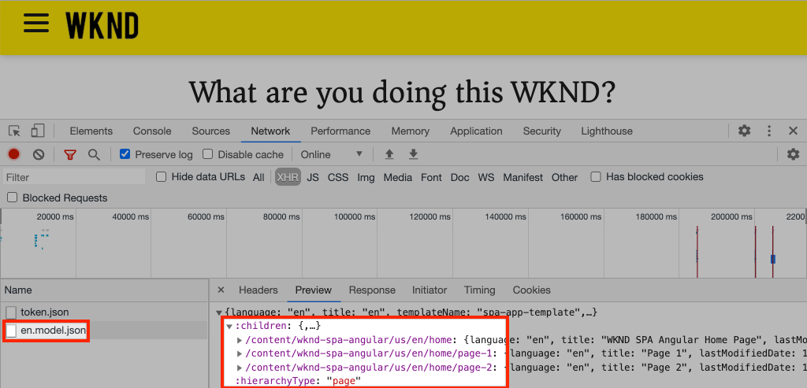

3. With the developer tools open, navigate to **Page 3**:

    

    Observe that a new XHR request is made to: `/content/wknd-spa-angular/us/en/home/page-2/page-3.model.json`

    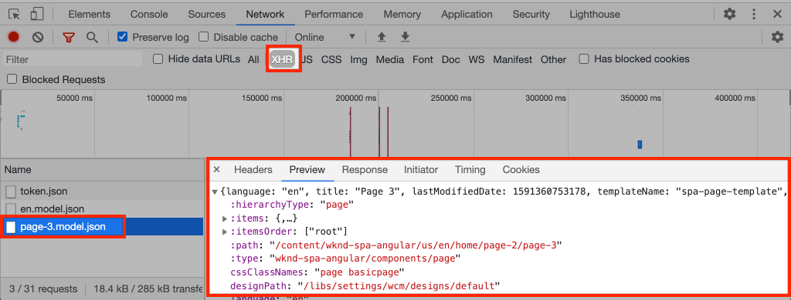

    The AEM Model Manager understands that the **Page 3** JSON content is not available and automatically triggers the additional XHR request.

4. Continue navigating the SPA using the various navigation links. Observe that no additional XHR requests are made, and that no full page refreshes occurs. This makes the SPA fast for the end-user and reduces unnecessary requests back to AEM.

    

5. Experiment with deep links by navigating directly to: [http://localhost:4502/content/wknd-spa-angular/us/en/home/page-2.html](http://localhost:4502/content/wknd-spa-angular/us/en/home/page-2.html). Observe that the browser's back button continues to work.

## Congratulations! {#congratulations}

Congratulations, you learned how multiple views in the SPA can be supported by mapping to AEM Pages with the SPA Editor SDK. Dynamic navigation has been implemented using Angular routing and added to the `Header` component.

You can always view the finished code on [GitHub](https://github.com/adobe/aem-guides-wknd-spa/tree/Angular/navigation-routing-solution) or check the code out locally by switching to the branch `Angular/navigation-routing-solution`.
