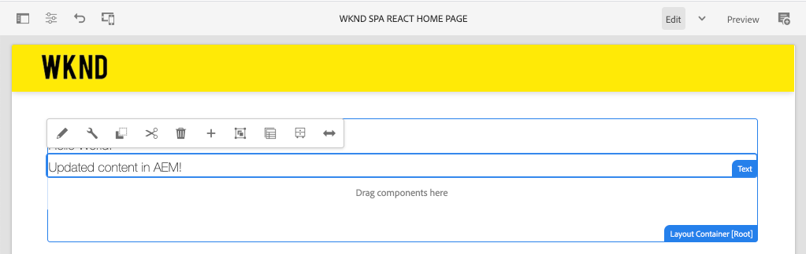
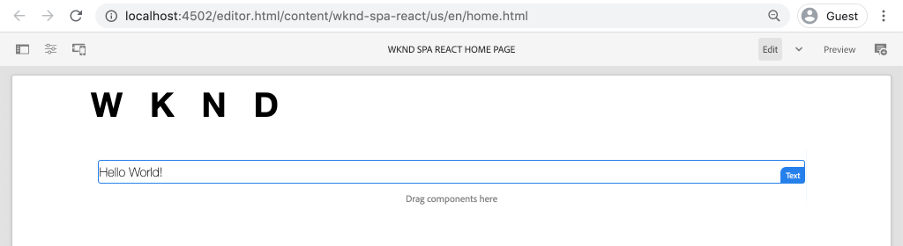
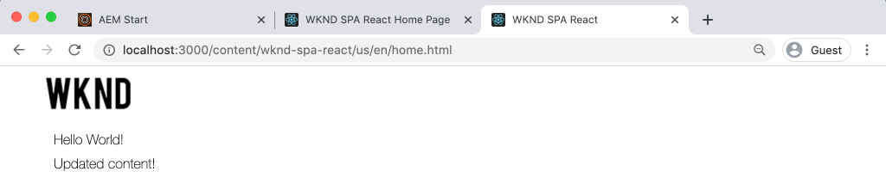
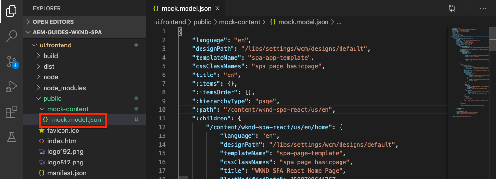
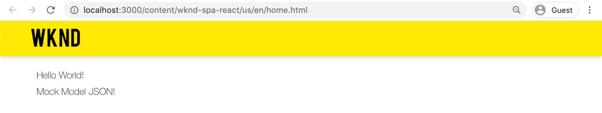

# Integrate a SPA {#integrate-spa}

Understand how the source code for a Single Page Application (SPA) written in React can be integrated with an Adobe Experience Manager (AEM) Project. Learn to use modern front-end tools, like a webpack dev server, to rapidly develop the SPA against the AEM JSON model API.

## Objective

1. Understand how the SPA project is integrated with AEM with client-side libraries.
2. Learn how to use a webpack development server for dedicated front-end development.
3. Explore the use of a **proxy** and static **mock** file for developing against the AEM JSON Model API

## What you will build

This chapter will add a simple `Header` component to the SPA. In the process of building out this static `Header` component several approaches to AEM SPA development will be used.



*The SPA is extended to add a static `Header` component*

## Prerequisites

Review the required tooling and instructions for setting up a [local development environment](overview.md#local-dev-environment).

### Get the code

1. Download the starting point for this tutorial via git:

    ```shell
    $ git clone git@github.com:adobe/aem-guides-wknd-spa.git
    $ cd aem-guides-wknd-spa
    $ git checkout React/integrate-spa-start
    ```

2. Deploy the code base to a local AEM instance using Maven:

    ```shell
    $ mvn clean install -PautoInstallSinglePackage
    ```

    If using [AEM 6.x](overview.md#compatibility) add the `classic` profile:

    ```shell
    $ mvn clean install -PautoInstallSinglePackage -Pclassic
    ```

You can always view the finished code on [GitHub](https://github.com/adobe/aem-guides-wknd-spa/tree/React/integrate-spa-solution) or check the code out locally by switching to the branch `React/integrate-spa-solution`.

## Integration approach {#integration-approach}

Two modules were created as part of the AEM project: `ui.apps` and `ui.frontend`.

The `ui.frontend` module is a [webpack](https://webpack.js.org/) project that contains all of the SPA source code. A majority of the SPA development and testing will be done in the webpack project. When a production build is triggered, the SPA is built and compiled using webpack. The compiled artifacts (CSS and Javascript) are copied into the `ui.apps` module which is then deployed to the AEM runtime.


*A high-level depiction of the SPA integration.*

Additional information about the Front-end build can be [found here](https://docs.adobe.com/content/help/en/experience-manager-core-components/using/developing/archetype/uifrontend-react.html).

## Inspect the SPA integration {#inspect-spa-integration}

Next, inspect the `ui.frontend` module to understand the SPA that has been auto-generated by the [AEM Project archetype](https://docs.adobe.com/content/help/en/experience-manager-core-components/using/developing/archetype/uifrontend-react.html).

1. In the IDE of your choice open up the AEM Project for the WKND SPA. This tutorial will use the [Visual Studio Code IDE](https://docs.adobe.com/content/help/en/experience-manager-learn/cloud-service/local-development-environment-set-up/development-tools.html#microsoft-visual-studio-code).

    

2. Expand and inspect the `ui.frontend` folder. Open the file `ui.frontend/package.json`

3. Under the `dependencies` you should see several related to `react` including `react-scripts`

    ```json
    "react": "^16.12.0",
    "react-app-polyfill": "^1.0.5",
    "react-dom": "^16.12.0",
    "react-router-dom": "^5.1.2",
    "react-scripts": "3.4.1"
    ```

    The `ui.frontend` is a React application based on the [Create React App](https://create-react-app.dev/) or CRA for short. The `react-scripts` version indicates which version of CRA is used.

4. There are also three dependencies prefixed with `@adobe`:

    ```json
    "@adobe/cq-react-editable-components": "^1.2.0",
    "@adobe/cq-spa-component-mapping": "^1.0.3",
    "@adobe/cq-spa-page-model-manager": "^1.1.0",
    ```

    The above modules make up the [AEM SPA Editor JS SDK](https://docs.adobe.com/content/help/en/experience-manager-65/developing/headless/spas/spa-blueprint.html) and provide the functionality to make it possible to map SPA Components to AEM Components.

5. In the `package.json` file there are several `scripts` defined:

    ```json
    "scripts": {
        "start": "react-scripts start",
        "build": "react-scripts build && clientlib",
        "test": "react-scripts test",
        "eject": "react-scripts eject",
    }
    ```

    These are standard build scripts made [available](https://create-react-app.dev/docs/available-scripts) by the Create React App.

    The only difference is the addition of `&& clientlib` to the `build` script. This extra instruction is responsible for copying the compiled SPA into the `ui.apps` module as a client-side library during a build.

    The npm module [aem-clientlib-generator](https://github.com/wcm-io-frontend/aem-clientlib-generator) is used to facilitate this.

6. Inspect the file `ui.frontend/clientlib.config.js`. This configuration file is used by [aem-clientlib-generator](https://github.com/wcm-io-frontend/aem-clientlib-generator#clientlibconfigjs) to determine how to generate the client library.

7. Inspect the file `ui.frontend/pom.xml`. This file transforms the `ui.frontend` folder into a [Maven module](http://maven.apache.org/guides/mini/guide-multiple-modules.html). The `pom.xml` file has been updated to use the [frontend-maven-plugin](https://github.com/eirslett/frontend-maven-plugin) to **test** and **build** the SPA during a Maven build.

8. Inspect the file `index.js` at `ui.frontend/src/index.js`:

    ```js
    //ui.frontend/src/index.js
    ...
    document.addEventListener('DOMContentLoaded', () => {
        ModelManager.initialize().then(pageModel => {
            const history = createBrowserHistory();
            render(
            <Router history={history}>
                <App
                history={history}
                cqChildren={pageModel[Constants.CHILDREN_PROP]}
                cqItems={pageModel[Constants.ITEMS_PROP]}
                cqItemsOrder={pageModel[Constants.ITEMS_ORDER_PROP]}
                cqPath={pageModel[Constants.PATH_PROP]}
                locationPathname={window.location.pathname}
                />
            </Router>,
            document.getElementById('spa-root')
            );
        });
    });
    ```

    `index.js` is the entrypoint of the SPA. `ModelManager` is provided by the AEM SPA Editor JS SDK. It is responsible for calling and injecting the `pageModel` (the JSON content) into the application.

## Add a Header component {#header-component}

Next, add a new component to the SPA and deploy the changes to a local AEM instance.

1. In the `ui.frontend` module, beneath `ui.frontend/src/components` create a new folder named `Header`.
2. Create a file named `Header.js` beneath the `Header` folder.

    

3. Populate `Header.js` with the following:

    ```js
    //Header.js
    import React, {Component} from 'react';

    export default class Header extends Component {

        render() {
            return (
                    <header className="Header">
                        <div className="Header-container">
                            <h1>WKND</h1>
                        </div>
                    </header>
            );
        }
    }
    ```

    Above is a standard React component that will output a static text string.

4. Open the file `ui.frontend/src/App.js`. This is the application entry-point.
5. Make the following updates to `App.js` to include the static `Header`:

    ```diff
      import { Page, withModel } from '@adobe/cq-react-editable-components';
      import React from 'react';
    + import Header from './components/Header/Header';

      // This component is the application entry point
      class App extends Page {
      render() {
          return (
          <div>
    +       <Header /> 
             {this.childComponents}
             {this.childPages}
         </div>
    ```

6. Open a new terminal and navigate into the `ui.frontend` folder and run the `npm run build` command:

    ```shell
    $ cd aem-guides-wknd-spa
    $ cd ui.frontend
    $ npm run build
    ...
    Compiled successfully.

    File sizes after gzip:

    118.95 KB (-33 B)  build/static/js/2.489f399a.chunk.js
    1.11 KB (+48 B)    build/static/js/main.6cfa5095.chunk.js
    806 B              build/static/js/runtime-main.42b998df.js
    451 B              build/static/css/main.e57bbe8a.chunk.css
    ```

7. Navigate to the `ui.apps` folder. Beneath `ui.apps/src/main/content/jcr_root/apps/wknd-spa-react/clientlibs/clientlib-react` you should see the compiled SPA files have been copied from  the`ui.frontend/build` folder. 

    

8. Return to the terminal and navigate into the `ui.apps` folder. Execute the following Maven command:

    ```shell
    $ cd ../ui.apps
    $ mvn clean install -PautoInstallPackage
    ...
    [INFO] ------------------------------------------------------------------------
    [INFO] BUILD SUCCESS
    [INFO] ------------------------------------------------------------------------
    [INFO] Total time:  9.629 s
    [INFO] Finished at: 2020-05-04T17:48:07-07:00
    [INFO] ------------------------------------------------------------------------
    ```

    This will deploy the `ui.apps` package to a local running instance of AEM.

9. Open a browser tab and navigate to [http://localhost:4502/editor.html/content/wknd-spa-react/us/en/home.html](http://localhost:4502/editor.html/content/wknd-spa-react/us/en/home.html). You should now see the contents of the `Header` component being displayed in the SPA.

    

    Steps 6-8 are executed automatically when triggering a Maven build from the root of the project (i.e `mvn clean install -PautoInstallSinglePackage`). You should now understand the basics of the integration between the SPA and AEM client-side libraries. Notice that you can still edit and add `Text` components in AEM beneath the static `Header` component.

## Webpack Dev Server - Proxy the JSON API {#proxy-json}

As seen in the previous exercises, performing a build and syncing the client library to a local instance of AEM takes a few minutes. This is acceptable for final testing, but is not ideal for the majority of the SPA development.

A [webpack-dev-server](https://webpack.js.org/configuration/dev-server/) can be used to rapidly develop the SPA. The SPA is driven by a JSON model generated by AEM. In this exercise the JSON content from a running instance of AEM will be **proxied** into the development server.

1. Return to the IDE and open the file `ui.frontend/package.json`.

    Look for a line like the following:

    ```json
    "proxy": "http://localhost:4502",
    ```

    The [Create React App](https://create-react-app.dev/docs/proxying-api-requests-in-development) provides an easy mechanism to proxy API requests. All unknown requests will be proxied through `localhost:4502`, the local AEM quickstart.

2. Open a terminal window and navigate to the `ui.frontend` folder. Run the command `npm start`:

    ```shell
    $ cd ui.frontend
    $ npm start
    ...
    Compiled successfully!

    You can now view wknd-spa-react in the browser.

    Local:            http://localhost:3000
    On Your Network:  http://192.168.86.136:3000

    Note that the development build is not optimized.
    To create a production build, use npm run build.
    ```

3. Open a new browser tab (if not already opened) and navigate to [http://localhost:3000/content/wknd-spa-react/us/en/home.html](http://localhost:3000/content/wknd-spa-react/us/en/home.html).

    

    You should see the same content as in AEM, but without any of the authoring capabilities enabled.

    >[!NOTE]
    >
    > Due to the security requirements of AEM, you will need to be logged into the local AEM instance (http://localhost:4502) in the same browser but in a different tab.

4. Return to the IDE and create a new folder named `media` at `ui.frontend/src/media`.
5. Download and add the following WKND logo to the `media` folder:

    

6. Open `Header.js` at `ui.frontend/src/components/Header/Header.js` and import the logo:

    ```diff
      import React, {Component} from 'react';
    + import wkndLogoDark from '../../media/wknd-logo-dk.png';
    ```

7. Make the following updates to `Header.js` to include the logo as part of the header:

    ```js
     export default class Header extends Component {

        get logo() {
            return (
                <div className="Logo">
                    
                </div>
            );
        }

        render() {
            return (
                    <header className="Header">
                        <div className="Header-container">
                            {this.logo}
                        </div>
                    </header>
            );
        }
    }
    ```

    Save the changes to `Header.js`.

8. Return to the browser at [http://localhost:3000/content/wknd-spa-react/us/en/home.html](http://localhost:3000/content/wknd-spa-react/us/en/home.html). You should immediately see the changes to the app reflected.

    

    You can continue to make content updates in AEM and see them reflected in **webpack-dev-server**, since we are proxying the content.

9. Stop the webpack dev server with `ctrl+c` in the terminal.

## Webpack Dev Server - Mock JSON API {#mock-json}

Another approach to rapid development is to use a static JSON file to act as the JSON model. By "mocking" the JSON, we remove the dependency on a local AEM instance. It also allows a front-end developer to update the JSON model in order to test functionality and drive changes to the JSON API that would then be later implemented by a back-end developer.

The initial set up of the mock JSON does **require a local AEM instance**.

1. In the browser navigate to [http://localhost:4502/content/wknd-spa-react/us/en.model.json](http://localhost:4502/content/wknd-spa-react/us/en.model.json).

    This is the JSON exported by AEM that is driving the application. Copy the JSON output.

2. Return to the IDE navigate to `ui.frontend/public` and add a new folder named `mock-content`.
3. Create a new file named `mock.model.json` beneath `ui.frontend/public/mock-content`. Paste the JSON output from **Step 1** here.

    

4. Open the file `index.html` at `ui.frontend/public/index.html`. Update the metadata property for the AEM page model to point to a variable `%REACT_APP_PAGE_MODEL_PATH%`:

    ```html
        <!-- AEM page model -->
        <meta
           property="cq:pagemodel_root_url"
           content="%REACT_APP_PAGE_MODEL_PATH%"
        />
    ```

    Using a variable for the value of the `cq:pagemodel_root_url` will make it easier to toggle between the proxy and mock json model.

5. Open the file `ui.frontend/.env.development` and make the following updates to comment out the previous value for `REACT_APP_PAGE_MODEL_PATH`:

    ```plain
    PUBLIC_URL=/

    #REACT_APP_PAGE_MODEL_PATH=/content/wknd-spa-react/us/en.model.json
    REACT_APP_PAGE_MODEL_PATH=/mock-content/mock.model.json

    REACT_APP_ROOT=/content/wknd-spa-react/us/en/home.html
    ```

6. If currently running, stop the **webpack-dev-server**. Start the **webpack-dev-server** from the terminal:

    ```shell
    $ cd ui.frontend
    $ npm start
    ```

    Navigate to [http://localhost:3000/content/wknd-spa-react/us/en/home.html](http://localhost:3000/content/wknd-spa-react/us/en/home.html) and you should see the SPA with the same content used in the **proxy** json.

7. Make a small change to the `mock.model.json` file created earlier. You should see the updated content immediately reflected in the **webpack-dev-server**.

    

Being able to manipulate the JSON model and see the effects on a live SPA can help a developer understand the JSON model API. It also allows both front-end and back-end development happen in parallel.

You can now toggle where to consume the JSON content by toggling the entries in the `env.development` file:

```plain
# JSON API via proxy to AEM
#REACT_APP_PAGE_MODEL_PATH=/content/wknd-spa-react/us/en.model.json

# JSON API via static mock file
REACT_APP_PAGE_MODEL_PATH=/mock-content/mock.model.json
```

## Add Styles with Sass

A React best practice is to keep each component modular and self contained. A general recommendation is to avoid re-using the same CSS class name across components, which make the use of preprocessors not as powerful. This project will use [Sass](https://sass-lang.com/) for a few useful features like variables. This project will also loosely follow [SUIT CSS naming conventions](https://github.com/suitcss/suit/blob/master/doc/components.md). SUIT is a variation of BEM notation, Block Element Modifier, used to create consistent CSS rules.

1. Open a terminal window and stop the **webpack-dev-server** if started. From inside the `ui.frontend` folder enter the following command to [install Sass](https://create-react-app.dev/docs/adding-a-sass-stylesheet):

    ```shell
    $ cd ui.frontend
    $ npm install node-sass --save
    ```

    Install `sass` as a peer-dependency:

    ```shell
    $ npm install sass --save
    ```

2. Install `normalize-scss` to normalize the styles across browsers: 

    ```shell
    $ npm install normalize-scss
    ```

3. Start the **webpack-dev-server** so that we can see the styles updating in real-time:

    ```shell
    $ npm start
    ```

    Use either the Proxy of Mock approach for handling the JSON model API.

4. Return to the IDE and beneath `ui.frontend/src` create a new folder named `styles`.
5. Create a new file beneath `ui.frontend/src/styles` named `_variables.scss` and populate it with the following variables:

    ```scss
    //_variables.scss

    //== Colors
    //
    //## Gray and brand colors for use across theme.

    $black:                  #202020;
    $gray:                   #696969;
    $gray-light:             #EBEBEB;
    $gray-lighter:           #F7F7F7;
    $white:                  #FFFFFF;
    $yellow:                 #FFEA00;
    $blue:                   #0045FF;


    //== Typography
    //
    //## Font, line-height, and color for body text, headings, and more.

    $font-family-sans-serif:  "Helvetica Neue", Helvetica, Arial, sans-serif;
    $font-family-serif:       Georgia, "Times New Roman", Times, serif;
    $font-family-base:        $font-family-sans-serif;
    $font-size-base:          18px;

    $line-height-base:        1.5;
    $line-height-computed:    floor(($font-size-base * $line-height-base));

    // Functional Colors
    $brand-primary:             $yellow;
    $body-bg:                   $white;
    $text-color:                $black;
    $text-color-inverse:        $gray-light;
    $link-color:                $blue;

    //Layout
    $max-width: 1024px;

    // Spacing
    $gutter-padding: 12px;
    ```

6. Re-name the extension of the file `index.css` at `ui.frontend/src/index.css` to **`index.scss`**. Replace the contents with the following:

    ```scss
    /* index.scss * /

    /* Normalize */
    @import '~normalize-scss/sass/normalize';

    @import './styles/variables';

    body {
        background-color: $body-bg;
        font-family: $font-family-base;
        margin: 0;
        padding: 0;
        font-size: $font-size-base;
        text-align: left;
        color: $text-color;
        line-height: $line-height-base;
    }

    //spacing for header
    body.page {
        padding-top: 75px;
    }
    ```

7. Update `ui.frontend/src/index.js` to include the re-named `index.scss`:

    ```diff
     ...
    - import './index.css';
    + import './index.scss';
     ....
    ```

8. Create a new file named `Header.scss` beneath `ui.frontend/src/components/Header`. Populate the file with the following:

    ```scss
    @import '../../styles/variables';

    .Header {
        width: 100%;
        position: fixed;
        top: 0;
        left:0;
        z-index: 99;
        background-color: $brand-primary;
        box-shadow: 0px 0px 10px 0px rgba(0, 0, 0, 0.24);
    }

    .Header-container {
        display: flex;
        max-width: $max-width;
        margin: 0 auto;
        padding-left: $gutter-padding;
        padding-right: $gutter-padding;
    }

    .Logo {
        z-index: 100;
        display: flex;
        padding-top: $gutter-padding;
        padding-bottom: $gutter-padding;
    }

    .Logo-img {
        width: 100px;
    }
    ```

9. Include `Header.scss` by updating `Header.js`:

    ```js
    import React, {Component} from 'react';
    import wkndLogoDark from '../../media/wknd-logo-dk.png';

    require('./Header.scss');
    ...
    ```

10. Return to the browser and the **webpack-dev-server**: [http://localhost:3000/content/wknd-spa-react/us/en/home.html](http://localhost:3000/content/wknd-spa-react/us/en/home.html)

    

    You should now see the updated styles added to the `Header` component.

## Deploy SPA updates to AEM

The changes made to the `Header` are currently only visible through the **webpack-dev-server**. Deploy the updated SPA to AEM to see the changes.

1. Navigate to the root of the project (`aem-guides-wknd-spa`) and deploy the project to AEM using Maven:

    ```shell
    $ cd ..
    $ mvn clean install -PautoInstallSinglePackage
    ```

2. Navigate to [http://localhost:4502/editor.html/content/wknd-spa-react/us/en/home.html](http://localhost:4502/editor.html/content/wknd-spa-react/us/en/home.html). You should see the updated `Header` with logo and styles applied.

    

    Now that the updated SPA is in AEM, authoring can continue.

## Congratulations! {#congratulations}

Congratulations, you have updated the SPA and explored the integration with AEM! You now know two different approaches for developing the SPA against the AEM JSON Model API using a **webpack-dev-server**.

You can always view the finished code on [GitHub](https://github.com/adobe/aem-guides-wknd-spa/tree/React/integrate-spa-solution) or check the code out locally by switching to the branch `React/integrate-spa-solution`.

### Next Steps {#next-steps}

[Map SPA components to AEM components](map-components.md) - Learn how to map React components to Adobe Experience Manager (AEM) components with the AEM SPA Editor JS SDK. Component mapping enables users to make dynamic updates to SPA components within the AEM SPA Editor, similar to traditional AEM authoring.
