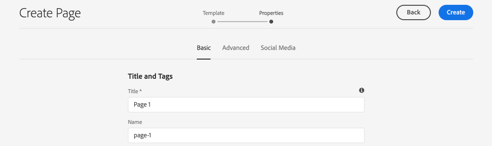
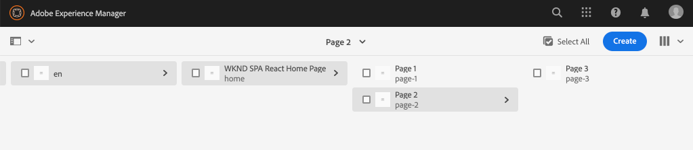
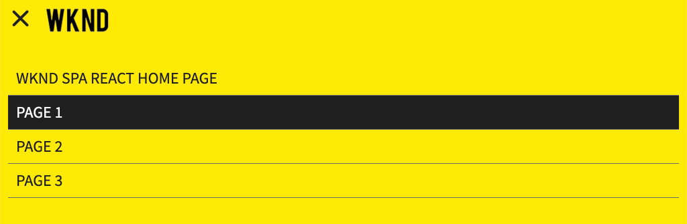
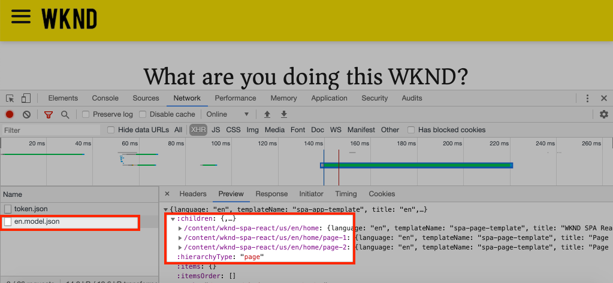
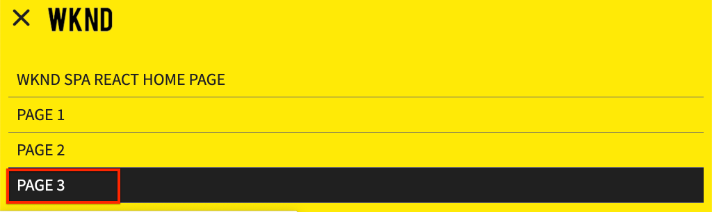
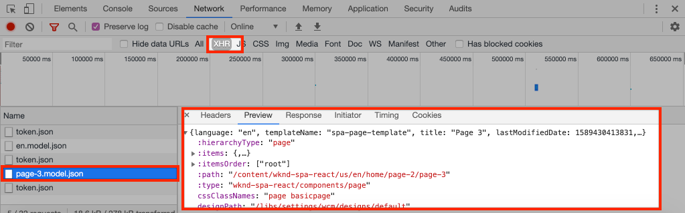

# Add navigation and routing {#navigation-routing}

Learn how multiple views in the SPA can be supported by mapping to AEM Pages with the SPA Editor SDK. Dynamic navigation is implemented using React Router and added to an existing Header component.

## Objective

1. Understand the SPA model routing options available when using the SPA Editor.
2. Learn to use [React Router](https://reacttraining.com/react-router/) to navigate between different views of the SPA.
3. Implement a dynamic navigation that is driven by the AEM page hierarchy.

## What you will build

This chapter will add a navigation menu to an existing `Header` component. The navigation menu will be driven by the AEM page hierarchy and will make use of the JSON model provided by the [Navigation Core Component](https://docs.adobe.com/content/help/en/experience-manager-core-components/using/components/navigation.html).


## Prerequisites

Review the required tooling and instructions for setting up a [local development environment](overview.md#local-dev-environment).

### Get the code

1. Download the starting point for this tutorial via Git:

    ```shell
    $ git clone git@github.com:adobe/aem-guides-wknd-spa.git
    $ cd aem-guides-wknd-spa
    $ git checkout React/navigation-routing-start
    ```

2. Deploy the code base to a local AEM instance using Maven:

    ```shell
    $ mvn clean install -PautoInstallSinglePackage
    ```

    If using [AEM 6.x](overview.md#compatibility) add the `classic` profile:

    ```shell
    $ mvn clean install -PautoInstallSinglePackage -Pclassic
    ```

3. Install the finished package for the traditional [WKND reference site](https://github.com/adobe/aem-guides-wknd/releases/latest). The images provided by [WKND reference site](https://github.com/adobe/aem-guides-wknd/releases/latest) will be re-used on the WKND SPA. The package can be installed using [AEM's Package Manager](http://localhost:4502/crx/packmgr/index.jsp).

    

You can always view the finished code on [GitHub](https://github.com/adobe/aem-guides-wknd-spa/tree/React/navigation-routing-solution) or check the code out locally by switching to the branch `React/navigation-routing-solution`.

## Inspect Header updates {#inspect-header}

In previous chapters, the `Header` component was added as a pure React component included via `App.js`. In this chapter, the `Header` component has been removed and will be added via the [Template Editor](https://docs.adobe.com/content/help/en/experience-manager-learn/sites/page-authoring/template-editor-feature-video-use.html). This will allow users to configure the navigation menu of the `Header` from within AEM.

>[!NOTE]
>
> Several CSS and JavaScript updates have already been made to the code base to start this chapter. To focus on core concepts, not **all** of the code changes are discussed. You can view the full changes [here](https://github.com/adobe/aem-guides-wknd-spa/compare/React/map-components-solution...React/navigation-routing-start).

1. In the IDE of your choice open the SPA starter project for this chapter.
2. Beneath the `ui.frontend` module inspect the file `Header.js` at: `ui.frontend/src/components/Header/Header.js`.

    Several updates have been made, including the addition of a `HeaderEditConfig` and a `MapTo` to enable the component to be mapped to an AEM component `wknd-spa-react/components/header`.

    ```js
    /* Header.js */
    ...
    export const HeaderEditConfig = {
        ...
    }
    ...
    MapTo('wknd-spa-react/components/header')(withRouter(Header), HeaderEditConfig);
    ```

3. In the `ui.apps` module inspect the component definition of the AEM `Header` component: `ui.apps/src/main/content/jcr_root/apps/wknd-spa-react/components/header/.content.xml`:

    ```xml
    <?xml version="1.0" encoding="UTF-8"?>
    <jcr:root xmlns:sling="http://sling.apache.org/jcr/sling/1.0" xmlns:cq="http://www.day.com/jcr/cq/1.0"
        xmlns:jcr="http://www.jcp.org/jcr/1.0"
        jcr:primaryType="cq:Component"
        jcr:title="Header"
        sling:resourceSuperType="wknd-spa-react/components/navigation"
        componentGroup="WKND SPA React - Structure"/>
    ```

    The AEM `Header` component will inherit all of the functionality of the [Navigation Core Component](https://docs.adobe.com/content/help/en/experience-manager-core-components/using/components/navigation.html) via the `sling:resourceSuperType` property.

## Add the Header to the Template {#add-header-template}

1. Open a browser and login to AEM, [http://localhost:4502/](http://localhost:4502/). The starting code base should already be deployed.
2. Navigate to the **SPA Page Template**: [http://localhost:4502/editor.html/conf/wknd-spa-react/settings/wcm/templates/spa-page-template/structure.html](http://localhost:4502/editor.html/conf/wknd-spa-react/settings/wcm/templates/spa-page-template/structure.html).
3. Select the outer-most **Root Layout Container** and click its **Policy** icon. Be careful **not** to select the **Layout Container** un-locked for authoring.

    

4. Create a new policy named **SPA Structure**:

    

    Under **Allowed Components** &gt; **General** &gt; select the **Layout Container** component.

    Under **Allowed Components** &gt; **WKND SPA REACT - STRUCTURE** &gt; select the **Header** component:

    

    Under **Allowed Components** &gt; **WKND SPA REACT - Content** &gt; select the **Image** and **Text** components. You should have 4 total components selected.

    Click **Done** to save the changes.

5. Refresh the page, and add the **Header** component above the un-locked **Layout Container**:

    

6. Select the **Header** component and click its **Policy** icon to edit the policy.
7. Create a new policy with a **Policy Title** of **WKND SPA Header**.

    Under the **Properties**:

    * Set the **Navigation Root** to `/content/wknd-spa-react/us/en`.
    * Set the **Exclude Root Levels** to **1**.
    * Uncheck **Collect all child pages**.
    * Set the **Navigation Structure Depth** to **3**.

    

    This will collect the navigation 2 levels deep beneath `/content/wknd-spa-react/us/en`.

8. After saving your changes you should see the populated `Header` as part of the template:

    

## Create Child Pages

Next, create additional pages in AEM that will serve as the different views in the SPA. We will also inspect the hierarchal structure of the JSON model provided by AEM.

1. Navigate to the **Sites** console: [http://localhost:4502/sites.html/content/wknd-spa-react/us/en/home](http://localhost:4502/sites.html/content/wknd-spa-react/us/en/home). Select the **WKND SPA React Home Page** and click **Create** &gt; **Page**:

    

2. Under **Template** select **SPA Page**. Under **Properties** enter **Page 1** for the **Title** and **page-1** as the name.

    

    Click **Create** and in the dialog pop-up, click **Open** to open the page in the AEM SPA Editor.

3. Add a new **Text** component to the main **Layout Container**. Edit the component and enter the text: **Page 1** using the RTE and the **H1** element (you will have to enter full-screen mode to change the paragraph elements)

    

    Feel free to add additional content, like an image.

4. Return to the AEM Sites console and repeat the above steps, creating a second page named **Page 2** as a sibling of **Page 1**.
5. Lastly create a third page, **Page 3** but as a **child** of **Page 2**. Once completed the site hierarchy should look like the following:

    

6. In a new tab, open the JSON model API provided by AEM: [http://localhost:4502/content/wknd-spa-react/us/en.model.json](http://localhost:4502/content/wknd-spa-react/us/en.model.json). This JSON content is requested when the SPA is first loaded. The outer structure looks like the following:

    ```json
    {
    "language": "en",
    "title": "en",
    "templateName": "spa-app-template",
    "designPath": "/libs/settings/wcm/designs/default",
    "cssClassNames": "spa page basicpage",
    ":type": "wknd-spa-react/components/spa",
    ":items": {},
    ":itemsOrder": [],
    ":hierarchyType": "page",
    ":path": "/content/wknd-spa-react/us/en",
    ":children": {
        "/content/wknd-spa-react/us/en/home": {},
        "/content/wknd-spa-react/us/en/home/page-1": {},
        "/content/wknd-spa-react/us/en/home/page-2": {},
        "/content/wknd-spa-react/us/en/home/page-2/page-3": {}
        }
    }
    ```

    Under `:children` you should see an entry for each of the pages created. The content for all of the pages is in this initial JSON request. Once, the navigation routing is implemented, subsequent views of the SPA will be loaded rapidly, since the content is already available client-side.

    It is not wise to load **ALL** of the content of a SPA in the initial JSON request, as this would slow down the initial page load. Next, lets look at how the heirarchy depth of pages are collected.

7. Navigate to the **SPA Root** template at: [http://localhost:4502/editor.html/conf/wknd-spa-react/settings/wcm/templates/spa-app-template/structure.html](http://localhost:4502/editor.html/conf/wknd-spa-react/settings/wcm/templates/spa-app-template/structure.html).

    Click the **Page properties menu** &gt; **Page Policy**:

    

8. The **SPA Root** template has an extra **Hierarchical Structure** tab to control the JSON content collected. The **Structure Depth** determines how deep in the site hierarchy to collect child pages beneath the **root**. You can also use the **Structure Patterns** field to filter out additional pages based on a regular expression.

    Update the **Structure Depth** to **2**:

    

    Click **Done** to save the changes to the policy.

9. Re-open the JSON model [http://localhost:4502/content/wknd-spa-react/us/en.model.json](http://localhost:4502/content/wknd-spa-react/us/en.model.json).

    ```json
    {
    "language": "en",
    "title": "en",
    "templateName": "spa-app-template",
    "designPath": "/libs/settings/wcm/designs/default",
    "cssClassNames": "spa page basicpage",
    ":type": "wknd-spa-react/components/spa",
    ":items": {},
    ":itemsOrder": [],
    ":hierarchyType": "page",
    ":path": "/content/wknd-spa-react/us/en",
    ":children": {
        "/content/wknd-spa-react/us/en/home": {},
        "/content/wknd-spa-react/us/en/home/page-1": {},
        "/content/wknd-spa-react/us/en/home/page-2": {}
        }
    }
    ```

    Notice that the **Page 3** path has been removed: `/content/wknd-spa-react/us/en/home/page-2/page-3` from the initial JSON model.

    Later, we will observe how the AEM SPA Editor SDK can dynamically load additional content.

## Implement the Navigation

Next, implement the navigation menu as part of the `Header`. We could add the code directly in `Header.js` but a better practice with is to avoid large components. Instead, we will implement a `Navigation` SPA component that could potentially be re-used later.

1. Review the JSON exposed by the AEM `Header` component at [http://localhost:4502/content/wknd-spa-react/us/en.model.json](http://localhost:4502/content/wknd-spa-react/us/en.model.json):

    ```json
    ...
    "header": {
        "items": [
        {
        "level": 0,
        "active": true,
        "path": "/content/wknd-spa-react/us/en/home",
        "description": null,
        "url": "/content/wknd-spa-react/us/en/home.html",
        "lastModified": 1589062597083,
        "title": "WKND SPA React Home Page",
        "children": [
                {
                "children": [],
                "level": 1,
                "active": false,
                "path": "/content/wknd-spa-react/us/en/home/page-1",
                "description": null,
                "url": "/content/wknd-spa-react/us/en/home/page-1.html",
                "lastModified": 1589429385100,
                "title": "Page 1"
                },
                {
                "level": 1,
                "active": true,
                "path": "/content/wknd-spa-react/us/en/home/page-2",
                "description": null,
                "url": "/content/wknd-spa-react/us/en/home/page-2.html",
                "lastModified": 1589429603507,
                "title": "Page 2",
                "children": [
                    {
                    "children": [],
                    "level": 2,
                    "active": false,
                    "path": "/content/wknd-spa-react/us/en/home/page-2/page-3",
                    "description": null,
                    "url": "/content/wknd-spa-react/us/en/home/page-2/page-3.html",
                    "lastModified": 1589430413831,
                    "title": "Page 3"
                    }
                ],
                }
            ]
            }
        ],
    ":type": "wknd-spa-react/components/header"
    ```

    The hierarchal nature of the AEM pages are modeled in the JSON that can be used to populate a navigation menu. Recall that the `Header` component inherits all of the functionality of the [Navigation Core Component](https://docs.adobe.com/content/help/en/experience-manager-core-components/using/components/navigation.html) and the content exposed through the JSON will be automatically mapped to React props.

2. Open a new terminal window and navigate to the `ui.frontend` folder of the SPA project. Start the **webpack-dev-server** with the command `npm start`.

    ```shell
    $ cd ui.frontend
    $ npm start
    ```

3. Open a new browser tab and navigate to [http://localhost:3000/](http://localhost:3000/).

    The **webpack-dev-server** should be configured to proxy the JSON model from a local instance of AEM (`ui.frontend/.env.development`). This will allow us to code directly against the content created in AEM in the previous exercise. Ensure that you are authenticated into AEM in the same browsing session.

    

    The `Header` currently has the menu toggle functionality already implemented. Next, implement the navigation menu.

4. Return to the IDE of your choice, and open the `Header.js` at `ui.frontend/src/components/Header/Header.js`.
5. Update the `homeLink()` method to remove the hard-coded String and use the dynamic props passed in by the AEM component:

    ```js
    /* Header.js */
    ...
    get homeLink() {
         //expect a single root defined as part of the navigation
        if(!this.props.items || this.props.items.length !== 1) {
            return null;
        }

        return this.props.items[0].url;
    }
    ...
    ```

    The above code will populate a url based on the root navigation item configured by the component. `homeLink()` is used to populate the logo in the `logo()` method and used to determine if the back-button should be displayed in `backButton()`.

    Save changes to `Header.js`.

6. Add a line at the top of `Header.js` to import the `Navigation` component beneath the other imports:

    ```js
    /* Header.js */
    ...
    import Navigation from '../Navigation/Navigation';
    ```

7. Next update the `get navigation()` method to instantiate the `Navigation` component:

    ```js
    /* Header.js */
    ...
    get navigation() {
        //pass all the props to Navigation component
        return <Navigation {...this.props} />;
    }
    ...
    ```

    As mentioned earlier, instead of implementing the navigation within the `Header` we will implement the majority of the logic in the `Navigation` component.  The props of the `Header` include the JSON structure needed to build the menu, we pass all of the props.
8. Open the file `Navigation.js` at `ui.frontend/src/components/Navigation/Navigation.js`.
9. Implement the `renderGroupNav(children)` method:

    ```js
    /* Navigation.js */
    ...
    renderGroupNav(children) {

        if(children === null || children.length < 1 ) {
            return null;
        }
        return (<ul className={this.baseCss + '__group'}>
                    {children.map(
                        (item,index) => { return this.renderNavItem(item,index)}
                    )}
                </ul>
        );
    }
    ...
    ```

    This method takes the an array of navigation items, `children`, and creates an un-ordered list. It then iterates over the array and passes the item to the `renderNavItem`, which will be implemented next.

10. Implement the `renderNavItem`:

    ```js
    /* Navigation.js */
    ...
    renderNavItem(item, index) {
        const cssClass = this.baseCss + '__item ' + 
                         this.baseCss + '__item--level-' + item.level + ' ' +
                         (item.active ? ' ' + this.baseCss + '__item--active' : '');
        return (
            <li key={this.baseCss + '__item-' + index} className={cssClass}>
                    { this.renderLink(item) }
                    { this.renderGroupNav(item.children) }
            </li>
        );
    }
    ...
    ```

    This method renders a list item, with CSS classes based on properties `level` and `active`. The method then calls `renderLink` to create the anchor tag. Since the `Navigation` content is hierarchal, a recursive strategy is used to call the `renderGroupNav` for the children of the current item.

11. Implement the `renderLink` method:

    Add an import method for the [Link](https://reacttraining.com/react-router/web/api/Link) component, part of React router, at the top of the file with the other imports:

    ```js
    import {Link} from "react-router-dom";
    ```

    Next finish the implementation of the `renderLink` method:

    ```js
    renderLink(item){
        return (
            <Link to={item.url} title={item.title} aria-current={item.active && 'page'}
               className={this.baseCss + '__item-link'}>{item.title}</Link>
        );
    }
    ```

    Notice that instead of a normal anchor tag, `<a>`, the [Link](https://reacttraining.com/react-router/web/api/Link) component is used. This ensures that the a full page refresh is not triggered, and instead leverages the React router provided by the AEM SPA Editor JS SDK.

12. Save changes to `Navigation.js` and return to the **webpack-dev-server**: [http://localhost:3000](http://localhost:3000)

    

    Open the navigation by clicking the menu toggle and you should see the populated navigation links. You should be able to navigate to different views of the SPA.

## Inspect the SPA Routing

Now that the navigation has been implemented, inspect the routing in AEM.

1. In the IDE open the file `index.js` at `ui.frontend/src/index.js`.

    ```js
    /* index.js */
    import { Router } from 'react-router-dom';
    ...
    ...
     ModelManager.initialize().then(pageModel => {
        const history = createBrowserHistory();
        render(
        <Router history={history}>
            <App
            history={history}
            cqChildren={pageModel[Constants.CHILDREN_PROP]}
            cqItems={pageModel[Constants.ITEMS_PROP]}
            cqItemsOrder={pageModel[Constants.ITEMS_ORDER_PROP]}
            cqPath={pageModel[Constants.PATH_PROP]}
            locationPathname={window.location.pathname}
            />
        </Router>,
        document.getElementById('spa-root')
        );
    });
    ```

    Notice that the `App` is wrapped in the `Router` component from [React Router](https://reacttraining.com/react-router/). The `ModelManager`, provided by the AEM SPA Editor JS SDK, adds the dynamic routes to AEM Pages based on the JSON model API.

2. Open a terminal, navigate to the root of the project, and deploy the project to AEM using your Maven skills:

    ```shell
    $ cd aem-guides-wknd-spa
    $ mvn clean install -PautoInstallSinglePackage
    ```

3. Navigate to the SPA homepage in AEM: [http://localhost:4502/content/wknd-spa-react/us/en/home.html](http://localhost:4502/content/wknd-spa-react/us/en/home.html) and open your browser's developer tools. Screenshots below are captured from Google Chrome browser.

    Refresh the page and you should see an XHR request to `/content/wknd-spa-react/us/en.model.json`, which is the SPA Root. Notice that only three child pages are included based on the hierarchy depth configuration to the SPA Root template made earlier in the tutorial. This does not include **Page 3**.

    

4. With the developer tools open, use the `Header` navigation to navigate to **Page 3**:

    

    Observe that a new XHR request is made to: `/content/wknd-spa-react/us/en/home/page-2/page-3.model.json`

    

    The AEM Model Manager understands that the **Page 3** JSON content is not available and automatically triggers the additional XHR request.

5. Continue navigating the SPA using the various navigation links of the `Header` component. Observe that no additional XHR requests are made, and that no full page refreshes occurs. This makes the SPA fast for the end-user and reduces unnecessary requests back to AEM.

    

6. Experiment with deep links by navigating directly to: [http://localhost:4502/content/wknd-spa-react/us/en/home/page-2.html](http://localhost:4502/content/wknd-spa-react/us/en/home/page-2.html). Observe that the browser's back button continues to work.

## Congratulations! {#congratulations}

Congratulations, you learned how multiple views in the SPA can be supported by mapping to AEM Pages with the SPA Editor SDK. Dynamic navigation has been implemented using React Router and added to the `Header` component.

You can always view the finished code on [GitHub](https://github.com/adobe/aem-guides-wknd-spa/tree/React/navigation-routing-solution) or check the code out locally by switching to the branch `React/navigation-routing-solution`.
